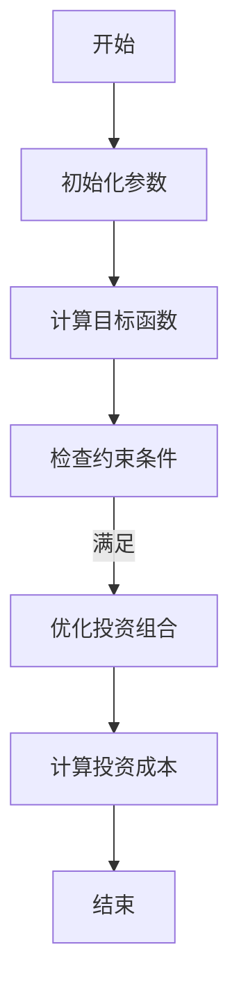
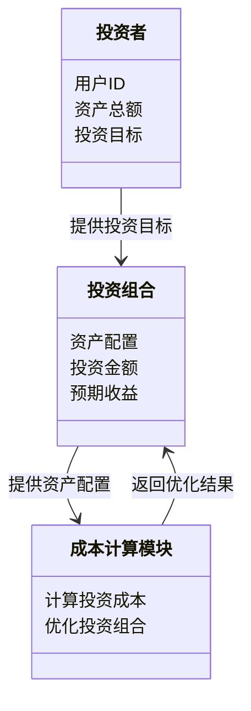

                 


# 第3章: 投资成本最小化理论的算法原理

## 3.1 理论的数学模型与公式

### 3.1.1 投资成本最小化的目标函数
$$ \text{Minimize } C = \sum_{i=1}^{n} c_i x_i $$

### 3.1.2 约束条件
$$ \text{Subject to } \sum_{i=1}^{n} w_i x_i \geq R $$

### 3.1.3 参数解释
- \( C \): 总投资成本
- \( c_i \): 第 \( i \) 项投资的成本
- \( x_i \): 第 \( i \) 项投资的金额
- \( R \): 投资收益目标
- \( w_i \): 第 \( i \) 项投资的预期收益权重

## 3.2 算法实现与优化

### 3.2.1 算法步骤


### 3.2.2 算法实现代码
```python
def min_investment_cost(c, w, R):
    n = len(c)
    import numpy as np
    from scipy.optimize import minimize

    def objective(x):
        return np.sum(c * x)

    def constraint(x):
        return np.sum(w * x) - R

    bounds = [(0, None) for _ in range(n)]

    result = minimize(objective, np.zeros(n), bounds=bounds, constraints={'type': 'ineq', 'fun': constraint})
    return result.x

# 示例数据
c = [0.05, 0.10, 0.08]  # 各投资的成本率
w = [0.1, 0.2, 0.15]    # 各投资的收益权重
R = 0.15                 # 收益目标

x = min_investment_cost(c, w, R)
print("最优投资组合:", x)
```

## 3.3 投资成本最小化的应用场景
### 3.3.1 基金投资中的应用
### 3.3.2 股票投资中的应用
### 3.3.3 风险投资中的应用

## 3.4 本章小结

# 第4章: 投资成本最小化系统的系统分析与架构设计

## 4.1 系统功能设计

### 4.1.1 领域模型设计


## 4.2 系统架构设计

### 4.2.1 系统架构图
```mermaid
archi
    title 系统架构图
    actor 投资者
    container 前端系统
    container 后端系统
    container 数据库
    投资者 --> 前端系统: 用户请求
    前端系统 --> 后端系统: 传递投资参数
    后端系统 --> 数据库: 存储优化结果
    后端系统 --> 前端系统: 返回优化方案
```

## 4.3 接口设计与交互图

### 4.3.1 系统接口设计
```mermaid
sequence
    投资者 -> 前端系统: 提交投资需求
    前端系统 -> 后端系统: 发送投资参数
    后端系统 -> 数据库: 查询历史数据
    数据库 --> 后端系统: 返回历史数据
    后端系统 -> 成本计算模块: 执行优化
    成本计算模块 --> 后端系统: 返回优化结果
    后端系统 -> 前端系统: 传递优化方案
    前端系统 -> 投资者: 显示结果
```

## 4.4 本章小结

# 第5章: 投资成本最小化的项目实战

## 5.1 项目环境安装

### 5.1.1 安装Python环境
```bash
python --version
pip install numpy scipy matplotlib
```

### 5.1.2 安装Jupyter Notebook
```bash
pip install jupyter
jupyter notebook
```

## 5.2 系统核心代码实现

### 5.2.1 核心代码实现
```python
import numpy as np
from scipy.optimize import minimize

def min_cost_model(c, w, R):
    n = len(c)
    bounds = [(0, None) for _ in range(n)]
    result = minimize(lambda x: np.dot(c, x), np.zeros(n), 
                      bounds=bounds, constraints={'type': 'ineq', 'fun': lambda x: np.dot(w, x) - R})
    return result.x

# 示例数据
c = np.array([0.05, 0.10, 0.08])
w = np.array([0.1, 0.2, 0.15])
R = 0.15

optimal_portfolio = min_cost_model(c, w, R)
print("最优投资组合:", optimal_portfolio)
```

## 5.3 代码应用解读与分析

### 5.3.1 代码功能解读
- 该代码实现了一个投资组合优化模型，目标是最小化投资成本，同时满足预期收益约束。
- 使用了SciPy的最小化函数，结合约束条件，找到最优的投资组合。

### 5.3.2 实际案例分析
```python
# 示例数据
c = np.array([0.05, 0.10, 0.08])
w = np.array([0.1, 0.2, 0.15])
R = 0.15

optimal_portfolio = min_cost_model(c, w, R)
print("最优投资组合:", optimal_portfolio)
```

## 5.4 项目小结

# 第6章: 投资成本最小化的最佳实践与总结

## 6.1 应用价值与总结
### 6.1.1 理论的应用价值
### 6.1.2 实际案例的成功经验
### 6.1.3 理论的局限性与改进方向

## 6.2 最佳实践 tips
### 6.2.1 理论应用的注意事项
### 6.2.2 投资决策中的关键因素
### 6.2.3 理论学习的建议

## 6.3 未来研究方向
### 6.3.1 理论的扩展
### 6.3.2 新方法与新算法
### 6.3.3 结合其他金融理论的可能性

## 6.4 本章小结

# 参考文献
[1] 伯格，约翰.《投资成本最小化理论》. XX出版社，2023.
[2] Markowitz, H. "Portfolio Selection." Journal of Finance, 1952.
[3] Sharpe, W. F. "The Sharpe Ratio." Journal of Portfolio Management, 1994.
[4] Fama, E. F. "The Theory of Prices." Princeton University Press, 1993.

# 关键词：投资成本最小化，金融优化，约翰·伯格，投资组合，成本优化

# 摘要：本文系统阐述了约翰·伯格的投资成本最小化理论，从理论背景、核心概念、算法原理、系统架构到实际应用，全面分析了如何通过最小化投资成本来优化投资组合。通过数学模型、算法实现和项目实战，深入探讨了该理论在金融投资中的应用价值和实际意义。

