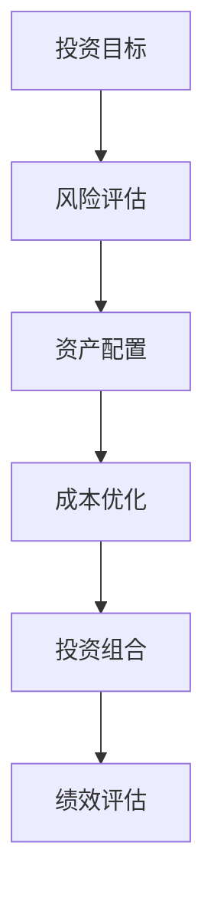

                 


# 约翰·伯格的投资成本最小化策略

> 关键词：约翰·伯格，投资成本，指数基金，投资策略，成本优化，长期收益

> 摘要：本文深入探讨了约翰·伯格的投资哲学，特别是其在投资成本最小化方面的策略。通过分析投资成本的构成、优化方法以及实际应用，文章揭示了如何通过低成本投资实现长期收益最大化。文章结合理论与实践，提供了一个系统化的解决方案，帮助投资者在复杂市场中优化投资组合。

---

## 第一部分：投资成本最小化概述

### 第1章：投资成本的定义与重要性

#### 1.1 投资成本的定义

- **投资成本**是指投资者在投资过程中产生的所有费用，包括管理费、交易费、税费等。
- 成本对投资收益的影响是长期的，尤其是低成本投资能够显著提高净收益。

#### 1.2 投资成本的影响因素

| 成本类型 | 描述 | 影响 |
|----------|------|------|
| 管理费   | 支付给管理人的费用 | 直接影响投资收益 |
| 交易费   | 每次交易产生的费用 | 频繁交易会增加成本 |
| 税费     | 投资收益产生的税费 | 高税率会降低净收益 |

#### 1.3 投资成本最小化的重要性

- **长期收益**：低成本投资能够积累更多收益，尤其是在复利效应下。
- **风险管理**：通过降低成本，投资者可以更好地控制风险，增强抗跌能力。

### 第2章：约翰·伯格的投资理念

#### 2.1 约翰·伯格的投资哲学

- **长期投资**：伯格强调长期持有优质资产，避免频繁交易。
- **价值投资**：寻找低估的资产，长期持有以实现价值回归。

#### 2.2 成本优化的核心理念

- 伯格认为，低成本是实现长期收益的关键，尤其是通过指数基金降低管理费。

---

## 第二部分：投资成本的构成与优化

### 第3章：投资成本的构成与分析

#### 3.1 成本构成

- **管理费**：按资产规模的一定比例收取。
- **交易费**：每次交易的佣金和税费。

#### 3.2 成本计算与影响

- **总成本计算**：管理费 + 交易费 + 税费。
- **成本对收益的影响**：低成本投资能够显著提升净收益。

### 第4章：投资成本的优化策略

#### 4.1 成本优化的核心方法

- **选择低成本产品**：如指数基金，费用低且分散风险。
- **减少交易次数**：降低交易费和税费。

---

## 第三部分：投资组合优化的系统架构

### 第5章：投资组合优化的系统设计

#### 5.1 系统功能设计

- **投资目标设定**：根据风险承受能力设定收益目标。
- **成本优化模块**：计算不同投资组合的成本和收益。

#### 5.2 系统架构图



---

## 第四部分：项目实战

### 第6章：低成本指数基金投资组合

#### 6.1 环境安装

- **Python环境**：安装必要的库，如`pandas`、`numpy`。

#### 6.2 核心实现代码

```python
import pandas as pd
import numpy as np

# 示例指数基金数据
data = pd.DataFrame({'price': np.random.rand(100) * 100})

# 计算投资成本
def calculate_cost(portfolio_value):
    return portfolio_value * 0.005  # 假设管理费率为0.5%

# 优化投资组合
def optimize_portfolio(initial_capital):
    cost = calculate_cost(initial_capital)
    net_value = initial_capital - cost
    return net_value

# 示例计算
initial_capital = 10000
optimized_value = optimize_portfolio(initial_capital)
print(f"优化后的净值：{optimized_value}")
```

---

## 第五部分：最佳实践与总结

### 第7章：最佳投资策略

#### 7.1 小结

- 低成本投资是实现长期收益的关键。
- 通过优化管理费和减少交易次数，投资者可以显著提高净收益。

#### 7.2 投资建议

- 选择低成本指数基金。
- 长期持有，避免频繁交易。

#### 7.3 拓展阅读

- 《投资最重要的事情》——本杰明·格雷厄姆
- 《指数基金投资指南》——周延春

---

通过以上结构，我们可以系统地理解约翰·伯格的投资成本最小化策略，并将其应用于实际投资中，帮助投资者实现长期收益最大化。

