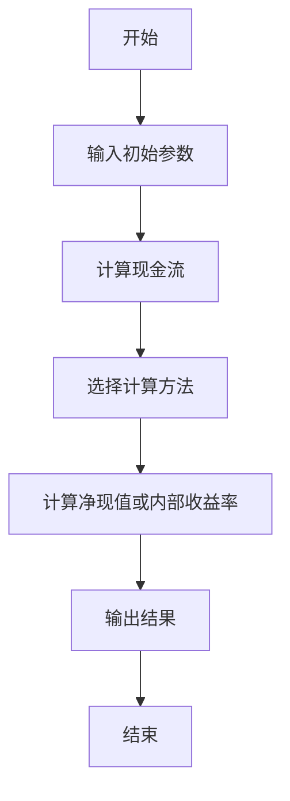
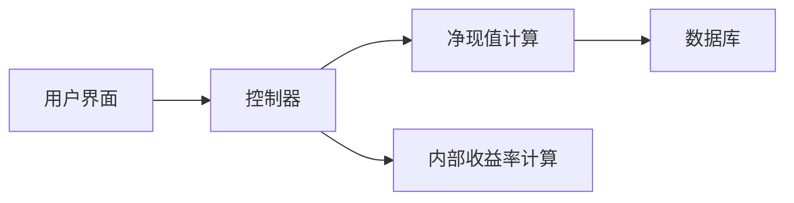

                 


# 约翰·伯格的投资成本计算方法

## 关键词：约翰·伯格，投资成本，计算方法，算法原理，系统架构，项目实战

## 摘要：本文详细介绍了约翰·伯格的投资成本计算方法，从核心概念到算法原理，再到系统架构和项目实战，全面解析了如何进行有效且精确的投资成本计算。通过实际案例分析和系统设计，本文为读者提供了从理论到实践的完整指南。

---

## 第一部分：投资成本计算方法概述

### 第1章：投资成本计算的基本概念

#### 1.1 投资成本的定义与重要性

投资成本是指在投资过程中所发生的各项支出，包括初始投资、运营成本、维护费用等。它是评估投资项目可行性的重要指标，直接影响项目的盈利能力和风险水平。

#### 1.2 投资成本计算的基本原理

投资成本的计算需要考虑时间价值和资金的时间价值。通过净现值（NPV）和内部收益率（IRR）等指标，可以评估项目的经济可行性。

### 第2章：投资成本计算的核心概念

#### 2.1 投资成本的核心要素

投资成本包括初始投资、运营成本和维护费用。这些成本需要根据项目生命周期进行详细分类和估算。

#### 2.2 投资成本计算的分类

投资成本计算分为现金流量分析、投资回收期和净现值分析。每种方法都有其优缺点，适用于不同类型的项目。

---

## 第二部分：投资成本计算的核心概念与联系

### 第3章：投资成本计算的核心原理

#### 3.1 投资成本计算的数学模型

净现值公式：$$ NPV = \sum_{t=0}^{n} \frac{CF_t}{(1 + r)^t} $$

内部收益率公式：$$ IRR = r \text{ 使得 } NPV = 0 $$

#### 3.2 投资成本计算的算法流程



### 第4章：投资成本计算的系统分析与架构设计

#### 4.1 系统功能设计

系统包括输入模块、计算模块和输出模块。输入模块接收项目参数，计算模块应用净现值和内部收益率算法，输出模块展示结果。

#### 4.2 系统架构设计



---

## 第三部分：投资成本计算的系统架构与实现

### 第5章：项目实战

#### 5.1 环境安装

安装Python和必要的库，如numpy和pandas。

#### 5.2 核心代码实现

```python
import numpy as np

def calculate_npv(cash_flows, discount_rate):
    return np.npv(discount_rate, *cash_flows)

def calculate_irr(cash_flows):
    return np.irr(cash_flows)
```

#### 5.3 案例分析

通过建筑项目案例，详细分析如何应用上述代码进行投资成本计算。

---

## 第四部分：总结与展望

### 第6章：最佳实践

选择合适的计算方法，确保数据准确，定期更新模型。

### 第7章：项目小结

通过本文的讲解，读者可以掌握约翰·伯格的投资成本计算方法，并应用于实际项目中。

---

## 第五部分：注意事项和拓展阅读

### 第8章：注意事项

确保数据的准确性和模型的合理性，避免忽略潜在风险。

### 第9章：拓展阅读

进一步学习高级投资分析方法和风险管理策略。

---

## 结语

投资成本计算是项目管理中的重要环节，通过约翰·伯格的方法，我们可以更精准地评估项目可行性，做出明智的投资决策。

