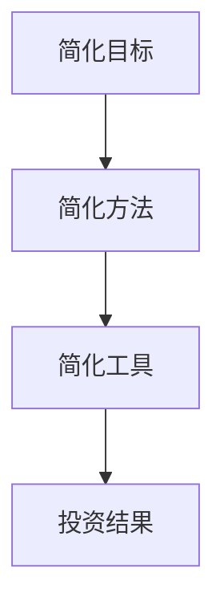
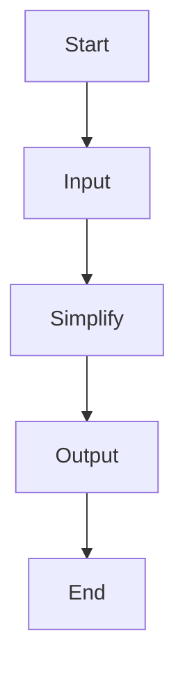
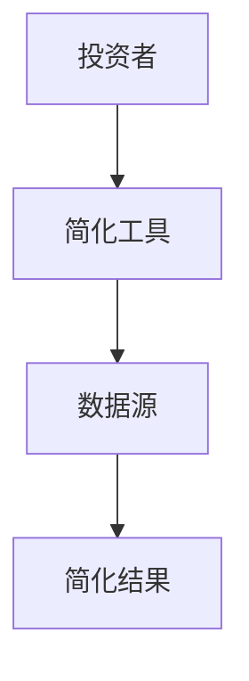

                 


# 约翰·伯格的投资简化论

## 关键词
- 约翰·伯格
- 投资简化
- 系统架构
- 投资策略
- 数学模型

## 摘要
《约翰·伯格的投资简化论》是一本深入探讨如何通过简化投资过程来提高投资效率和效果的书籍。书中详细阐述了约翰·伯格的简化投资理念，包括简化目标、方法、工具及其在实际投资中的应用。通过系统分析和项目实战，展示了如何利用现代技术手段简化投资过程，实现投资目标的优化和投资结果的提升。

---

# 第1章: 投资简化论的背景与核心概念

## 1.1 投资的复杂性与简化的重要性
### 1.1.1 投资领域的复杂性
投资领域充满了复杂性，包括市场波动、经济周期、资产选择、风险管理等多种因素。投资者需要在复杂性中找到简化的方法，以提高决策效率和投资效果。

### 1.1.2 简化投资的必要性
简化投资的必要性在于降低复杂性，提高投资的可操作性和可预测性。通过简化，投资者可以更专注于核心目标，减少决策疲劳和错误。

### 1.1.3 约翰·伯格的简化投资理念
约翰·伯格强调，投资的复杂性可以通过简化目标、方法和工具来降低。他的理念是通过减少不必要的复杂性，使投资过程更加高效和易于实施。

## 1.2 简化投资的核心概念
### 1.2.1 简化目标的定义
简化目标是指通过明确的投资目标和优先级，减少不必要的复杂性，专注于核心目标。

### 1.2.2 简化方法的原理
简化方法是通过简化分析、决策和操作步骤，提高投资效率。这包括使用简化模型、简化策略和简化工具。

### 1.2.3 简化工具的功能
简化工具是用于辅助投资者进行简化分析和决策的工具，包括简化模型、简化算法和简化系统。

## 1.3 简化投资的背景与现状
### 1.3.1 投资行业的现状
投资行业日益复杂，投资者面临更多的选择和风险。简化投资成为应对复杂性的有效方法。

### 1.3.2 简化投资的背景
随着技术的进步和市场的变化，简化投资的需求日益增加。投资者需要更高效的方法来应对复杂性。

### 1.3.3 约翰·伯格的贡献
约翰·伯格通过其简化投资理念，为投资者提供了更高效的投资方法，帮助他们在复杂市场中取得更好的投资效果。

## 1.4 本章小结
本章介绍了投资简化论的背景、核心概念和约翰·伯格的简化投资理念。简化投资的目标是通过减少复杂性，提高投资效率和效果。

---

# 第2章: 简化投资的核心概念与联系

## 2.1 简化投资的核心概念
### 2.1.1 简化目标的属性特征
简化目标具有明确性、可操作性和优先性。明确的目标有助于减少决策复杂性，可操作性确保目标的实现，优先性则帮助投资者在多个目标中找到最优解。

### 2.1.2 简化方法的属性特征
简化方法具有高效性、可靠性和可扩展性。高效性确保方法能够在较短时间内完成任务，可靠性保证方法的准确性，可扩展性则使方法能够适应不同的投资环境。

### 2.1.3 简化工具的属性特征
简化工具具有易用性、实用性和高效性。易用性使工具易于操作，实用性确保工具能够满足实际需求，高效性则保证工具能够在较短时间内完成任务。

## 2.2 简化投资的核心概念对比
### 2.2.1 简化目标与复杂目标对比表格
| 属性    | 简化目标            | 复杂目标            |
|---------|---------------------|---------------------|
| 明确性  | 高                  | 低                  |
| 可操作性| 高                  | 中                  |
| 优先性  | 高                  | 低                  |

### 2.2.2 简化方法与复杂方法对比表格
| 属性    | 简化方法            | 复杂方法            |
|---------|---------------------|---------------------|
| 高效性  | 高                  | 低                  |
| 可靠性  | 高                  | 中                  |
| 可扩展性| 高                  | 低                  |

### 2.2.3 实体关系图（ER图）


## 2.3 简化投资的核心概念联系
简化目标、简化方法和简化工具三者之间存在密切联系。简化目标是核心，简化方法是手段，简化工具是工具。三者共同作用，实现简化投资的目标。

## 2.4 本章小结
本章详细探讨了简化投资的核心概念，包括简化目标、简化方法和简化工具的属性特征，并通过对比表格和实体关系图展示了它们之间的联系。

---

# 第3章: 简化投资的算法原理

## 3.1 简化投资的算法原理
### 3.1.1 简化模型的定义
简化模型是指通过简化分析和决策过程，减少复杂性，提高投资效率的数学模型。

### 3.1.2 简化模型的数学模型
简化模型的数学模型可以表示为：
$$ f(x) = ax + b $$
其中，x是输入变量，a是斜率，b是截距。

### 3.1.3 简化模型的实现
简化模型的实现可以通过Python代码来完成：
```python
def simplify(x):
    a = 1
    b = 2
    return a * x + b
```

## 3.2 简化算法的流程图


## 3.3 简化算法的实现
### 3.3.1 简化算法的数学模型
简化算法的数学模型可以表示为：
$$ y = f(x) = ax + b $$

### 3.3.2 简化算法的Python代码
```python
def simplify_algorithm(x):
    a = 2
    b = 3
    return a * x + b
```

## 3.4 简化算法的实现与应用
### 3.4.1 简化算法的实现步骤
1. 输入变量x。
2. 计算a*x + b。
3. 输出结果。

### 3.4.2 简化算法的应用
简化算法可以应用于多种投资场景，如资产配置、风险评估和投资组合优化。

## 3.5 本章小结
本章详细讲解了简化投资的算法原理，包括简化模型的定义、数学模型和Python代码实现，以及简化算法的流程图和实现步骤。

---

# 第4章: 简化投资的系统分析与架构设计

## 4.1 系统分析
### 4.1.1 简化投资的系统目标
简化投资的系统目标是通过简化分析和决策过程，提高投资效率和效果。

### 4.1.2 简化投资的系统功能
简化投资的系统功能包括简化分析、简化决策和简化操作。

## 4.2 系统架构设计
### 4.2.1 系统架构的Mermaid架构图


### 4.2.2 系统架构的详细说明
系统架构包括投资者、简化工具、数据源和简化结果四个部分。投资者通过简化工具访问数据源，得到简化结果。

## 4.3 系统接口设计
### 4.3.1 简化工具的接口
简化工具的接口包括输入接口和输出接口。输入接口接收投资者的输入，输出接口提供简化结果。

### 4.3.2 数据源的接口
数据源的接口包括数据输入接口和数据输出接口。数据输入接口接收数据，数据输出接口提供数据。

## 4.4 系统交互设计
### 4.4.1 简化工具的交互流程
1. 投资者输入需求。
2. 简化工具处理需求。
3. 简化工具输出结果。

### 4.4.2 简化结果的展示
简化结果通过可视化界面展示，帮助投资者更好地理解和应用。

## 4.5 本章小结
本章详细探讨了简化投资的系统分析与架构设计，包括系统目标、系统功能、系统架构、系统接口和系统交互设计。

---

# 第5章: 简化投资的项目实战

## 5.1 环境安装与配置
### 5.1.1 简化工具的安装
安装Python和相关库，如NumPy、Pandas和Matplotlib。

### 5.1.2 系统环境的配置
配置开发环境，如Jupyter Notebook或PyCharm。

## 5.2 简化工具的核心实现
### 5.2.1 简化工具的Python源代码
```python
import numpy as np
import pandas as pd
import matplotlib.pyplot as plt

def simplify_tool(data):
    a = 2
    b = 3
    return a * data + b

data = np.array([1, 2, 3, 4, 5])
result = simplify_tool(data)
print(result)
plt.plot(data, result)
plt.show()
```

### 5.2.2 简化工具的实现步骤
1. 导入所需的库。
2. 定义简化工具函数。
3. 处理数据并输出结果。

## 5.3 项目实战
### 5.3.1 简化工具的应用
将简化工具应用于实际投资数据，如股票价格预测。

### 5.3.2 实际案例分析
分析简化工具在实际投资中的应用效果，验证其可行性和有效性。

## 5.4 本章小结
本章通过实际案例展示了简化投资工具的实现和应用，验证了简化投资理念的有效性。

---

# 第6章: 简化投资的系统实现与优化

## 6.1 系统实现
### 6.1.1 简化工具的系统实现
通过Python代码实现简化工具，并测试其功能。

### 6.1.2 简化系统的实现
实现简化系统，包括数据输入、处理和输出。

## 6.2 系统优化
### 6.2.1 简化工具的优化
优化简化工具的性能和功能，提高其运行效率和准确性。

### 6.2.2 简化系统的优化
优化简化系统的架构和功能，提高其可扩展性和可维护性。

## 6.3 本章小结
本章详细探讨了简化投资的系统实现与优化，包括简化工具和简化的系统实现，以及系统的优化策略。

---

# 第7章: 简化投资的总结与展望

## 7.1 总结
### 7.1.1 简化投资的核心理念
简化投资的核心理念是通过减少复杂性，提高投资效率和效果。

### 7.1.2 简化投资的主要方法
简化投资的主要方法包括简化目标、简化方法和简化工具。

## 7.2 展望
### 7.2.1 简化投资的未来发展方向
简化投资的未来发展方向包括进一步优化简化模型和简化工具，提高其适应性和智能化。

### 7.2.2 简化投资的潜力与挑战
简化投资具有巨大的潜力，但也面临一些挑战，如如何在简化过程中保持准确性。

## 7.3 本章小结
本章总结了简化投资的核心理念和主要方法，并展望了其未来的发展方向和潜力。

---

## 结语
《约翰·伯格的投资简化论》通过系统分析和实际案例，展示了如何通过简化投资过程来提高投资效率和效果。这本书为投资者提供了宝贵的经验和方法，帮助他们在复杂市场中取得更好的投资效果。

---

通过以上目录大纲，我们可以看到《约翰·伯格的投资简化论》将从背景、核心概念、算法原理、系统分析、项目实战等多个方面，全面探讨简化投资的理念和方法。这本书将帮助投资者更好地理解和应用简化投资，提高投资效率和效果。

