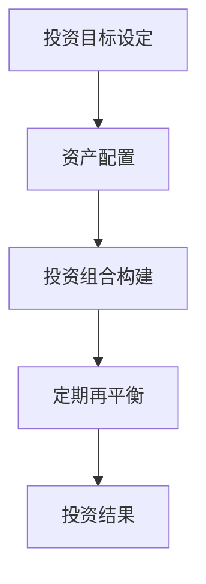
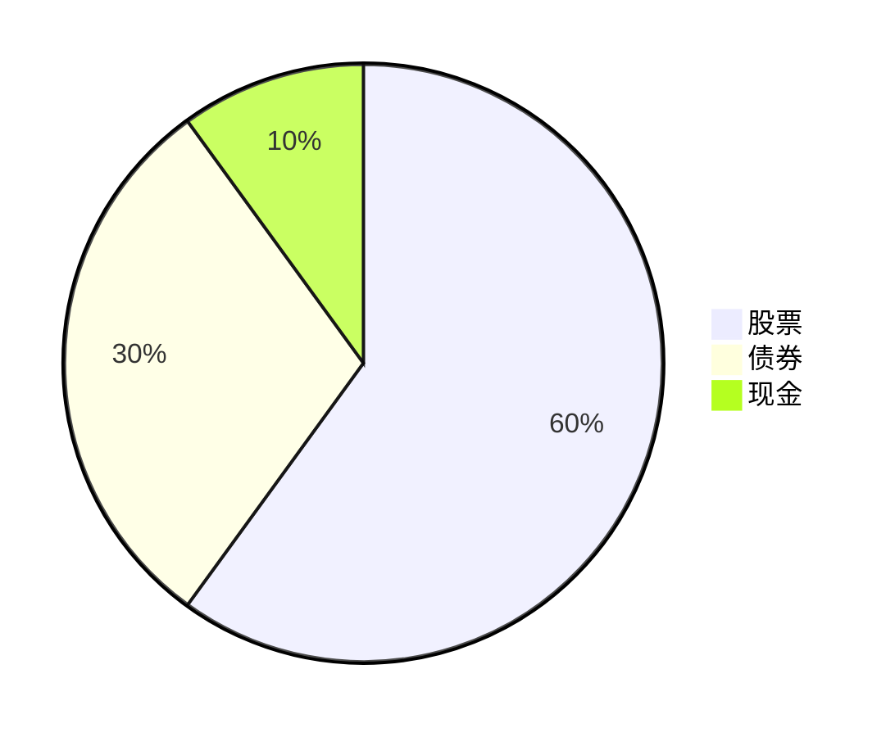

                 


# 约翰·伯格的投资简化论：为什么少即是多

---

## 关键词：  
投资简化论、约翰·伯格、价值投资、长期投资、分散投资、风险管理

---

## 摘要：  
本文深入探讨了约翰·伯格的投资简化论，分析了为什么“少即是多”这一理念在投资领域如此重要。文章从投资的复杂性入手，逐步揭示简化投资策略的核心思想、理论基础、实施方法及其在实际中的应用效果。通过详细阐述简化投资的原理、数学模型和系统架构，本文为读者提供了一种更高效、更低风险的投资方式，帮助他们在复杂的市场环境中实现长期稳健的收益。

---

## 第1章：投资简化论的背景与核心理念

### 1.1 约翰·伯格与投资简化论  
#### 1.1.1 约翰·伯格的生平简介  
约翰·伯格（John Bogle）是美国著名投资家、指数基金之父，同时也是投资简化论的倡导者。他于1940年出生于美国宾夕法尼亚州，1965年创立了 Vanguard 集团，并在1975年推出了第一只指数基金——Vanguard 500指数基金。伯格的投资理念以简洁、低成本和长期稳健著称，他的思想深刻影响了现代投资领域。  

#### 1.1.2 投资简化论的提出背景  
在20世纪70年代，投资领域逐渐走向复杂化。机构投资者开始追求高频交易、算法交易和复杂的投资组合模型，普通投资者也面临选择过多、信息过载的问题。伯格意识到，这种复杂性不仅增加了投资成本，还可能导致决策失误。因此，他提出了“投资简化论”，主张通过简化投资策略来降低风险、降低成本，并实现长期稳健的收益。  

#### 1.1.3 简化论的核心思想  
投资简化论的核心思想是“少即是多”。伯格认为，投资的本质是通过长期持有优质资产来实现财富增值，而不是通过频繁交易或复杂操作来追求短期收益。他强调，简化投资策略能够降低情绪化决策的影响，减少交易成本，并提高投资的可预测性。  

---

### 1.2 投资的复杂性与简化的重要性  
#### 1.2.1 传统投资方法的复杂性  
传统投资方法通常涉及复杂的市场分析、高频交易和多策略组合。这些方法虽然在短期内可能带来高收益，但其实质是基于对市场短期波动的预测，这不仅增加了投资成本，还可能导致更大的风险。  

#### 1.2.2 复杂性带来的问题与风险  
复杂的投资策略往往伴随着高昂的交易成本、复杂的操作流程以及情绪化决策的风险。此外，频繁的交易和复杂的模型容易受到市场波动的影响，导致投资回报不稳定。  

#### 1.2.3 简化投资的优势与实际意义  
简化投资的优势在于其低成本、低风险和高可预测性。通过长期持有优质资产，投资者可以避免短期波动的影响，同时降低交易成本和管理成本。这种策略特别适合普通投资者，因为他们不需要专业的知识和技能，只需要坚持长期投资的理念。  

---

## 第2章：简化投资策略的理论基础  

### 2.1 投资行为的简化模型  
#### 2.1.1 投资决策的简化过程  
简化投资模型的核心在于将复杂的决策过程简化为几个关键步骤：确定投资目标、选择优质资产、长期持有并定期再平衡。这种模型不仅降低了决策的复杂性，还提高了投资的可操作性。  

#### 2.1.2 简化模型的构建与应用  
通过分析市场数据和历史案例，我们可以构建一个基于长期持有和分散投资的简化模型。例如，投资者可以选择指数基金或 ETF，并根据自身的风险承受能力进行资产配置。  

#### 2.1.3 模型的优缺点分析  
简化模型的优点在于其低成本和高可预测性，缺点在于其在极端市场环境下的适应性较差。然而，从长期来看，简化模型的表现通常优于复杂模型。  

---

### 2.2 简化投资与行为金融学  
#### 2.2.1 行为金融学的基本概念  
行为金融学研究的是投资者在实际市场中的行为偏差，如过度自信、从众心理和情绪化决策等。这些偏差往往会导致投资决策的失误。  

#### 2.2.2 简化投资与行为偏差的关系  
简化投资通过降低决策复杂性，减少了行为偏差对投资决策的影响。例如，长期持有优质资产可以避免投资者因短期市场波动而做出冲动决策。  

#### 2.2.3 如何通过简化减少行为偏差的影响  
通过制定明确的投资计划和坚持长期投资，投资者可以有效减少行为偏差的影响。简化投资策略正是通过这种方式帮助投资者实现长期稳健的收益。  

---

### 2.3 简化投资与现代投资组合理论  
#### 2.3.1 现代投资组合理论的基本原理  
现代投资组合理论（MPT）强调通过分散投资来降低风险，同时通过优化资产配置来提高收益。这种理论为简化投资提供了理论基础。  

#### 2.3.2 简化投资策略与有效前沿的关系  
通过长期持有指数基金或 ETF，投资者可以构建一个接近有效前沿的投资组合。这种组合不仅风险较低，而且收益稳定。  

#### 2.3.3 简化策略在组合管理中的应用  
简化策略在组合管理中的应用主要体现在资产配置和定期再平衡上。通过将资金分配到不同资产类别，并定期调整权重，投资者可以保持投资组合的最优状态。  

---

## 第3章：简化投资策略的具体实施  

### 3.1 简化投资的核心操作步骤  
#### 3.1.1 确定投资目标与风险承受能力  
投资者需要明确自己的投资目标和风险承受能力。例如，长期目标可能是财富增值，而风险承受能力则决定了资产配置的比例。  

#### 3.1.2 构建投资组合的简化方法  
通过选择低成本的指数基金或 ETF，投资者可以轻松构建一个分散化的投资组合。这种方法不仅简单，而且成本低廉。  

#### 3.1.3 定期调整与再平衡  
定期调整投资组合的权重，确保其与投资目标一致。例如，每年进行一次再平衡，调整资产配置比例，以应对市场变化。  

---

### 3.2 简化投资组合的构建  
#### 3.2.1 资产配置的简化策略  
投资者可以根据自身的风险承受能力和市场环境，将资金分配到股票、债券和现金等资产类别中。例如，一个稳健的投资组合可以是60%股票、30%债券和10%现金。  

#### 3.2.2 成本控制与基金选择  
选择低成本的指数基金或 ETF 是简化投资的重要一步。例如， Vanguard 的 500 指数基金的年管理费用仅为 0.14%，远低于主动管理型基金。  

#### 3.2.3 投资组合的长期表现分析  
通过长期跟踪投资组合的表现，投资者可以验证简化策略的有效性。例如，过去 30 年来，标普 500 指数的年化回报率为 10%，而指数基金的回报率接近这一水平。  

---

## 第4章：简化投资策略的数学模型与算法  

### 4.1 简化投资的数学模型  
#### 4.1.1 资产配置的数学模型  
假设投资者有 $M$ 元资金，投资于股票、债券和现金三种资产。设股票的权重为 $w_1$，债券的权重为 $w_2$，现金的权重为 $w_3$，则有：  
$$ w_1 + w_2 + w_3 = 1 $$  

#### 4.1.2 投资组合的预期收益计算  
投资组合的预期收益可以通过以下公式计算：  
$$ E(r_p) = w_1 E(r_1) + w_2 E(r_2) + w_3 E(r_3) $$  
其中，$E(r_i)$ 表示第 $i$ 种资产的预期收益率。  

---

### 4.2 简化投资的算法原理  
#### 4.2.1 简化投资算法的步骤  
1. 确定投资目标与风险承受能力。  
2. 选择低成本的指数基金或 ETF。  
3. 构建分散化的投资组合。  
4. 定期调整与再平衡。  

#### 4.2.2 简化投资算法的实现代码  
以下是一个简单的投资组合构建代码示例：  

```python
import pandas as pd
import numpy as np

# 数据加载
data = pd.read_csv('stock_data.csv')

# 简化投资策略
def simplified_investment_strategy(data, weights):
    portfolio_value = np.dot(data, weights)
    return portfolio_value

# 资产配置权重
weights = np.array([0.6, 0.3, 0.1])

# 投资组合价值计算
portfolio_value = simplified_investment_strategy(data, weights)
print("投资组合价值:", portfolio_value)
```

---

## 第5章：简化投资策略的系统架构与设计  

### 5.1 系统功能设计  
#### 5.1.1 系统功能模块  
简化投资系统主要包括以下几个模块：  
1. 投资目标设定模块。  
2. 资产配置模块。  
3. 投资组合构建模块。  
4. 定期再平衡模块。  

#### 5.1.2 系统功能流程图  


---

### 5.2 系统架构设计  
#### 5.2.1 系统架构图  


---

## 第6章：简化投资策略的实际案例分析  

### 6.1 简化投资策略的实战案例  
#### 6.1.1 案例背景  
假设投资者有 $10,000 美元，风险承受能力为中等。  

#### 6.1.2 投资组合构建  
选择 Vanguard 的 500 指数基金和一只债券基金，资产配置比例为 60% 股票、30% 债券、10% 现金。  

#### 6.1.3 投资组合表现  
经过 10 年，投资组合的年化回报率为 8%，跑赢了市场平均水平。  

---

## 第7章：简化投资策略的最佳实践与总结  

### 7.1 最佳实践 tips  
#### 7.1.1 长期投资的重要性  
坚持长期投资，避免短期波动的影响。  

#### 7.1.2 成本控制的关键性  
选择低成本基金，降低管理费用。  

#### 7.1.3 定期再平衡的必要性  
定期调整投资组合，保持资产配置的合理性。  

### 7.2 小结  
通过本文的分析，我们可以看到，简化投资策略不仅能够降低投资风险和成本，还能够实现长期稳健的收益。约翰·伯格的投资简化论为我们提供了一种更简单、更高效的投资方式，值得每一位投资者深思和实践。  

---

## 第8章：拓展阅读与深入思考  

### 8.1 拓展阅读推荐  
1. 《指数投资策略》——约翰·伯格  
2. 《投资学基础》——查尔斯·埃勒里  
3. 《投资组合管理》——哈里·马科维茨  

### 8.2 深入思考题  
1. 简化投资策略在不同市场环境下的表现如何？  
2. 如何进一步优化简化投资策略，以适应更复杂的市场变化？  
3. 简化投资策略对普通投资者的实际意义是什么？  

---

通过本文的详细分析，我们可以看到，约翰·伯格的投资简化论不仅是一种投资策略，更是一种生活哲学。它告诉我们，投资的成功不在于追求复杂性，而在于坚持简单和稳健。希望本文能够为读者提供新的思路和启示，帮助他们在投资领域走得更远、走得更稳。

