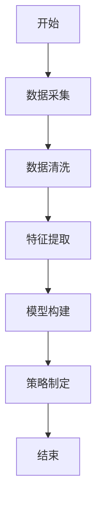

                 


# 《约翰·伯格的投资简化论：应对金融产品复杂化的挑战》

## 关键词：  
金融产品复杂化、投资简化论、金融风险管理、投资策略优化、技术分析方法

## 摘要：  
在当前金融市场的高度复杂化背景下，投资者面临着前所未有的挑战。约翰·伯格的投资简化论为应对这些挑战提供了一种全新的思路。本文通过深入分析金融产品的复杂性，结合简化论的核心原理、算法原理、数学模型以及系统架构设计，探讨如何通过简化论来优化投资策略，降低投资风险，提高决策效率。

---

## 第一部分：背景与挑战

### 第1章：金融产品的复杂化问题

#### 1.1 金融产品的多样化与复杂性  
- **1.1.1 传统金融产品的局限性**  
  传统金融产品（如股票、债券、基金等）虽然简单，但在市场波动加剧的情况下，投资者难以通过单一产品实现多样化的资产配置。  

- **1.1.2 现代金融工具的复杂性**  
  近年来，金融衍生品（如期权、期货、ETF等）的普及使得金融产品种类急剧增加，但其复杂性也显著提高。投资者需要理解多种产品的特性、风险和收益关系，这对普通投资者来说是一项巨大的挑战。  

- **1.1.3 市场波动与投资者决策难度**  
  市场波动的加剧和信息的爆炸式增长，使得投资者在做出决策时面临更多的不确定性。复杂的金融产品进一步增加了投资者的决策难度。  

#### 1.2 投资者面临的挑战  
- **1.2.1 信息过载与决策疲劳**  
  投资者每天需要处理大量的市场数据、新闻和分析报告，信息过载导致决策疲劳，难以做出理性的投资决策。  

- **1.2.2 风险与收益的平衡难题**  
  复杂的金融产品往往伴随着高风险，而普通投资者难以准确评估这些风险。如何在风险与收益之间找到平衡点，是投资者面临的核心挑战。  

- **1.2.3 市场预测的不确定性**  
  金融市场具有高度的不确定性，投资者难以准确预测市场走势，尤其是在复杂的金融工具面前，预测难度进一步增加。  

---

## 第二部分：简化论的核心概念

### 第2章：简化论的基本原理

#### 2.1 简化论的定义与目标  
- **2.1.1 简化论的核心理念**  
  简化论是一种通过减少复杂性来提高决策效率的方法论。其核心目标是将复杂的金融产品和市场信息简化为易于理解和操作的形式。  

- **2.1.2 简化论的目标**  
  简化论的目标是降低金融投资的复杂性，使投资者能够以更简单的方式做出决策，同时保持或提高投资效率和收益。  

#### 2.2 简化论的关键原则  
- **2.2.1 简化的核心原则**  
  简化论的核心原则包括：聚焦核心因素、避免过度复杂化、利用简化工具等。  

- **2.2.2 简化与效率的平衡**  
  简化论强调在简化过程中保持效率，避免因过度简化而失去关键信息。  

- **2.2.3 简化论的适用范围**  
  简化论适用于所有复杂的金融产品和投资场景，尤其是面对信息过载和市场波动的环境。  

#### 2.3 简化论与金融投资的结合  
- **2.3.1 简化论在金融投资中的应用**  
  简化论通过简化金融产品的特性、市场信息和投资策略，帮助投资者更轻松地做出决策。  

- **2.3.2 简化论与复杂金融产品的对比**  
  通过对比分析，展示简化论在降低复杂性方面的优势。  

---

## 第三部分：简化论的算法与数学模型

### 第3章：简化论的算法原理

#### 3.1 简化论的算法步骤  
- **3.1.1 数据简化**  
  通过去除冗余数据和提取关键指标，简化金融数据。  

- **3.1.2 模型简化**  
  通过构建简化模型，将复杂的金融产品特性转化为易于理解的形式。  

- **3.1.3 决策简化**  
  根据简化后的数据和模型，制定简化的投资策略。  

#### 3.2 简化论的流程图  


#### 3.3 简化论的Python代码示例  
```python
def simplify_data(data):
    # 假设data是一个包含金融数据的DataFrame
    # 提取关键特征
    key_features = ['close', 'open', 'volume']
    simplified_data = data[key_features]
    return simplified_data

# 示例数据
data = {
    'open': [100, 105, 98, 102],
    'high': [110, 115, 100, 105],
    'low': [90, 95, 95, 98],
    'close': [105, 110, 100, 103],
    'volume': [1000, 1200, 900, 1100]
}
simplified_data = simplify_data(data)
print(simplified_data)
```

### 第4章：简化论的数学模型

#### 4.1 资产配置模型  
- **4.1.1 模型定义**  
  资产配置模型用于确定不同资产在投资组合中的权重。  

- **4.1.2 模型公式**  
  $$ w_i = \frac{a_i}{\sum a_j} $$  
  其中，$w_i$ 表示第 $i$ 个资产的权重，$a_i$ 表示第 $i$ 个资产的金额。  

#### 4.2 风险评估模型  
- **4.2.1 风险公式**  
  $$ R = \sigma^2 $$  
  其中，$R$ 表示风险，$\sigma^2$ 表示资产收益的方差。  

---

## 第四部分：系统分析与架构设计

### 第5章：投资决策系统的功能设计

#### 5.1 系统功能设计  
- **5.1.1 数据采集模块**  
  从多个数据源采集金融数据。  

- **5.1.2 数据处理模块**  
  对采集到的数据进行清洗和特征提取。  

- **5.1.3 简化策略模块**  
  根据简化论算法生成简化后的投资策略。  

#### 5.2 系统架构设计  


---

## 第五部分：项目实战

### 第6章：简化投资组合的构建

#### 6.1 项目环境安装  
- 安装必要的Python库，如Pandas、NumPy、Matplotlib等。  

#### 6.2 核心代码实现  
```python
import pandas as pd
import numpy as np

def calculate_returns(data, window=20):
    # 计算收益率
    returns = data['close'].pct_change().dropna()
    return returns

def apply_simplify_strategy(data, threshold=0.05):
    # 简化策略：基于收益率的阈值筛选
    simplified_data = data.copy()
    simplified_data['simplified_signal'] = 0
    simplified_data.loc[simplified_data['close'].shift(1) > data['close'], 'simplified_signal'] = 1
    return simplified_data

# 示例数据
data = pd.DataFrame({
    'close': [100, 105, 102, 108, 112, 109, 115, 120, 118, 122]
})

returns = calculate_returns(data)
simplified_data = apply_simplify_strategy(data)
print(simplified_data)
```

---

## 第六部分：最佳实践与总结

### 第7章：简化论的应用与展望

#### 7.1 简化论的优势  
- 提高投资决策效率  
- 降低投资风险  
- 适合普通投资者  

#### 7.2 简化论的注意事项  
- 简化过程中避免信息丢失  
- 定期更新简化模型  
- 结合市场实际情况  

#### 7.3 拓展阅读  
- 《投资学》  
- 《简化论在金融中的应用》  

---

通过以上分析和实践，我们可以看到，约翰·伯格的投资简化论为应对金融产品的复杂化提供了有效的解决方案。投资者可以通过简化论的核心原理、算法和数学模型，构建更简单、更高效的投资策略，从而在复杂的金融环境中做出更明智的决策。

