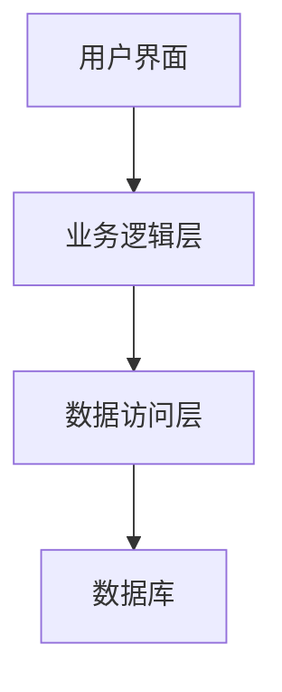
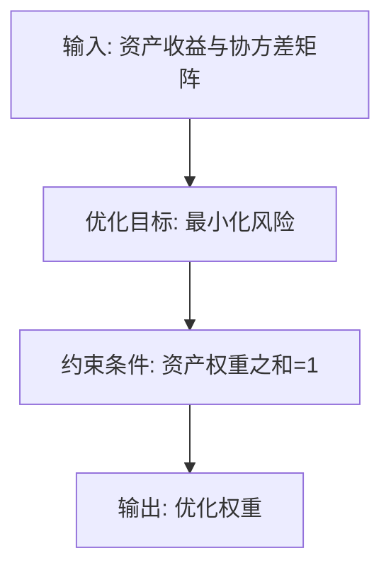

                 


# 约翰·伯格的投资组合再平衡策略

> 关键词：投资组合再平衡，约翰·伯格，资产配置，风险优化，组合优化

> 摘要：本文详细探讨了约翰·伯格的投资组合再平衡策略，从理论基础到实际应用，结合数学模型和系统架构，深入分析了该策略的核心思想、实现方法和优化技巧。

---

## 第一部分: 投资组合再平衡策略概述

### 第1章: 投资组合再平衡的核心概念

#### 1.1 投资组合再平衡的定义与背景

投资组合再平衡是一种通过定期调整投资组合中的资产权重，以维持预期风险和收益水平的策略。其核心思想是根据市场变化和个人投资目标的变化，动态优化资产配置。再平衡的目的是降低风险、提高收益并避免过度集中。

**约翰·伯格的再平衡策略**是基于现代投资组合理论（MPT）的一种动态调整方法。其核心思想是通过定期调整资产权重，使投资组合的风险和收益达到最优状态。

#### 1.2 约翰·伯格再平衡策略的核心思想

约翰·伯格的投资组合再平衡策略强调：
1. **风险控制**：通过分散投资降低组合的整体风险。
2. **动态优化**：根据市场变化和个人目标调整组合。
3. **长期视角**：定期检查和调整组合，确保长期收益。

---

### 第2章: 投资组合再平衡的理论基础

#### 2.1 资产配置与风险分散

资产配置是投资组合管理的核心，通过将资金分配到不同资产类别（股票、债券、现金等），降低组合的波动性并提高收益。

**风险分散原理**：投资组合的风险低于单一资产的风险，因为不同资产的收益波动不完全相关。

#### 2.2 约翰·伯格再平衡策略的数学模型

约翰·伯格的再平衡策略基于**均值-方差优化模型**，目标是最小化组合的风险（方差）并最大化收益。

**公式推导**：
$$ E(r_p) = \sum w_i E(r_i) $$
$$ \sigma_p^2 = \sum w_i^2 \sigma_i^2 + 2 \sum_{i < j} w_i w_j \rho_{ij} \sigma_i \sigma_j $$

其中：
- $w_i$：资产i的权重
- $E(r_i)$：资产i的期望收益
- $\sigma_i$：资产i的收益波动率
- $\rho_{ij}$：资产i和j的相关性

---

### 第3章: 约翰·伯格再平衡策略的实施步骤

#### 3.1 确定投资目标与风险承受能力

1. **投资目标**：收益目标、时间 horizon、流动性需求。
2. **风险承受能力**：根据投资者的风险偏好确定。

#### 3.2 构建初始投资组合

1. **资产分配**：根据目标确定各资产权重。
2. **选择投资标的**：选择能实现目标的资产。
3. **初始组合优化**：调整权重以匹配目标。

#### 3.3 定期再平衡与动态调整

1. **再平衡频率**：定期检查组合权重，调整至目标状态。
2. **市场变化影响**：根据市场变化优化组合。
3. **动态调整触发条件**：市场波动、目标变化等。

---

## 第二部分: 投资组合再平衡的系统架构与实现

### 第4章: 投资组合再平衡的系统架构设计

#### 4.1 系统功能模块划分

1. **数据采集与处理模块**：获取市场数据和组合信息。
2. **组合优化与再平衡模块**：执行优化算法。
3. **风险评估与预警模块**：监控风险并发出预警。

#### 4.2 系统架构设计



#### 4.3 系统接口设计

1. **数据接口**：与数据源交互。
2. **优化算法接口**：调用优化模块。
3. **风险评估接口**：获取风险指标。

---

### 第5章: 投资组合再平衡的算法实现

#### 5.1 均值-方差优化算法



**实现步骤**：
1. 输入资产收益和协方差矩阵。
2. 设置优化目标和约束条件。
3. 计算最优权重。

---

### 第6章: 项目实战

#### 6.1 环境安装

安装必要的库：
```bash
pip install numpy pandas scikit-learn matplotlib
```

#### 6.2 核心代码实现

```python
import numpy as np
from sklearn.covariance import LedoitWolf
import matplotlib.pyplot as plt

def mean_variance_optimization(risky_returns, risky_weights, risk_free_rate):
    # 计算协方差矩阵
    cov_matrix = np.cov(risky_returns)
    
    # 使用拉格朗日乘数法求解优化问题
    A = np.array([np.append(risky_weights, 1)])
    b = np.array([1])
    
    # 优化目标：最小化方差
    def objective(weights):
        return -np.dot(weights[:-1], np.dot(cov_matrix, weights[:-1]))
    
    # 约束条件：权重之和=1
    def constraint(weights):
        return np.dot(A, weights) - b
    
    # 使用scipy优化器
    from scipy.optimize import minimize
    weights = np.array([1.0/len(risky_weights)]*len(risky_weights))
    result = minimize(objective, weights, method='SLSQP', constraints={'type': 'eq', 'fun': constraint})
    
    return result.x[:-1]

# 示例数据
risky_returns = np.array([[0.1], [0.05], [0.08]])
risky_weights = [0.4, 0.3, 0.3]
risk_free_rate = 0.02

optimal_weights = mean_variance_optimization(risky_returns, risky_weights, risk_free_rate)
print("最优权重:", optimal_weights)
```

---

## 第三部分: 最佳实践与小结

### 7.1 最佳实践

1. **定期检查**：至少每季度检查一次投资组合。
2. **避免过度交易**：频繁调整会增加交易成本。
3. **结合定投**：定期定额投资可以平滑波动。

### 7.2 小结

约翰·伯格的投资组合再平衡策略通过动态优化资产配置，帮助投资者在不同市场环境下保持合理的风险和收益水平。通过定期再平衡，投资者可以有效降低风险，提高整体收益。

---

通过本文的分析，读者可以深入了解约翰·伯格再平衡策略的核心思想和实现方法，并能够将其应用于实际投资中。

