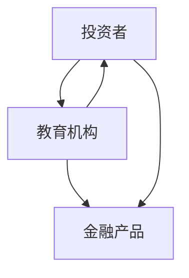
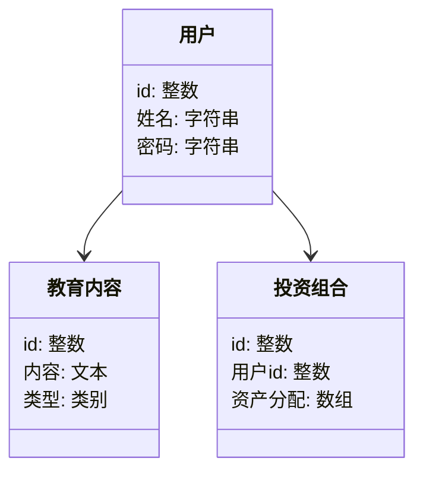

                 


# 约翰·伯格的投资者教育与普及理念

## 关键词：投资者教育、约翰·伯格、长期投资、分散投资、低成本投资

## 摘要：本文深入探讨了约翰·伯格的投资者教育理念，分析了长期投资、分散投资和低成本投资的核心思想，结合数学模型和系统架构，提供了实践案例和最佳实践建议，帮助读者理解并应用这些理念。

## 第一部分：投资者教育的背景与重要性

### 第1章：投资者教育的核心概念

#### 1.1 投资者教育的背景与问题背景

投资者教育的重要性在于帮助个人做出明智的投资决策。金融市场的复杂性和信息不对称使得投资者容易陷入误区，如短期波动追逐、情绪化交易等。这些问题导致投资者难以实现长期财务目标。投资者教育的目标是提高金融素养，引导理性投资。

#### 1.2 投资者教育的核心问题描述

投资者在决策中常面临信息不对称、情绪影响和短期行为与长期目标的冲突。这些问题导致投资结果不佳。解决方案包括提高金融素养、培养长期投资理念和避免情绪化交易。

#### 1.3 投资者教育的解决方案

通过教育提高投资者的金融素养，强调长期投资和分散投资的重要性，帮助投资者避免常见误区。

#### 1.4 投资者教育的边界与外延

教育对象包括个人和机构投资者，内容涵盖基本知识、投资策略和风险管理。教育方法包括讲座、书籍和在线资源。

#### 1.5 投资者教育的概念结构与核心要素

教育目标包括知识传递、技能培养和态度塑造；内容涉及基础概念、策略和风险管理；方法包括理论教学和实践模拟；效果评估通过测试和行为观察进行。

## 第二部分：约翰·伯格的投资者教育理念

### 第2章：约翰·伯格的投资者教育理念

#### 2.1 约翰·伯格的投资者教育核心理念

伯格强调长期投资、分散投资和低成本投资。长期投资避免短期波动影响，分散投资降低风险，低成本减少费用侵蚀收益。

#### 2.2 长期投资理念

长期投资通过复利效应实现财富增长。数学模型显示，长期持有指数基金的收益高于频繁交易。伯格建议投资者持有投资组合至少三年。

#### 2.3 分散投资理念

分散投资通过持有不同资产降低风险。根据现代投资组合理论，分散化是减少风险的有效方法。伯格建议投资多个资产类别，如股票和债券。

#### 2.4 成本控制理念

低成本投资减少费用对收益的影响。指数基金费用低，适合长期投资。伯格指出，费用高的基金长期表现不佳。

## 第三部分：投资者教育的核心概念与联系

### 第3章：投资者教育的核心概念原理

#### 3.1 投资者教育的核心概念

投资者教育涉及心理学、行为学和经济学。心理因素影响投资决策，行为因素决定实际操作，经济学理论指导投资策略。

#### 3.2 核心概念属性特征对比

| 概念 | 定义 | 影响 | 对策 |
|------|------|------|------|
| 心理因素 | 投资者心理状态 | 影响决策 | 提高金融素养 |
| 行为因素 | 投资者行为模式 | 影响结果 | 培养长期理念 |
| 决策因素 | 投资决策过程 | 影响收益 | 引导理性行为 |

#### 3.3 投资者教育的ER实体关系图



### 第4章：数学模型与算法原理

#### 4.1 长期投资的数学模型

$$ S = P \times (1 + r)^n $$

其中，S为终值，P为本金，r为年收益率，n为年数。模型显示，长期持有指数基金的收益高于短期交易。

#### 4.2 分散投资的算法原理

使用现代投资组合理论，通过分散投资降低风险。公式：

$$ \sigma_p = \sqrt{\sum w_i^2 \sigma_i^2 + 2 \sum_{i<j} w_i w_j \sigma_i \sigma_j \rho_{i,j}} $$

表示投资组合的风险，分散化降低整体风险。

#### 4.3 成本控制的优化模型

$$ \text{总成本} = \sum (w_i \times c_i) $$

通过选择低成本基金，优化投资组合总成本。

## 第五部分：系统分析与架构设计

### 第5章：系统分析与架构设计

#### 5.1 系统功能设计

模块包括用户管理、投资教育、投资组合管理。类图如下：



#### 5.2 系统架构设计

采用分层架构，包括表现层、业务逻辑层和数据访问层。架构图如下：


#### 5.3 系统接口设计

接口包括用户注册、登录、查看教育内容和管理投资组合。使用REST API设计。

#### 5.4 系统交互设计

序列图显示用户登录、查看教育内容和创建投资组合的流程。

## 第六部分：项目实战

### 第6章：项目实战

#### 6.1 环境安装

安装Python、Pandas、Matplotlib和Flask框架，配置虚拟环境。

#### 6.2 核心代码实现

代码实现投资组合分析，包括数据获取、分析和可视化。

```python
import pandas as pd
import matplotlib.pyplot as plt

# 数据获取
data = pd.read_csv('data.csv')
data['收盘价'].plot()
plt.show()
```

#### 6.3 代码解读与分析

代码获取数据，计算收益，绘制图表，分析投资组合表现。

## 第七部分：最佳实践与总结

### 第7章：最佳实践

#### 7.1 最佳实践 tips

- 定期定额投资，避免择时。
- 分散投资，降低风险。
- 选择低成本基金，节省费用。

#### 7.2 总结

约翰·伯格的理念强调长期、分散和低成本投资。通过系统学习和实践，投资者可以做出明智决策。

#### 7.3 注意事项

避免情绪化交易，定期评估投资组合，保持长期视角。

#### 7.4 拓展阅读

推荐书籍：《投资最重要的简单真理》、《漫步华尔街》。

---

通过以上结构，文章详细探讨了约翰·伯格的投资者教育理念，结合理论和实践，帮助读者理解并应用这些理念。

