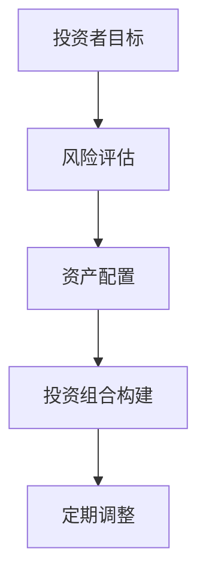
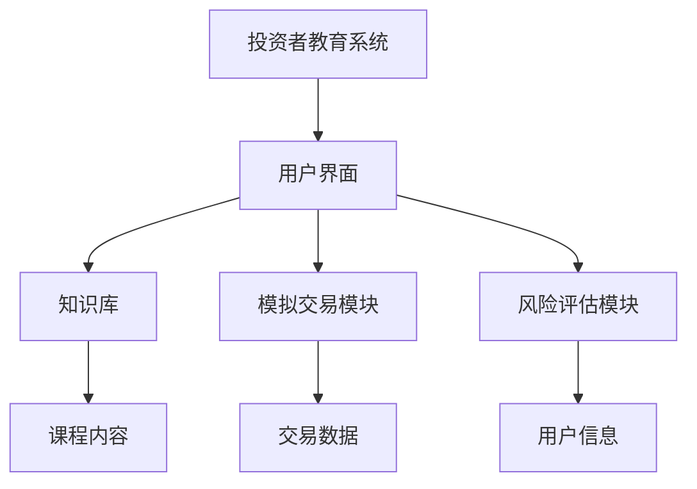

                 


# 约翰·伯格的投资者教育理念

## 关键词：投资者教育，约翰·伯格，价值投资，风险管理，投资系统，投资组合

## 摘要：  
《约翰·伯格的投资者教育理念》这篇文章深入探讨了约翰·伯格的投资者教育思想及其对现代投资策略的影响。通过分析伯格的核心理念，包括价值投资、风险管理、投资组合优化等，文章详细阐述了如何通过系统化的投资者教育帮助投资者做出更明智的投资决策。同时，文章结合实际案例和数学模型，为读者提供了一个全面理解伯格教育理念的框架。

---

## 第一部分：投资者教育的背景与重要性

### 第1章：投资者教育的核心概念

#### 1.1 投资者教育的定义与背景

- **投资者教育的定义**：投资者教育是指通过系统化的知识传授和实践指导，帮助投资者理解和掌握投资的基本原理、策略和技巧，从而做出理性的投资决策。
- **投资者教育的背景**：随着金融市场的快速发展，投资者面临的金融产品和投资渠道日益多样化，但同时也伴随着更高的风险和复杂性。许多投资者由于缺乏专业知识和经验，往往容易受到市场波动和认知偏差的影响，做出错误的投资决策。
- **投资者教育的重要性**：投资者教育不仅是保护投资者免受金融欺诈的重要手段，也是提高市场整体效率和稳定性的关键因素。通过教育，投资者可以更好地理解市场规律，避免盲目跟风，从而实现长期稳健的投资收益。

#### 1.2 约翰·伯格的投资者教育理念

- **伯格的投资哲学**：约翰·伯格是美国著名投资家，其投资哲学以“价值投资”为核心，强调长期投资、分散投资和风险管理。他认为，投资者应该关注企业的内在价值，而不是市场的短期波动。
- **伯格对投资者行为的洞察**：伯格指出，投资者的决策往往受到情绪和认知偏差的影响，例如过度自信、从众心理等。这些偏差会导致投资者在市场高点买入，在市场低点卖出，从而蒙受损失。
- **伯格教育理念的核心要素**：
  1. **价值投资**：强调买入低于内在价值的股票，长期持有，等待市场的重新评估。
  2. **风险管理**：通过分散投资和合理的资产配置来降低投资组合的整体风险。
  3. **长期思维**：鼓励投资者关注长期收益，避免被短期市场波动所左右。

#### 1.3 投资者教育的现状与挑战

- **当前投资者教育的主要问题**：
  1. 教育内容过于复杂，难以被普通投资者理解。
  2. 教育机构和金融机构的利益冲突可能导致教育内容偏向销售导向。
  3. 投资者自身的认知偏差和心理因素往往被忽视。
- **投资者认知偏差与行为偏差**：
  - **代表性偏差**：投资者倾向于根据少数案例或经验来推断普遍情况。
  - **确认偏差**：投资者倾向于寻找与自己观点一致的信息，忽略相反的证据。
  - **损失厌恶**：投资者对潜在损失的恐惧往往超过对潜在收益的追求。
- **教育体系的不足与改进方向**：
  1. 需要更加注重投资者的心理教育，帮助他们克服认知偏差。
  2. 教育内容应更加贴近实际，避免过于理论化。
  3. 利用技术手段（如大数据、人工智能）来个性化地指导投资者。

---

## 第二部分：投资理念的核心原理

### 第2章：价值投资与长期思维

#### 2.1 价值投资的定义与特征

- **价值投资的定义**：价值投资是一种投资策略，强调以低于公允价值的价格买入优质资产，并长期持有，等待市场重新评估其价值。
- **价值投资的核心特征**：
  1. **注重内在价值**：关注企业的基本面，如盈利能力、成长潜力、财务状况等。
  2. **长期持有**：避免频繁交易，降低交易成本和税收负担。
  3. **分散投资**：通过投资多个不同的资产来降低风险。

#### 2.2 投资者心理与行为分析

- **投资者心理偏差的类型与影响**：
  - **过度自信**：投资者倾向于高估自己的判断能力，容易导致错误决策。
  - **从众心理**：投资者倾向于跟随市场的主流观点，导致羊群效应。
  - **贪婪与恐惧**：市场的上涨往往引发贪婪，市场的下跌则引发恐惧，这两种情绪都会影响投资者的理性决策。
- **行为金融学的理论框架**：
  - ** prospect theory**：描述了投资者在面对收益和损失时的不同决策倾向。
  - ** bounded rationality**：投资者在决策时受到认知能力和信息处理能力的限制。
- **伯格对投资者心理的深刻分析**：
  伯格认为，投资者的决策往往受到情绪和认知偏差的影响，因此教育的核心在于帮助投资者克服这些偏差，回归理性。

#### 2.3 价值投资的数学模型与公式

- **投资组合的期望收益与风险**：
  - **期望收益**：$$ E(r) = \sum p_i r_i $$
  - **方差（风险）**：$$ \sigma^2 = \sum p_i (r_i - E(r))^2 $$
- **资产定价模型（CAPM）**：
  - **CAPM公式**：$$ r_i = r_f + \beta_i (r_m - r_f) $$
  - 其中，$$ r_f $$ 是无风险利率，$$ r_m $$ 是市场期望收益，$$ \beta_i $$ 是资产的贝塔系数，表示资产相对于市场的波动性。
- **价值投资的数学公式与应用**：
  - 通过分析企业的市盈率（P/E）、市净率（P/B）等指标，判断其是否被市场低估。

---

## 第三部分：投资决策的系统化方法

### 第3章：投资决策的系统化框架

#### 3.1 投资决策的流程与步骤

- **投资目标的设定与分析**：
  - 确定投资目标（如保值、增值、风险承受能力）。
  - 分析自身的财务状况和投资期限。
- **资产配置的策略与方法**：
  - 根据风险承受能力和收益目标，确定股票、债券、现金等各类资产的配置比例。
  - 使用数学模型优化资产配置，如现代投资组合理论（MPT）。
- **投资组合的构建与优化**：
  - 选择符合投资目标和资产配置的个股或基金。
  - 定期监控和调整投资组合，以适应市场变化和自身目标的变化。

#### 3.2 系统化投资的数学模型

- **投资组合优化的数学公式**：
  - **优化目标**：最大化收益，最小化风险。
  - **约束条件**：资产配置比例，流动性要求等。
  - **优化算法**：使用二次规划等方法求解最优解。
- **风险调整后的收益模型**：
  - **夏普比率**：$$ \text{夏普比率} = \frac{E(r_i - r_f)}{\sigma_i} $$
  - **特雷诺比率**：$$ \text{特雷诺比率} = \frac{E(r_i - r_f)}{\sqrt{\sigma_i^2 - \beta_i^2 \sigma_m^2}} $$
- **资产配置的动态调整方法**：
  - 根据市场变化和投资者目标的变化，定期重新优化资产配置。
  - 使用情景分析和压力测试评估不同市场条件下的投资组合表现。

#### 3.3 系统化投资的实现路径

- **系统化投资的流程图（Mermaid图）**

- **投资决策的算法实现（Python代码示例）**：
  ```python
  import numpy as np
  from scipy.optimize import minimize

  # 示例：优化投资组合
  def portfolio_optimization(returns, weights=None):
      n = len(returns)
      if weights is None:
          weights = np.ones(n) / n
      # 定义目标函数（最小化风险，即方差）
      def objective(weights, returns):
          return np.dot(weights.T, np.dot(returns, weights))
      # 定义约束条件
      constraints = [
          ('sum', weights, 1),
          ('>=', weights, 0)
      ]
      # 使用二次规划求解
      result = minimize(objective, weights, method='SLSQP', constraints=constraints)
      return result.x

  # 示例数据
  returns = np.array([[0.1], [0.2], [0.15]])
  optimal_weights = portfolio_optimization(returns)
  print(optimal_weights)
  ```

---

## 第四部分：投资者教育的系统设计与实现

### 第4章：投资者教育系统的架构设计

#### 4.1 投资者教育系统的功能模块

- **知识学习模块**：
  - 提供基础的金融知识培训，如股票、债券、基金等。
  - 提供价值投资、风险管理等核心理念的学习课程。
- **投资模拟模块**：
  - 提供虚拟交易环境，投资者可以模拟实际市场中的投资行为。
  - 自动生成投资组合，并提供实时的收益和风险评估。
- **风险评估模块**：
  - 帮助投资者评估自身的风险承受能力。
  - 提供个性化的投资建议和资产配置方案。

#### 4.2 系统架构设计（Mermaid图）



#### 4.3 系统接口设计与交互流程

- **用户注**：
  - 用户登录系统，选择感兴趣的学习模块。
  - 系统根据用户需求提供相应的课程或模拟交易环境。
  - 用户完成学习或模拟交易后，系统提供反馈和总结报告。

---

## 第五部分：项目实战

### 第5章：投资者教育系统的实现

#### 5.1 环境安装

- **技术选型**：
  - 前端：React或Vue.js
  - 后端：Python（Django或Flask）
  - 数据库：MySQL或MongoDB
  - 开发工具：PyCharm、VS Code

#### 5.2 核心实现源代码

- **Python代码示例**：
  ```python
  # 简单的投资组合优化函数
  def portfolio_optimizer(returns, risk_free_rate=0.02):
      n = len(returns)
      # 计算协方差矩阵
      covariance_matrix = np.cov(returns)
      # 计算风险平价权重
      weights = np.full(n, 1/n)
      # 优化投资组合
      def objective(weights, returns):
          return np.dot(weights.T, np.dot(returns, weights))
      result = minimize(objective, weights, method='SLSQP', constraints=('sum', weights, 1))
      return result.x

  # 示例数据
  returns = np.array([[0.1], [0.2], [0.15]])
  optimal_weights = portfolio_optimizer(returns)
  print(optimal_weights)
  ```

#### 5.3 案例分析与解读

- **实际案例分析**：
  - 假设一个投资者有100万元，风险承受能力中等。
  - 根据系统建议，将其资产配置为40%股票、30%债券、20%现金、10%基金。
  - 系统定期提供市场分析报告，提醒投资者进行必要的调整。

---

## 第六部分：最佳实践与小结

### 第6章：总结与注意事项

#### 6.1 小结

- 通过系统化的投资者教育，可以帮助投资者克服认知偏差，避免盲目决策。
- 伯格的价值投资理念强调长期思维和风险管理，是投资者教育的重要内容。
- 通过技术手段（如大数据、人工智能）可以进一步提升投资者教育的效果。

#### 6.2 注意事项

- 投资者教育不仅仅是知识的传授，更需要关注投资者的心理和行为。
- 在实际操作中，需要结合市场环境和投资者的个性化需求，灵活调整教育策略。
- 需要警惕教育机构的利益驱动，确保教育内容的客观性和中立性。

#### 6.3 拓展阅读

- **推荐书籍**：
  - 《投资学》（作者：查理·帕克）
  - 《价值投资入门》（作者：彼得·林奇）
- **推荐网站**：
  - [Morningstar](https://www.morningstar.com)：提供基金评级和市场分析。
  - [Fintech News](https://www.fintechnews.com)：关注金融科技领域的最新动态。

---

## 结语

通过《约翰·伯格的投资者教育理念》，我们可以看到，投资者教育不仅仅是传授知识，更是一种帮助投资者克服认知偏差、实现长期稳健收益的系统工程。伯格的价值投资理念和风险管理思想为我们提供了一个重要的框架，而技术手段的应用则进一步提升了投资者教育的效率和效果。希望本文能为投资者和教育工作者提供有益的启示和指导。

