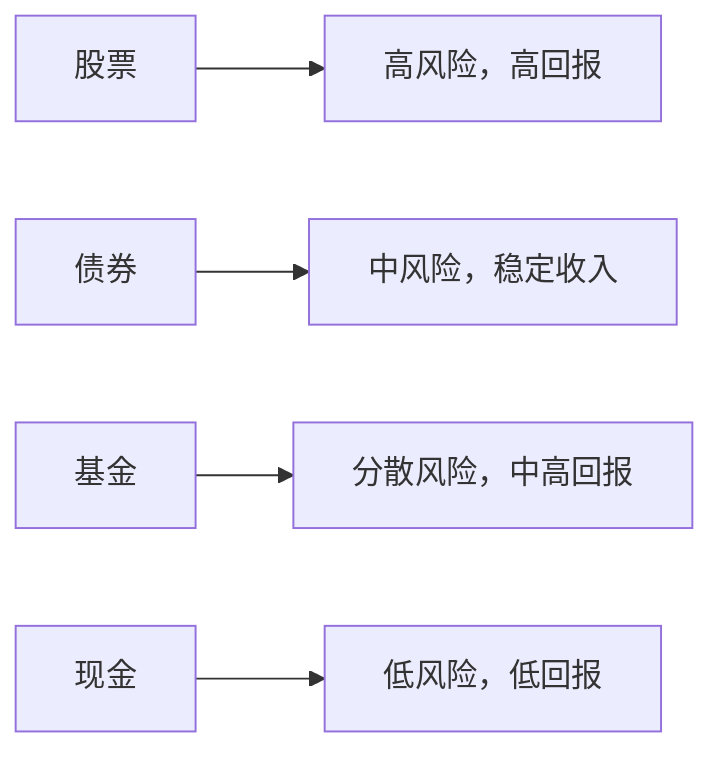

                 


# 约翰·伯格的投资者教育：普及金融知识的重要性

## 关键词：投资者教育，金融知识，约翰·伯格，投资策略，风险管理，投资者心理

## 摘要：本文探讨了约翰·伯格在投资者教育领域的贡献，分析了金融知识普及的重要性，并结合实际案例，阐述了如何通过教育提升投资者的决策能力。文章从背景介绍、核心概念、投资策略、心理分析、教育实践等方面展开，为读者提供了全面的视角。

---

## 第一部分：背景介绍

### 第1章：金融知识的重要性

#### 1.1 金融知识的重要性

- **1.1.1 什么是金融知识**
  金融知识涉及如何管理个人财务、投资和理解金融市场运作。它包括识别资产类别、评估风险、计算回报等核心内容。

- **1.1.2 金融知识在个人财务中的作用**
  良好的金融知识帮助个人做出明智的投资决策，避免财务危机，实现财务自由。

- **1.1.3 金融知识对社会经济的影响**
  普及金融知识可以提高整体经济的稳定性，减少市场波动，促进经济健康发展。

#### 1.2 投资者教育的现状与挑战

- **1.2.1 当前投资者教育的主要问题**
  包括教育资源不足、信息不对称、投资者认知偏差等。

- **1.2.2 投资者教育的全球趋势**
  随着全球化，投资者教育越来越受到重视，各国都在加强相关体系建设。

- **1.2.3 投资者教育的未来方向**
  更加注重实践教育和个性化指导，利用技术手段提升教育效果。

#### 1.3 约翰·伯格的投资者教育理念

- **1.3.1 约翰·伯格的教育背景与成就**
  伯格是投资界的权威，以其长期投资和价值投资理念闻名。

- **1.3.2 伯格的投资者教育方法**
  强调长期投资，避免短期波动，注重基本面分析。

- **1.3.3 伯格教育理念的核心思想**
  教育投资者理性决策，避免情绪化投资，注重知识积累和实践。

---

## 第二部分：核心概念与联系

### 第2章：金融市场的核心概念

#### 2.1 资产类别与特点

- **资产类别对比表格**

| 资产类别 | 特点 | 风险 | 回报 |
|----------|------|------|------|
| 股票     | 潜在高回报 | 高    | 高    |
| 债券     | 稳定收入   | 中    | 中    |
| 基金     | 多样化投资 | 中    | 中高   |
| 现金     | 流动性强   | 低    | 低    |

- **资产类别之间的关系**
  Mermaid图示：



---

### 第2章：投资策略与风险管理

#### 2.2 风险与回报的关系

- **风险的基本概念**
  投资风险是指投资收益的不确定性，包括市场风险、流动性风险等。

- **风险与回报的正相关性**
  Mermaid图示：


- **风险调整后的回报**
  计算公式：夏普比率 = (平均超额回报) / 标准差

  代码实现：

  ```python
  import numpy as np

  def sharpe_ratio(returns, risk_free_rate):
      excess_returns = returns - risk_free_rate
      return np.mean(excess_returns) / np.std(excess_returns)

  returns = np.array([0.1, 0.05, 0.15, 0.08])
  risk_free_rate = 0.02

  print(sharpe_ratio(returns, risk_free_rate))
  ```

---

## 第三部分：投资策略与风险管理

### 第3章：投资策略概述

#### 3.1 主要投资策略类型

- **被动投资**
  - 定义： mimic 指数表现，如指数基金。
  - 优点：费用低，风险分散。

- **主动投资**
  - 定义：通过选股或择时获取超额收益。
  - 缺点：费用高，风险集中。

- **对冲投资**
  - 定义：通过做空和做多对冲市场风险。
  - 优点：降低系统性风险。

---

## 第四部分：投资者心理与行为

### 第4章：投资者心理分析

#### 4.1 心理偏差对投资决策的影响

- **常见偏差**：从众、过度自信、损失厌恶。
- **影响**：导致非理性决策，如追涨杀跌。

#### 4.2 行为模式与决策过程

- **情绪化投资**：基于市场波动而非基本面。
- **羊群效应**：跟随市场趋势而非独立判断。

---

## 第五部分：投资者教育的实践与案例

### 第5章：教育实践与案例分析

#### 5.1 教育平台的设计与实现

- **系统功能设计**
  Mermaid类图：


- **案例分析**
  通过实际案例，展示教育如何改变投资者行为。

---

## 第六部分：总结与展望

### 第6章：总结与未来方向

#### 6.1 全文总结

- 强调金融知识普及的重要性，伯格理念的核心价值。

#### 6.2 未来展望

- 技术驱动教育创新，个性化教育，全球化的投资者教育趋势。

---

## 结语

约翰·伯格的投资者教育理念强调知识普及和理性决策。通过系统学习和实践，投资者可以做出更明智的决策，实现长期财务目标。未来，投资者教育将更加注重技术应用和个性化，帮助更多人掌握金融知识，提升投资能力。

