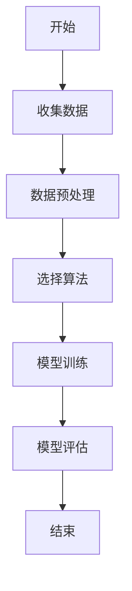
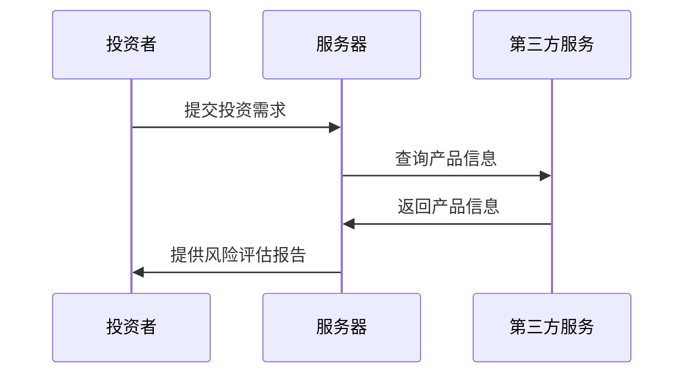

                 


# 约翰·伯格的投资者权益保护观

## 关键词：投资者权益保护，风险管理，法律框架，伦理考量，技术方法，系统架构

## 摘要：  
本文从约翰·伯格的投资者权益保护观出发，系统分析了投资者权益保护的核心概念、法律框架、技术方法及其在实际投资中的应用。通过对投资者权益保护的背景介绍、法律与伦理分析、技术方法的深入探讨，结合具体的案例分析，本文旨在为投资者提供一套全面的权益保护解决方案，帮助他们在复杂多变的市场环境中更好地保护自身利益。

---

# 第一部分: 投资者权益保护的背景与重要性

## 第1章: 投资者权益保护的背景介绍

### 1.1 投资者权益保护的核心概念

#### 1.1.1 投资者权益保护的定义  
投资者权益保护是指通过法律、伦理和技术创新，确保投资者在投资活动中能够获得公平、公正的待遇，避免因信息不对称、市场操纵或其他不正当行为而遭受损失。  

#### 1.1.2 投资者权益保护的必要性  
- **保护投资者利益**：确保投资者在投资决策中拥有充分的信息和公平的交易环境。  
- **维护市场秩序**：通过保护投资者权益，促进市场的健康发展，增强投资者信心。  
- **促进金融创新**：合理的权益保护机制能够激发市场参与者的创新动力。  

#### 1.1.3 投资者权益保护的边界与外延  
投资者权益保护的边界在于平衡各方利益，既要保护投资者的合法权益，也要避免过度保护影响市场的正常运作。其外延包括信息透明化、风险披露、公平交易等多方面内容。  

---

### 1.2 投资者权益保护的核心要素

#### 1.2.1 投资者的基本权利  
- **知情权**：投资者有权了解投资产品的基本信息、风险提示等。  
- **参与权**：投资者有权参与投资决策的相关过程。  
- **收益权**：投资者有权获得投资收益。  
- **监督权**：投资者有权监督投资机构的运作。  

#### 1.2.2 投资者义务与责任  
- **遵守合同约定**：投资者需按照合同履行支付款项、提供信息等义务。  
- **风险自担**：投资者需根据自身风险承受能力进行投资决策。  

#### 1.2.3 投资者权益保护的法律框架  
- **法律依据**：包括《证券法》《公司法》《消费者权益保护法》等。  
- **监管机构**：如证监会、银保监会等，负责监督市场行为，维护投资者权益。  

---

## 第2章: 投资者权益保护的核心概念与联系

### 2.1 投资者权益保护的核心原理

#### 2.1.1 投资者权益保护的理论基础  
- **有效市场假说**：假设市场能够有效反映所有信息，投资者能够基于充分的信息进行理性决策。  
- **行为金融学**：研究投资者心理偏差对决策的影响，从而制定更合理的保护机制。  

#### 2.1.2 投资者权益保护的法律依据  
- **法律文件**：如《投资者适当性管理办法》《私募投资基金监督管理暂行办法》等。  
- **监管框架**：包括事前监管（如产品审批）、事中监管（如实时监控）和事后监管（如纠纷处理）。  

#### 2.1.3 投资者权益保护的伦理考量  
- **公平性**：确保所有投资者在市场中享有平等的保护。  
- **透明性**：要求市场参与者公开透明地披露信息。  
- **责任分担**：明确各方在保护投资者权益中的责任与义务。  

---

### 2.2 投资者权益保护的核心概念对比

#### 2.2.1 投资者与利益相关者的对比  
- **投资者**：直接参与投资活动，享有收益和承担风险。  
- **利益相关者**：包括公司股东、债权人、员工等，与投资者权益保护密切相关但不完全相同。  

#### 2.2.2 权益保护与风险控制的对比  
- **权益保护**：侧重于事后权益的维护。  
- **风险控制**：侧重于事前风险管理，两者相辅相成。  

#### 2.2.3 投资者教育与投资者保护的对比  
- **投资者教育**：通过教育提高投资者的金融素养。  
- **投资者保护**：通过制度和机制保护投资者权益。  

---

### 2.3 投资者权益保护的ER实体关系图

```mermaid
erDiagram
    投资者 ..> 投资者权益
    投资者 ..> 保护机制
    保护机制 ..> 监管机构
    保护机制 ..> 金融机构
    保护机制 ..> 市场参与者
```

---

# 第二部分: 投资者权益保护的法律与伦理分析

## 第3章: 投资者权益保护的法律框架

### 3.1 投资者权益保护的法律法规

#### 3.1.1 主要法律文件概述  
- **《证券法》**：规范证券发行和交易行为，保护投资者合法权益。  
- **《公司法》**：规范公司治理结构，确保股东权益。  
- **《消费者权益保护法》**：适用于金融消费领域，保护投资者的消费者权益。  

#### 3.1.2 法律框架的构成  
- **法律层面**：国家层面的法律法规。  
- **监管层面**：证监会、银保监会等机构的规章。  
- **自律层面**：行业协会制定的自律规则。  

#### 3.1.3 法律框架的实施与监督  
- **监管机构**：负责监督市场行为，查处违法行为。  
- **司法途径**：投资者可通过诉讼维护自身权益。  

---

### 3.2 投资者权益保护的法律案例分析

#### 3.2.1 典型案例分析  
- **案例一**：某证券公司未充分披露风险，导致投资者损失。  
- **案例二**：某私募基金公司非法集资，投资者权益受损。  

#### 3.2.2 法律适用的难点与争议  
- **法律适用的模糊性**：如私募基金的法律适用问题。  
- **执行难度**：如中小投资者维权成本高。  

#### 3.2.3 法律框架的优化建议  
- **加强监管力度**：提高违法成本，震慑不法行为。  
- **完善投资者赔偿机制**：建立投资者赔偿基金，降低维权成本。  

---

## 第4章: 投资者权益保护的伦理问题

### 4.1 投资者权益保护的伦理基础

#### 4.1.1 伦理保护的必要性  
- **公平性**：确保市场参与者的机会均等。  
- **透明性**：要求市场信息的公开透明。  

#### 4.1.2 伦理保护的实现路径  
- **加强投资者教育**：提高投资者的金融素养。  
- **强化行业自律**：推动行业协会制定更严格的自律规则。  

#### 4.1.3 伦理保护的挑战与机遇  
- **挑战**：利益冲突、信息不对称等。  
- **机遇**：通过技术创新（如区块链）提高市场透明度。  

---

### 4.2 投资者权益保护的伦理评估模型

#### 4.2.1 伦理评估模型的构建  
- **模型输入**：市场环境、参与者行为、信息透明度等。  
- **模型输出**：伦理风险等级、保护建议等。  

#### 4.2.2 伦理评估模型的实施步骤  
1. 数据收集：收集市场参与者的行为数据。  
2. 风险评估：分析潜在的伦理风险。  
3. 保护建议：提出具体的保护措施。  

---

### 4.2.3 伦理评估模型的优缺点  
- **优点**：系统化、可量化。  
- **缺点**：模型的复杂性和实施成本较高。  

---

# 第三部分: 投资者权益保护的技术方法

## 第5章: 投资者权益保护的技术原理

### 5.1 投资者权益保护的技术方法

#### 5.1.1 风险评估技术  
- **方法**：通过数学模型评估投资产品的风险。  
- **工具**：如VaR（Value at Risk）、CVaR（Conditional Value at Risk）等。  

#### 5.1.2 信息披露技术  
- **方法**：通过区块链技术确保信息披露的透明性和不可篡改性。  
- **工具**：区块链平台、智能合约等。  

#### 5.1.3 投资者教育技术  
- **方法**：利用人工智能技术为投资者提供个性化的教育内容。  
- **工具**：智能投顾系统、教育平台等。  

---

### 5.2 投资者权益保护的技术流程

#### 5.2.1 技术流程的标准化  
- **标准化步骤**：信息收集、风险评估、信息披露、投资者教育等。  

#### 5.2.2 技术流程的优化  
- **优化措施**：引入自动化技术，提高效率。  

#### 5.2.3 技术流程的实施与监督  
- **实施步骤**：从数据收集到最终的保护措施落地。  
- **监督机制**：通过技术手段实时监控市场行为。  

---

## 第6章: 投资者权益保护的算法原理

### 6.1 投资者权益保护的算法模型

#### 6.1.1 风险评估模型  
- **模型名称**：风险评估模型  
- **公式**：  
  $$ \text{VaR} = \mu + z \cdot \sigma $$  
  其中，$\mu$ 是平均值，$z$ 是标准正态分布的分位数，$\sigma$ 是标准差。  

#### 6.1.2 信息披露算法  
- **算法名称**：区块链信息披露算法  
- **步骤**：  
  1. 数据上链：将投资产品的信息上链。  
  2. 数据验证：通过共识机制验证数据的真实性。  
  3. 数据查询：投资者可随时查询相关信息。  

#### 6.1.3 投资者教育算法  
- **算法名称**：个性化教育算法  
- **步骤**：  
  1. 收集投资者信息：包括投资目标、风险偏好等。  
  2. 生成教育内容：根据投资者信息生成个性化的教育方案。  
  3. 实施教育：通过平台提供教育内容。  

---

### 6.2 投资者权益保护的算法流程图



---

## 第7章: 投资者权益保护的系统架构设计

### 7.1 系统功能设计

#### 7.1.1 领域模型  
```mermaid
classDiagram
    投资者 <---- 投资者权益
    投资者 <---- 保护机制
    保护机制 <---- 监管机构
    保护机制 <---- 金融机构
```

---

### 7.2 系统架构设计  


---

### 7.3 系统接口设计  
- **输入接口**：投资者信息、投资产品信息等。  
- **输出接口**：风险评估结果、教育内容等。  

---

### 7.4 系统交互设计  


---

## 第8章: 项目实战

### 8.1 环境安装

#### 8.1.1 技术栈选择  
- **前端**：React、Vue等。  
- **后端**：Python（Django/Flask）、Java等。  
- **数据库**：MySQL、MongoDB等。  

#### 8.1.2 开发工具安装  
- **Python**：安装Anaconda或PyCharm。  
- **区块链框架**：安装以太坊或其他区块链开发框架。  

---

### 8.2 系统核心实现源代码

#### 8.2.1 风险评估系统实现  
```python
import numpy as np

def calculate_variance(data):
    return np.var(data)

def calculate_standard_deviation(data):
    return np.std(data)

def calculate_value_at_risk(data, confidence_level=0.95):
    mu = np.mean(data)
    sigma = np.std(data)
    z = norm.ppf(confidence_level)
    return mu + z * sigma
```

---

### 8.2.2 区块链信息披露系统实现  
```python
from web3 import Web3

def connect_to_ethereum():
    w3 = Web3(Web3.HTTPProvider("http://localhost:8545"))
    return w3

def store_data_on_chain(w3, data):
    # 假设已经部署了一个智能合约
    contract = w3.eth.contract(address='0x...', abi=...)
    transaction = contract.functions.storeData(data).buildTransaction({'from': w3.eth.accounts[0]})
    w3.eth.sendTransaction(transaction)
```

---

### 8.3 实际案例分析与解读  
- **案例分析**：某公司通过区块链技术实现投资产品的信息披露，有效降低了投资者的信息不对称风险。  
- **详细解读**：通过区块链技术确保数据的真实性和不可篡改性，为投资者提供可靠的决策依据。  

---

## 第9章: 总结与展望

### 9.1 总结  
投资者权益保护是一个复杂而重要的问题，需要法律、伦理和技术的共同作用。通过本文的分析，我们得出以下结论：  
- **法律层面**：需要进一步完善相关法律法规，加强监管力度。  
- **伦理层面**：需要推动行业自律，提高市场透明度。  
- **技术层面**：需要引入更多创新技术（如区块链、人工智能）来提升保护效果。  

---

### 9.2 展望  
未来，投资者权益保护将朝着以下几个方向发展：  
- **技术驱动**：利用新兴技术（如区块链、人工智能）提升保护效果。  
- **全球化**：随着资本市场的全球化，投资者权益保护将面临更大的挑战和机遇。  
- **教育普及**：通过投资者教育提高投资者的自我保护能力。  

---

## 附录

### 附录A: 相关法律条文摘录  
- **《证券法》**：  
  $$\text{第一百一十条}：证券公司应当采取措施，保障投资者的交易安全，维护投资者的合法权益。$$  

- **《公司法》**：  
  $$\text{第一百零二条}：公司应当向股东提供真实、准确、完整的财务信息。$$  

---

### 附录B: 工具推荐  
- **区块链开发工具**：Ethereum、Hyperledger。  
- **风险评估工具**：Python的scipy、pandas库。  
- **投资者教育平台**：Coursera、edX等在线教育平台。  

---

通过以上内容，我们可以看到，投资者权益保护是一个需要多方面协同的复杂问题。只有通过法律、伦理和技术的共同作用，才能真正实现对投资者权益的有效保护。

