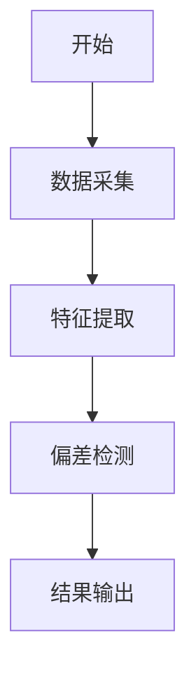
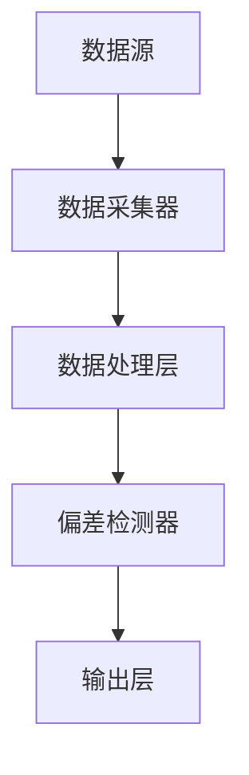
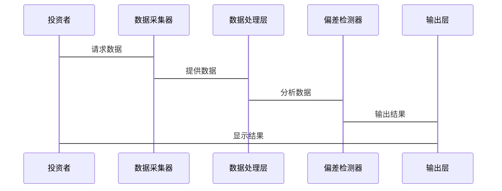

                 


# 约翰·伯格的投资者行为偏差研究

## 关键词：投资者行为偏差，约翰·伯格，认知偏差，行为偏差，投资心理学，投资决策模型

## 摘要：本文深入探讨了约翰·伯格提出的投资者行为偏差，分析了认知偏差和行为偏差对投资决策的影响。通过详细阐述偏差的分类、算法识别、数学模型及系统架构，结合实际案例，为投资者提供识别和纠正偏差的策略，帮助做出更理性的投资决策。

---

## 第一部分：投资者行为偏差的背景与基础

### 第1章：投资心理学与行为偏差概述

#### 1.1 投资心理学的基本概念

投资心理学研究投资者在决策过程中的心理因素，揭示认知、情感和行为如何影响投资决策。约翰·伯格强调，理解这些因素是实现长期稳健投资的关键。行为偏差是指投资者在决策过程中偏离理性预期的倾向，这些偏差可能导致非理性投资行为。

#### 1.2 行为偏差的定义与分类

行为偏差分为认知偏差和行为偏差。认知偏差是认知过程中的错误，行为偏差是基于错误认知的行动。常见的认知偏差包括确认偏差、损失厌恶，而行为偏差则包括从众和过度交易。

---

## 第二部分：投资者行为偏差的核心概念与联系

### 第2章：认知偏差与行为偏差的分析

#### 2.1 认知偏差的原理

认知偏差是信息处理过程中的系统性错误。例如，确认偏差使投资者倾向于寻找支持自己观点的信息，导致决策失误。损失厌恶使投资者更害怕损失，影响其卖出决策。

#### 2.2 行为偏差的原理

行为偏差是认知偏差的结果，如从众和过度交易。从众使投资者跟随市场趋势，而过度交易则增加了交易成本，降低了收益。

#### 2.3 认知偏差与行为偏差的关系

认知偏差导致行为偏差，两者相互作用，影响投资结果。ER实体关系图展示了偏差间的关联，帮助理解其相互作用。

---

## 第三部分：投资者行为偏差的算法原理

### 第3章：行为偏差识别算法

#### 3.1 算法流程图（mermaid）



#### 3.2 算法实现

伪代码实现：

```python
def detect偏差(data):
    features = extract_features(data)
    for f in features:
        if is偏差(f):
            return True
    return False

def main():
    data = 采集数据()
    if detect偏差(data):
        输出结果()
    else:
        输出无偏差()
```

核心函数分析：`detect偏差`函数检查数据中的偏差，`main`函数执行数据采集和结果输出。

---

## 第四部分：数学模型与公式

### 第4章：行为偏差的数学分析

#### 4.1 投资决策模型

投资决策模型公式：

$$
决策 = f(认知, 行为偏差)
$$

#### 4.2 偏差对收益的影响

收益计算公式：

$$
收益 = 理论收益 - 偏差影响
$$

偏差影响由认知偏差和行为偏差共同决定。

---

## 第五部分：系统分析与架构设计

### 第5章：系统架构设计

#### 5.1 领域模型（mermaid类图）


#### 5.2 系统架构图（mermaid架构图）



#### 5.3 系统交互设计（mermaid序列图）



---

## 第六部分：项目实战

### 第6章：案例分析与实现

#### 6.1 环境安装与配置

安装必要的工具和库，如Python、Pandas、NumPy和Scikit-learn。

#### 6.2 核心代码实现

```python
import pandas as pd
from sklearn import tree

def load_data():
    # 加载数据
    data = pd.read_csv('investor_data.csv')
    return data

def extract_features(data):
    # 提取特征
    features = data[['情绪', '行为', '认知']]
    return features

def detect偏差(features):
    # 使用决策树检测偏差
    clf = tree.DecisionTreeClassifier()
    clf.fit(features, labels)
    return clf.predict(features)

def main():
    data = load_data()
    features = extract_features(data)
    偏差 = detect偏差(features)
    输出结果(偏差)

if __name__ == "__main__":
    main()
```

代码解读：加载数据，提取特征，使用决策树检测偏差，输出结果。

#### 6.3 案例分析

分析一个投资者在面对市场波动时的行为，展示如何通过算法识别偏差，并提供纠正建议。

---

## 第七部分：总结与最佳实践

### 第7章：最佳实践与小结

#### 7.1 小结

总结投资者行为偏差的影响，强调识别和纠正偏差的重要性。结论部分指出，理解和应对偏差是提升投资决策的关键。

#### 7.2 最佳实践 tips

- 定期回顾和分析投资决策。
- 使用系统工具检测偏差。
- 保持理性，避免情绪化决策。
- 持续学习和改进投资策略。

---

## 附录

- 附录A：相关术语表
- 附录B：参考文献
- 附录C：工具与资源推荐

---

## 图表索引

- 图表1：认知偏差与行为偏差对比表
- 图表2：认知偏差与行为偏差的ER关系图
- 图表3：行为偏差识别算法流程图
- 图表4：投资决策模型分析图
- 图表5：领域模型类图
- 图表6：系统架构图
- 图表7：系统交互序列图

---

# 结束语

通过本文的详细分析，读者可以全面理解约翰·伯格提出的投资者行为偏差，并学会在实际投资中识别和纠正这些偏差，做出更理性的投资决策。希望本文能为投资者提供有价值的指导和启示。

