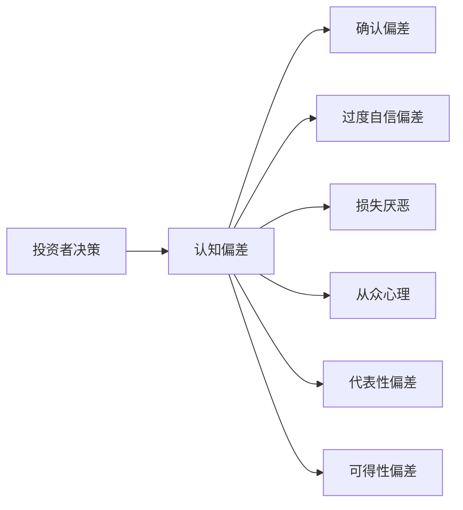

                 

# 约翰·伯格的投资者行为学观点

---

## 关键词：
- 投资者行为学
- 约翰·伯格
- 理性与非理性
- 投资决策
- 行为偏差

---

## 摘要：
本文深入探讨了约翰·伯格的投资者行为学观点，分析了投资者在决策过程中的心理偏差、情绪影响以及非理性行为。通过结合实际案例和数学模型，文章详细阐述了如何通过理解投资者行为来优化投资策略，强调了长期投资和低成本指数基金的重要性。文章结构清晰，内容涵盖背景介绍、核心概念、算法原理、系统分析以及项目实战，帮助读者全面理解伯格的投资者行为学理论及其实际应用。

---

# 目录

## 第一部分: 投资者行为学的背景与基础

## 第二部分: 投资者行为学的核心概念与联系

## 第三部分: 投资者行为学的算法原理

## 第四部分: 投资者行为学的系统分析与架构设计方案

## 第五部分: 投资者行为学的项目实战

---

## 第一部分: 投资者行为学的背景与基础

## 第2章: 投资者行为学的核心概念与联系

### 2.1 投资者行为学的核心原理

#### 2.1.3 投资者认知偏差的分类与影响

---

### 2.1.3 投资者认知偏差的分类与影响

投资者认知偏差是投资者行为学中的核心概念之一。认知偏差是指投资者在决策过程中由于心理因素的影响，导致判断和选择偏离理性逻辑的现象。约翰·伯格在其研究中指出，认知偏差是投资者行为中的主要障碍之一，常常导致投资决策失误。

#### 1. 认知偏差的分类

认知偏差可以分为以下几类：

1. **确认偏差（Confirmation Bias）**：投资者倾向于寻找和关注与自己已有观点一致的信息，而忽略或忽视与之矛盾的信息。这种偏差会导致投资者坚持错误的投资决策，无法及时调整投资策略。
   
2. **过度自信偏差（Overconfidence Bias）**：投资者往往对自己的投资能力过于自信，认为自己能够准确预测市场走势，从而过度交易或冒险。这种偏差在市场上涨时尤为明显，投资者容易忽视市场的不确定性。

3. **损失厌恶（Loss Aversion）**：投资者对损失的厌恶程度远超过对收益的追求。他们更倾向于避免损失，而不是追求收益最大化。这种心理会导致投资者在市场下跌时急于卖出，错失长期增值的机会。

4. **从众心理（Herding Behavior）**：投资者倾向于跟随市场中的大多数人的行为，尤其是在市场波动剧烈时。这种行为可能导致市场的过度波动，放大市场的涨跌幅度。

5. **代表性偏差（Representativeness Bias）**：投资者倾向于根据有限的信息对市场或资产进行分类，并将其与典型案例进行比较，从而做出不合理的假设。这种偏差常见于对新兴市场的投资决策中。

6. **可得性偏差（Availability Bias）**：投资者倾向于根据最近或容易回忆起来的信息做出决策，而忽视其他重要的信息。这种偏差在突发事件发生后尤为明显，投资者容易受到市场情绪的影响。

---

#### 2. 投资者认知偏差的图表分析

以下是投资者认知偏差的分类及其影响的示意图：

---

#### 3. 投资者认知偏差对投资行为的影响

认知偏差对投资者行为的影响是深远的。以下是几种主要偏差的具体影响：

1. **确认偏差**：导致投资者忽视与自己观点不符的信息，从而错失投资机会或坚持错误的投资决策。例如，一位投资者坚信科技股将长期上涨，因此只关注支持这一观点的信息，而忽视科技行业可能面临的技术瓶颈或政策变化。

2. **过度自信偏差**：导致投资者过度交易，频繁买卖股票，增加交易成本，并可能错失长期增值的机会。例如，投资者相信自己能够准确预测市场的短期走势，频繁进行短线交易，却忽略了长期投资的复利效应。

3. **损失厌恶**：导致投资者在市场下跌时急于卖出，避免进一步亏损。这种行为虽然可以避免短期损失，却可能错过市场反弹的机会，导致长期收益减少。例如，投资者在2008年全球金融危机期间卖出股票，错过了后续市场的复苏。

4. **从众心理**：导致市场的非理性波动，尤其是在市场恐慌或狂热时。例如，2015年中国的股灾期间，大量投资者盲目跟风，导致市场出现大幅波动。

5. **代表性偏差**：导致投资者基于片面信息做出决策，例如将某个新兴行业的成功案例作为投资依据，而忽视了行业的整体风险和竞争环境。这种偏差在科技行业尤其明显，许多投资者仅看到某家科技公司的成功，而忽视了行业的高风险和高竞争性。

6. **可得性偏差**：导致投资者基于最近发生的事件做出决策，例如在恐怖袭击发生后，投资者可能过度关注地缘政治风险，从而影响其对相关市场的投资决策。

---

#### 4. 投资者认知偏差的应对策略

为了克服认知偏差对投资决策的影响，投资者可以采取以下策略：

1. **自我反思与认知评估**：定期反思自己的投资决策，识别是否存在认知偏差，并尝试用更全面的信息进行决策。

2. **分散投资**：通过分散投资降低单一资产的风险，避免因某一项资产的偏差导致整体投资组合的重大损失。

3. **长期投资**：长期投资可以帮助投资者避免短期市场波动的干扰，减少因情绪化决策带来的损失。

4. **定期复盘**：定期回顾投资组合的表现，评估投资决策的有效性，并根据市场变化进行调整。

5. **借助专业工具**：使用专业的投资分析工具和模型，帮助自己做出更理性的决策。

---

#### 5. 投资者认知偏差的数学模型

为了更深入地理解认知偏差对投资行为的影响，我们可以构建一个简单的数学模型来描述投资者在决策过程中的偏差。

考虑一个投资者在选择投资标的时，受到认知偏差的影响，其决策过程可以表示为：

$$
\text{投资决策} = \text{理性决策} + \text{认知偏差的影响}
$$

其中，理性决策基于市场信息和基本面分析，而认知偏差的影响则是投资者心理因素导致的偏离理性决策的部分。

例如，假设投资者在选择股票时，理性决策基于公司的财务指标和行业前景，而认知偏差的影响包括对公司的过度乐观或对市场的过度担忧。

通过量化认知偏差的影响，投资者可以更好地理解自己在决策中的偏差，并采取相应的策略进行调整。

---

#### 6. 投资者认知偏差的案例分析

为了更好地理解认知偏差对投资行为的影响，我们可以通过一个实际案例进行分析：

**案例：科技股投资中的代表性偏差**

假设2020年，投资者看到某家科技公司推出了革命性的新产品，并取得了显著的市场成功。由于该公司的成功案例易于获取，投资者可能基于此对公司所在行业的整体前景产生乐观预期，并决定投资于该行业中的其他公司。

然而，这种基于单一成功案例的决策忽略了行业中的其他因素，例如技术瓶颈、市场竞争、政策监管等。这种决策偏差被称为“代表性偏差”，因为它将行业中的单一成功案例过度推广到整个行业。

通过分析这一案例，投资者可以意识到，仅仅基于容易获取的成功案例做出决策是不够的，还需要全面评估行业和公司的基本面情况。

---

## 总结

认知偏差是投资者行为学中的重要研究对象，其对投资决策的影响不容忽视。通过识别和理解各种认知偏差，投资者可以更好地做出理性的决策，避免因心理因素导致的投资失误。约翰·伯格在其研究中强调，克服认知偏差是实现长期投资成功的关键之一。因此，投资者在实际操作中，应当通过自我反思、分散投资和借助专业工具等多种方式，减少认知偏差的影响，优化投资策略。

---

通过以上分析，我们可以看到，认知偏差是投资者行为中的一个重要因素，理解其分类和影响对于优化投资决策具有重要意义。接下来，我们将进一步探讨投资者行为学的其他核心概念，包括投资者情绪、决策过程和行为模型等。

