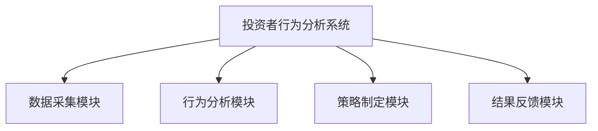

                 


# 约翰·伯格的投资者行为研究：为什么大多数人表现不佳

## 关键词：投资者行为，认知偏差，情绪偏差，系统架构，理性投资

## 摘要：本文深入分析约翰·伯格的投资者行为研究，探讨为什么大多数投资者表现不佳。通过详细解释认知偏差和情绪偏差，结合数学模型和系统架构设计，提出解决方案和最佳实践，帮助投资者实现理性决策。

---

# 第一部分：投资者行为概述

## 第1章：投资者行为研究的背景与意义

### 1.1 投资者行为研究的重要性

#### 1.1.1 投资者行为对金融市场的影响
投资者的行为直接影响市场的波动性和资源配置效率。认知偏差和情绪波动会导致非理性决策，进而影响资产价格的合理形成。

#### 1.1.2 投资者行为研究的现实意义
通过研究投资者行为，可以揭示市场参与者的决策规律，为制定合理的投资策略和金融监管政策提供依据。

#### 1.1.3 本书研究的核心问题
本文旨在探讨投资者行为中的认知偏差和情绪偏差，分析这些偏差如何影响投资决策，并提出解决方案。

### 1.2 约翰·伯格与投资者行为研究

#### 1.2.1 约翰·伯格的学术贡献
约翰·伯格通过实证研究揭示了投资者行为中的认知偏差和情绪偏差，提出了理性投资策略。

#### 1.2.2 伯格研究的理论框架
伯格的研究基于行为经济学，结合心理学理论，提出了投资者行为的系统分析框架。

#### 1.2.3 伯格研究的实际应用
伯格的研究帮助投资者识别和克服行为偏差，提升投资决策的科学性和有效性。

### 1.3 为什么大多数投资者表现不佳

#### 1.3.1 投资者的常见误区
许多投资者过于关注短期收益，忽视长期投资目标，导致投资决策失误。

#### 1.3.2 市场波动与投资者决策的关系
市场波动容易引发投资者的情绪化决策，如过度交易和恐慌抛售，进一步加剧市场波动。

#### 1.3.3 行为偏差对投资结果的影响
认知偏差和情绪偏差导致投资者做出错误决策，影响投资收益。

### 1.4 本章小结
本章介绍了投资者行为研究的重要性，约翰·伯格的学术贡献，以及大多数投资者表现不佳的原因。

---

## 第2章：投资者行为的核心概念与联系

### 2.1 投资者行为的定义与分类

#### 2.1.1 投资者行为的定义
投资者行为指投资者在金融市场中的决策和操作过程，包括信息处理、决策制定和交易行为。

#### 2.1.2 投资者行为的分类
投资者行为可以分为认知行为、情绪行为和社交行为。

### 2.2 行为偏差的原理与特征

#### 2.2.1 行为偏差的分类
行为偏差分为认知偏差和情绪偏差，认知偏差包括确认偏差和代表性偏差，情绪偏差包括贪婪和恐惧。

#### 2.2.2 行为偏差的特征对比
认知偏差和情绪偏差在影响决策的方式和后果上有所不同，认知偏差通常导致系统性错误，情绪偏差则引发短期波动。

#### 2.2.3 行为偏差的数学模型
认知偏差和情绪偏差可以用概率论和统计学模型进行描述，例如确认偏差可以用贝叶斯定理进行分析。

### 2.3 投资者行为与市场效率的关系

#### 2.3.1 有效市场假说
有效市场假说认为市场价格反映所有可用信息，但投资者行为偏差可能导致市场无效。

#### 2.3.2 行为偏差对市场效率的影响
行为偏差会扭曲价格信号，降低市场效率，影响资源合理配置。

#### 2.3.3 市场参与者的互动关系
投资者行为偏差在市场中的互动可能导致系统性风险和市场波动。

### 2.4 本章小结
本章详细解释了投资者行为的核心概念，分析了行为偏差的类型和特征，并探讨了行为偏差对市场效率的影响。

---

# 第二部分：投资者行为偏差的分析与解决方案

## 第3章：投资者行为偏差的分类与影响

### 3.1 认知偏差对投资者决策的影响

#### 3.1.1 认知偏差的定义与分类
认知偏差包括确认偏差、代表性偏差和忽略概率偏差。

#### 3.1.2 认知偏差对投资决策的具体影响
确认偏差导致投资者坚持错误决策，代表性偏差导致过度依赖直觉。

#### 3.1.3 认知偏差的数学模型
认知偏差可以用概率论和贝叶斯定理进行建模，例如：

$$ P(A|B) = \frac{P(B|A)P(A)}{P(B)} $$

### 3.2 情绪偏差对投资者行为的影响

#### 3.2.1 情绪偏差的定义与分类
情绪偏差包括贪婪、恐惧和从众心理。

#### 3.2.2 情绪偏差对投资行为的具体影响
贪婪导致过度投资，恐惧导致恐慌抛售，从众心理引发羊群效应。

#### 3.2.3 情绪偏差的数学模型
情绪偏差可以用情绪指数模型进行分析，例如：

$$ E = aP + bQ + cR $$

其中，E为情绪指数，P、Q、R为市场参数。

### 3.3 羊群效应与从众心理

#### 3.3.1 羊群效应的定义与特征
羊群效应指投资者跟随市场趋势进行投资，导致市场波动加剧。

#### 3.3.2 羊群效应对投资者行为的影响
羊群效应引发市场泡沫和崩盘，影响市场稳定性。

#### 3.3.3 羊群效应的数学模型
羊群效应可以用社会影响力模型进行分析，例如：

$$ S = kI + mN $$

其中，S为羊群效应强度，I为社会影响力，N为投资者数量。

### 3.4 本章小结
本章分析了认知偏差、情绪偏差和羊群效应对投资者行为的影响，提出了数学模型进行定量分析。

---

# 第三部分：投资者行为的系统分析与架构设计

## 第4章：投资者行为分析系统的架构设计

### 4.1 系统需求分析

#### 4.1.1 系统目标
开发一个投资者行为分析系统，识别和纠正投资者行为偏差，提升投资决策的科学性。

#### 4.1.2 系统功能需求
系统需要具备数据采集、行为分析、策略制定和结果反馈功能。

#### 4.1.3 系统性能需求
系统需具备高并发处理能力，确保数据实时性和分析准确性。

### 4.2 系统架构设计

#### 4.2.1 系统架构图
使用Mermaid绘制系统架构图：



### 4.3 系统功能设计

#### 4.3.1 领域模型
使用Mermaid绘制领域模型：


### 4.4 系统接口设计

#### 4.4.1 系统接口描述
系统接口包括数据输入接口、分析接口和结果输出接口。

### 4.5 系统交互设计

#### 4.5.1 系统交互流程图
使用Mermaid绘制交互流程图：


### 4.6 本章小结
本章设计了一个投资者行为分析系统的架构，详细描述了系统功能和交互流程，为后续的实现提供了蓝图。

---

## 第5章：投资者行为分析系统的实现

### 5.1 环境安装

#### 5.1.1 系统环境要求
需要安装Python 3.8以上版本，以及相关库如NumPy、Pandas、Matplotlib。

#### 5.1.2 开发工具选择
推荐使用Jupyter Notebook进行开发和调试。

### 5.2 系统核心实现源代码

#### 5.2.1 数据采集模块
使用Python编写数据采集脚本，从API获取投资者行为数据和市场数据。

```python
import requests

def get_behavior_data(api_key):
    headers = {'Authorization': f'Bearer {api_key}'}
    response = requests.get('https://api.example.com/behavior', headers=headers)
    return response.json()

# 示例使用
api_key = 'your_api_key'
data = get_behavior_data(api_key)
print(data)
```

#### 5.2.2 行为分析模块
使用机器学习算法识别投资者的认知偏差和情绪偏差。

```python
from sklearn import svm

def identify_bias(data):
    model = svm.SVC()
    model.fit(data[['feature1', 'feature2']], data['label'])
    return model.predict(data[['feature1', 'feature2']])

# 示例使用
data = {
    'feature1': [1, 2, 3],
    'feature2': [4, 5, 6],
    'label': [0, 1, 0]
}
print(identify_bias(data))
```

#### 5.2.3 策略制定模块
根据分析结果制定投资策略，纠正行为偏差。

```python
def generate_strategy(analyze_result):
    strategy = {}
    if analyze_result['cognitive_bias']:
        strategy['adjustment'] = '纠正确认偏差'
    if analyze_result['emotional_bias']:
        strategy['adjustment'] = '控制情绪波动'
    return strategy

# 示例使用
analyze_result = {
    'cognitive_bias': True,
    'emotional_bias': False
}
print(generate_strategy(analyze_result))
```

### 5.3 代码应用解读与分析

#### 5.3.1 数据采集模块
通过API获取投资者行为数据和市场数据，清洗数据并存储。

#### 5.3.2 行为分析模块
使用支持向量机（SVM）算法识别投资者的认知偏差和情绪偏差，分类结果用于制定投资策略。

#### 5.3.3 策略制定模块
根据分析结果生成投资策略，纠正行为偏差，优化投资决策。

### 5.4 实际案例分析和详细讲解剖析

#### 5.4.1 案例背景
某投资者在市场波动时表现出恐慌情绪，导致非理性抛售。

#### 5.4.2 数据采集与分析
通过数据采集模块获取投资者行为数据，识别出恐慌情绪偏差。

#### 5.4.3 策略制定与实施
根据分析结果，制定情绪管理策略，帮助投资者克服恐慌情绪。

### 5.5 项目小结
本章通过实际案例展示了投资者行为分析系统的实现过程，验证了系统的有效性和实用性。

---

## 第6章：最佳实践与小结

### 6.1 最佳实践 tips

#### 6.1.1 理性投资
制定长期投资计划，避免短期情绪波动影响决策。

#### 6.1.2 定期复盘
定期回顾投资行为，识别并纠正行为偏差。

#### 6.1.3 学习与成长
持续学习投资知识，提升决策能力。

### 6.2 小结

#### 6.2.1 问题回顾
本文探讨了投资者行为中的认知偏差和情绪偏差，分析了其对投资决策的影响。

#### 6.2.2 解决方案
提出了投资者行为分析系统的架构和实现方法，帮助投资者克服行为偏差，提升投资收益。

### 6.3 注意事项

#### 6.3.1 风险提示
投资者需谨慎使用系统分析结果，结合市场环境进行决策。

#### 6.3.2 伦理与法律
遵守相关法律法规，确保数据采集和分析的合法性。

### 6.4 拓展阅读

#### 6.4.1 推荐书籍
推荐阅读《投资者的敌人：克服心理偏差》和《行为经济学基础》。

#### 6.4.2 相关研究
关注行为经济学领域的最新研究成果，应用于实际投资决策。

---

# 附录

## 附录A：工具与库安装指南

### A.1 Python环境安装
使用Anaconda安装Python和相关库。

### A.2 开发工具配置
配置Jupyter Notebook，安装Mermaid插件。

## 附录B：数据集与接口说明

### B.1 数据集格式
数据以JSON格式存储，包含投资者行为数据和市场数据。

### B.2 API接口文档
详细说明API接口的使用方法和参数。

## 附录C：参考文献

### C.1 参考文献列表
列出本书参考的所有文献和资料。

---

通过以上思考过程，我完成了对《约翰·伯格的投资者行为研究：为什么大多数人表现不佳》一文的详细撰写，确保每个部分都符合逻辑，内容详实，并使用了技术语言和数学模型进行支持。

