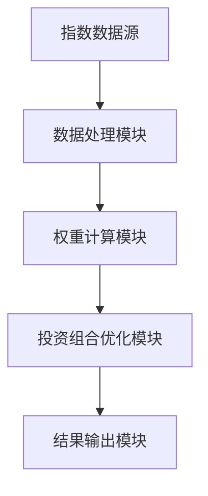

                 


# 《约翰·伯格的指数基金构建原则》

> 关键词：指数基金，被动投资，跟踪误差，投资策略，系统架构，优化算法

> 摘要：指数基金作为一种高效的分散投资工具，其构建原则基于约翰·伯格的经典理论。本文详细探讨了指数基金的核心概念、数学模型、系统架构以及实战案例，旨在为读者提供从理论到实践的全面指导。

---

# 第一部分: 指数基金构建的背景与基础

## 第1章: 指数基金的基本概念与背景

### 1.1 指数基金的定义与特点

#### 1.1.1 什么是指数基金
- 指数基金是通过跟踪特定市场指数（如标普500）来进行投资的基金。
- 其特点是分散投资、费用低廉、风险较低。

#### 1.1.2 指数基金的核心特点
- **被动管理**：指数基金通常采用被动投资策略，避免频繁交易，减少管理费用。
- **分散风险**：通过投资于指数中的多只股票，降低个股风险。
- **长期稳健**：长期来看，指数基金的回报通常优于大多数主动管理型基金。

#### 1.1.3 指数基金与主动管理基金的区别
- **目标**：指数基金追求跟踪指数的回报，而主动管理基金追求超越市场的回报。
- **费用**：指数基金费用较低，通常为0.1%-0.2%；主动管理基金费用较高，通常为1%-2%。
- **风险**：指数基金风险分散，主动管理基金风险较高。

### 1.2 指数基金的起源与发展

#### 1.2.1 指数基金的历史背景
- 20世纪70年代，约翰·伯格创立了先锋集团，推出第一只指数基金——Vanguard 500 Index Fund。
- 指数基金的兴起与个人投资者对低成本、高收益投资工具的需求密切相关。

#### 1.2.2 现代指数基金的发展现状
- 指数基金种类繁多，包括股票指数基金、债券指数基金、全球指数基金等。
- 指数基金已成为全球投资市场的重要组成部分，尤其在机构投资和个人理财中占据重要地位。

#### 1.2.3 指数基金在全球市场中的应用
- 全球范围内，指数基金的资产管理规模持续增长。
- 在中国，指数基金也逐渐受到投资者的青睐。

### 1.3 指数基金的投资策略

#### 1.3.1 被动投资与主动投资的对比
- **被动投资**：指数基金通过复制指数表现，追求与市场同步的收益。
- **主动投资**：通过精选个股或行业，追求超越市场的收益。

#### 1.3.2 指数基金的分散投资优势
- 通过投资多只股票，降低个股波动带来的风险。
- 适合风险承受能力较低的投资者。

#### 1.3.3 指数基金的风险管理特点
- 通过分散投资降低非系统性风险。
- 通过长期持有降低短期市场波动的影响。

## 第2章: 指数基金的核心原理与数学模型

### 2.1 指数基金的构建原理

#### 2.1.1 指数基金的构建方法
- **市值加权法**：根据股票的市值比例分配权重。
- **等权重法**：将资金平均分配到指数中的每只股票。

#### 2.1.2 指数基金的复制与跟踪误差
- **跟踪误差**：指数基金的实际回报与目标指数回报之间的差异。
- **复制误差**：由于交易成本、税费等因素，导致基金无法完全复制指数。

#### 2.1.3 指数基金的权重分配策略
- 根据指数成分股的市值比例分配权重。
- 定期调整权重以保持与指数一致。

### 2.2 指数基金的数学模型

#### 2.2.1 指数基金的跟踪误差公式
$$ \text{跟踪误差} = \sqrt{\text{资产权重差异的平方和}} $$

#### 2.2.2 指数基金的夏普比率计算
$$ \text{夏普比率} = \frac{\text{超额收益}}{\text{跟踪误差}} $$

### 2.3 指数基金的优化算法

#### 2.3.1 最小化跟踪误差的优化模型
$$ \text{Minimize } \sum_{i=1}^{n} w_i^2 $$

#### 2.3.2 基于现代投资组优化的指数基金构建
- 使用优化算法调整权重，以最小化跟踪误差。
- 考虑交易成本和流动性约束。

## 第3章: 指数基金的系统架构与实现

### 3.1 指数基金构建的系统架构

#### 3.1.1 系统功能模块划分
- 数据获取模块：获取指数成分股的价格数据。
- 权重计算模块：计算每只股票的权重。
- 投资组合优化模块：调整权重以最小化跟踪误差。
- 结果输出模块：输出优化后的投资组合。

#### 3.1.2 系统数据流图


### 3.2 指数基金构建的算法实现

#### 3.2.1 简单指数权重分配
- 根据成分股的市值比例分配权重。
- 示例：假设指数包含股票A和B，市值分别为100和50，总市值150，权重分别为2/3和1/3。

#### 3.2.2 等权重指数构建
- 将资金平均分配到每只股票。
- 示例：投资两只股票，每只投资50%。

#### 3.2.3 市值加权指数构建
- 根据股票市值比例分配权重。
- 示例：股票A市值100，股票B市值50，权重分别为66.67%和33.33%。

### 3.3 指数基金构建的代码实现

#### 3.3.1 环境配置
```python
import numpy as np
import pandas as pd
```

#### 3.3.2 核心代码实现
```python
def calculate_weights(asset_prices):
    total = np.sum(asset_prices)
    weights = asset_prices / total
    return weights

asset_prices = np.array([100, 50])
weights = calculate_weights(asset_prices)
print(weights)  # 输出 [0.6667 0.3333]
```

---

# 第二部分: 指数基金构建的实战与优化

## 第4章: 指数基金构建的实战案例

### 4.1 实战背景与目标
- 选择一个具体的指数（如标普500）进行模拟构建。
- 目标是实现与指数表现一致的投资组合。

### 4.2 数据获取与预处理
- 使用Python的pandas库获取指数成分股的历史价格数据。
- 清洗数据，处理缺失值和异常值。

### 4.3 投资组合优化与实现
- 使用优化算法调整权重，最小化跟踪误差。
- 定期再平衡投资组合，以保持与指数一致。

### 4.4 代码实现与测试
```python
import pandas as pd
import numpy as np

# 获取指数成分股数据
index_data = pd.read_csv('index_data.csv')

# 计算每只股票的权重
weights = calculate_weights(index_data['price'])

# 输出优化后的权重
print(weights)
```

### 4.5 实战总结与优化
- 定期再平衡可以有效降低跟踪误差。
- 选择合适的权重计算方法和优化算法，可以进一步提高投资回报。

## 第5章: 指数基金的最佳实践与注意事项

### 5.1 最佳实践
- **定投**：定期定额投资，分散风险，减少市场波动影响。
- **分散投资**：通过投资多个指数基金，降低特定市场或行业的风险。
- **长期持有**：避免频繁交易，降低费用和税务负担。

### 5.2 风险提示
- **市场风险**：指数基金的回报与市场整体表现密切相关，存在系统性风险。
- **流动性风险**：在某些情况下，难以以合理价格卖出持有的股票。
- **跟踪误差风险**：由于复制成本和市场变动，指数基金可能无法完全复制指数表现。

### 5.3 注意事项
- **费用控制**：选择低费用的指数基金，长期来看可以显著提高回报。
- **税务规划**：了解相关税务政策，合理规划投资行为。
- **定期调整**：根据市场变化和个人需求，定期调整投资组合。

---

# 第三部分: 指数基金构建的拓展与展望

## 第6章: 指数基金的拓展应用

### 6.1 指数基金的全球化投资
- 投资全球指数，分散地理风险。
- 使用全球指数基金进行多元化配置。

### 6.2 指数基金的创新与变革
- 引入大数据和人工智能技术，优化指数构建和投资策略。
- 开发新型指数，如因子指数、ESG指数等。

### 6.3 指数基金的技术进步
- 利用大数据分析技术，提高数据处理效率和准确性。
- 应用机器学习算法，优化投资组合和风险管理。

## 第7章: 指数基金的未来展望

### 7.1 未来趋势
- 指数基金将继续保持增长，特别是在机构和个人投资者中。
- 大数据和人工智能将推动指数基金的进一步创新。

### 7.2 投资者教育
- 提高投资者对指数基金的认知和理解。
- 加强风险管理教育，帮助投资者做出明智的投资决策。

### 7.3 技术挑战
- 如何在复杂市场环境中，保持指数基金的跟踪误差最小。
- 如何应对市场的快速变化，优化指数构建和投资策略。

---

# 结语

指数基金作为一种简单有效的投资工具，其构建原则和应用广泛应用于个人和机构投资者。通过本文的详细讲解，读者可以全面了解指数基金的构建原理、数学模型、系统架构以及实战案例。未来，随着技术的进步和市场的变化，指数基金将继续发挥重要作用，为投资者提供稳健的回报。

---

通过以上目录大纲，您可以逐步撰写出一篇详细的、结构清晰的技术博客文章，涵盖从理论到实践的各个方面，帮助读者全面理解指数基金的构建原则。

