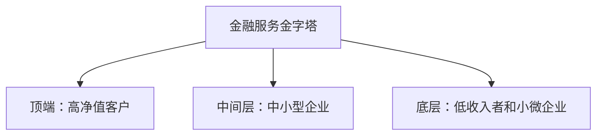
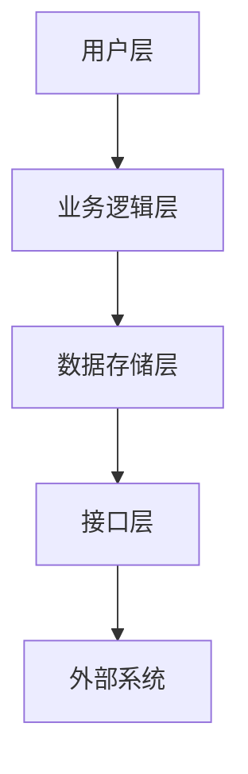

                 


# 约翰·伯格的普惠金融理念：金融科技带来的机遇与挑战

> 关键词：普惠金融，金融科技，区块链，大数据，人工智能，约翰·伯格

> 摘要：本文深入探讨了约翰·伯格的普惠金融理念，结合金融科技的发展，分析了其带来的机遇与挑战。通过详细的技术分析和实际案例，阐述了区块链、大数据和人工智能在普惠金融中的应用，并提供了系统架构设计和项目实战指导。

---

# 第一部分: 普惠金融的背景与概念

## 第1章: 普惠金融的定义与核心目标

### 1.1 普惠金融的定义与核心目标

#### 1.1.1 普惠金融的定义

普惠金融是指以可负担的成本，为所有有需求的人群提供适当、有效的金融服务。其核心目标是消除金融排斥，确保所有人都能平等地获得金融服务。

#### 1.1.2 普惠金融的核心目标

- 提供金融服务的可及性：确保所有人都能方便地获得金融服务。
- 提供金融服务的可负担性：确保金融服务的成本合理，不会成为负担。
- 提供金融服务的可持续性：确保金融服务的长期稳定，能够持续满足需求。

#### 1.1.3 普惠金融与传统金融的区别

| 属性 | 传统金融 | 普惠金融 |
|------|----------|----------|
| 服务对象 | 机构、企业、富裕个体 | 所有人群，特别是低收入者 |
| 服务范围 | 高效、高利润 | 包括小额信贷、保险等 |
| 技术应用 | 传统银行系统 | 结合金融科技 |

### 1.2 金融科技的演进与影响

#### 1.2.1 金融科技的定义

金融科技（Fintech）是指利用技术手段优化或替代传统金融服务和流程的创新活动。它涵盖了区块链、人工智能、大数据等多种技术。

#### 1.2.2 金融科技的演进历程

1. 早期阶段：20世纪90年代，互联网技术的应用。
2. 发展阶段：2000年代，移动支付和电子商务的兴起。
3. 现阶段：2010年代至今，区块链、人工智能等技术的广泛应用。

#### 1.2.3 金融科技对金融行业的深远影响

- 提高效率：通过自动化流程减少人工干预。
- 降低成本：利用技术手段降低运营成本。
- 扩大覆盖范围：让更多人能够获得金融服务。

### 1.3 约翰·伯格的普惠金融理念

#### 1.3.1 约翰·伯格的生平简介

约翰·伯格是普惠金融领域的权威专家，致力于通过技术创新解决金融排斥问题。

#### 1.3.2 约翰·伯格的普惠金融理论

约翰·伯格提出，通过技术创新，特别是金融科技的应用，可以有效降低金融服务的成本，扩大服务范围，从而实现普惠金融的目标。

#### 1.3.3 约翰·伯格理念的现实意义

- 提供了实现普惠金融的具体路径。
- 强调了技术创新在普惠金融中的核心作用。

---

## 第2章: 普惠金融的核心概念与框架

### 2.1 普惠金融的核心要素

#### 2.1.1 金融服务的可及性

通过技术手段，如移动支付和在线平台，确保金融服务能够覆盖到偏远地区的人群。

#### 2.1.2 金融服务的可负担性

通过技术创新降低成本，确保金融服务的价格合理。

#### 2.1.3 金融服务的可持续性

确保金融服务能够长期稳定地满足需求，避免因技术或经济波动导致服务中断。

### 2.2 普惠金融的理论框架

#### 2.2.1 金融排斥的定义与表现

金融排斥是指某些人群无法获得适当的金融服务，导致他们在经济活动中处于不利地位。

#### 2.2.2 普惠金融的金字塔模型



#### 2.2.3 普惠金融的实现路径

- 技术创新：利用金融科技解决金融服务的可及性和可负担性问题。
- 政策支持：通过政策引导和激励机制，鼓励金融机构提供普惠金融服务。

### 2.3 金融科技在普惠金融中的作用

#### 2.3.1 金融科技如何解决金融排斥

- 提供小额信贷：通过区块链技术实现透明、可追溯的小额信贷。
- 提供保险服务：通过大数据分析，为低收入者提供定制化的保险产品。

#### 2.3.2 金融科技的创新模式

- 智能合约：通过区块链技术实现自动化的金融合约。
- 人工智能客服：通过自然语言处理技术提供个性化的金融服务。

#### 2.3.3 金融科技的风险与挑战

- 技术风险：如数据泄露和系统故障。
- 监管风险：如何在创新与合规之间找到平衡。

---

## 第3章: 金融科技的核心技术与应用

### 3.1 区块链技术在普惠金融中的应用

#### 3.1.1 区块链技术的定义与特点

区块链是一种去中心化的分布式账本技术，具有不可篡改、透明性和高安全性等特点。

#### 3.1.2 区块链在普惠金融中的应用场景

- 小额信贷：通过区块链技术实现透明、可追溯的小额信贷。
- 供应链金融：通过区块链技术实现供应链上下游企业的金融需求。

#### 3.1.3 区块链技术的优缺点分析

优点：
- 高安全性：数据难以被篡改。
- 透明性：所有交易记录公开透明。
- 降低成本：减少中间环节，降低交易成本。

缺点：
- 技术复杂：需要较高的技术门槛。
- 能耗高：区块链的运行需要大量计算资源。

### 3.2 大数据技术在普惠金融中的应用

#### 3.2.1 大数据技术的定义与特点

大数据技术是指对海量、多样化数据进行采集、处理和分析的技术。

#### 3.2.2 大数据在普惠金融中的应用场景

- 风险评估：通过大数据分析评估客户的信用风险。
- 市场细分：通过大数据分析识别潜在客户群体。

#### 3.2.3 大数据技术的优缺点分析

优点：
- 数据驱动决策：通过分析大量数据，提供精准的金融服务。
- 提高效率：大数据技术可以快速处理大量数据，提高效率。

缺点：
- 数据隐私问题：如何保护用户数据的隐私。
- 数据质量：数据的准确性和完整性对分析结果影响很大。

### 3.3 人工智能技术在普惠金融中的应用

#### 3.3.1 人工智能技术的定义与特点

人工智能（AI）是指计算机系统模拟人类智能的技术，包括学习、推理和自适应能力。

#### 3.3.2 人工智能在普惠金融中的应用场景

- 智能客服：通过自然语言处理技术提供个性化的金融服务。
- 风险控制：通过机器学习算法预测客户的信用风险。

#### 3.3.3 人工智能技术的优缺点分析

优点：
- 高效率：人工智能可以快速处理大量数据，提高效率。
- 高准确性：通过机器学习算法提高预测的准确性。

缺点：
- 技术复杂：需要较高的技术门槛。
- 黑箱问题：人工智能的决策过程难以解释。

---

## 第4章: 普惠金融的系统架构与设计

### 4.1 普惠金融系统的总体架构

#### 4.1.1 系统架构的分层设计



#### 4.1.2 系统架构的功能模块划分

- 用户模块：用户注册、登录、信息管理。
- 金融服务模块：提供小额信贷、保险等服务。
- 风险控制模块：评估客户信用风险。

#### 4.1.3 系统架构的可扩展性设计

- 模块化设计：每个功能模块相对独立，便于扩展。
- 接口设计：通过标准化接口实现模块之间的通信。

### 4.2 系统功能设计

#### 4.2.1 用户身份认证模块

- 功能：用户注册、登录、身份验证。
- 实现：通过区块链技术实现身份认证的去中心化。

#### 4.2.2 金融服务模块

- 功能：提供小额信贷、保险等服务。
- 实现：通过智能合约实现自动化的金融服务。

#### 4.2.3 风险控制模块

- 功能：评估客户信用风险。
- 实现：通过大数据分析和机器学习算法进行风险评估。

### 4.3 系统接口设计

#### 4.3.1 API接口的设计原则

- 标准化：接口遵循统一标准，便于集成。
- 安全性：接口必须具备身份认证和加密机制。

#### 4.3.2 API接口的实现方式

- RESTful API：常用的数据格式和HTTP方法。
- Web Socket：实时通信。

#### 4.3.3 API接口的安全性设计

- 认证：使用JWT实现身份认证。
- 加密：使用HTTPS协议保证数据传输的安全性。

---

## 第5章: 项目实战——基于约翰·伯格理念的普惠金融系统实现

### 5.1 项目环境搭建

#### 5.1.1 开发工具的安装与配置

- 开发工具：IntelliJ IDEA或VS Code。
- 配置：安装Java或Python开发环境。

#### 5.1.2 数据库的选择与搭建

- 数据库选择：MySQL或MongoDB。
- 配置：安装数据库并配置好连接信息。

#### 5.1.3 项目框架的搭建

- 框架选择：Spring Boot（Java）或Django（Python）。
- 配置：搭建基本的项目框架，包括路由、视图、模型。

### 5.2 系统核心功能实现

#### 5.2.1 用户注册与登录功能

- 实现：前后端分离，后端使用JWT实现身份认证。
- 代码示例：

```python
from django.contrib.auth.models import User
from rest_framework.authtoken.views import obtain_auth_token

@api_view(['POST'])
def login(request):
    data = request.data
    user = User.objects.create_user(data['username'], data['email'], data['password'])
    token = obtain_auth_token(request)
    return Response({'token': token.key})
```

#### 5.2.2 金

---

# 总结与展望

通过本文的探讨，我们深入理解了约翰·伯格的普惠金融理念，并结合金融科技的发展，分析了其带来的机遇与挑战。我们详细介绍了区块链、大数据和人工智能等技术在普惠金融中的应用，并提供了系统的架构设计和项目实战指导。未来，随着技术的不断进步，普惠金融将更加普及和高效，金融科技将继续发挥其重要作用。

---

# 附录

## 术语表

- 区块链：分布式账本技术，用于记录和验证交易。
- 大数据：海量、多样化数据的采集、处理和分析技术。
- 人工智能：模拟人类智能的技术，包括学习和推理能力。

## 进一步阅读

- 《区块链技术进阶与实战》
- 《大数据分析与挖掘》
- 《人工智能应用开发》

## 最佳实践 Tips

- 在系统设计中，确保模块化设计，便于扩展。
- 在接口设计中，优先采用标准化接口，确保安全性。
- 在项目实现中，注重代码的可读性和可维护性。

---

通过以上目录大纲，我们可以系统地学习和理解约翰·伯格的普惠金融理念，并结合金融科技的发展，实现普惠金融的目标。希望本文能为读者提供有价值的指导和启示。

