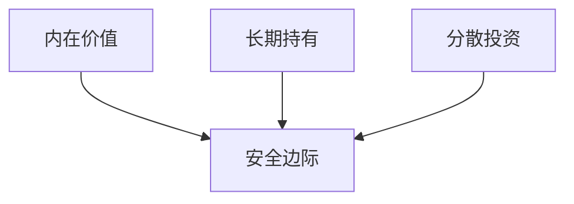
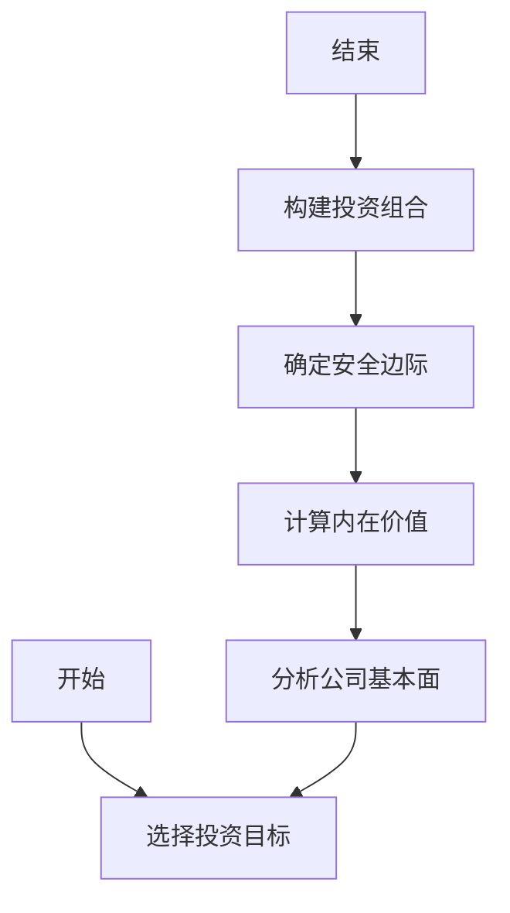
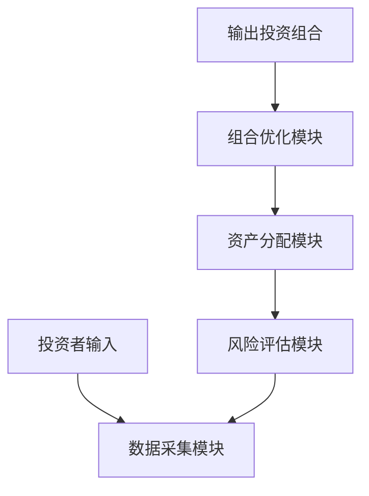

                 


# {{约翰·伯格的普通投资者指南}}

## {{关键词}}
- 约翰·伯格
- 价值投资
- 长期投资
- 投资组合管理
- 财务分析
- 风险管理

## {{摘要}}
本文将深入探讨约翰·伯格的投资哲学和方法，从其背景、核心概念到实际应用，系统地分析价值投资的基本原理和策略。通过详细的财务分析、投资组合构建和风险管理方法，本文旨在为普通投资者提供实用的指导和启示。结合理论与实践，本文将帮助读者更好地理解和应用伯格的投资理念。

---

# 第1章 约翰·伯格及其投资哲学概述

## 1.1 约翰·伯格的生平与投资背景

### 1.1.1 约翰·伯格的早期经历
约翰·伯格（John Bogle）是美国著名投资家，被誉为“指数基金之父”。他于1940年出生于美国宾夕法尼亚州，早年在宾夕法尼亚大学学习，并在1965年加入富达投资（Fidelity Investments）。伯格的职业生涯始于富达，但他逐渐对传统的主动管理型基金感到不满，认为这些基金的高费用和频繁的交易使投资者的利益受损。

### 1.1.2 约翰·伯格的投资理念形成
在富达工作期间，伯格观察到许多投资者因为频繁的交易和高昂的费用而无法获得稳定的收益。他开始思考，是否有更简单、更有效的方法来帮助普通投资者实现财富增长。通过对市场运行规律的深入研究，伯格逐渐形成了自己的投资哲学：价值投资与长期持有。

### 1.1.3 伯格投资哲学的核心思想
伯格的核心思想是“简单就是美”。他认为，市场是不可预测的，投资者应该避免频繁交易和复杂的策略，而是应该选择低成本、低风险的投资工具，长期持有优质资产，从而获得稳定的收益。

## 1.2 投资哲学的核心概念

### 1.2.1 价值投资的定义
价值投资是一种以低于市场价值的价格购买优质资产的投资策略。伯格认为，市场波动是短期的，但优质资产的内在价值是长期的。投资者应该关注企业的基本面，而不是市场的短期波动。

### 1.2.2 长期投资的内涵
长期投资是指投资者将资金投入到优质资产中，并保持长期持有的策略。伯格认为，长期投资可以避免短期市场波动的影响，同时降低交易成本和费用。

### 1.2.3 投资组合管理的原则
伯格主张构建一个分散化的投资组合，以降低风险。他建议投资者将资金分配到不同的资产类别中，如股票、债券和现金，以平衡风险和收益。

## 1.3 伯格投资哲学的实践应用

### 1.3.1 伯格的投资策略
伯格的投资策略主要基于指数基金。他认为，指数基金能够以极低的成本提供市场平均收益，是普通投资者的最佳选择。

### 1.3.2 伯格的投资组合管理方法
伯格建议投资者将资产分配到多个指数基金中，以分散风险。他推荐使用成本最低的指数基金，因为高昂的费用会侵蚀长期收益。

### 1.3.3 伯格投资哲学的案例分析
通过分析伯格的投资组合，我们可以看到他如何通过长期持有低成本指数基金实现财富增长。例如，伯格自己投资于 Vanguard 500 Index Fund，该基金长期表现优于大多数主动管理型基金。

## 1.4 伯格投资哲学的现代意义

### 1.4.1 伯格投资哲学的现代挑战
尽管伯格的投资哲学在今天依然适用，但市场环境的变化也带来了一些新的挑战。例如，科技公司的崛起和市场的高波动性可能会影响指数基金的表现。

### 1.4.2 伯格投资哲学的现代应用
现代投资者可以利用伯格的哲学，结合新的投资工具和技术，优化自己的投资组合。例如，使用大数据分析和人工智能技术来辅助投资决策。

### 1.4.3 伯格投资哲学的未来发展趋势
随着金融市场的全球化和数字化，伯格的投资哲学将更加注重低成本、分散化和长期持有的原则。未来的投资策略可能会更加注重风险管理和资产配置。

## 1.5 本章小结
本章介绍了约翰·伯格的投资哲学，包括他的生平、核心思想和投资策略。伯格的价值投资和长期持有理念为普通投资者提供了一个简单有效的投资方法。

---

# 第2章 价值投资的核心概念与分析框架

## 2.1 价值投资的核心概念

### 2.1.1 价值投资的定义
价值投资是一种以低于市场价值的价格购买优质资产的投资策略。伯格认为，市场波动是短期的，但优质资产的内在价值是长期的。投资者应该关注企业的基本面，而不是市场的短期波动。

### 2.1.2 价值投资的核心要素
价值投资的核心要素包括：
- **内在价值**：资产的真实价值，不受到市场波动的影响。
- **安全边际**：购买价格低于内在价值的部分，以降低投资风险。
- **长期持有**：避免频繁交易，以降低交易成本和税费。

### 2.1.3 价值投资与其它投资策略的区别
与主动管理型投资不同，价值投资强调长期持有和分散投资。与指数投资相比，价值投资更注重个股的选择和分析。

## 2.2 价值投资的分析框架

### 2.2.1 财务分析的核心指标
价值投资者通常关注以下财务指标：
- **市盈率（P/E）**：衡量股票价格与每股收益的比率。
- **市净率（P/B）**：衡量股票价格与每股净资产的比率。
- **股息率**：衡量股票的股息与股票价格的比率。

### 2.2.2 行业分析的关键因素
行业分析是价值投资的重要组成部分。投资者需要分析行业的竞争格局、增长潜力和风险因素。

### 2.2.3 公司基本面分析的步骤
1. **行业分析**：了解公司的行业地位和竞争环境。
2. **财务分析**：评估公司的财务健康状况。
3. **管理团队**：分析公司的管理层能力和战略规划。
4. **竞争优势**：评估公司的核心竞争力和护城河。

## 2.3 价值投资的核心概念与联系

### 2.3.1 核心概念的实体关系图


### 2.3.2 核心概念的属性特征对比
| 概念       | 属性特征 |
|------------|----------|
| 内在价值   | 真实价值，不随市场波动而变化 |
| 安全边际   | 购买价格低于内在价值 |
| 长期持有   | 避免频繁交易，降低成本 |
| 分散投资   | 降低风险，平衡收益 |

## 2.4 价值投资的算法原理

### 2.4.1 价值投资的算法流程图


### 2.4.2 价值投资的数学模型
价值投资者通常使用以下公式来计算内在价值：
$$
\text{内在价值} = \sum_{t=1}^{\infty} \frac{\text{现金流}_t}{(1 + r)^t}
$$
其中，$r$ 是折现率，$\text{现金流}_t$ 是第 $t$ 年的现金流。

### 2.4.3 价值投资的案例分析
以可口可乐为例，假设其股票的市盈率为15，每股收益为2元，市净率为3，每股净资产为5元。投资者可以通过计算内在价值，确定是否以当前价格购买该股票。

## 2.5 本章小结
本章详细介绍了价值投资的核心概念和分析框架，包括内在价值、安全边际和长期持有的原则。通过财务分析和行业分析，投资者可以更好地选择优质资产。

---

# 第3章 投资组合构建与风险管理

## 3.1 投资组合构建的策略

### 3.1.1 分散化投资的重要性
分散化投资是降低风险的重要手段。通过将资金分配到不同的资产类别和行业，投资者可以减少特定资产的风险。

### 3.1.2 资产配置的原则
资产配置是投资组合构建的核心。投资者需要根据自身的风险承受能力和收益目标，合理分配股票、债券和现金的比例。

### 3.1.3 投资组合的再平衡
定期再平衡投资组合可以确保资产配置与最初的计划一致。例如，每年年初进行一次再平衡，调整各资产类别的比例。

## 3.2 投资组合构建的系统分析

### 3.2.1 系统功能设计
- **数据采集**：收集市场数据，包括股票价格、财务指标等。
- **风险评估**：评估各资产的风险和收益。
- **资产分配**：根据投资者的目标，分配各资产的比例。
- **组合优化**：通过优化算法，找到最优的投资组合。

### 3.2.2 系统架构设计


### 3.2.3 系统接口设计
- **输入接口**：投资者的风险承受能力和收益目标。
- **输出接口**：优化后的投资组合和各资产的比例。

## 3.3 风险管理的方法

### 3.3.1 风险识别
投资者需要识别市场风险、流动性风险和信用风险等。

### 3.3.2 风险评估
通过历史数据分析和情景分析，评估各种风险对投资组合的影响。

### 3.3.3 风险控制
通过分散化投资和再平衡策略，降低投资组合的整体风险。

## 3.4 风险管理的案例分析

### 3.4.1 案例背景
假设市场出现剧烈波动，投资者需要调整投资组合以降低风险。

### 3.4.2 风险管理的实施
通过增加债券比例和减少股票比例，降低投资组合的波动性。

## 3.5 本章小结
本章介绍了投资组合构建和风险管理的方法，包括分散化投资、资产配置和风险控制策略。通过系统分析和优化算法，投资者可以更好地管理投资风险。

---

# 第4章 财务分析与估值

## 4.1 财务分析的核心指标

### 4.1.1 盈利能力分析
- **净利润率**：净利润与营业收入的比率。
- **毛利率**：营业收入减去成本，再除以营业收入。

### 4.1.2 偿债能力分析
- **资产负债率**：总负债与总资产的比率。
- **流动比率**：流动资产与流动负债的比率。

### 4.1.3 运营能力分析
- **存货周转率**：存货周转次数。
- **应收账款周转率**：应收账款周转次数。

## 4.2 估值方法的选择

### 4.2.1 市盈率法
$$
\text{市盈率} = \frac{\text{股票价格}}{\text{每股收益}}
$$

### 4.2.2 市净率法
$$
\text{市净率} = \frac{\text{股票价格}}{\text{每股净资产}}
$$

### 4.2.3 现金流折现法
$$
\text{内在价值} = \sum_{t=1}^{\infty} \frac{\text{现金流}_t}{(1 + r)^t}
$$

## 4.3 估值模型的实现

### 4.3.1 数据准备
收集目标公司的财务数据，包括营业收入、净利润、现金流等。

### 4.3.2 模型实现
通过编程实现估值模型，例如使用Python编写现金流折现模型。

### 4.3.3 结果分析
根据模型计算出的内在价值，与市场价格进行比较，确定投资机会。

## 4.4 估值案例分析

### 4.4.1 案例背景
以苹果公司为例，计算其内在价值和市场价格，判断是否值得投资。

### 4.4.2 案例分析
使用现金流折现法，计算苹果公司的内在价值，并与市场价格进行比较。

## 4.5 本章小结
本章介绍了财务分析的核心指标和估值方法，包括市盈率法、市净率法和现金流折现法。通过实际案例分析，投资者可以更好地进行估值和投资决策。

---

# 第5章 长期投资策略与市场波动

## 5.1 长期投资的策略

### 5.1.1 长期投资的优势
- 避免短期波动的影响。
- 降低交易成本和税费。

### 5.1.2 长期投资的挑战
- 市场波动的不确定性。
- 经济周期的影响。

## 5.2 市场波动的应对策略

### 5.2.1 长期持有与市场波动
长期投资者应避免因市场波动而频繁交易，坚持持有优质资产。

### 5.2.2 投资组合的再平衡
定期再平衡投资组合，确保资产配置与最初计划一致。

### 5.2.3 风险管理与长期投资
通过分散化投资和风险管理，降低市场波动对投资组合的影响。

## 5.3 长期投资的案例分析

### 5.3.1 案例背景
以伯克希尔哈撒韦为例，分析长期投资的策略和效果。

### 5.3.2 案例分析
伯克希尔哈撒韦通过长期持有优质资产，实现稳定的收益增长。

## 5.4 本章小结
本章探讨了长期投资的策略和应对市场波动的方法，强调长期持有和分散投资的重要性。

---

# 第6章 投资组合管理与风险管理

## 6.1 投资组合管理的策略

### 6.1.1 资产分配
根据投资者的风险承受能力和收益目标，合理分配各资产的比例。

### 6.1.2 股票选择
选择具有强大竞争优势和良好管理的公司。

### 6.1.3 定期再平衡
定期调整投资组合，确保资产配置与最初计划一致。

## 6.2 风险管理的方法

### 6.2.1 分散化投资
通过投资不同资产类别和行业，降低特定资产的风险。

### 6.2.2 风险评估
通过历史数据分析和情景分析，评估各种风险对投资组合的影响。

### 6.2.3 风险控制
通过分散化投资和再平衡策略，降低投资组合的整体风险。

## 6.3 投资组合管理的案例分析

### 6.3.1 案例背景
假设市场出现剧烈波动，投资者需要调整投资组合以降低风险。

### 6.3.2 投资组合管理的实施
通过增加债券比例和减少股票比例，降低投资组合的波动性。

## 6.4 本章小结
本章介绍了投资组合管理与风险管理的方法，包括资产分配、股票选择和风险控制策略。通过定期再平衡和分散化投资，投资者可以更好地管理投资风险。

---

# 第7章 项目实战：基于伯格投资哲学的策略实现

## 7.1 项目背景与目标

### 7.1.1 项目背景
本项目旨在通过伯格的投资哲学，构建一个低成本、分散化的投资组合，实现长期稳定的收益。

### 7.1.2 项目目标
- 构建一个分散化的投资组合。
- 选择低成本的指数基金。
- 实现投资组合的定期再平衡。

## 7.2 项目实施步骤

### 7.2.1 环境安装
安装Python和必要的库，例如Pandas、NumPy和Matplotlib。

### 7.2.2 数据采集
收集市场数据，包括股票价格、财务指标等。

### 7.2.3 模型实现
编写代码实现投资组合优化算法，例如使用遗传算法优化投资组合。

### 7.2.4 系统测试
通过历史数据验证模型的性能，评估投资组合的收益和风险。

## 7.3 项目代码实现

### 7.3.1 数据准备
```python
import pandas as pd
import numpy as np

# 数据准备
data = pd.read_csv('stock_data.csv')
returns = data.pct_change().dropna()
```

### 7.3.2 模型实现
```python
import numpy as np

def optimize_portfolio(returns):
    n = returns.shape[1]
    returns_matrix = returns.values
    sigma = np.cov(returns_matrix.T)
    inv_sigma = np.linalg.inv(sigma)
    ones = np.ones(n)
    weights = inv_sigma @ ones / (ones.T @ inv_sigma @ ones)
    return weights
```

### 7.3.3 结果分析
通过代码计算出优化后的投资组合权重，与市场指数进行比较，评估模型的性能。

## 7.4 项目案例分析

### 7.4.1 案例背景
以标普500指数为例，构建一个分散化的投资组合。

### 7.4.2 案例分析
通过代码优化投资组合，选择低成本的指数基金，实现长期稳定的收益。

## 7.5 本章小结
本章通过项目实战，展示了如何基于伯格的投资哲学，构建一个低成本、分散化的投资组合。通过代码实现和案例分析，投资者可以更好地理解和应用伯格的投资理念。

---

# 第8章 总结与展望

## 8.1 本章总结

### 8.1.1 伯格投资哲学的核心思想
伯格的投资哲学强调低成本、分散化和长期持有，为普通投资者提供了一个简单有效的投资方法。

### 8.1.2 价值投资的核心概念
价值投资关注内在价值和安全边际，强调长期持有和分散投资。

### 8.1.3 投资组合管理与风险管理
通过资产分配和再平衡，投资者可以更好地管理投资风险，实现长期稳定的收益。

## 8.2 未来展望

### 8.2.1 伯格投资哲学的现代挑战
随着市场环境的变化，伯格的投资哲学需要结合新的投资工具和技术，优化投资策略。

### 8.2.2 伯格投资哲学的未来发展趋势
未来的投资策略可能会更加注重风险管理、资产配置和技术创新，以适应市场的变化。

## 8.3 最佳实践 Tips

### 8.3.1 投资者注意事项
- 避免频繁交易和高费用。
- 坚持长期持有和分散投资。
- 定期再平衡投资组合。

### 8.3.2 投资者小结
通过本文的介绍，投资者可以更好地理解和应用伯格的投资哲学，实现长期稳定的收益。

---

# 结语

通过本文的详细介绍，读者可以全面了解约翰·伯格的投资哲学和方法，从其背景、核心概念到实际应用，系统地分析价值投资的基本原理和策略。结合理论与实践，本文将帮助读者更好地理解和应用伯格的投资理念，成为成功的投资者。

