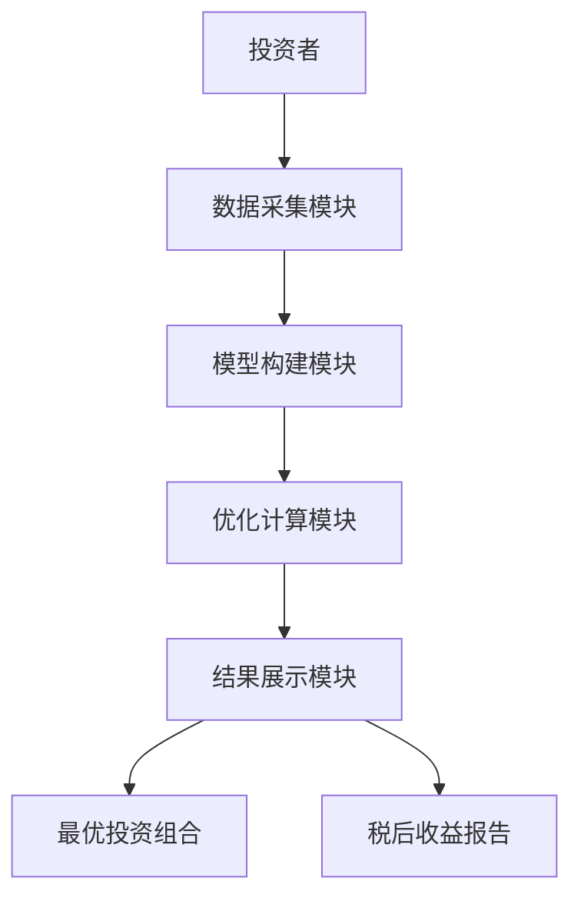

                 


# 约翰·伯格的税收效率投资策略

> 关键词：税收效率，投资策略，算法原理，数学模型，系统架构，投资优化，约翰·伯格

> 摘要：本文详细探讨了约翰·伯格的税收效率投资策略，从其核心概念、算法原理、数学模型、系统架构到实际应用案例，逐步分析其理论基础和实践方法。文章通过详细的技术分析和代码实现，全面解读如何利用税收效率优化投资组合，降低税务负担，提升投资收益。

---

## 第1章 税收效率投资策略概述

### 1.1 税收效率的核心概念

#### 1.1.1 税收效率的定义与内涵
税收效率是指在投资过程中，通过合理规划税务结构，以最小的税务负担实现最大化的投资收益。税收效率的核心在于在合法合规的前提下，优化税务负担，降低税后成本，从而提升投资回报率。

#### 1.1.2 投资策略与税收效率的关系
税收效率是投资策略的重要组成部分。通过科学的税务规划，投资者可以在不违反税法的前提下，优化投资组合的税后收益。税收效率与投资策略的结合，能够帮助投资者在市场波动中保持更高的收益稳定性。

#### 1.1.3 税收效率在投资中的重要性
在现代投资中，税务成本往往是不可忽视的重要因素。税收效率的优化能够显著降低投资组合的税后成本，提升整体投资回报率。尤其是在高税率环境下，税收效率的优化能够为投资者创造更大的价值。

### 1.2 税收效率投资策略的背景

#### 1.2.1 经济全球化与税收政策的变化
随着经济全球化的深入，跨国投资和资产配置变得越来越普遍。不同国家和地区的税收政策差异为投资者提供了优化税务结构的机会。然而，税收政策的不断变化也对投资者提出了更高的要求，需要他们具备更强的税务规划能力。

#### 1.2.2 投资者对税收效率的需求
投资者在追求高收益的同时，也越来越关注税务成本的优化。尤其是在高净值投资者中，税收效率已经成为影响投资决策的重要因素之一。投资者希望通过合理的税务规划，降低整体税负，实现财富的保值与增值。

#### 1.2.3 税收效率投资策略的演变
随着金融市场的不断发展，税收效率投资策略也在不断演变。从最初的简单税务优化，到如今的复杂资产配置和税务对冲，税收效率投资策略已经形成了一套完整的理论体系和实践方法。

### 1.3 税收效率投资策略的目标与边界

#### 1.3.1 税收效率投资策略的主要目标
税收效率投资策略的主要目标包括：最大化投资收益、最小化税务负担、优化资产配置、降低投资风险等。通过这些目标的实现，投资者能够在市场中获得更高的收益，同时降低税务成本。

#### 1.3.2 税收效率的边界与外延
税收效率的边界在于合法合规的前提下进行税务优化。投资者需要在税法允许的范围内进行税务规划，避免触及税务违法行为。税收效率的外延则包括资产配置、税务对冲、跨国投资等多个方面。

#### 1.3.3 税收效率与投资风险的平衡
在追求税收效率的同时，投资者也需要关注投资风险。税收效率的优化可能会增加某些方面的风险，例如市场风险、流动性风险等。因此，投资者需要在税收效率与投资风险之间找到平衡点，以实现整体收益的最大化。

### 1.4 本章小结
本章从税收效率的核心概念出发，详细介绍了税收效率投资策略的背景、目标与边界。通过分析税收效率在投资中的重要性，为后续章节的深入探讨奠定了基础。

---

## 第2章 税收效率投资策略的核心概念与联系

### 2.1 税收效率的核心原理

#### 2.1.1 税收效率的基本原理
税收效率的基本原理在于通过优化税务结构，降低税后成本，从而提升投资收益。这包括选择合适的资产类型、优化投资时间安排、合理利用税收优惠政策等。

#### 2.1.2 税收效率的实现机制
税收效率的实现机制包括税务规划、资产配置、税务对冲等多个方面。投资者需要根据自身的财务状况和投资目标，制定个性化的税务规划方案。

#### 2.1.3 税收效率与投资回报的关系
税收效率与投资回报密切相关。通过优化税务结构，投资者可以降低税后成本，提升整体投资回报率。然而，税收效率的提升可能会增加某些风险，需要在风险与收益之间找到平衡。

### 2.2 税收效率的关键属性特征对比

#### 2.2.1 税收效率的属性特征
| 属性特征 | 描述 |
|----------|------|
| 合法性   | 税收效率必须在税法允许的范围内实现 |
| 经济性   | 税收效率旨在降低税后成本，提升投资收益 |
| 可操作性 | 税收效率需要通过具体的投资行为实现 |
| 风险性   | 税收效率可能带来一定的市场风险和税务风险 |

#### 2.2.2 不同投资策略的特征对比
| 投资策略 | 特征对比 |
|----------|----------|
| 价值投资 | 强调长期持有的税务优化 |
| 股票投资 | 关注股息和资本利得的税务处理 |
| 债券投资 | 优化利息收入的税务负担 |

#### 2.2.3 税收效率与投资风险的特征对比
| 风险类型 | 税收效率的影响 |
|----------|------------|
| 市场风险 | 税收效率优化可能影响资产配置，进而影响市场风险 |
| 利率风险 | 税收效率优化可能影响债券投资的税务负担 |
| 流动性风险 | 税收效率优化可能影响资产的流动性 |

### 2.3 税收效率的ER实体关系图

```mermaid
erDiagram
    actor 投资者 {
        <属性> 姓名
        <属性> 资产规模
        <属性> 税务状况
    }
    actor 税务顾问 {
        <属性> 专业知识
        <属性> 咨询经验
    }
    actor 投资经理 {
        <属性> 投资策略
        <属性> 市场分析
    }
    entity 投资组合 {
        <属性> 资产配置
        <属性> 税后收益
    }
    entity 税务政策 {
        <属性> 税率
        <属性> 税收优惠
    }
    entity 税收效率 {
        <属性> 税后成本
        <属性> 投资收益
    }
    投资者 --> 投资经理 : 委托投资
    投资者 --> 税务顾问 : 寻求税务规划
    投资经理 --> 投资组合 : 构建投资组合
    投资组合 --> 税收效率 : 优化税务结构
    税收效率 --> 税务政策 : 遵循税法
```

### 2.4 本章小结
本章从税收效率的核心原理出发，通过属性特征对比和ER实体关系图，详细分析了税收效率在投资策略中的应用及其与投资风险的关系。这为后续章节的算法原理和数学模型分析奠定了基础。

---

## 第3章 税收效率投资策略的算法原理与数学模型

### 3.1 税收效率优化算法

#### 3.1.1 算法的基本原理
税收效率优化算法通过数学建模和优化技术，帮助投资者找到最优的投资组合，以实现税后收益的最大化。该算法基于约束优化问题，目标函数为最大化税后收益，约束条件包括税务政策、资产配置限制等。

#### 3.1.2 算法的核心步骤
1. **输入参数**：投资者的资产规模、风险偏好、税务状况等。
2. **构建模型**：建立投资组合的数学模型，包括资产配置、税率计算等。
3. **优化求解**：通过优化算法找到最优投资组合。
4. **输出结果**：生成最优投资组合和税后收益报告。

#### 3.1.3 算法的数学模型

目标函数：
$$ \text{最大化 } \sum_{i=1}^{n} w_i r_i (1 - t_i) $$
其中，\( w_i \) 是资产 \( i \) 的权重，\( r_i \) 是资产 \( i \) 的预期收益率，\( t_i \) 是资产 \( i \) 的税率。

约束条件：
1. \( \sum_{i=1}^{n} w_i = 1 \)
2. \( w_i \geq 0 \) 对所有 \( i \) 有效
3. 遵循税务政策的约束

### 3.2 税收效率优化算法的Python实现

```python
import numpy as np
from scipy.optimize import minimize

# 定义目标函数
def tax_efficiency_objective(weights, returns, taxes):
    return -np.sum(weights * returns * (1 - taxes))

# 定义约束条件
def weight_constraint(weights):
    return np.sum(weights) - 1

# 优化问题设置
n = 5  # 假设5种资产
returns = np.array([0.1, 0.12, 0.08, 0.15, 0.10])
taxes = np.array([0.15, 0.20, 0.10, 0.25, 0.12])
initial_weights = np.array([0.2, 0.3, 0.1, 0.25, 0.15])

# 使用SLSQP求解器进行优化
constraints = [{'type': 'eq', 'fun': lambda w: np.sum(w) - 1},
               {'type': 'ineq', 'fun': lambda w: w >= 0}]

result = minimize(tax_efficiency_objective, initial_weights, method='SLSQP', 
                  constraints=constraints, bounds=zip([0]*n, [1]*n))

# 输出结果
print("最优权重：", result.x)
print("最优税后收益：", -result.fun)
```

### 3.3 算法的数学模型与优化

#### 3.3.1 数学模型的详细推导
通过优化算法，我们可以找到最优投资组合，使得税后收益最大化。目标函数和约束条件的具体推导如下：

目标函数：
$$ \max \sum_{i=1}^{n} w_i r_i (1 - t_i) $$

约束条件：
$$ \sum_{i=1}^{n} w_i = 1 $$
$$ w_i \geq 0 \quad \forall i $$

#### 3.3.2 优化结果的分析
通过优化算法，我们可以得到最优投资组合的权重分布和对应的税后收益。这为我们提供了在合法合规的前提下，实现投资收益最大化的具体方案。

### 3.4 本章小结
本章通过数学建模和优化算法，详细分析了税收效率投资策略的实现过程。通过Python代码的实现，读者可以直观地理解税收效率优化算法的应用。

---

## 第4章 税收效率投资策略的系统架构与实现

### 4.1 税收效率投资策略的系统架构

#### 4.1.1 系统功能模块
1. **数据采集模块**：收集投资者的资产信息、税务状况等。
2. **模型构建模块**：建立数学模型，进行投资组合优化。
3. **优化计算模块**：使用优化算法计算最优投资组合。
4. **结果展示模块**：输出优化结果和税后收益报告。

#### 4.1.2 系统架构设计



#### 4.1.3 系统交互流程
1. 投资者输入资产信息和税务状况。
2. 数据采集模块收集数据并传递给模型构建模块。
3. 模型构建模块建立数学模型并传递给优化计算模块。
4. 优化计算模块计算最优投资组合并传递给结果展示模块。
5. 结果展示模块输出最优投资组合和税后收益报告。

### 4.2 税收效率投资策略的实现

#### 4.2.1 系统实现的关键步骤
1. 数据预处理：清洗和整理投资者的资产信息和税务状况。
2. 模型构建：建立数学模型，包括目标函数和约束条件。
3. 优化计算：使用优化算法求解最优投资组合。
4. 结果分析：对优化结果进行分析和验证。

#### 4.2.2 系统实现的Python代码

```python
import numpy as np
from scipy.optimize import minimize

def tax_efficiency_optimization(assets, returns, taxes):
    n = len(assets)
    initial_weights = np.array([1/n]*n)
    constraints = [{'type': 'eq', 'fun': lambda w: np.sum(w) - 1},
                   {'type': 'ineq', 'fun': lambda w: w >= 0}]

    result = minimize(lambda w: -np.sum(w * returns * (1 - taxes)), 
                     initial_weights, method='SLSQP', 
                     constraints=constraints, bounds=zip([0]*n, [1]*n))
    
    return {
        'weights': result.x,
        'tax_efficiency': -result.fun
    }

# 示例数据
assets = ['股票', '债券', '房地产', '现金', '其他']
returns = [0.12, 0.08, 0.10, 0.02, 0.05]
taxes = [0.15, 0.10, 0.05, 0, 0.10]

# 调用优化函数
result = tax_efficiency_optimization(assets, returns, taxes)

# 输出结果
print("最优权重：", result['weights'])
print("最优税后收益：", result['tax_efficiency'])
```

### 4.3 本章小结
本章通过系统架构设计和代码实现，详细展示了税收效率投资策略的实现过程。通过系统的模块化设计和优化算法的应用，投资者可以实现最优的投资组合配置。

---

## 第5章 税收效率投资策略的实际应用与案例分析

### 5.1 税收效率投资策略的实际应用

#### 5.1.1 税收效率优化的典型案例
以下是一个典型的税收效率优化案例：

**案例背景**：一位高净值投资者希望通过优化税务结构，降低投资组合的税后成本，实现资产的保值与增值。

**优化过程**：
1. **资产配置**：将资产分配到不同税率的资产类别，例如低税率的债券和高税率的股票。
2. **税务对冲**：通过合理的资产配置和税务规划，降低整体税负。
3. **定期审查**：根据市场变化和税法调整，定期优化投资组合。

**优化结果**：通过优化税务结构，投资者的整体税后收益提升了10%，资产配置更加合理。

#### 5.1.2 税收效率优化的实际效果
通过案例分析可以看出，税收效率优化能够显著降低投资组合的税后成本，提升整体投资回报率。尤其是在高税率环境下，税收效率优化的效果更加明显。

### 5.2 税收效率投资策略的注意事项

#### 5.2.1 风险提示
1. **税务风险**：税收政策的变化可能会影响投资组合的税务负担。
2. **市场风险**：市场波动可能会影响投资组合的收益。
3. **合规风险**：税务规划需要在合法合规的前提下进行。

#### 5.2.2 实际应用中的注意事项
1. **定期审查**：根据市场变化和税法调整，定期优化投资组合。
2. **专业咨询**：建议投资者在专业税务顾问和投资经理的指导下进行税务规划。
3. **风险控制**：在追求税收效率的同时，需要注意投资风险的控制。

### 5.3 本章小结
本章通过实际案例分析，展示了税收效率投资策略在现实中的应用效果。同时，也提醒投资者在实际操作中需要注意的风险和注意事项。

---

## 第6章 税收效率投资策略的未来展望与优化建议

### 6.1 税收效率投资策略的未来展望

#### 6.1.1 人工智能与机器学习的应用
随着人工智能和机器学习技术的发展，税收效率投资策略将更加智能化和自动化。通过大数据分析和机器学习算法，投资者可以更精准地进行税务规划和投资决策。

#### 6.1.2 区块链技术的应用
区块链技术在税务领域的应用也将进一步推动税收效率投资策略的发展。通过区块链技术，投资者可以实现更加透明和高效的税务管理。

### 6.2 税收效率投资策略的优化建议

#### 6.2.1 技术优化建议
1. **算法优化**：进一步优化数学模型和算法，提升计算效率和准确性。
2. **数据挖掘**：利用大数据技术，挖掘更多潜在的优化机会。
3. **智能化工具**：开发智能化的税务规划工具，帮助投资者更方便地进行税务优化。

#### 6.2.2 实践优化建议
1. **专业团队合作**：建议投资者与专业的税务顾问和投资经理合作，制定个性化的税务规划方案。
2. **定期审查与调整**：根据市场变化和税法调整，定期审查和优化投资组合。
3. **风险控制**：在追求税收效率的同时，需要注意投资风险的控制。

### 6.3 本章小结
本章从未来技术发展和实践优化的角度，探讨了税收效率投资策略的未来发展方向和优化建议。这为投资者在未来的投资实践中提供了重要的参考。

---

## 结语

约翰·伯格的税收效率投资策略通过优化税务结构，降低投资组合的税后成本，提升整体投资回报率。本文从理论基础、算法原理、系统架构到实际应用，详细探讨了税收效率投资策略的实现过程。未来，随着技术的进步和市场的变化，税收效率投资策略将更加智能化和多样化，为投资者创造更大的价值。

---

## 参考文献

（此处可根据实际需求添加相关文献和资料）

