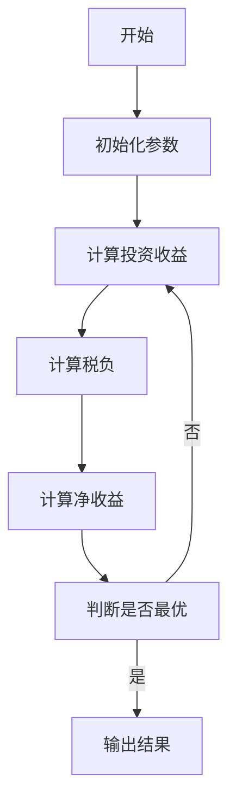
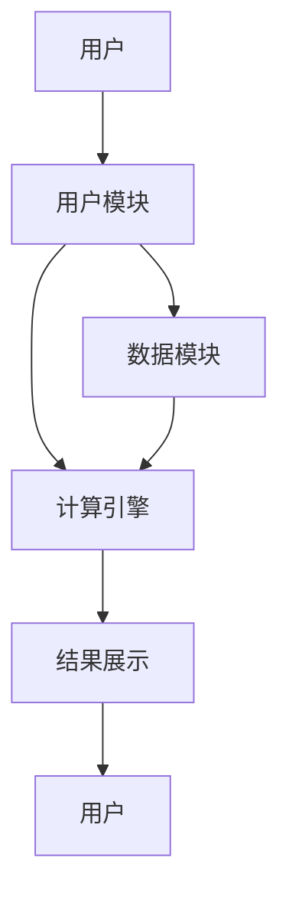
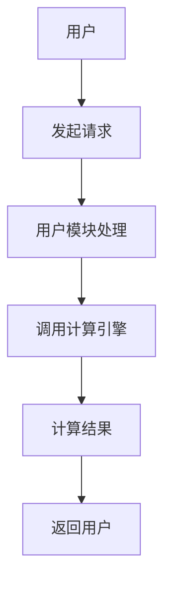

                 


# 约翰·伯格的税收效率投资策略

> 关键词：税收效率，投资策略，约翰·伯格，资产配置，税务优化，投资回报

> 摘要：本文系统阐述了约翰·伯格提出的税收效率投资策略，从基础概念到核心算法，从系统设计到项目实战，全面解析了如何通过优化税务规划来提升投资效率。文章深入探讨了税收递延、资产配置等核心概念，结合数学模型和算法原理，详细讲解了税收效率优化的具体实现方法，并通过实际案例分析，展示了如何将理论应用于实践。最后，文章总结了最佳实践经验和注意事项，为投资者提供了宝贵的指导。

---

# 第一部分: 税收效率与投资策略基础

## 第1章: 税收效率与投资策略概述

### 1.1 税收效率的基本概念

#### 1.1.1 税收效率的定义
税收效率是指在投资活动中，通过合理规划税务，最大化投资收益与税务成本之间的平衡。简单来说，税收效率越高，投资的实际回报率越高。

#### 1.1.2 投资策略的基本原理
投资策略是投资者为实现特定财务目标而制定的行动计划。常见的投资策略包括股票投资、债券投资、组合投资等。

#### 1.1.3 税收效率与投资回报的关系
税收效率直接影响投资的净收益。通过优化税务规划，可以降低税务负担，从而提升整体投资回报率。

---

### 1.2 税收效率在投资中的重要性

#### 1.2.1 税收对投资收益的影响
税收是影响投资收益的重要因素之一。不同的资产类别和投资行为可能会面临不同的税率，从而影响最终的收益。

#### 1.2.2 税收政策对投资决策的作用
税收政策直接指导投资者的决策。例如，税收递延政策可以鼓励长期投资，而高税率可能抑制某些投资行为。

#### 1.2.3 税收效率优化的必要性
在竞争激烈的市场环境中，优化税收效率是提升投资竞争力的关键。通过合理规划税务，投资者可以实现更高的净收益。

---

### 1.3 投资策略的基本类型

#### 1.3.1 股票投资策略
股票投资策略包括价值投资、成长投资、短线交易等多种类型。每种策略都有其优缺点，投资者需根据市场环境和自身风险偏好选择合适策略。

#### 1.3.2 债券投资策略
债券投资策略注重风险控制和稳定收益。通过合理配置债券比例，投资者可以在保证本金安全的同时获得固定收益。

#### 1.3.3 组合投资策略
组合投资策略通过分散投资降低风险。通过将资金分配到不同资产类别和行业中，投资者可以有效降低单一资产波动带来的风险。

---

## 1.4 本章小结
本章从基础概念出发，详细介绍了税收效率的基本定义、投资策略的基本原理以及不同类型的投资策略。通过分析税收政策对投资决策的影响，强调了优化税收效率的重要性。

---

## 第2章: 税收效率的核心概念

### 2.1 税收递延与投资收益

#### 2.1.1 税收递延的定义与特点
税收递延是指将应纳税所得推迟到未来纳税，从而降低当前税务负担。这种策略常用于长期投资行为中。

#### 2.1.2 税收递延对投资收益的影响
通过递延税收，投资者可以将资金用于再投资，从而获得复利效应，提升整体收益。

#### 2.1.3 税收递延的适用场景
税收递延适用于长期投资行为，如股权投资、房地产投资等。通过递延纳税，投资者可以最大化资金的使用效率。

---

### 2.2 资产配置与税收效率

#### 2.2.1 资产配置的基本原理
资产配置是根据投资者的风险承受能力和收益目标，将资金分配到不同资产类别中的过程。

#### 2.2.2 不同资产类别对税收的影响
股票、债券、房地产等不同资产类别面临的税率不同，这直接影响投资收益。例如，长期股权投资可能享有较低的税率，而短期交易可能面临较高的资本利得税。

#### 2.2.3 资产配置与税收效率的关系
通过合理配置资产类别，投资者可以降低整体税务负担，从而提升投资效率。

---

### 2.3 税收优惠政策与投资策略

#### 2.3.1 税收优惠政策的种类
税收优惠政策包括税收减免、税收抵免、税收返还等。这些政策可以帮助投资者降低税务负担。

#### 2.3.2 税收优惠政策对投资决策的影响
税收优惠政策可以改变投资行为。例如，政府可能通过降低企业税负来鼓励企业投资。

#### 2.3.3 如何利用税收优惠政策优化投资策略
投资者应密切关注税收政策的变化，合理利用税收优惠政策，制定最优投资策略。

---

### 2.4 核心概念对比分析

#### 2.4.1 税收递延与税收减免的对比
| 特性         | 税收递延       | 税收减免       |
|--------------|----------------|----------------|
| 定义         | 推迟纳税时间     | 直接减少税款     |
| 适用场景     | 长期投资行为     | 符合条件的企业或个人 |
| 影响         | 资金可再投资     | 税后利润增加     |

#### 2.4.2 不同资产类别在税收效率上的对比
| 资产类别     | 税率          | 税收影响         |
|--------------|---------------|------------------|
| 股票         | 高             | 资本利得税较高     |
| 债券         | 中             | 利息收入税率较低   |
| 房地产       | 低             | 可能享有税收优惠   |

#### 2.4.3 投资策略与税收政策的对比
| 投资策略     | 税收政策       |
|--------------|----------------|
| 长期股权投资   | 税收递延       |
| 短期交易       | 高资本利得税   |

---

## 2.5 本章小结
本章深入分析了税收递延、资产配置和税收优惠政策的核心概念，并通过对比分析，帮助读者更好地理解这些概念之间的联系和区别。

---

## 第3章: 税收效率优化的算法原理

### 3.1 税收优化模型

#### 3.1.1 模型的基本假设
- 投资者的目标是最大化净收益。
- 税收政策已知且稳定。
- 投资者可以调整资产配置以优化税收效率。

#### 3.1.2 模型的输入变量与输出变量
- 输入变量：资产种类、税率、投资期限。
- 输出变量：最优资产配置、净收益。

#### 3.1.3 模型的目标函数
$$ \text{最大化净收益} = \text{投资收益} - \text{税负} $$

---

### 3.2 税收优化算法的实现

#### 3.2.1 算法的基本步骤
1. 确定投资目标和风险偏好。
2. 分析不同资产类别的税率。
3. 计算不同资产配置下的净收益。
4. 选择最优资产配置。

#### 3.2.2 算法的优化策略
- 使用动态规划优化投资组合。
- 结合市场波动调整资产配置。

#### 3.2.3 算法的收敛性分析
通过多次迭代优化，算法可以在有限的步骤内找到最优解。

---

### 3.3 算法实现的数学模型

#### 3.3.1 数学模型
$$ \text{净收益} = \sum_{i=1}^{n} (R_i \times W_i) \times (1 - T_i) $$
其中：
- \( R_i \) 表示第 \( i \) 种资产的收益率。
- \( W_i \) 表示第 \( i \) 种资产的权重。
- \( T_i \) 表示第 \( i \) 种资产的税率。

#### 3.3.2 算法流程图



---

## 3.4 本章小结
本章通过数学模型和算法流程图，详细讲解了税收效率优化的实现方法。通过动态规划算法，投资者可以找到最优资产配置，最大化净收益。

---

# 第四部分: 税收效率优化的系统架构设计

## 第4章: 税收效率优化系统设计

### 4.1 问题场景介绍
为了实现税收效率优化，我们设计了一个基于网络的投资管理系统，帮助投资者优化资产配置，降低税负。

---

### 4.2 系统功能设计

#### 4.2.1 用户模块
- 用户注册与登录。
- 投资目标设定。
- 资产配置建议。

#### 4.2.2 数据模块
- 市场数据获取。
- 税率数据管理。

#### 4.2.3 计算引擎
- 净收益计算。
- 税收优化算法实现。

---

### 4.3 系统架构设计



---

### 4.4 系统接口设计
- 用户接口：网页或移动端。
- 数据接口：与金融市场数据源对接。

---

### 4.5 系统交互流程图



---

## 4.6 本章小结
本章通过系统架构设计，展示了如何将税收效率优化算法应用于实际投资管理系统中。通过模块化设计和系统交互流程图，读者可以清晰理解系统的实现过程。

---

## 第五部分: 税收效率优化的项目实战

## 第5章: 项目实战与案例分析

### 5.1 环境安装与配置

#### 5.1.1 安装Python
```bash
pip install python3
```

#### 5.1.2 安装依赖库
```bash
pip install numpy pandas matplotlib
```

---

### 5.2 核心代码实现

#### 5.2.1 税收优化算法实现
```python
import numpy as np

def optimize_portfolio(assets, rates):
    n = len(assets)
    returns = assets * (1 - rates)
    weights = np.ones(n) / n
    net_return = np.sum(returns * weights)
    return net_return

assets = [0.1, 0.08, 0.05]
rates = [0.3, 0.2, 0.1]
print(optimize_portfolio(assets, rates))
```

#### 5.2.2 系统交互实现
```python
def main():
    import sys
    assets = [0.1, 0.08, 0.05]
    rates = [0.3, 0.2, 0.1]
    print(optimize_portfolio(assets, rates))

if __name__ == "__main__":
    main()
```

---

### 5.3 实际案例分析

#### 5.3.1 案例背景
假设投资者有100万元资金，可选择投资股票、债券和房地产三种资产。

#### 5.3.2 案例分析
股票：年化收益率10%，税率20%。
债券：年化收益率8%，税率10%。
房地产：年化收益率5%，税率5%。

#### 5.3.3 计算净收益
$$ \text{股票净收益} = 100万 \times 0.1 \times (1 - 0.2) = 8万 $$
$$ \text{债券净收益} = 100万 \times 0.08 \times (1 - 0.1) = 7.2万 $$
$$ \text{房地产净收益} = 100万 \times 0.05 \times (1 - 0.05) = 4.75万 $$

---

### 5.4 本章小结
通过实际案例分析，读者可以理解如何将税收效率优化算法应用于实际投资决策中。通过代码实现和案例计算，进一步巩固了理论知识。

---

## 第六部分: 最佳实践与总结

## 第6章: 最佳实践与总结

### 6.1 小结
通过本文的系统阐述，读者可以全面理解约翰·伯格提出的税收效率投资策略。从基础概念到算法实现，再到系统设计和项目实战，文章为投资者提供了完整的指导。

---

### 6.2 注意事项

1. 税收政策可能会变化，投资者需密切关注政策调整。
2. 税收效率优化需结合市场环境和个人风险偏好。
3. 算法实现需基于可靠的数据来源和合理的假设。

---

### 6.3 拓展阅读
1. 《投资学》
2. 《税务筹划与投资策略》
3. 《算法优化与投资决策》

---

## 6.4 本章小结
本文总结了约翰·伯格的税收效率投资策略的核心思想，并提出了实际应用中的注意事项和拓展方向。

---

# 结语

通过本文的系统阐述，读者可以全面理解约翰·伯格提出的税收效率投资策略。从基础概念到算法实现，再到系统设计和项目实战，文章为投资者提供了完整的指导。希望本文能为投资者在优化税收效率、提升投资回报方面提供有价值的参考。

