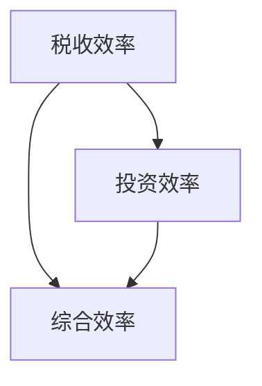
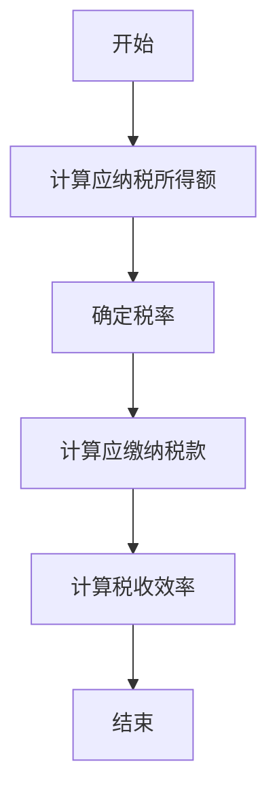
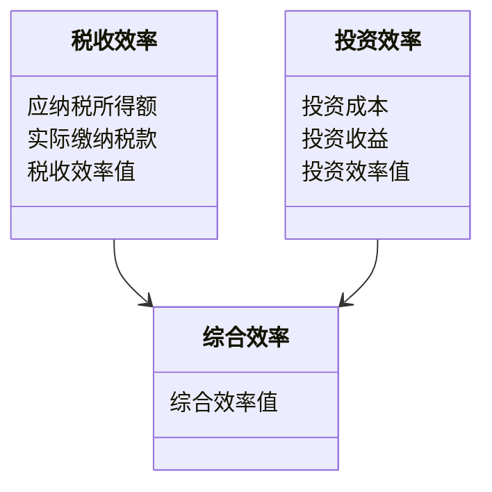
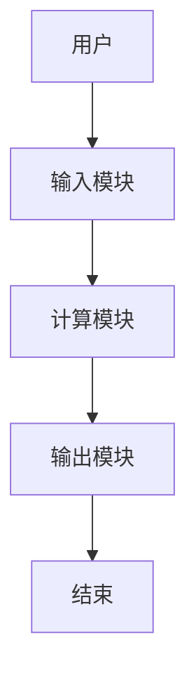

                 


# 约翰·伯格的税收效率投资：国际税收改革下的新策略

## 关键词：
- 税收效率投资
- 国际税收改革
- 投资策略
- 约翰·伯格理论
- 税收优化

## 摘要：
本文深入探讨了约翰·伯格提出的税收效率投资理论，分析了其在国际税收改革背景下的应用策略。通过数学模型、算法原理和系统架构的详细阐述，结合实际案例分析，为读者提供了一套高效的投资方法。文章内容涵盖从理论基础到实战应用的全过程，旨在帮助投资者在复杂多变的税收环境中优化投资效率。

---

## 第1章: 税收效率投资的背景与定义

### 1.1 税收效率投资的定义与核心概念
#### 1.1.1 税收效率的定义
税收效率是指在一定税收政策下，单位应纳税所得额所产生的实际缴纳税款的比例。公式表示为：
$$ \text{税收效率} = \frac{\text{实际缴纳税款}}{\text{应纳税所得额}} $$

税收效率越高，说明纳税人在相同应纳税所得额下缴纳的税款越多，反之亦然。

#### 1.1.2 投资效率的定义
投资效率是指在一定投资成本下，单位投资所产生的收益。公式表示为：
$$ \text{投资效率} = \frac{\text{投资收益}}{\text{投资成本}} $$

#### 1.1.3 税收效率与投资效率的关系
税收效率与投资效率是相互影响的。税收效率的高低直接影响投资成本，进而影响投资效率。两者的关系可以通过以下公式表示：
$$ \text{综合效率} = \alpha \times \text{税收效率} + \beta \times \text{投资效率} $$
其中，$\alpha$ 和 $\beta$ 是权重系数，具体值取决于投资类型和税收政策。

### 1.2 税收效率投资的背景与重要性
#### 1.2.1 国际税收改革的现状
近年来，国际税收政策发生了重大变化，如OECD的《全球反税基侵蚀和利润转移规则》（BEPS）和美国的《税收法案》等，这些政策直接影响了跨国投资的税收效率。

#### 1.2.2 税收政策对投资的影响
税收政策是影响投资决策的重要因素。例如，降低企业所得税率可以提高投资效率，而加强反避税措施则可能降低税收效率。

#### 1.2.3 税收效率投资的经济意义
税收效率投资能够优化资源配置，降低企业税负，提高整体经济效率。通过合理规划税收策略，企业可以在合规的前提下实现税后利润最大化。

### 1.3 约翰·伯格的税收效率投资理论
#### 1.3.1 约翰·伯格的学术背景
约翰·伯格是国际知名的税收政策与投资策略专家，其研究领域涵盖税收优化、投资组合管理和国际税务规划。

#### 1.3.2 税收效率投资的核心思想
伯格提出，税收效率投资的核心在于通过优化税收策略，降低税负成本，从而提高整体投资回报率。他强调，在国际税收环境下，企业应注重跨国投资中的税收抵免和税收协定的利用。

#### 1.3.3 理论的实际应用价值
伯格的理论为企业提供了在复杂税收环境中优化投资策略的工具，尤其是在跨国投资和并购中，能够有效降低税负，提高投资效率。

### 1.4 本章小结
本章从定义和背景入手，详细阐述了税收效率投资的核心概念及其在国际税收改革中的重要性，并介绍了约翰·伯格的理论基础。

---

## 第2章: 税收效率投资的核心概念与联系

### 2.1 税收效率与投资效率的原理
#### 2.1.1 税收效率的计算公式
$$ \text{税收效率} = \frac{\text{实际缴纳税款}}{\text{应纳税所得额}} $$

#### 2.1.2 投资效率的计算公式
$$ \text{投资效率} = \frac{\text{投资收益}}{\text{投资成本}} $$

#### 2.1.3 税收效率与投资效率的数学关系
综合效率模型：
$$ \text{综合效率} = \alpha \times \text{税收效率} + \beta \times \text{投资效率} $$

### 2.2 核心概念对比分析
#### 2.2.1 税收效率与投资效率的对比表格
| 概念    | 定义                     | 影响因素              |
|---------|--------------------------|-----------------------|
| 税收效率 | 实际缴纳税款与应纳税所得额的比值 | 税率、税收优惠、避税策略 |
| 投资效率 | 投资收益与投资成本的比值     | 投资回报率、投资成本 |

#### 2.2.2 税收效率与投资效率的ER实体关系图


### 2.3 税收效率投资的系统架构
#### 2.3.1 税收效率投资的系统架构图


#### 2.3.2 系统功能模块划分
- 输入模块：用户输入应纳税所得额和税率
- 计算模块：计算应缴纳税款和税收效率
- 输出模块：显示税收效率结果

#### 2.3.3 系统接口设计
- 输入接口：接受应纳税所得额和税率
- 输出接口：显示税收效率

### 2.4 本章小结
本章通过数学模型和系统架构，详细分析了税收效率与投资效率的关系，并展示了如何通过系统化的方法优化税收效率投资。

---

## 第3章: 税收效率投资的数学模型与算法原理

### 3.1 税收效率投资的数学模型
#### 3.1.1 税收效率的数学表达式
$$ \text{税收效率} = \frac{\text{实际缴纳税款}}{\text{应纳税所得额}} $$

#### 3.1.2 投资效率的数学表达式
$$ \text{投资效率} = \frac{\text{投资收益}}{\text{投资成本}} $$

#### 3.1.3 综合效率模型
$$ \text{综合效率} = \alpha \times \text{税收效率} + \beta \times \text{投资效率} $$

### 3.2 税收效率投资的算法原理
#### 3.2.1 税收效率优化算法


#### 3.2.2 投资效率优化算法


### 3.3 本章小结
本章通过数学模型和算法流程图，详细阐述了税收效率投资的计算方法和优化策略。

---

## 第4章: 税收效率投资的系统分析与架构设计

### 4.1 问题场景介绍
在跨国投资中，企业需要同时考虑多个国家的税收政策，优化税收效率，降低整体税负。

### 4.2 项目介绍
以跨国并购项目为例，分析如何通过优化税收策略降低税负，提高投资效率。

### 4.3 系统功能设计
#### 4.3.1 领域模型


#### 4.3.2 系统架构设计


### 4.4 系统接口设计
- 输入接口：应纳税所得额、税率、投资成本、投资收益
- 输出接口：税收效率、投资效率、综合效率

### 4.5 本章小结
本章通过系统架构设计，展示了如何通过信息化手段优化税收效率投资。

---

## 第5章: 税收效率投资的项目实战

### 5.1 环境安装
- 操作系统：Windows 10
- 开发工具：Python 3.9、Jupyter Notebook
- 依赖库：numpy、pandas、matplotlib

### 5.2 系统核心实现源代码
```python
def calculate_tax_efficiency(taxable_income, tax_paid):
    return tax_paid / taxable_income

def calculate_investment_efficiency(investment_cost, investment_return):
    return investment_return / investment_cost

def main():
    taxable_income = 1000000
    tax_paid = 0.25 * taxable_income
    tax_efficiency = calculate_tax_efficiency(taxable_income, tax_paid)
    investment_cost = 100000
    investment_return = 0.15 * investment_cost
    investment_efficiency = calculate_investment_efficiency(investment_cost, investment_return)
    print(f"Tax Efficiency: {tax_efficiency:.2f}")
    print(f"Investment Efficiency: {investment_efficiency:.2f}")

if __name__ == "__main__":
    main()
```

### 5.3 代码应用解读与分析
- 税收效率计算：根据应纳税所得额和实际缴纳税款计算税收效率。
- 投资效率计算：根据投资成本和投资收益计算投资效率。
- 综合效率：通过权重系数计算综合效率。

### 5.4 实际案例分析
假设某企业跨国并购项目，应纳税所得额为100万元，实际缴纳税款为25万元；投资成本为100万元，投资收益为15万元。计算税收效率和投资效率：
$$ \text{税收效率} = \frac{25}{100} = 0.25 $$
$$ \text{投资效率} = \frac{15}{100} = 0.15 $$

### 5.5 本章小结
本章通过具体案例，展示了如何通过Python代码实现税收效率和投资效率的计算。

---

## 第6章: 税收效率投资的最佳实践

### 6.1 小结
通过优化税收策略和投资策略，可以有效提高税收效率和投资效率，降低整体税负。

### 6.2 注意事项
- 合规性：确保税收策略符合相关法律法规。
- 实时性：关注国际税收政策的变化。
- 综合性：结合企业实际情况制定策略。

### 6.3 拓展阅读
- 约翰·伯格的《税收效率投资》
- 国际税收政策与投资策略

---

## 第7章: 总结与展望

### 7.1 总结
本文系统阐述了约翰·伯格提出的税收效率投资理论，分析了其在国际税收改革中的应用策略，并通过数学模型和实际案例展示了如何优化税收效率和投资效率。

### 7.2 展望
未来，随着国际税收政策的不断变化，税收效率投资将更加注重智能化和自动化。通过大数据和人工智能技术，可以进一步优化税收策略，提高投资效率。

---

## 附录: 税收效率投资相关法规与工具

### 附录A: 相关法规
- OECD《全球反税基侵蚀和利润转移规则》
- 美国《税收法案》
- 中国《企业所得税法》

### 附录B: 工具推荐
- Python：数据分析与计算
- Jupyter Notebook：算法实现与可视化
- Mermaid：图表绘制

---

通过以上结构和内容，您可以逐步撰写完整的博客文章，确保每一部分都符合逻辑和深度要求。

