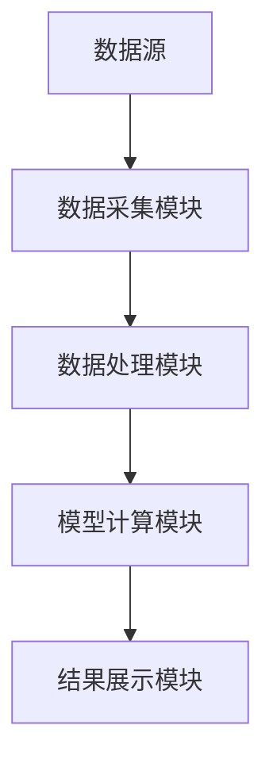

                 


# {{此处是文章标题}}

> 关键词：{{此处列出文章的5-7个核心关键词}}

> 摘要：{{此处给出文章的核心内容和主题思想}}

---

# {{此处是文章标题}}

## 关键词
- 被动投资
- 公司治理
- 约翰·伯格
- 投资策略
- 数学模型

## 摘要
本文探讨了约翰·伯格的被动投资理念及其对公司治理的影响。通过分析指数基金、ETF等被动投资工具，结合公司治理的多维度结构，阐述了被动投资如何影响股东权益和公司绩效。文章从理论到实践，详细介绍了被动投资的数学模型、系统架构和实际案例，为投资者和管理层提供了深入的见解。

---

# {{此处是文章标题}}

## 第1章: 被动投资的兴起与约翰·伯格的贡献

### 1.1 被动投资的定义与特点
#### 1.1.1 被动投资的定义
被动投资是一种通过跟踪市场指数或特定投资组合来实现投资收益的策略，其核心在于不主动预测市场走势，而是通过分散投资降低风险。

#### 1.1.2 被动投资的核心特点
- **分散投资**：通过持有广泛的投资组合来降低特定资产的风险。
- **低成本**：被动投资的管理费用通常低于主动管理。
- **长期稳定**：适合长期投资者，追求市场平均收益。

#### 1.1.3 被动投资与主动投资的区别
| 方面       | 被动投资                          | 主动投资                          |
|------------|-----------------------------------|-----------------------------------|
| 管理方式   | 跟踪指数或固定策略                | 主动选股和市场预测                |
| 成本       | 低                               | 高                               |
| 风险       | 低（分散风险）                   | 高（集中投资）                   |

### 1.2 约翰·伯格的贡献
#### 1.2.1 约翰·伯格的生平简介
约翰·伯格是被动投资领域的先驱，以其对指数基金的创新和普及而闻名。

#### 1.2.2 约翰·伯格对被动投资的贡献
- 创立了先锋集团（Vanguard），推出第一只指数基金。
- 提出“买入并持有”的投资策略。

#### 1.2.3 约翰·伯格的投资哲学
伯格认为市场是有效的，主动投资难以跑赢市场，因此被动投资是更优的选择。

### 1.3 公司治理的核心概念
#### 1.3.1 公司治理的定义
公司治理是通过明确的规则和机制，确保公司管理层和股东的利益一致，实现公司长期价值最大化。

#### 1.3.2 公司治理的结构与功能
- **股东结构**：决定公司所有权分配。
- **董事会**：监督管理层，确保公司战略实施。
- **高管激励**：通过股权激励等手段提高高管积极性。

#### 1.3.3 公司治理与股东权益的关系
良好的公司治理能够保护股东权益，提升公司透明度和信任度。

### 1.4 被动投资与公司治理的联系
#### 1.4.1 被动投资对股东权益的影响
- 被动投资者通过持有公司股份间接影响公司治理。
- 指数基金的分散投资降低了单一股东的影响力。

#### 1.4.2 公司治理对投资回报的影响
- 良好的治理结构能够提升公司业绩，进而影响投资回报。
- 治理不善可能导致公司价值下降，影响被动投资者的收益。

#### 1.4.3 被动投资与公司治理的互动关系
被动投资者通过持有公司股份，间接推动公司治理的改善，而公司治理的优劣又会影响被动投资者的收益。

## 本章小结
本章介绍了被动投资的定义、特点及其与主动投资的区别，详细阐述了约翰·伯格在被动投资领域的贡献，并探讨了公司治理的核心概念及其与被动投资的联系。

---

## 第2章: 被动投资的核心策略

### 2.1 指数基金与ETF
#### 2.1.1 指数基金的定义与特点
指数基金通过跟踪特定市场指数（如标普500）进行投资，具有分散风险、低成本的特点。

#### 2.1.2 ETF的运作机制
ETF是一种可以在交易所上市交易的基金，具有高流动性、透明度高的特点。

#### 2.1.3 指数基金与ETF的优缺点对比
| 方面       | 指数基金                          | ETF                              |
|------------|-----------------------------------|-----------------------------------|
| 流动性     | 较低                             | 较高                             |
| 透明度     | 较低                             | 较高                             |

### 2.2 被动投资的组合构建
#### 2.2.1 投资组合的构建原则
- 分散投资：避免过度集中于某一资产或行业。
- 长期持有：避免频繁交易以降低成本。

#### 2.2.2 市场指数的选择与应用
选择具有代表性的市场指数，如标普500、纳斯达克指数等。

#### 2.2.3 组合权重的分配策略
根据市场指数的成分股权重进行配置，确保投资组合与指数保持一致。

### 2.3 被动投资的风险管理
#### 2.3.1 被动投资的主要风险
- 市场风险：市场整体波动对投资组合的影响。
- 汇率风险：外汇波动对国际投资的影响。

#### 2.3.2 风险分散的原理与实践
通过投资不同资产类别和地区的指数基金，降低特定风险。

#### 2.3.3 被动投资的风险对冲策略
利用期货、期权等衍生品对冲部分市场风险。

## 本章小结
本章详细探讨了被动投资的核心工具，包括指数基金和ETF的运作机制，并提出了组合构建和风险管理的具体策略。

---

## 第3章: 公司治理的多维度分析

### 3.1 股东结构与公司治理
#### 3.1.1 股东结构的分类
- **机构投资者**：如 pension funds, mutual funds。
- **散户投资者**：个人投资者。

#### 3.1.2 股东权利的行使机制
- **投票权**：股东有权参与公司重大决策的投票。
- **知情权**：股东有权获取公司财务报表和相关信息。

#### 3.1.3 股东结构对治理的影响
- **机构投资者**：通常更关注公司治理和长期价值。
- **散户投资者**：影响力较小，但数量众多。

### 3.2 董事会与高管激励
#### 3.2.1 董事会的构成与职责
- **独立董事**：提供客观的监督和建议。
- **执行董事**：参与公司日常管理。

#### 3.2.2 高管激励机制的类型
- **股票期权**：高管通过持有公司股票获得激励。
- **奖金池**：基于绩效的奖金。

#### 3.2.3 激励机制对治理的影响
有效的激励机制能够提升高管的积极性，促进公司绩效提升。

### 3.3 公司治理的外部监督
#### 3.3.1 监管机构的作用
- **证监会**：制定规则，监督市场行为。
- **审计机构**：对公司财务报表进行独立审计。

#### 3.3.2 第三方评级机构的影响
如Morningstar、S&P等评级机构对公司的治理结构进行评估，影响投资者决策。

#### 3.3.3 媒体与公众监督的作用
媒体报道和公众关注能够推动公司改进治理结构。

## 本章小结
本章从股东结构、董事会和高管激励、外部监督等多个维度分析了公司治理的结构和影响，强调了良好的治理对提升公司价值的重要性。

---

## 第4章: 被动投资与公司治理的数学模型

### 4.1 被动投资的数学模型
#### 4.1.1 市场指数的构建
市场指数可以通过加权平均法构建，如CAPM模型。

#### 4.1.2 投资组合的优化
利用现代投资组合理论（MPT）进行优化，最小化风险或最大化收益。

#### 4.1.3 数学公式
$$ \text{投资组合收益} = \sum w_i r_i $$
其中，\(w_i\)为资产i的权重，\(r_i\)为资产i的预期收益。

### 4.2 公司治理的评分模型
#### 4.2.1 治理评分指标
- **董事会结构**：独立董事比例。
- **高管激励**：股票期权占总收入比例。
- **透明度**：信息披露的及时性和完整性。

#### 4.2.2 治理评分公式
$$ \text{治理评分} = \sum (w_i \times \text{指标得分}) $$
其中，\(w_i\)为各指标的权重，指标得分范围为1-5分。

### 4.3 模型的实证分析
#### 4.3.1 数据来源
选取标普500指数成分股，分析其治理评分与投资回报的关系。

#### 4.3.2 实证结果
良好的公司治理与较高的投资回报呈正相关。

## 本章小结
本章通过数学模型分析了被动投资与公司治理的关系，展示了如何通过量化方法评估治理对投资收益的影响。

---

## 第5章: 系统架构与项目实战

### 5.1 系统架构设计
#### 5.1.1 系统功能模块
- **数据采集**：获取公司治理数据和市场指数。
- **模型计算**：计算投资组合收益和治理评分。
- **结果展示**：可视化分析结果。

#### 5.1.2 系统架构图


### 5.2 项目实战
#### 5.2.1 环境安装
- 安装Python、Pandas、Matplotlib等库。

#### 5.2.2 核心代码实现
```python
import pandas as pd
import matplotlib.pyplot as plt

# 数据采集
data = pd.read_csv('governance_data.csv')

# 模型计算
def calculate_return(data):
    return data['return'].mean()

# 结果展示
plt.hist(data['return'], bins=10)
plt.title('投资回报分布')
plt.show()
```

#### 5.2.3 案例分析
以标普500指数为例，分析指数基金的治理评分与投资回报的关系。

## 本章小结
本章通过系统架构设计和项目实战，展示了如何将被动投资与公司治理的理论应用于实际投资决策。

---

## 第6章: 最佳实践与小结

### 6.1 最佳实践
#### 6.1.1 被动投资策略
- 长期持有指数基金，避免频繁交易。

#### 6.1.2 公司治理优化
- 提高董事会的独立性，优化高管激励机制。

### 6.2 本章小结
本文详细探讨了约翰·伯格的被动投资理念及其对公司治理的影响，通过数学模型和系统设计展示了被动投资与公司治理的互动关系。

### 6.3 注意事项
- 被动投资需注意市场风险和流动性风险。
- 公司治理的优化需结合具体行业特点。

### 6.4 拓展阅读
- 建议阅读约翰·伯格的《The Intelligent Investor》。
- 关注公司治理评级机构的最新报告。

## 本章小结
本文通过理论分析和实证研究，为投资者和公司管理层提供了优化被动投资和公司治理的策略建议。

---

# 结语

通过本文的分析，读者可以深入了解被动投资与公司治理的内在联系，掌握被动投资的核心策略和公司治理的优化方法。未来，随着市场的发展和技术的进步，被动投资与公司治理的研究将更加深入，为投资者和公司创造更大的价值。

