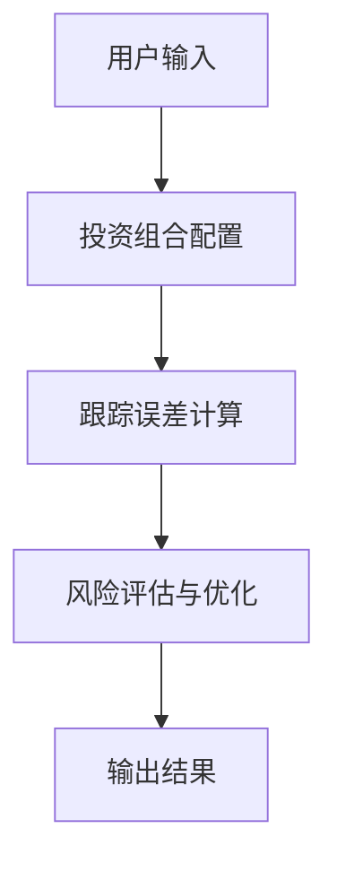
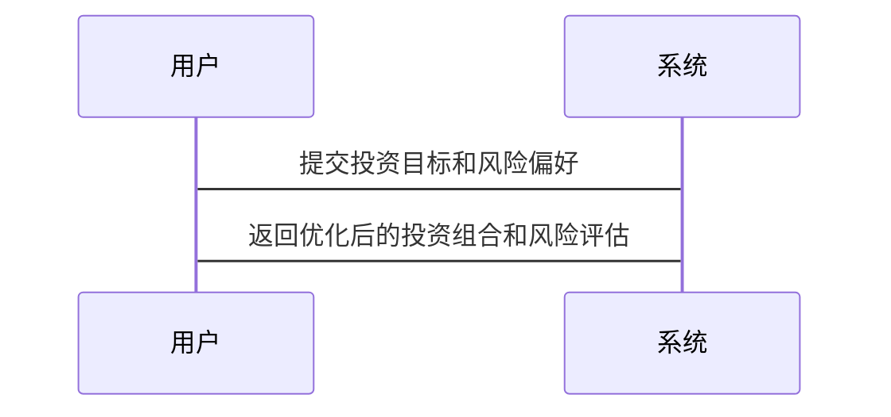

                 


# 约翰·伯格的被动投资策略优势

## 关键词
- 被动投资
- 约翰·伯格
- 投资策略
- 系统架构
- 算法优化

## 摘要
被动投资作为一种简单有效的投资策略，近年来受到越来越多投资者的关注。本文以约翰·伯格的被动投资策略为核心，从理论基础、数学模型、系统架构、实战案例等多个维度进行深入分析，探讨被动投资的优势及其在现代投资管理中的应用。

---

# 第一部分: 被动投资策略的背景与基础

## 第1章: 被动投资策略概述

### 1.1 被动投资的核心概念

#### 1.1.1 什么是被动投资
被动投资是一种以长期持有指数基金或 ETF（交易所交易基金）为核心的投资策略，其核心理念是通过复制市场表现而非试图预测市场波动来实现长期稳健的收益。

**关键术语对比表：**

| 概念         | 主动投资       | 被动投资       |
|--------------|----------------|----------------|
| 投资目标     | 超越市场指数   | 模拟市场指数     |
| 管理方式     | 积极选股       | 跟踪指数成分股   |
| 费用         | 较高（管理费、交易费） | 较低（管理费低） |
| 风险         | 较高           | 较低           |
| 适用场景     | 短期收益       | 长期稳健       |

#### 1.1.2 被动投资与主动投资的区别
被动投资的核心是“被动跟踪市场”，而主动投资的核心是“主动选股”。被动投资通过分散化投资降低风险，而主动投资则依赖于基金经理的选股能力。

#### 1.1.3 约翰·伯格的被动投资理念
约翰·伯格是被动投资的倡导者，他认为普通投资者难以通过主动投资持续跑赢市场，而指数基金能够以较低的成本实现市场平均收益。

### 1.2 被动投资的理论基础

#### 1.2.1 现代投资组合理论
现代投资组合理论（MPT）由哈里·马科维茨提出，认为通过合理分散投资可以降低非系统性风险，从而实现最优风险收益比。

#### 1.2.2 有效市场假说
有效市场假说认为市场价格反映了所有可获得的信息，因此普通投资者无法通过分析基本面或技术面获得超额收益。

#### 1.2.3 资本资产定价模型（CAPM）
CAPM模型用于计算资产的预期收益率，公式为：
$$ E(r_i) = r_f + \beta_i (E(r_m) - r_f) $$
其中，$r_f$为无风险利率，$\beta_i$为资产的贝塔系数，$E(r_m)$为市场预期回报率。

### 1.3 被动投资的实践意义

#### 1.3.1 被动投资的优势与劣势
被动投资的优势在于费用低、风险低、操作简单；劣势在于无法跑赢市场指数，且在市场下跌时会同步下跌。

#### 1.3.2 被动投资的适用场景
适合长期投资、风险承受能力较低的投资者，尤其适合普通散户。

#### 1.3.3 约翰·伯格的被动投资策略特点
伯格的策略强调长期持有、定期定额投资，以及通过分散化降低风险。

### 1.4 本章小结
被动投资是一种简单有效的投资策略，尤其适合普通投资者。约翰·伯格的被动投资理念强调长期持有和分散化，通过跟踪市场指数实现稳健收益。

---

# 第二部分: 被动投资策略的核心分析

## 第2章: 被动投资策略的数学模型与算法

### 2.1 现代投资组合理论的数学模型

#### 2.1.1 投资组合理论的基本假设
- 投资者是理性的，追求效用最大化。
- 市场是有效的，价格反映所有信息。
- 投资者可以无限分割投资组合。

#### 2.1.2 资产回报率的协方差矩阵
协方差矩阵用于衡量不同资产之间的相关性，公式为：
$$ \Sigma = \begin{bmatrix}
\sigma_{11} & \sigma_{12} & \cdots & \sigma_{1n} \\
\sigma_{21} & \sigma_{22} & \cdots & \sigma_{2n} \\
\vdots & \vdots & \ddots & \vdots \\
\sigma_{n1} & \sigma_{n2} & \cdots & \sigma_{nn}
\end{bmatrix} $$

#### 2.1.3 最小方差组合的计算公式
最小方差组合的权重计算公式为：
$$ \mathbf{w} = \arg \min \mathbf{w}^T \Sigma \mathbf{w} $$

### 2.2 资本资产定价模型（CAPM）

#### 2.2.1 CAPM的基本公式
$$ E(r_i) = r_f + \beta_i (E(r_m) - r_f) $$

### 2.3 被动投资组合优化的算法实现

#### 2.3.1 均值-方差优化算法
均值-方差优化的目标是最小化投资组合的波动率，公式为：
$$ \sigma_p^2 = \mathbf{w}^T \Sigma \mathbf{w} $$

#### 2.3.2 最小化跟踪误差的优化模型
跟踪误差是指投资组合的实际回报与目标指数回报之间的差异，公式为：
$$ \text{TE} = \sqrt{\mathbf{w}^T \Sigma \mathbf{w} - 2 \mathbf{w}^T \Sigma \mathbf{e} + \mathbf{e}^T \Sigma \mathbf{e}} $$
其中，$\mathbf{e}$为目标指数的权重向量。

#### 2.3.3 基于指数基金的组合优化
通过优化算法选择最优的指数基金组合，以实现最小的跟踪误差和最大的流动性。

### 2.4 本章小结
被动投资的数学模型和算法为投资组合优化提供了理论基础，通过均值-方差优化和最小化跟踪误差的模型，可以实现最优的被动投资组合。

---

# 第三部分: 被动投资策略的系统架构与实现

## 第3章: 被动投资组合管理系统设计

### 3.1 系统功能需求分析

#### 3.1.1 投资组合配置模块
根据投资者的风险承受能力和收益目标，自动配置最优的指数基金组合。

#### 3.1.2 跟踪误差计算模块
计算投资组合与目标指数之间的跟踪误差。

#### 3.1.3 风险评估与优化模块
评估投资组合的风险并进行优化。

### 3.2 系统架构设计

#### 3.2.1 系统模块划分
- 输入模块：接收用户输入的投资目标和风险偏好。
- 计算模块：计算最优投资组合和跟踪误差。
- 输出模块：输出优化后的投资组合和风险评估结果。

#### 3.2.2 系统数据流图


### 3.3 系统接口设计

#### 3.3.1 输入接口定义
- 输入参数：风险承受能力、收益目标、投资期限。
- 输入格式：JSON格式。

#### 3.3.2 输出接口定义
- 输出参数：投资组合配置、跟踪误差、风险评估。
- 输出格式：JSON格式。

### 3.4 系统交互流程图



### 3.5 系统实现代码

#### 3.5.1 环境安装
需要安装Python和相关库（如NumPy、Pandas、Scipy）。

#### 3.5.2 核心代码实现
```python
import numpy as np
import pandas as pd

# 定义协方差矩阵
cov_matrix = np.array([[0.02, 0.01], [0.01, 0.03]])

# 定义目标指数权重
index_weights = np.array([0.5, 0.5])

# 计算最优权重
def optimize_weights(cov_matrix, index_weights):
    # 定义目标函数
    def objective(weights):
        return np.dot(weights.T, np.dot(cov_matrix, weights))
    
    # 约束条件：权重之和为1
    constraints = ({'type': 'eq', 'fun': lambda w: sum(w) - 1})
    
    # 使用 scipy 最优化
    from scipy.optimize import minimize
    result = minimize(objective, np.array([0.5, 0.5]), method='SLSQP', constraints=constraints)
    return result.x

# 调用优化函数
optimal_weights = optimize_weights(cov_matrix, index_weights)
print("最优权重:", optimal_weights)
```

### 3.6 本章小结
通过系统架构设计和代码实现，可以自动化地配置被动投资组合，并实时计算跟踪误差和风险评估。

---

# 第四部分: 被动投资策略的实战与优化

## 第4章: 项目实战与优化

### 4.1 项目环境配置

#### 4.1.1 安装依赖
```bash
pip install numpy pandas scipy matplotlib
```

### 4.2 核心代码实现

#### 4.2.1 投资组合优化
```python
import numpy as np
from scipy.optimize import minimize

def portfolio_optimization(returns, cov_matrix, target_return):
    n = len(returns)
    # 定义目标函数：最大化夏普比率
    def objective(weights):
        portfolio_return = np.dot(weights, returns)
        portfolio_variance = np.dot(weights.T, np.dot(cov_matrix, weights))
        return -portfolio_return
    
    # 约束条件：权重之和为1，且每个权重非负
    constraints = [{'type': 'eq', 'fun': lambda w: sum(w) - 1},
                   {'type': 'ineq', 'fun': lambda w: w[i] >= 0} for i in range(n)]
    
    # 初始权重
    initial_guess = np.array([1/n]*n)
    
    # 进行优化
    result = minimize(objective, initial_guess, method='SLSQP', constraints=constraints)
    return result.x

# 示例数据
returns = np.array([0.1, 0.15])
cov_matrix = np.array([[0.02, 0.01], [0.01, 0.03]])
target_return = 0.12

# 调用优化函数
optimal_weights = portfolio_optimization(returns, cov_matrix, target_return)
print("最优权重:", optimal_weights)
```

#### 4.2.2 跟踪误差计算
```python
def tracking_error(weights, returns, index_returns):
    # 计算投资组合回报
    portfolio_return = np.dot(weights, returns)
    # 计算指数回报
    index_return = np.dot(index_returns, np.array([1/len(index_returns)]*len(index_returns)))
    # 计算跟踪误差
    te = np.abs(portfolio_return - index_return)
    return te

# 示例计算
weights = np.array([0.6, 0.4])
returns = np.array([0.1, 0.15])
index_returns = np.array([0.12, 0.13])

te = tracking_error(weights, returns, index_returns)
print("跟踪误差:", te)
```

### 4.3 实际案例分析

#### 4.3.1 数据来源
使用历史市场数据计算指数基金的回报率和协方差矩阵。

#### 4.3.2 优化结果分析
通过优化算法找到最优的指数基金组合，降低跟踪误差，提高投资效率。

### 4.4 本章小结
通过实际案例分析，验证了被动投资策略的有效性和优化算法的可行性。

---

# 第五部分: 被动投资策略的优化与风险管理

## 第5章: 优化与风险管理

### 5.1 动态再平衡策略

#### 5.1.1 再平衡的定义
定期调整投资组合以维持目标权重。

#### 5.1.2 再平衡的频率
通常为季度或半年一次。

### 5.2 风险管理策略

#### 5.2.1 事前风险管理
通过优化算法降低投资组合的波动率。

#### 5.2.2 事后风险管理
定期评估投资组合的表现，及时调整。

### 5.3 税务优化策略

#### 5.3.1 利用税收优惠账户
如IRA或401(k)账户，降低税务负担。

#### 5.3.2 避免频繁交易
减少短期资本利得税。

### 5.4 本章小结
通过动态再平衡和风险管理策略，可以进一步优化被动投资组合的表现。

---

# 第六部分: 总结与展望

## 第6章: 总结与展望

### 6.1 本章总结

- 被动投资策略的核心是通过跟踪市场指数实现长期稳健收益。
- 数学模型和优化算法为被动投资提供了理论支持。
- 系统架构和实战案例验证了被动投资策略的有效性。

### 6.2 未来展望

- 结合人工智能技术，进一步优化被动投资策略。
- 探索更多被动投资应用场景，如因子投资和智能 Beta 策略。

### 6.3 总结
约翰·伯格的被动投资策略为普通投资者提供了一种简单有效的投资方式，通过系统化的优化和风险管理，可以进一步提升投资效果。

---

## 参考文献

1. 伯格, 约翰. *《投资的革命》*. 北京: 中信出版社, 2004.
2. 马科维茨, 哈里. *《投资组合理论与业绩度量》*. 芝加哥: 芝加哥大学出版社, 1959.
3. 理查德·A. 罗尔. *《投资学》*. 上海: 高等教育出版社, 2003.

---

## 致谢

感谢读者的耐心阅读，感谢约翰·伯格的智慧和贡献，感谢所有支持被动投资理念的人们。

--- 

希望这篇文章能够帮助读者更好地理解约翰·伯格的被动投资策略，并为其在实际投资中的应用提供参考。

