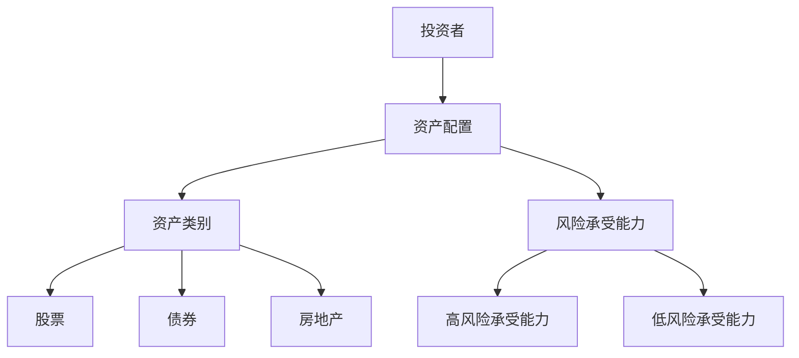
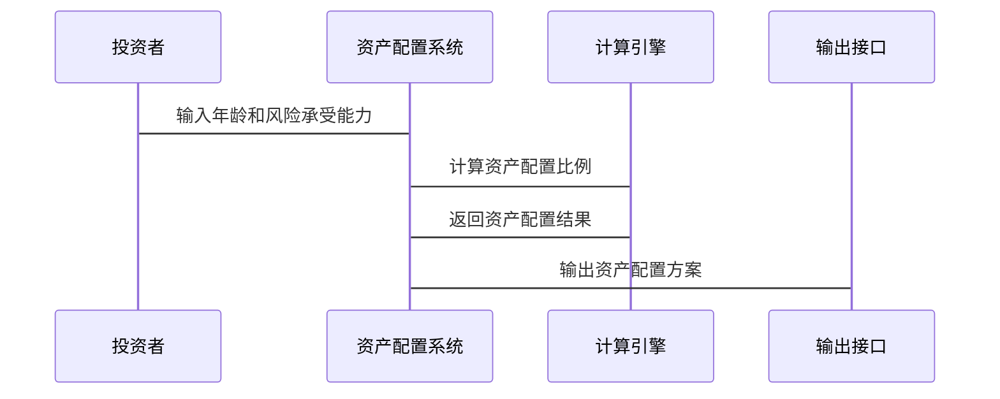

                 


# 约翰·伯格的资产配置原则：年龄与风险承受能力的平衡

> 关键词：资产配置，风险承受能力，约翰·伯格，投资组合，年龄，风险调整

> 摘要：本文深入探讨了约翰·伯格的资产配置原则，特别是如何根据年龄和风险承受能力来平衡投资组合。文章首先介绍了资产配置的基本概念和重要性，然后详细讲解了约翰·伯格的理论和策略，包括其核心算法、系统架构和项目实战。通过具体案例分析和数学公式推导，本文为读者提供了从理论到实践的全面指导，帮助投资者根据自身情况制定科学的资产配置方案。

---

## 第一部分: 资产配置与风险承受能力的基础

### 第1章: 资产配置的基本概念

#### 1.1 资产配置的定义与重要性

资产配置是指将资金分配到不同的资产类别（如股票、债券、房地产等）中，以实现投资目标的过程。其核心在于分散投资，降低风险，同时追求收益最大化。

- **资产配置的定义**：资产配置是一种投资策略，旨在通过将资金分配到不同资产类别中，以平衡风险与收益。
- **资产配置的重要性**：
  - **分散风险**：通过投资多种资产，降低单一资产带来的风险。
  - **优化收益**：根据不同资产的收益特性，合理分配资金，提高整体收益。
  - **适应市场变化**：根据市场环境和个人情况调整资产配置，确保投资组合的稳健性。

#### 1.2 风险承受能力的定义与评估

风险承受能力是指投资者在面对投资损失时的心理和财务承受能力。它直接影响资产配置的决策。

- **风险承受能力的定义**：投资者在面对潜在损失时的心理和财务承受能力。
- **风险承受能力的评估方法**：
  - **心理评估**：通过问卷调查了解投资者的风险偏好。
  - **财务评估**：分析投资者的财务状况，包括收入、资产、负债等。
  - **时间评估**：考虑投资者的投资期限，长期投资者通常能承受更高的风险。

#### 1.3 资产配置与风险承受能力的联系

资产配置与风险承受能力密切相关，前者是根据后者制定的。

- **资产配置与风险承受能力的相互作用**：
  - 风险承受能力高时，可增加高风险资产（如股票）的配置。
  - 风险承受能力低时，应增加低风险资产（如债券）的配置。
- **不同生命周期阶段的资产配置策略**：
  - **年轻阶段**：风险承受能力强，适合高风险资产配置。
  - **中年阶段**：风险承受能力适中，资产配置需平衡。
  - **老年阶段**：风险承受能力低，资产配置需保守。

---

### 第2章: 约翰·伯格的资产配置原则

#### 2.1 约翰·伯格的生平与投资理念

约翰·伯格是美国著名投资专家， Vanguard集团的创始人，以其长期投资和分散投资的理念闻名。

- **约翰·伯格的生平简介**：
  - 1934年出生，毕业于宾夕法尼亚大学。
  - 创办Vanguard集团，推动指数基金的发展。
- **伯格的投资哲学**：
  - 长期投资，避免频繁交易。
  - 分散投资，降低风险。
  - 重视费用控制，追求性价比。

#### 2.2 伯格的资产配置理论

伯格提出了一种基于年龄和风险承受能力的资产配置模型。

- **伯格的资产配置模型**：
  - 根据年龄和风险承受能力，动态调整资产配置比例。
  - 年龄越大，风险资产比例越低。
  - 风险承受能力越低，风险资产比例越低。

- **伯格的风险调整收益概念**：
  - 在风险可控的前提下，追求收益最大化。
  - 风险调整后的收益是衡量投资组合的重要指标。

- **伯格的长期投资策略**：
  - 长期投资，避免短期波动影响决策。
  - 定期审视和调整资产配置，适应市场变化。

#### 2.3 伯格的年龄与风险承受能力平衡法则

伯格强调，年龄和风险承受能力是影响资产配置的两大重要因素。

- **年龄对风险承受能力的影响**：
  - 年龄越大，风险承受能力越低。
  - 年龄越小，风险承受能力越高。

- **伯格的资产配置调整原则**：
  - 每年根据年龄增长，逐步降低风险资产比例。
  - 根据市场环境和个人财务状况，动态调整资产配置。

- **不同年龄段的资产配置建议**：
  - **20-30岁**：股票占比60%，债券占比20%，现金占比20%。
  - **30-50岁**：股票占比40%，债券占比40%，现金占比20%。
  - **50岁以上**：股票占比20%，债券占比60%，现金占比20%。

---

### 第3章: 资产配置的核心概念与联系

#### 3.1 资产配置的核心原理

资产配置的核心在于分散投资和风险控制。

- **投资组合的分散化原理**：
  - 通过投资不同资产类别，降低特定资产的风险。
  - 分散化可以降低非系统性风险。

- **风险与收益的平衡原理**：
  - 高风险资产可能带来高收益，但也可能带来更大的损失。
  - 低风险资产收益稳定，但可能低于高风险资产。

- **资产类别与投资目标的关系**：
  - 投资目标不同，资产配置比例不同。
  - 长期目标适合较高风险资产，短期目标适合低风险资产。

#### 3.2 风险承受能力的特征对比

不同年龄段和资产类别的风险特征对比。

- **不同年龄段的风险承受能力对比**：
  | 年龄段 | 风险承受能力 |
  |--------|---------------|
  | 20-30  | 高             |
  | 30-50  | 中             |
  | 50以上 | 低             |

- **不同资产类别的风险特征对比**：
  | 资产类别 | 风险特征 |
  |----------|----------|
  | 股票     | 高       |
  | 债券     | 中       |
  | 房地产   | 中       |

- **风险承受能力与投资期限的关系**：
  - 投资期限长，风险承受能力高。
  - 投资期限短，风险承受能力低。

#### 3.3 资产配置的ER实体关系图



---

### 第4章: 资产配置的算法原理

#### 4.1 资产配置算法的概述

- **常见资产配置算法**：
  - 均值-方差优化
  - 风险调整收益优化
  - 简单资产配置

- **简单资产配置算法的优缺点**：
  - 优点：简单易懂，操作方便。
  - 缺点：忽视市场环境和投资者需求。

- **复杂资产配置算法的优缺点**：
  - 优点：考虑多因素，优化效果好。
  - 缺点：计算复杂，需要大量数据支持。

#### 4.2 基于年龄的风险调整资产配置算法

- **算法原理**：
  - 根据投资者年龄和风险承受能力，动态调整资产配置比例。
  - 年龄越大，风险资产比例越低。

- **算法步骤**：
  1. 确定投资者年龄和风险承受能力。
  2. 根据年龄确定基础资产配置比例。
  3. 根据风险承受能力调整资产配置比例。
  4. 输出最终资产配置方案。

- **算法实现的代码示例**：

```python
def age_based_asset_allocation(age, risk_tolerance):
    # 基础资产配置比例
    base_stock = max(100 - age * 2, 20)
    base_bond = 60 - (age * 1)
    base_cash = 20

    # 根据风险承受能力调整
    if risk_tolerance == 'high':
        stock = base_stock + 10
        bond = base_bond - 5
        cash = base_cash
    elif risk_tolerance == 'medium':
        stock = base_stock
        bond = base_bond
        cash = base_cash
    else:
        stock = base_stock - 10
        bond = base_bond + 5
        cash = base_cash + 5

    return {'股票': stock, '债券': bond, '现金': cash}

# 示例：30岁，风险承受能力中等
allocation = age_based_asset_allocation(30, 'medium')
print(allocation)  # 输出：{'股票': 40, '债券': 55, '现金': 20}
```

#### 4.3 数学模型与公式

- **投资组合的期望收益公式**：
  $$ E(r_p) = \sum_{i=1}^{n} w_i E(r_i) $$
  其中，\( w_i \) 是资产i的权重，\( E(r_i) \) 是资产i的期望收益。

- **投资组合的风险公式**：
  $$ \sigma_p^2 = \sum_{i=1}^{n} \sum_{j=1}^{n} w_i w_j \sigma_i \sigma_j \rho_{ij} $$
  其中，\( \sigma_i \) 是资产i的收益率标准差，\( \rho_{ij} \) 是资产i和j的相关系数。

---

## 第五章: 系统分析与架构设计方案

### 5.1 问题场景介绍

- **项目介绍**：
  - 开发一个基于年龄和风险承受能力的资产配置系统。
  - 用户输入年龄和风险承受能力，系统输出资产配置方案。

- **系统功能设计**：
  - 用户输入：年龄、风险承受能力。
  - 系统处理：计算资产配置比例。
  - 输出结果：资产配置方案。

### 5.2 系统架构设计

#### 5.2.1 领域模型mermaid类图


#### 5.2.2 系统架构mermaid架构图


#### 5.2.3 系统交互mermaid序列图



---

## 第六章: 项目实战

### 6.1 环境安装

- **安装Python**：从官网下载并安装Python 3.x。
- **安装依赖库**：使用pip安装numpy和pandas。

```bash
pip install numpy pandas
```

### 6.2 系统核心实现源代码

- **资产配置系统实现**：

```python
import numpy as np
import pandas as pd

def calculate_asset_allocation(age, risk_tolerance):
    # 风险承受能力评分
    risk_score = {'high': 1, 'medium': 0.5, 'low': 0}
    
    # 基础资产配置
    base_weights = {
        '股票': 60 - age * 1.5,
        '债券': 30 + age * 1.5,
        '现金': 10
    }
    
    # 根据风险承受能力调整
    adjusted_weights = {
        '股票': base_weights['股票'] * (1 - risk_score[risk_tolerance]),
        '债券': base_weights['债券'] * (1 + risk_score[risk_tolerance]),
        '现金': base_weights['现金']
    }
    
    # 标准化权重
    total = adjusted_weights['股票'] + adjusted_weights['债券'] + adjusted_weights['现金']
    allocation = {
        '股票': adjusted_weights['股票'] / total,
        '债券': adjusted_weights['债券'] / total,
        '现金': adjusted_weights['现金'] / total
    }
    
    return allocation

# 示例：40岁，风险承受能力中等
allocation = calculate_asset_allocation(40, 'medium')
print(allocation)  # 输出：{'股票': 0.4, '债券': 0.5, '现金': 0.1}
```

### 6.3 实际案例分析

- **案例背景**：一位40岁的投资者，风险承受能力中等。
- **资产配置方案**：
  - 股票：40%
  - 债券：50%
  - 现金：10%
- **分析**：
  - 股票比例适中，适合中风险承受能力。
  - 债券比例较高，适合长期稳健投资。

### 6.4 项目小结

- **系统优势**：
  - 自动化计算，节省时间。
  - 根据年龄和风险承受能力动态调整，适应性强。

---

## 第七章: 总结与展望

### 7.1 总结

- **核心总结**：
  - 资产配置是投资成功的关键。
  - 年龄和风险承受能力是影响资产配置的重要因素。
  - 伯格的理论提供了科学的指导。

### 7.2 展望

- **未来发展方向**：
  - 结合更多因素（如市场环境、经济指标）优化资产配置。
  - 开发智能化资产配置系统，利用大数据和人工智能提高配置效率。

---

## 第八章: 最佳实践 tips、小结、注意事项、拓展阅读

### 8.1 最佳实践 tips

- **定期审查投资组合**：每年至少审查一次，根据变化调整。
- **保持分散投资**：避免过度集中，降低风险。
- **长期持有**：短期波动不影响长期收益。

### 8.2 小结

- 资产配置是科学的投资策略。
- 年龄和风险承受能力是配置的重要依据。
- 伯格的理论提供了一套实用的指导原则。

### 8.3 注意事项

- **避免过度自信**：市场环境复杂，需谨慎调整。
- **注意费用控制**：高费用会侵蚀收益。
- **保持理性**：避免情绪化投资。

### 8.4 拓展阅读

- 《投资学》：深入理解资产配置的理论基础。
- 《约翰·伯格的投资之道》：伯格的投资理念和经验分享。

---

以上是《约翰·伯格的资产配置原则：年龄与风险承受能力的平衡》的技术博客文章的完整目录结构和详细内容。

