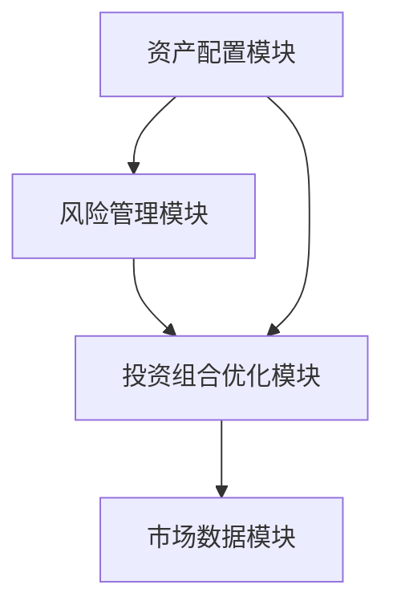
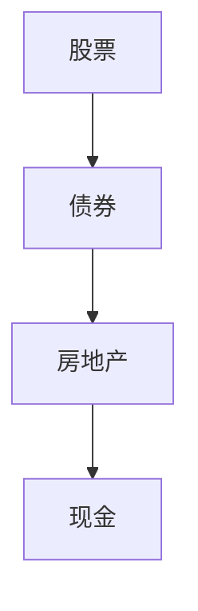

                 

# 约翰·伯格的退休投资建议：长期规划的重要性

> 关键词：退休投资，长期规划，约翰·伯格，资产配置，风险管理，投资策略，投资回报

> 摘要：本文将深入探讨约翰·伯格的退休投资理念，分析长期规划在退休投资中的重要性。通过系统的理论分析和实际案例，我们将揭示如何通过科学的资产配置、风险管理以及投资策略来实现退休生活的财务安全与稳定。本文将涵盖投资基础、长期策略、系统设计等多个方面，为读者提供一份全面的退休投资指南。

---

## 第1章: 退休投资的背景与重要性

### 1.1 退休投资的背景

#### 1.1.1 人口老龄化与退休问题的加剧
随着全球人口老龄化的加剧，退休问题变得越来越紧迫。根据世界银行的数据显示，65岁及以上人口占总人口的比例在发达国家已超过15%，而在发展中国家也在快速增长。这意味着传统的“养儿防老”模式已难以满足现代退休需求，个人必须通过投资来实现财务安全。

#### 1.1.2 传统退休模式的局限性
传统的退休模式依赖于政府养老金和社会福利，但随着老龄化问题的加剧，政府财政压力越来越大，养老金的可持续性受到质疑。此外，通货膨胀和经济波动也使得单纯依靠固定收益难以维持退休生活。

#### 1.1.3 长期规划在退休投资中的核心地位
退休投资的本质是通过长期的资产积累，在退休后获得稳定的收入来源。长期规划的重要性体现在以下几个方面：
1. **时间的杠杆效应**：通过长期投资，可以利用复利效应实现资产的快速增长。
2. **风险分散**：长期投资能够平滑短期市场波动带来的风险。
3. **目标的可实现性**：通过长期规划，可以明确每年需要实现的投资收益目标。

### 1.2 约翰·伯格的投资理念

#### 1.2.1 约翰·伯格的个人背景与投资成就
约翰·伯格是美国著名投资专家，被誉为“指数基金之父”。他创立了先锋集团（Vanguard），并推出了第一只低成本指数基金。伯格的投资理念以长期、分散、低成本为核心，强调通过纪律性的投资行为实现财富增长。

#### 1.2.2 伯格的投资哲学与长期规划思想
伯格认为，投资的核心在于分散风险和降低费用。他提倡通过长期持有指数基金来实现资产增值，并强调避免频繁的交易和市场预测。

#### 1.2.3 伯格对个人投资者的启示
伯格的投资理念对个人投资者有重要的启示：
1. **长期投资优于短期投机**：市场短期波动难以预测，但长期趋势可以通过复利实现收益。
2. **分散投资降低风险**：通过投资不同类型资产（股票、债券、现金等）分散风险。
3. **低成本投资策略**：高昂的管理费用会侵蚀长期收益。

### 1.3 退休投资的核心目标

#### 1.3.1 确保退休生活的基本需求
退休投资的首要目标是确保退休后的基本生活需求，包括住房、医疗、日常开支等。

#### 1.3.2 提供额外的退休生活品质保障
在满足基本需求的基础上，退休投资还应为提升退休生活质量提供资金支持，如旅行、兴趣爱好等。

#### 1.3.3 长期规划与资产保值增值的关系
通过长期规划，投资者可以平衡资产的安全性和收益性，避免在退休后因市场波动导致资产大幅缩水。

## 1.4 本章小结
本章从退休投资的背景、约翰·伯格的投资理念以及退休投资的核心目标三个方面，阐述了长期规划在退休投资中的重要性。下一章将深入分析投资基础与风险认知，为后续的策略制定奠定基础。

---

## 第2章: 投资基础与风险认知

### 2.1 投资的基本原理

#### 2.1.1 投资的定义与分类
投资是指将资金投入到某种资产中，期望在未来获得收益的行为。根据资产类型，投资可以分为股票、债券、房地产、现金等。

#### 2.1.2 资产配置的基本原则
资产配置是投资的核心策略，其基本原则包括：
1. **风险分散**：通过投资不同类型资产降低风险。
2. **收益与风险匹配**：高风险资产应匹配高收益目标。
3. **长期视角**：资产配置应根据市场变化和投资者目标进行动态调整。

#### 2.1.3 投资的三要素：收益、风险、时间
- **收益**：投资回报的高低取决于资产类型和市场表现。
- **风险**：投资的风险主要来自于市场波动和经济周期。
- **时间**：时间是投资最好的朋友，长期投资可以通过复利效应实现收益最大化。

### 2.2 风险管理的核心理念

#### 2.2.1 投资风险的分类与特征
投资风险主要包括市场风险、流动性风险、通胀风险等。市场风险是无法通过分散投资完全消除的风险，而流动性风险则会影响资产的变现能力。

#### 2.2.2 现代投资组合理论与风险分散
现代投资组合理论（MPT）由哈里·马科维茨提出，其核心思想是通过分散投资降低风险。MPT的数学模型如下：

$$
\text{最优组合} = \arg \min \sigma^2 \quad \text{在} \quad E[r] \text{固定}
$$

其中，$\sigma^2$表示组合的方差（风险），$E[r]$表示组合的期望收益。

#### 2.2.3 长期规划中的风险管理策略
在长期投资中，风险管理的核心是通过资产配置和分散投资降低整体风险。例如，通过投资股票、债券、房地产等多种资产类别，可以有效分散市场波动带来的影响。

### 2.3 理财目标与投资策略的关系

#### 2.3.1 理财目标的设定方法
理财目标的设定应基于个人的财务状况、退休需求和风险承受能力。常见的理财目标包括：
- 确保基本生活开支
- 提供额外的退休收入
- 应对突发的财务需求

#### 2.3.2 投资策略的选择与调整
投资策略的选择应基于理财目标和市场环境。例如，风险承受能力强的投资者可以选择较高比例的股票资产，而风险厌恶的投资者则可以选择债券或现金。

#### 2.3.3 长期规划中的目标分解与实现路径
长期规划需要将总体目标分解为逐年的小目标，并根据每年的市场表现进行动态调整。例如，假设退休后每年需要10万元的开支，投资者需要确保投资组合每年至少产生10万元的收益。

### 2.4 本章小结
本章从投资的基本原理、风险管理的核心理念以及理财目标与投资策略的关系三个方面，为读者提供了退休投资的理论基础。下一章将重点分析长期投资策略与资产配置。

---

## 第3章: 长期投资策略与资产配置

### 3.1 长期投资的核心策略

#### 3.1.1 长期投资的定义与优势
长期投资是指将资金投入到某一资产类别中长期持有，以实现复利效应。其主要优势包括：
- 时间的杠杆效应：长期持有可以最大化复利效应。
- 市场波动的平滑作用：长期投资可以避免短期市场波动的影响。

#### 3.1.2 长期投资与短期投资的对比
- **长期投资**：注重资产的长期增值，适合风险承受能力较强且目标明确的投资者。
- **短期投资**：注重市场的短期波动，适合需要快速资金周转的投资者。

#### 3.1.3 长期投资中的复利效应
复利效应是长期投资的核心优势。例如，假设年化收益率为7%，初始投资100元，30年后的资产规模为：

$$
100 \times (1 + 0.07)^{30} \approx 100 \times 5.025 \approx 502.5 \text{元}
$$

---

## 第4章: 风险管理与投资组合优化

### 4.1 风险管理的核心方法

#### 4.1.1 风险分散的基本原理
通过投资不同类型资产，可以降低整体投资组合的风险。例如，股票和债券在市场波动时通常表现出负相关性，因此可以通过同时持有股票和债券来分散风险。

#### 4.1.2 投资组合优化的数学模型
投资组合优化的数学模型如下：

$$
\min \sigma^2 \quad \text{在} \quad E[r] \text{固定}
$$

其中，$\sigma^2$表示组合的方差（风险），$E[r]$表示组合的期望收益。

#### 4.1.3 风险与收益的平衡点
在长期投资中，风险与收益是辩证统一的。投资者需要在两者之间找到平衡点，以实现长期稳定的收益。

---

## 第5章: 退休投资的系统设计与实施

### 5.1 系统设计的基本原则

#### 5.1.1 系统设计的目标与范围
退休投资系统的目的是实现资产的长期保值增值，其范围包括资产配置、风险管理、投资监控等。

#### 5.1.2 系统功能的模块划分
- 资产管理模块：实现资产的分类、配置和监控。
- 风险评估模块：评估投资组合的风险并提出优化建议。
- 投资组合优化模块：根据市场变化调整资产配置。

#### 5.1.3 系统架构的设计与实现
系统架构应采用模块化设计，确保各模块之间的独立性和可扩展性。以下是系统架构的mermaid图：

### 5.2 系统功能设计

#### 5.2.1 资产管理模块
资产管理模块负责实现资产的分类、配置和监控。以下是资产配置的mermaid图：

---

通过以上内容，我们可以看到，退休投资需要从长期规划的角度出发，结合资产配置、风险管理等多方面的知识。约翰·伯格的退休投资建议为我们提供了一个科学的框架，帮助我们在退休后实现财务安全与稳定。

