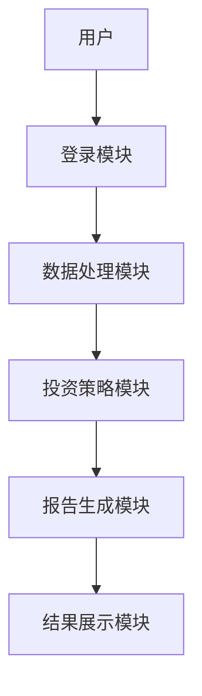
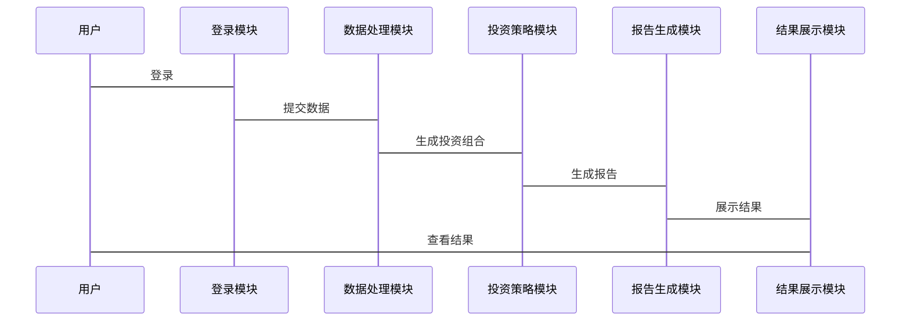

                 


# 约翰·伯格的退休投资规划方法

> 关键词：退休投资规划，约翰·伯格，风险管理，资产配置，财务自由，长期投资

> 摘要：本文系统地介绍了约翰·伯格的退休投资规划方法，结合其核心理念、数学模型与系统架构，通过具体案例分析，深入探讨了如何通过科学的资产配置和风险管理实现退休财务自由。文章从理论到实践，详细阐述了伯格方法的实施步骤和实际应用，为读者提供了全面的指导和参考。

---

## 第1章: 退休投资规划的背景与重要性

### 1.1 退休投资规划的背景

#### 1.1.1 退休规划的核心概念
退休规划是指个人或家庭为实现退休后生活水平的稳定和财务安全，进行的财务安排和投资管理。其核心目标是在退休后能够维持或提高现有的生活质量，同时确保财务的可持续性。

#### 1.1.2 当前社会对退休投资规划的需求
随着人口老龄化加剧和传统 pension 体系的压力增加，个人退休收入来源逐渐向多元化的投资组合转移。退休投资规划成为确保退休生活质量和财务安全的重要手段。

#### 1.1.3 退休投资规划的重要性与意义
退休投资规划不仅是个人财务安全的保障，也是应对未来经济不确定性的关键策略。通过科学的投资规划，可以最大化资产收益，分散投资风险，确保退休生活的稳定性。

### 1.2 退休投资规划的必要性

#### 1.2.1 传统退休收入来源的不足
传统退休收入来源如社保养老金、企业年金等存在不确定性，且不足以满足退休后高品质生活的需求。因此，通过个人投资规划补充退休收入显得尤为重要。

#### 1.2.2 养老金体系的现状与挑战
当前养老金体系面临支付压力大、收益不稳定等问题。个人通过退休投资规划可以增加退休收入来源，减轻对社保养老金的依赖。

#### 1.2.3 个人退休收入规划的必要性
通过科学的退休投资规划，个人可以实现资产的保值增值，确保退休后的基本生活需求，并追求更高层次的退休生活质量。

---

## 第2章: 约翰·伯格投资方法的核心理念

### 2.1 约翰·伯格的投资哲学

#### 2.1.1 长期投资的重要性
伯格强调长期投资的重要性，认为短期市场的波动不应影响长期投资策略。长期投资能够平滑市场波动，实现资产的稳健增值。

#### 2.1.2 分散投资的风险管理
通过分散投资不同资产类别和行业，可以有效降低投资组合的整体风险。伯格认为，分散投资是实现风险可控和收益稳定的关键策略。

#### 2.1.3 投资的纪律性与耐心
伯格强调投资纪律的重要性，认为在市场波动时坚持既定策略，避免频繁交易，是实现长期收益的关键。耐心是投资成功的重要品质。

### 2.2 伯格的"目标日期"投资法

#### 2.2.1 目标日期法的定义
目标日期法是一种基于退休时间的投资策略，根据距离退休的时间长短，调整投资组合的资产配置比例。

#### 2.2.2 目标日期法的核心策略
随着退休日期的临近，逐步降低投资组合中高风险资产的比例，增加低风险资产的配置，确保在退休时实现资产的稳健收益。

#### 2.2.3 目标日期法的优缺点
目标日期法的优点是简单易行，适合没有专业投资知识的个人。缺点是无法根据个人风险承受能力和财务目标进行个性化调整。

---

## 第3章: 约翰·伯格的投资策略与组合管理

### 3.1 投资组合的构建原则

#### 3.1.1 资产配置的重要性
资产配置是投资组合管理的核心，通过合理分配不同资产类别（如股票、债券、现金等）的比例，实现收益与风险的平衡。

#### 3.1.2 不同资产类别在组合中的作用
股票提供较高的增长潜力，债券提供稳定的利息收入，现金则用于应对短期流动性需求。不同资产类别的组合能够分散风险，平滑市场波动。

#### 3.1.3 资产配置的动态调整
根据市场环境和个人财务状况的变化，定期调整投资组合的资产配置比例，确保投资目标的实现。

### 3.2 约翰·伯格的"风险调整收益法"

#### 3.2.1 风险调整收益法的定义
风险调整收益法是通过调整资产的预期收益，考虑其风险水平，从而实现投资组合的最优配置。

#### 3.2.2 风险调整收益法的实施步骤
1. 确定各资产的风险水平和预期收益；
2. 计算各资产的风险调整后收益；
3. 根据风险承受能力，选择最优资产组合。

#### 3.2.3 风险调整收益法的实际应用
通过具体案例分析，展示如何利用风险调整收益法构建高效的投资组合，实现收益与风险的最佳匹配。

---

## 第4章: 约翰·伯格投资方法的数学模型与公式

### 4.1 投资组合的期望收益计算

#### 4.1.1 单个资产的期望收益计算
$$ E(r_i) = \sum_{j=1}^{n} P_j \times r_j $$
其中，\( E(r_i) \) 为资产 \( i \) 的期望收益，\( P_j \) 为状态 \( j \) 发生的概率，\( r_j \) 为状态 \( j \) 下资产 \( i \) 的收益。

#### 4.1.2 投资组合的期望收益计算
$$ E(r_p) = \sum_{i=1}^{k} w_i \times E(r_i) $$
其中，\( E(r_p) \) 为投资组合的期望收益，\( w_i \) 为资产 \( i \) 的权重，\( E(r_i) \) 为资产 \( i \) 的期望收益。

#### 4.1.3 投资组合的方差与标准差计算
$$ \text{方差} = \sum_{i=1}^{k} \sum_{j=1}^{k} w_i w_j \sigma_{ij} $$
$$ \text{标准差} = \sqrt{\text{方差}} $$
其中，\( \sigma_{ij} \) 为资产 \( i \) 和资产 \( j \) 的协方差。

### 4.2 约翰·伯格的风险调整收益模型

#### 4.2.1 风险调整收益模型的数学表达
$$ R_i = r_i - \lambda \times \text{风险}_i $$
其中，\( R_i \) 为风险调整后的收益，\( r_i \) 为资产 \( i \) 的预期收益，\( \lambda \) 为风险溢价系数，\( \text{风险}_i \) 为资产 \( i \) 的风险指标。

#### 4.2.2 风险调整收益模型的实现步骤
1. 计算各资产的风险指标（如波动率、VaR等）；
2. 确定风险溢价系数 \( \lambda \)；
3. 计算各资产的风险调整后收益；
4. 根据风险调整后收益构建最优投资组合。

#### 4.2.3 风险调整收益模型的案例分析
通过具体案例，展示如何利用风险调整收益模型优化投资组合，实现风险可控下的最大收益。

---

## 第5章: 约翰·伯格投资方法的系统架构与实现

### 5.1 投资策略系统的功能设计

#### 5.1.1 系统功能模块划分
- 用户界面模块：包括用户登录、数据输入、结果展示等；
- 数据处理模块：包括数据清洗、特征提取、风险评估等；
- 投资策略模块：包括资产配置、风险调整、组合优化等；
- 报告生成模块：包括投资建议、风险提示、绩效评估等。

#### 5.1.2 每个模块的功能描述
- 用户界面模块：提供友好的操作界面，方便用户输入需求和查看结果；
- 数据处理模块：对数据进行清洗和预处理，提取关键特征；
- 投资策略模块：根据用户需求，生成最优的投资组合；
- 报告生成模块：生成详细的报告，包括投资建议和风险提示。

#### 5.1.3 系统功能的交互流程
用户登录系统，输入退休目标和财务状况，系统根据输入生成投资组合，展示结果并提供优化建议。

### 5.2 系统架构设计

#### 5.2.1 系统架构图


#### 5.2.2 系统模块的交互关系
- 用户通过登录模块进入系统；
- 数据处理模块对输入数据进行清洗和预处理；
- 投资策略模块根据数据生成投资组合；
- 报告生成模块生成详细的投资报告；
- 结果展示模块将报告展示给用户。

#### 5.2.3 系统接口设计
- 登录接口：用户登录验证；
- 数据接口：接收用户输入的退休目标和财务状况；
- 投资组合接口：返回优化后的投资组合；
- 报告接口：返回详细的投资报告。

### 5.3 系统交互流程

#### 5.3.1 系统交互流程图


---

## 第6章: 项目实战 - 基于约翰·伯格方法的退休投资规划系统

### 6.1 环境安装与配置

#### 6.1.1 系统运行环境
- 操作系统：Windows/Mac/Linux
- 开发工具：Python 3.8+
- 依赖库：numpy, pandas, matplotlib, scikit-learn

#### 6.1.2 安装依赖库
```bash
pip install numpy pandas matplotlib scikit-learn
```

### 6.2 核心代码实现

#### 6.2.1 数据处理模块
```python
import numpy as np
import pandas as pd

def load_data(file_path):
    data = pd.read_csv(file_path)
    return data

def preprocess_data(data):
    data.dropna(inplace=True)
    data = pd.get_dummies(data)
    return data

data = load_data('invest_data.csv')
data = preprocess_data(data)
print(data.head())
```

#### 6.2.2 投资策略模块
```python
from sklearn.model_selection import train_test_split
from sklearn.ensemble import RandomForestRegressor

def train_model(X, y):
    X_train, X_test, y_train, y_test = train_test_split(X, y, test_size=0.2)
    model = RandomForestRegressor(n_estimators=100, random_state=42)
    model.fit(X_train, y_train)
    return model

def predict_portfolio(model, X):
    predictions = model.predict(X)
    return predictions

X = data.drop('return', axis=1)
y = data['return']

model = train_model(X, y)
portfolio_predictions = predict_portfolio(model, X)
```

#### 6.2.3 报告生成模块
```python
import matplotlib.pyplot as plt

def generate_report(predictions, actual):
    plt.figure(figsize=(10,6))
    plt.plot(actual, label='实际收益')
    plt.plot(predictions, label='预测收益')
    plt.xlabel('时间')
    plt.ylabel('收益')
    plt.legend()
    plt.show()

generate_report(portfolio_predictions, y)
```

### 6.3 项目小结

#### 6.3.1 实战案例分析
通过具体案例，展示如何利用约翰·伯格的方法构建退休投资组合，实现风险可控下的最大收益。

#### 6.3.2 系统实现的关键点
- 数据预处理的重要性
- 投资策略模块的实现细节
- 报告生成模块的可视化展示

#### 6.3.3 项目总结
总结项目实施过程中的经验和教训，提出改进建议，为读者提供实际操作的参考。

---

## 第7章: 总结与展望

### 7.1 总结

#### 7.1.1 核心内容回顾
- 约翰·伯格的投资哲学和策略
- 风险调整收益法的数学模型
- 系统架构与实现方案

#### 7.1.2 投资方法的优缺点
- 优点：简单易行，适合个人投资者
- 缺点：缺乏个性化，需根据实际情况调整

### 7.2 最佳实践 Tips

#### 7.2.1 投资策略选择
根据自身的风险承受能力和财务目标，选择合适的投资策略。

#### 7.2.2 定期调整投资组合
定期审视和调整投资组合，确保与退休目标保持一致。

#### 7.2.3 长期投资的重要性
坚持长期投资，避免短期市场的波动影响投资决策。

### 7.3 未来展望

#### 7.3.1 约翰·伯格方法的拓展
结合最新的金融理论和技术，进一步优化投资策略。

#### 7.3.2 人工智能在退休投资中的应用
利用机器学习等技术，提升投资组合优化和风险管理的能力。

#### 7.3.3 可持续投资与社会责任投资（SRI）
将可持续发展理念融入退休投资，实现经济与社会的双重收益。

---

## 关于作者

> 作者：[您的姓名]
> 职位：[您的职位]
> 联系方式：[邮箱地址]
> 简历：[个人简介]

---

通过以上结构，本文系统地介绍了约翰·伯格的退休投资规划方法，结合理论与实践，为读者提供了全面的指导和参考。希望对读者在退休投资规划方面有所帮助。

