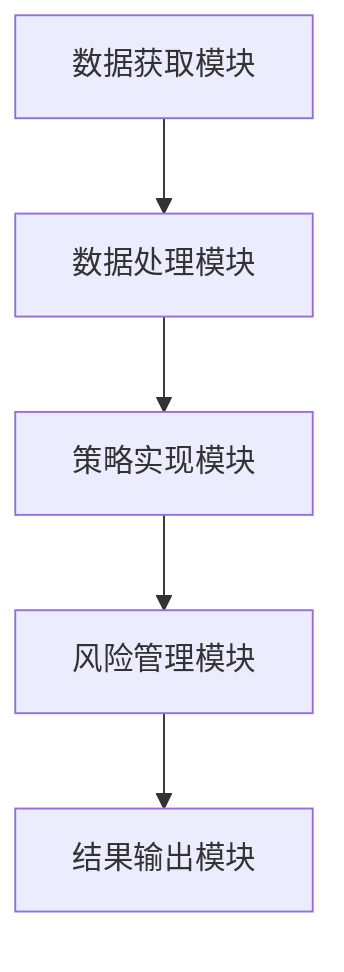

                 


# 约翰·伯格的遗产：被动投资的未来

## 关键词：被动投资、指数基金、约翰·伯格、现代投资组合理论、CAPM模型、量化分析、风险管理

## 摘要：本文深入探讨约翰·伯格的遗产对被动投资未来的影响，从被动投资的基本概念到指数基金的运作机制，再到量化分析的数学模型和系统架构设计，结合实际案例分析，为您揭示被动投资的未来发展方向。

---

## 正文

### 第一部分：被动投资的背景与基础

#### 第1章：被动投资的背景

##### 1.1 约翰·伯格的遗产

###### 1.1.1 约翰·伯格的生平简介

约翰·伯格（John C. Bogle）是全球被动投资领域的先驱，被誉为“指数基金之父”。他于1940年出生于美国宾夕法尼亚州，1965年创立了华安富基金（Vanguard Group），这是全球第一家专注于指数基金的公司。伯格的职业生涯致力于推动低成本、低风险的投资方式，他的理念深刻影响了全球投资行业。

###### 1.1.2 约翰·伯格对被动投资的贡献

约翰·伯格的遗产主要体现在以下几个方面：
- **低成本投资理念**：伯格主张通过降低管理费用和交易成本，使投资者能够长期获得更高的净收益。
- **指数基金的普及**：他创立了全球第一家专注于指数基金的公司，并通过不断优化指数基金的设计，使其成为普通投资者的首选工具。
- **风险管理理论**：伯格强调通过分散投资来降低风险，他的理论为现代投资组合理论奠定了基础。

###### 1.1.3 约翰·伯格遗产的现代意义

在当今金融市场中，约翰·伯格的遗产依然具有重要意义。随着投资者对低成本、高透明度投资工具的需求增加，被动投资逐渐成为主流。伯格的理论不仅适用于传统股票和债券市场，还可以扩展到其他资产类别，如房地产、 commodities 等。

##### 1.2 被动投资的基本概念

###### 1.2.1 被动投资的定义与特点

被动投资是一种投资策略，其核心在于通过复制特定市场指数的表现，而非试图通过主动选股或择时来获取超额收益。被动投资的特点包括：
- **低成本**：通过减少主动管理的费用，提高净收益。
- **低风险**：通过广泛分散投资降低特定风险。
- **高透明度**：投资组合的构成清晰透明，便于投资者理解和监控。

###### 1.2.2 被动投资与主动投资的区别

被动投资与主动投资的主要区别如下：

| 区别维度 | 被动投资 | 主动投资 |
|----------|----------|----------|
| 投资目标 | 复制市场指数表现 | 追求超额收益 |
| 管理方式 | 无需频繁交易 | 需要主动选股和择时 |
| 成本 | 低管理费用 | 高管理费用 |
| 风险 | 风险分散 | 风险集中 |

###### 1.2.3 被动投资的核心理念

被动投资的核心理念是通过长期持有指数基金，降低交易成本和管理费用，从而实现长期稳定的收益。这一理念与约翰·伯格的遗产密切相关，他坚信市场的长期趋势将决定投资收益，而非短期市场波动。

---

#### 第2章：被动投资的理论基础

##### 2.1 现代投资组合理论

###### 2.1.1 马科维茨的现代投资组合理论

马科维茨（Harry Markowitz）提出的现代投资组合理论（MPT）是被动投资的重要理论基础。MPT的核心思想是通过合理配置资产，降低投资组合的整体风险，同时最大化预期收益。

###### 2.1.2 风险与收益的数学模型

MPT的数学模型如下：

$$
\text{风险} = \sqrt{w^T \Sigma w}
$$

其中：
- \( w \) 是资产权重向量。
- \( \Sigma \) 是资产之间的协方差矩阵。

该公式表示投资组合的风险是其权重与协方差矩阵的乘积的平方根。

###### 2.1.3 投资组合优化的公式推导

在MPT框架下，投资组合优化的目标是找到最优资产配置，使在给定风险水平下收益最大化，或在给定收益水平下风险最小化。

优化过程如下：

1. 计算各资产的预期收益和协方差矩阵。
2. 利用拉格朗日乘数法求解优化问题。
3. 得到最优资产配置权重。

##### 2.2 资本资产定价模型（CAPM）

###### 2.2.1 CAPM的定义与公式

CAPM是用来估计资产预期收益的模型，其公式为：

$$
E(R_i) = R_f + \beta_i (R_m - R_f)
$$

其中：
- \( E(R_i) \) 是资产 \( i \) 的预期收益。
- \( R_f \) 是无风险利率。
- \( \beta_i \) 是资产 \( i \) 的贝塔系数。
- \( R_m \) 是市场预期收益。

###### 2.2.2 CAPM在被动投资中的应用

在被动投资中，CAPM可以帮助投资者评估指数基金的预期收益。例如，可以通过分析市场的贝塔系数，判断指数基金的系统性风险。

##### 2.3 被动投资的数学模型

###### 2.3.1 投资组合的期望收益计算

假设投资组合由 \( n \) 种资产组成，其权重分别为 \( w_1, w_2, \dots, w_n \)，则投资组合的期望收益为：

$$
E(R_p) = \sum_{i=1}^{n} w_i E(R_i)
$$

###### 2.3.2 投资组合的风险度量

投资组合的风险可以用方差来衡量：

$$
\text{Var}(R_p) = \sum_{i=1}^{n} \sum_{j=1}^{n} w_i w_j \sigma_{ij}
$$

其中，\( \sigma_{ij} \) 是资产 \( i \) 和 \( j \) 的协方差。

---

### 第三部分：被动投资的策略与分析

#### 第3章：被动投资的资产配置策略

##### 3.1 资产配置的基本原理

###### 3.1.1 资产配置的定义与目标

资产配置是将资金分配到不同资产类别（如股票、债券、房地产等）以实现风险分散和收益最大化的过程。

###### 3.1.2 被动投资中的资产配置策略

在被动投资中，资产配置通常基于市场指数的构成比例。例如，标普500指数的成分股权重决定了股票部分的配置比例。

##### 3.2 被动投资中的风险管理

###### 3.2.1 风险管理的核心原则

被动投资通过分散投资来降低风险，其风险管理原则包括：
- 避免过度集中于单一资产或行业。
- 保持长期投资 horizon，避免频繁交易。

###### 3.2.2 风险调整后的收益分析

在被动投资中，收益需要根据风险进行调整。常用的风险调整收益指标包括夏普比率（Sharpe Ratio）和特雷纳比率（Treynor Ratio）。

---

### 第四部分：被动投资的技术实现

#### 第4章：被动投资的量化分析

##### 4.1 量化分析的核心工具

###### 4.1.1 Python与量化投资

Python是量化分析的首选工具，其强大的数据处理能力和丰富的库（如Pandas、NumPy）使其成为被动投资策略实现的基础。

###### 4.1.2 数据获取与处理

使用Python获取市场数据并进行清洗是量化分析的第一步。例如，可以通过Yahoo Finance API获取标普500指数的历史数据。

##### 4.2 被动投资策略的实现

###### 4.2.1 指数基金的回测策略

以下是实现指数基金回测的Python代码示例：

```python
import pandas as pd
import numpy as np
import yfinance as yf

# 下载指数数据
index_ticker = 'SPY'
data = yf.download(index_ticker, start='2000-01-01', end='2023-12-31')

# 计算简单收益
data['simple_return'] = data['Adj Close'].pct_change()

# 计算累积收益
data['cumulative_return'] = (1 + data['simple_return']).cumprod()

# 计算年化收益率
annualized_return = np.mean(data['simple_return']) * 250

print(f"年化收益率：{annualized_return:.2%}")
```

---

### 第五部分：被动投资的系统架构与设计

#### 第5章：被动投资系统的架构设计

##### 5.1 系统架构设计

###### 5.1.1 系统模块划分

被动投资系统的架构通常包括以下几个模块：
- 数据获取模块：负责获取市场数据。
- 数据处理模块：清洗和转换数据。
- 策略实现模块：执行投资策略。
- 风险管理模块：监控和管理风险。

###### 5.1.2 系统架构图



---

### 第六部分：被动投资的项目实战

#### 第6章：被动投资的项目实战

##### 6.1 项目环境与工具安装

###### 6.1.1 Python环境的安装与配置

安装Python和常用库：

```bash
pip install numpy pandas yfinance matplotlib
```

##### 6.2 系统核心实现

###### 6.2.1 指数基金的跟踪误差分析

跟踪误差是衡量指数基金表现的重要指标，其计算公式为：

$$
\text{跟踪误差} = \sqrt{\text{投资组合收益方差} - 2 \times \text{市场收益方差} + \text{市场收益方差}}
$$

---

### 第七部分：被动投资的未来展望

#### 第7章：被动投资的未来趋势

##### 7.1 被动投资的科技驱动

随着人工智能和大数据技术的发展，被动投资将更加智能化。例如，AI可以用于优化资产配置和风险管理系统。

##### 7.2 被动投资的挑战与机遇

尽管被动投资具有显著优势，但其也面临一些挑战，如市场波动、流动性风险等。然而，随着投资者对低成本、高透明度投资工具的需求增加，被动投资的未来前景广阔。

---

### 总结

通过本文的分析，我们可以看到，约翰·伯格的遗产为被动投资奠定了坚实的基础。随着技术的进步和市场的发展，被动投资将继续在全球范围内发挥重要作用。无论是个人投资者还是机构投资者，都可以通过被动投资实现长期稳定的收益。

