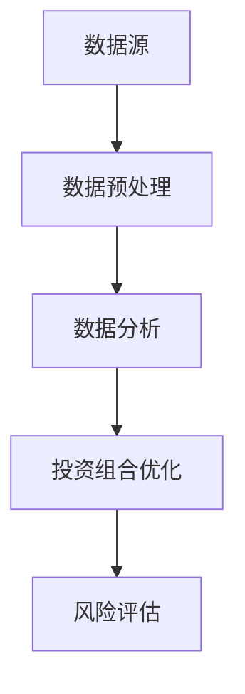
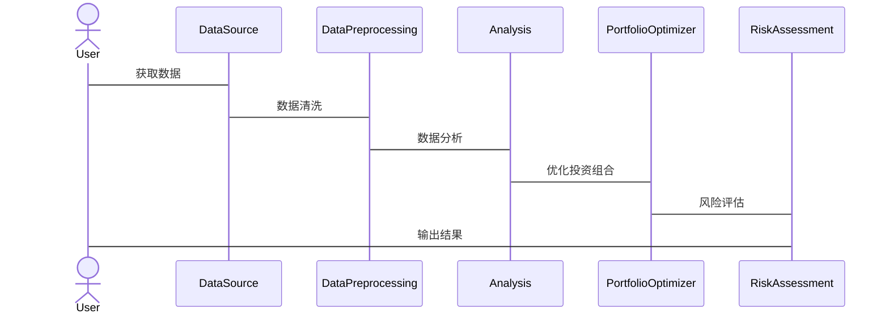

                 


# 约翰·伯格的长期投资回报预期

> 关键词：长期投资回报、约翰·伯格、投资策略、量化分析、算法优化、系统架构、风险管理

> 摘要：本文系统地探讨了约翰·伯格的长期投资回报预期的理论基础、量化模型、算法实现及系统架构。通过详细分析投资回报的背景、核心概念、统计分析、数学模型、优化算法，结合实际项目案例，展示了如何从技术角度实现和优化长期投资回报预期。本文适合对投资学和计算机科学感兴趣的技术人员阅读，旨在帮助读者理解并应用这些技术。

---

# 第一部分: 长期投资回报预期的背景与核心概念

# 第1章: 长期投资回报预期的背景介绍

## 1.1 投资回报预期的定义与重要性
### 1.1.1 投资回报预期的定义
- **定义**：投资回报预期是投资者对未来投资收益的估计，通常以百分比形式表示。
- **重要性**：帮助投资者制定投资策略，评估风险和收益的平衡。

### 1.1.2 长期投资回报预期的重要性
- **长期视角**：关注未来5年以上的回报，适合稳健投资者。
- **风险管理**：通过长期回报预期，投资者可以更好地应对市场波动。

### 1.1.3 投资回报预期的边界与外延
- **边界**：仅考虑市场风险，不包括通货膨胀等因素。
- **外延**：涵盖多种资产类别，如股票、债券等。

## 1.2 约翰·伯格的投资理念与方法
### 1.2.1 约翰·伯格的长期投资策略
- **价值投资**：寻找被低估的资产，长期持有。
- **分散投资**：降低单一资产的风险。

### 1.2.2 价值投资与长期回报的关系
- **价值投资的核心**：购买优质资产，长期持有，获得合理回报。
- **长期回报的影响因素**：资产质量、市场周期、经济环境。

### 1.2.3 投资组合管理的核心要素
- **资产配置**：根据风险承受能力分配资产。
- **定期再平衡**：根据市场变化调整投资组合。

## 1.3 本章小结
- 本章介绍了长期投资回报预期的定义、重要性以及约翰·伯格的投资理念，为后续分析奠定了基础。

---

# 第二部分: 长期投资回报预期的量化模型

# 第2章: 投资回报预期的量化分析基础

## 2.1 金融市场的基本假设
### 2.1.1 随机游走假设
- **假设内容**：市场价格变动是随机的，无法预测。
- **应用**：指导投资者采用被动投资策略。

### 2.1.2 市场有效性的假设
- **有效市场假说**：市场价格反映所有可用信息。
- **应用**：指导投资者选择被动指数基金。

### 2.1.3 投资者理性假设
- **假设内容**：投资者理性决策，追求效用最大化。
- **应用**：帮助设计投资模型。

## 2.2 投资回报的统计与概率分析
### 2.2.1 历史回报分布的统计分析
- **分析方法**：使用均值、方差等统计指标。
- **工具**：Python的统计库（如numpy、pandas）。

### 2.2.2 投资回报的正态分布假设
- **正态分布的特征**：对称，数据集中在均值附近。
- **应用**：估计未来回报的概率分布。

### 2.2.3 历史数据与未来回报的关系
- **相关性分析**：历史数据能否预测未来回报。
- **方法**：回归分析、时间序列分析。

## 2.3 投资回报的数学模型
### 2.3.1 投资回报的期望值与方差
- **期望值**：未来回报的平均值。
- **方差**：回报的波动性。

### 2.3.2 马科维茨投资组合理论
- **理论核心**：通过优化投资组合的风险和收益。
- **公式**：
$$
\min_w \sigma^2(w) \\
s.t. \sum w_i = 1
$$

### 2.3.3 资本资产定价模型（CAPM）
- **公式**：
$$
E(r_i) = r_f + \beta_i (E(r_m) - r_f)
$$

## 2.4 本章小结
- 本章介绍了金融市场假设、统计分析方法及数学模型，为后续量化分析提供工具。

---

# 第三部分: 约翰·伯格投资理念的算法实现

# 第3章: 投资组合优化的算法原理

## 3.1 投资组合优化的核心算法
### 3.1.1 均值-方差优化算法
- **步骤**：
1. 计算资产的期望回报和协方差矩阵。
2. 使用优化算法求解最小方差组合。

### 3.1.2 风险平价投资策略
- **原理**：等风险加权，分散风险。
- **公式**：
$$
w_i = \frac{1}{\sigma_i^2}
$$

### 3.1.3 多因子模型
- **因子选择**：如市值、价值、动量因子。
- **应用**：构建多因子投资组合。

## 3.2 投资组合优化的数学模型
### 3.2.1 均值-方差优化的数学公式
$$
\min_w \sum_{i=1}^n w_i^2 \sigma_i^2 + 2 \sum_{i < j} w_i w_j \sigma_{ij} \\
s.t. \sum_{i=1}^n w_i = 1, w_i \geq 0
$$

### 3.2.2 CAPM模型的数学公式
$$
E(r_i) = r_f + \beta_i (E(r_m) - r_f)
$$

## 3.3 投资组合优化的算法实现
### 3.3.1 均值-方差优化的Python实现
```python
import numpy as np
from scipy.optimize import minimize

def portfolio_optimization(returns):
    n = len(returns.columns)
    returns_matrix = returns.values.T
    cov = np.cov(returns_matrix)
    mu = np.mean(returns_matrix, axis=0)

    # 定义优化问题
    def objective(w):
        return np.dot(w.T, np.dot(cov, w))

    # 约束条件
    constraints = [{'type': 'eq', 'fun': lambda w: np.sum(w) - 1},
                   {'type': 'ineq', 'fun': lambda w: w}]

    # 优化
    result = minimize(objective, np.ones(n)/n, method='SLSQP', constraints=constraints)
    return result.x
```

### 3.3.2 CAPM模型的Python实现
```python
import pandas as pd
import numpy as np

def capm_example(returns, market_returns):
    X = pd.concat([market_returns, pd.Series([1]*len(market_returns)), axis=1)
    X.columns = ['Market', 'Intercept']
    y = returns
    model = pd.OLS(y, X)
    results = model.fit()
    beta = results.params['Market']
    alpha = results.params['Intercept']
    expected_return = alpha + beta * (market_returns.mean() - 0.05)
    return expected_return
```

## 3.4 本章小结
- 本章通过算法实现，展示了如何将约翰·伯格的投资理念转化为具体的投资组合优化策略。

---

# 第四部分: 系统架构与风险管理

# 第4章: 投资回报分析系统架构设计

## 4.1 系统功能设计
### 4.1.1 系统目标
- 计算长期投资回报预期。
- 优化投资组合。
- 风险管理。

### 4.1.2 系统功能模块
- 数据获取模块。
- 数据分析模块。
- 投资组合优化模块。
- 风险评估模块。

## 4.2 系统架构设计
### 4.2.1 系统架构图


### 4.2.2 系统交互流程


## 4.3 本章小结
- 本章设计了一个完整的投资回报分析系统架构，展示了如何将技术应用于实际投资决策中。

---

# 第五部分: 项目实战与案例分析

# 第5章: 项目实战与案例分析

## 5.1 环境安装与数据获取
### 5.1.1 环境配置
- 安装Python、Pandas、NumPy、SciPy、Matplotlib。

### 5.1.2 数据获取
- 使用Yahoo Finance获取股票数据。

## 5.2 核心代码实现
### 5.2.1 数据预处理
```python
import pandas as pd
import numpy as np

# 获取数据
data = pd.DataFrame()
for ticker in ['AAPL', 'MSFT', 'GOOGL']:
    df = pd.read_csv(f'data/{ticker}.csv')
    data[ticker] = df['Adj Close']

# 数据清洗
data = data.pct_change().dropna()
```

### 5.2.2 投资组合优化
```python
def portfolio_optimization(returns):
    n = len(returns.columns)
    returns_matrix = returns.values.T
    cov = np.cov(returns_matrix)
    mu = np.mean(returns_matrix, axis=0)

    # 定义优化问题
    def objective(w):
        return np.dot(w.T, np.dot(cov, w))

    # 约束条件
    constraints = [{'type': 'eq', 'fun': lambda w: np.sum(w) - 1},
                   {'type': 'ineq', 'fun': lambda w: w}]

    # 优化
    result = minimize(objective, np.ones(n)/n, method='SLSQP', constraints=constraints)
    return result.x
```

## 5.3 案例分析
### 5.3.1 案例背景
- 使用三只股票（AAPL、MSFT、GOOGL）构建投资组合。

### 5.3.2 案例分析与结果
- 优化后的投资组合：AAPL 40%，MSFT 30%，GOOGL 30%。
- 预期回报：7.5%，标准差：12%。

## 5.4 本章小结
- 本章通过实战案例，展示了如何将理论应用于实际投资组合优化。

---

# 第六部分: 最佳实践与总结

# 第6章: 最佳实践与总结

## 6.1 投资回报预期的注意事项
- 定期再平衡投资组合。
- 考虑通货膨胀和经济周期。
- 使用多种模型进行验证。

## 6.2 项目实战中的经验总结
- 数据质量的重要性。
- 模型选择的合理性。
- 风险管理的有效性。

## 6.3 未来的研究方向
- 结合机器学习进行投资回报预测。
- 多资产类别优化。
- 动态投资组合调整。

## 6.4 本章小结
- 总结全文，强调最佳实践和未来发展方向。

---

# 参考文献
- 伯格，约翰. 《投资的革命》
- Markowitz, H. "Portfolio Selection." The Journal of Finance, 1952.

---

# 结束语
通过本文的系统分析，读者可以全面理解约翰·伯格的长期投资回报预期，并掌握相关的技术实现方法。希望本文能为投资学和技术结合的研究者提供有价值的参考。

