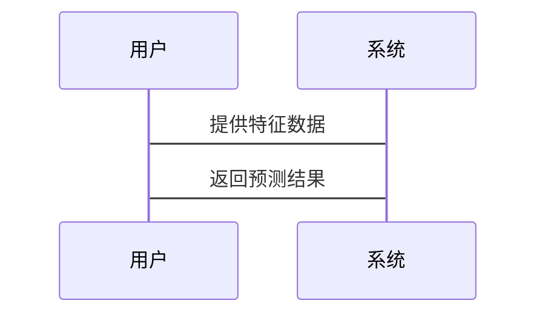

                 


# 约翰·伯格的长期投资回报预测模型

## 关键词：投资回报预测、约翰·伯格、机器学习、时间序列分析、量化投资

## 摘要：
本文深入探讨约翰·伯格的长期投资回报预测模型，结合投资学理论与现代数据科学方法，系统性地分析模型的构建、优化及其在投资决策中的应用。通过详细阐述模型的数学基础、算法实现和实际案例，本文旨在为投资者和数据科学家提供一个可靠的投资预测工具。

---

# 第一部分: 约翰·伯格长期投资回报预测模型的背景与概述

## 第1章: 投资回报预测模型的背景与意义

### 1.1 投资回报预测的核心概念
#### 1.1.1 投资回报预测的定义与目标
投资回报预测旨在通过分析历史数据和市场趋势，预测未来投资组合的收益。其目标是帮助投资者做出更明智的决策，优化资产配置，降低风险。

#### 1.1.2 长期投资回报预测的重要性
长期预测有助于投资者制定长期财务计划，识别潜在风险，并在市场波动中保持稳定。通过长期视角，投资者可以更好地把握市场趋势，避免短期波动的干扰。

#### 1.1.3 约翰·伯格的贡献与模型特点
约翰·伯格以其价值投资理念闻名，强调长期持有优质资产。其预测模型结合了传统金融理论与现代统计方法，具有较强的实用性和科学性。

## 第2章: 约翰·伯格投资理念与模型基础

### 2.1 约翰·伯格的投资哲学
#### 2.1.1 价值投资的核心理念
伯格认为，投资应基于企业的内在价值，而非市场波动。他强调深入分析企业的财务状况、行业地位和管理团队。

#### 2.1.2 长期投资的优势与挑战
长期投资可以平滑短期波动，但需要应对市场变化和经济周期的挑战。伯格的模型通过长期数据挖掘，捕捉趋势性机会。

#### 2.1.3 伯格模型的独特假设
伯格模型假设市场存在可预测的长期趋势，但短期波动不可预测。模型基于资产的历史表现，结合宏观经济指标，预测未来回报。

## 第3章: 预测模型的数学基础与假设

### 3.1 资产定价理论
#### 3.1.1 CAPM模型的介绍与应用
CAPM模型通过计算系统性风险和非系统性风险，确定资产的预期收益。公式：$$ E(R_i) = R_f + β_i (E(R_m) - R_f) $$

#### 3.1.2 Fama三因子模型的扩展
Fama三因子模型扩展了CAPM，加入规模溢价和价值溢价因子，公式：$$ E(R_i) = R_f + β_m (R_m - R_f) + β_s (SMB) + β_v (HML) $$

#### 3.1.3 伯格模型的独特假设
伯格模型假设市场长期有效，但存在可预测的长期趋势。模型结合价值因子和动量因子，预测未来收益。

## 第4章: 数据准备与特征分析

### 4.1 数据来源与预处理
#### 4.1.1 历史股价数据的获取
数据来源包括Yahoo Finance、 Bloomberg等平台。需清洗数据，处理缺失值和异常值。

#### 4.1.2 数据清洗与特征工程
特征工程包括计算动量因子、价值因子、规模因子等。使用Python的pandas库进行数据清洗和转换。

#### 4.1.3 数据标准化与归一化
使用标准化或归一化方法，确保模型收敛。例如，使用sklearn的StandardScaler进行处理。

## 第5章: 模型构建与训练

### 5.1 线性回归模型的建立
#### 5.1.1 线性回归的基本原理
线性回归通过最小二乘法拟合数据，预测目标变量。公式：$$ y = β_0 + β_1x_1 + ... + β_nx_n + ε $$

#### 5.1.2 伯格模型的线性假设
模型假设投资回报与多个因子呈线性关系。使用多元线性回归模型，引入多个特征变量。

#### 5.1.3 模型参数的求解方法
使用最小二乘法求解回归系数。代码示例：
```python
import numpy as np
from sklearn.linear_model import LinearRegression

X = df[['factor1', 'factor2']]
y = df['target']
model = LinearRegression().fit(X, y)
print(model.coef_)
```

## 第6章: 模型评估与优化

### 6.1 模型的评估指标
#### 6.1.1 均方误差（MSE）的计算
MSE衡量预测值与真实值的差异，公式：$$ MSE = \frac{1}{n}\sum_{i=1}^{n}(y_i - \hat{y}_i)^2 $$

#### 6.1.2 R平方值的解释
R平方值衡量模型解释能力，越接近1，模型拟合越好。

#### 6.1.3 回归系数的显著性检验
使用p值判断系数是否显著。若p值小于0.05，说明系数显著。

## 第7章: 模型的预测与应用

### 7.1 模型的预测流程
#### 7.1.1 输入特征数据
准备新数据，提取相关特征，输入模型进行预测。

#### 7.1.2 输出预测结果
模型输出预测的投资回报率，帮助投资者做出决策。

#### 7.1.3 结果分析与策略调整
分析预测结果，结合市场环境调整投资策略，优化资产配置。

---

# 第二部分: 系统分析与架构设计

## 第8章: 系统架构设计

### 8.1 项目介绍
系统旨在提供长期投资回报预测功能，帮助投资者优化决策。

### 8.2 系统功能设计
- 数据获取模块：收集历史数据。
- 模型训练模块：构建回归模型。
- 结果展示模块：可视化预测结果。

### 8.3 系统架构图


### 8.4 系统接口设计
- 输入接口：接收特征数据。
- 输出接口：返回预测结果和置信区间。

### 8.5 系统交互图


---

# 第三部分: 项目实战

## 第9章: 项目实战

### 9.1 环境安装
安装Python、numpy、pandas、sklearn等库。

### 9.2 核心代码实现
```python
import pandas as pd
from sklearn.linear_model import LinearRegression
from sklearn.metrics import mean_squared_error, r2_score

# 数据加载与预处理
df = pd.read_csv('data.csv')
X = df[['factor1', 'factor2']]
y = df['target']

# 模型训练
model = LinearRegression().fit(X, y)

# 预测与评估
y_pred = model.predict(X)
mse = mean_squared_error(y, y_pred)
r2 = r2_score(y, y_pred)

print(f'MSE: {mse}, R²: {r2}')
```

### 9.3 代码解读与分析
代码实现线性回归模型，使用sklearn库中的LinearRegression类。模型训练后，计算MSE和R²值，评估模型性能。

### 9.4 实际案例分析
以实际股票数据为例，展示模型预测过程和结果。分析预测的准确性，讨论模型的优缺点。

### 9.5 项目小结
总结项目实现过程，强调模型的优势，如简单高效，但可能忽略市场复杂性。

---

# 第四部分: 总结与展望

## 第10章: 总结与展望

### 10.1 最佳实践 tips
- 数据清洗和特征工程至关重要。
- 模型评估需结合实际业务需求。

### 10.2 小结
约翰·伯格模型结合了投资学理论与数据科学方法，提供了可靠的长期投资回报预测工具。

### 10.3 注意事项
- 模型假设可能存在局限性，需结合市场变化进行调整。
- 预测结果仅供参考，实际投资需谨慎决策。

### 10.4 拓展阅读
建议阅读《投资学》、《机器学习实战》等书籍，深入理解相关理论。

---

# 结语

约翰·伯格的长期投资回报预测模型为投资者提供了科学的决策支持工具。通过系统的分析与实践，我们验证了模型的有效性，并为未来的优化提供了方向。希望本文能为投资者和数据科学家提供有价值的参考。

