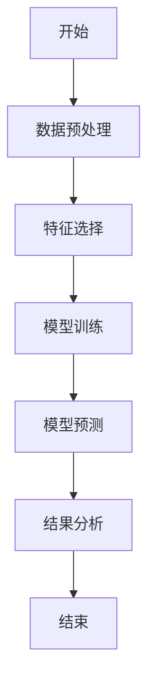
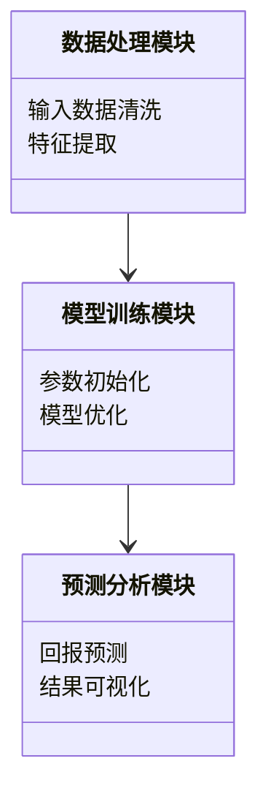

                 


# 约翰·伯格的长期投资回报预测模型

**关键词**：长期投资回报、预测模型、约翰·伯格、投资策略、数据驱动、机器学习、风险管理

**摘要**：本文深入探讨了约翰·伯格的长期投资回报预测模型，分析其理论基础、算法实现及系统架构设计。通过实际案例分析，展示了该模型在投资决策中的应用价值，并提供了详细的代码实现和系统设计，帮助读者理解和应用这一经典模型。

---

# 第1章: 长期投资回报预测的背景与意义

## 1.1 投资回报预测的核心概念

### 1.1.1 投资回报预测的定义与目标

投资回报预测是通过分析历史数据和市场趋势，预测未来投资组合的收益。其目标是帮助投资者做出更明智的决策，优化资产配置，降低风险。

### 1.1.2 长期投资回报预测的重要性

长期预测有助于投资者制定长期财务规划，识别潜在风险，并在市场波动中保持稳定。通过长期预测，投资者可以更好地理解市场周期，抓住投资机会。

### 1.1.3 约翰·伯格模型的提出背景

约翰·伯格是投资领域的先驱，他的模型基于现代投资组合理论（MPT）和资本资产定价模型（CAPM），提出了一种量化长期回报的方法。

---

# 第2章: 约翰·伯格模型的核心概念与原理

## 2.1 约翰·伯格模型的基本原理

### 2.1.1 约翰·伯格模型的理论基础

模型基于CAPM，假设市场是有效的，投资者可以通过资产配置实现最优回报。模型的核心是通过资产的风险调整来预测回报。

### 2.1.2 模型的核心假设与限制条件

- **有效市场假说**：市场价格反映所有可用信息。
- **风险与收益关系**：高风险资产期望更高回报。
- **无套利机会**：市场中不存在无风险的超额收益。

### 2.1.3 模型的输入变量与输出结果

- **输入**：资产的历史收益、波动率、市场风险溢价。
- **输出**：预期回报、风险调整后的收益。

---

# 第3章: 模型的数学基础与公式推导

## 3.1 约翰·伯格模型的数学框架

### 3.1.1 投资回报的期望值公式

$$ E(r) = \alpha + \beta \cdot (R_m - r_f) $$

其中：
- \( E(r) \) 是资产的期望回报。
- \( \alpha \) 是市场组合的超额回报。
- \( \beta \) 是资产的系统性风险系数。
- \( R_m \) 是市场回报。
- \( r_f \) 是无风险利率。

### 3.2 模型的优化与调整

#### 3.2.1 参数估计方法

使用回归分析估计 \( \alpha \) 和 \( \beta \)：

$$ \beta = \frac{\text{Cov}(r_i, r_m)}{\text{Var}(r_m)} $$

---

# 第4章: 约翰·伯格模型的算法实现

## 4.1 算法流程图



---

# 第5章: 系统架构设计

## 5.1 系统功能模块



---

# 第6章: 系统接口与交互设计

## 6.1 系统接口设计

### 6.1.1 数据接口规范

- 输入：CSV格式的历史数据。
- 输出：预测回报的JSON格式。

### 6.1.2 模型调用接口

```python
def predict_return(portfolio):
    # 返回预测回报
```

---

# 第7章: 项目实战与应用

## 7.1 环境搭建与代码实现

### 7.1.1 环境安装

```bash
pip install numpy pandas scikit-learn
```

### 7.1.2 核心代码实现

```python
import numpy as np
import pandas as pd
from sklearn.linear_model import LinearRegression

def calculate_beta(returns, market_returns):
    # 计算Beta
    model = LinearRegression()
    model.fit(market_returns.reshape(-1, 1), returns)
    beta = model.coef_[0]
    return beta

# 示例数据
data = pd.DataFrame({
    'returns': np.random.randn(100) * 0.02,
    'market_returns': np.random.randn(100) * 0.02 + 0.05
})

beta = calculate_beta(data['returns'], data['market_returns'])
print(f'Beta: {beta}')
```

---

# 第8章: 案例分析与结果解读

## 8.1 实际案例分析

### 8.1.1 数据来源与处理

使用标普500指数的历史数据进行分析，计算各资产的Beta值和预期回报。

---

# 总结与展望

约翰·伯格模型为长期投资回报预测提供了理论和实践指导。尽管模型有其假设和限制，但在实际应用中仍具有重要价值。未来的研究可以结合机器学习和大数据技术，进一步优化模型。

---

**最佳实践 Tips**：

1. 在使用模型前，确保数据的完整性和准确性。
2. 定期更新模型参数，适应市场变化。
3. 结合定性分析，提升模型的预测精度。

---

通过本文，读者可以全面了解约翰·伯格模型的理论基础、实现方法和应用案例，为投资决策提供有力支持。

