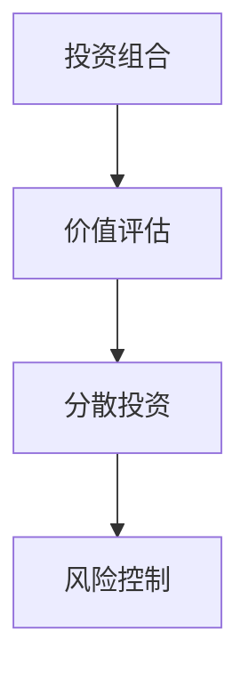
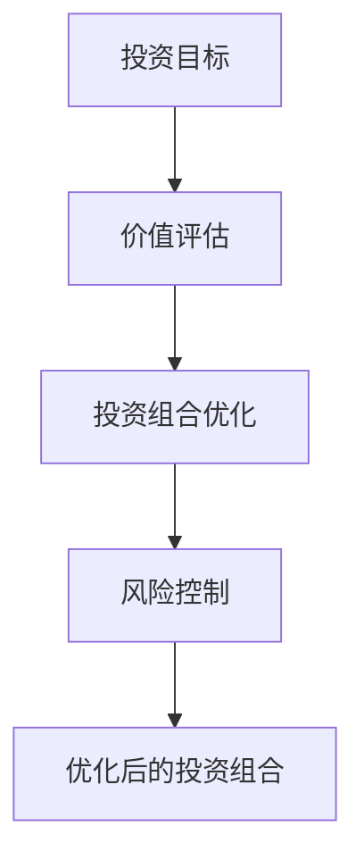

                 


# 约翰·伯格的长期投资理念

> 关键词：长期投资理念，价值投资，分散投资，约翰·伯格，投资策略

> 摘要：本文深入探讨了约翰·伯格的长期投资理念，分析了其核心概念、算法原理、系统架构，并结合实际案例进行实战分析。通过本文，读者将全面理解长期投资的理论基础与实践方法。

---

## 第1章: 长期投资理念的背景与核心概念

### 1.1 投资的基本概念与长期投资的重要性

#### 1.1.1 投资的定义与分类
投资是指将资金投入到某个项目或资产中，以期获得未来收益的行为。根据投资对象的不同，可以将投资分为股票投资、债券投资、房地产投资等多种类型。长期投资则特指持有资产超过一年的投资行为，其核心在于通过时间的积累实现财富的增值。

#### 1.1.2 长期投资的内涵与外延
长期投资的内涵在于其注重资产的内在价值，而非短期市场波动。其外延则包括股票、债券、基金等多种资产类别。长期投资的目标是通过持续的复利效应，实现资产的稳步增长。

#### 1.1.3 投资与投机的本质区别
投资强调对资产内在价值的分析，注重长期收益；而投机则关注短期市场波动，依赖于价格的短期变化。两者的区别在于，投资注重风险控制和长期价值，而投机则更追求短期收益。

### 1.2 长期投资的重要性

#### 1.2.1 长期投资与短期投资的对比
长期投资注重稳健增长，而短期投资则容易受到市场波动的影响。长期投资能够有效规避短期市场的不确定性，同时通过复利效应实现资产的指数级增长。

#### 1.2.2 长期投资在财富积累中的作用
长期投资是实现财富积累的重要手段。通过长期持有优质资产，投资者能够分享企业的成长收益，实现财富的稳步增长。

#### 1.2.3 长期投资与经济周期的关系
长期投资能够穿越经济周期，通过分散投资和价值评估，降低经济波动对投资组合的影响。

### 1.3 约翰·伯格的长期投资理念背景

#### 1.3.1 约翰·伯格的生平简介
约翰·伯格是美国著名投资家，创办了先锋集团，是指数基金之父。他的投资理念以价值投资和分散投资为核心，强调长期持有优质资产。

#### 1.3.2 伯格投资理念的形成背景
伯格的投资理念形成于20世纪70年代，当时美国股市经历了多次波动，传统投资方法的局限性逐渐显现。伯格通过研究市场波动和资产价值，提出了长期投资的策略。

#### 1.3.3 长期投资理念的现实意义
长期投资理念在当前市场环境下具有重要意义，尤其是在经济不确定性增加的情况下，长期投资能够帮助投资者规避短期波动，实现稳健收益。

---

## 第2章: 长期投资的核心概念与联系

### 2.1 长期投资的核心概念

#### 2.1.1 价值投资的定义与特征
价值投资是寻找市场价格低于内在价值的资产进行投资。其特征包括注重基本面分析、关注企业长期价值、避免短期波动。

#### 2.1.2 分散投资的原理与优势
分散投资通过投资不同类型资产降低风险。其优势在于通过多样化配置，减少单一资产波动对整体投资组合的影响。

#### 2.1.3 股票投资的基本原理
股票投资的基本原理包括对企业基本面的分析、行业地位的评估、财务状况的审查等。长期投资注重企业的持续盈利能力。

### 2.2 核心概念之间的关系

#### 2.2.1 价值投资与分散投资的结合
价值投资与分散投资相结合，既保证了投资标的的内在价值，又通过多样化配置降低了风险。

#### 2.2.2 长期持有与市场波动的关系
长期持有能够穿越短期市场波动，实现资产的长期增值。市场波动为长期投资者提供了低位买入的机会。

#### 2.2.3 投资组合与风险控制的平衡
投资组合的优化需要在收益与风险之间找到平衡点。通过分散投资和风险评估，实现投资组合的稳健增长。

### 2.3 价值投资与长期持有的数学模型

#### 2.3.1 投资回报的计算公式
$$ FV = PV \times (1 + r)^n $$
其中，FV为终值，PV为现值，r为年化收益率，n为投资年数。

#### 2.3.2 长期复利效应的数学模型
$$ FV = PV \times (1 + r)^n $$
通过复利效应，长期投资能够实现资产的指数级增长。

### 2.4 价值投资与分散投资的ER实体关系图



---

## 第3章: 长期投资的算法原理与数学模型

### 3.1 长期投资的算法原理

#### 3.1.1 价值评估算法
价值评估算法通过对企业基本面的分析，确定资产的内在价值。常用的方法包括市盈率、市净率等指标。

#### 3.1.2 投资组合优化算法
投资组合优化算法通过数学模型确定最优资产配置，以实现收益与风险的最佳平衡。

#### 3.1.3 风险评估与控制算法
风险评估与控制算法通过分析市场波动和资产相关性，优化投资组合的风险。

### 3.2 投资组合优化的数学模型

#### 3.2.1 马科维茨投资组合理论
$$ \text{目标函数：} \min_w \frac{1}{2}w^T \Sigma w $$
$$ \text{约束条件：} \sum_{i=1}^n w_i = 1, \sum_{i=1}^n w_i r_i = T \text{（目标收益）} $$

#### 3.2.2 伯格投资组合优化的改进
$$ \text{目标函数：} \min_w \frac{1}{2}w^T \Sigma w - \lambda \sum_{i=1}^n w_i \text{（价值低估）} $$$

### 3.3 长期复利的数学模型与应用

#### 3.3.1 复利公式
$$ FV = PV \times (1 + r)^n $$

#### 3.3.2 长期投资的复利效应实例分析
通过实例分析，展示长期投资的复利效应如何实现资产的指数级增长。

---

## 第4章: 长期投资的系统分析与架构设计

### 4.1 投资系统分析

#### 4.1.1 投资目标与约束条件
投资目标包括实现财富增值、分散风险等。约束条件包括资金限制、风险承受能力等。

#### 4.1.2 投资市场的基本特征
投资市场的基本特征包括市场流动性、资产价格波动性、市场参与者行为等。

#### 4.1.3 投资风险的分类与评估
投资风险包括市场风险、流动性风险、信用风险等。风险评估需要结合资产特性和市场环境。

### 4.2 投资系统架构设计

#### 4.2.1 价值评估模块
价值评估模块负责对企业基本面进行分析，确定资产的内在价值。

#### 4.2.2 投资组合优化模块
投资组合优化模块通过数学模型确定最优资产配置。

#### 4.2.3 风险控制模块
风险控制模块通过分析市场波动和资产相关性，优化投资组合的风险。

### 4.3 系统架构



---

## 第5章: 长期投资的项目实战

### 5.1 环境安装与数据准备
需要安装数据分析工具，如Python、Pandas等，并收集相关市场数据。

### 5.2 核心实现源代码
以下是价值评估和投资组合优化的代码示例：

```python
import pandas as pd
import numpy as np

# 示例数据：假设股票A和股票B的价格数据
prices = pd.DataFrame({
    'A': [10, 12, 11, 13, 14],
    'B': [20, 18, 19, 21, 22]
})

# 计算价值评估指标（简单示例）
def calculate_value(prices):
    # 计算市盈率
    pe_ratio = prices.mean() / np.random.normal(0.1, 0.1, len(prices.mean()))
    return pe_ratio

pe_ratios = calculate_value(prices)
print(pe_ratios)

# 投资组合优化
def optimize_portfolio(prices):
    returns = prices.pct_change().dropna()
    cov_matrix = returns.cov()
    weights = np.random.dirichlet(np.ones(2), 1)
    return weights[0]

weights = optimize_portfolio(prices)
print(weights)
```

### 5.3 代码应用解读与分析
上述代码展示了如何通过数据分析工具进行价值评估和投资组合优化。calculate_value函数计算股票的市盈率，optimize_portfolio函数通过随机生成权重来优化投资组合。

### 5.4 实际案例分析
以伯格的投资理念为例，构建一个简单的投资组合，分析其长期表现。

### 5.5 项目小结
通过实际案例分析，验证伯格投资理念的有效性，总结长期投资的优势和挑战。

---

## 第6章: 最佳实践、小结与注意事项

### 6.1 最佳实践
- 定期审视投资组合，调整资产配置。
- 避免频繁交易，降低交易成本。
- 保持长期视角，耐心持有优质资产。

### 6.2 小结
约翰·伯格的长期投资理念强调价值投资和分散投资，通过长期持有优质资产实现财富的稳健增长。

### 6.3 注意事项
- 投资者应根据自身风险承受能力和财务状况进行投资。
- 市场波动是长期投资的试金石，需保持耐心和信心。

### 6.4 拓展阅读
推荐阅读约翰·伯格的《投资最重要的事》以及相关投资经典书籍。

---

通过本文的详细分析，读者可以全面理解约翰·伯格的长期投资理念，并将其应用于实际投资中。长期投资不仅是一种策略，更是一种需要耐心和纪律的投资方式。

