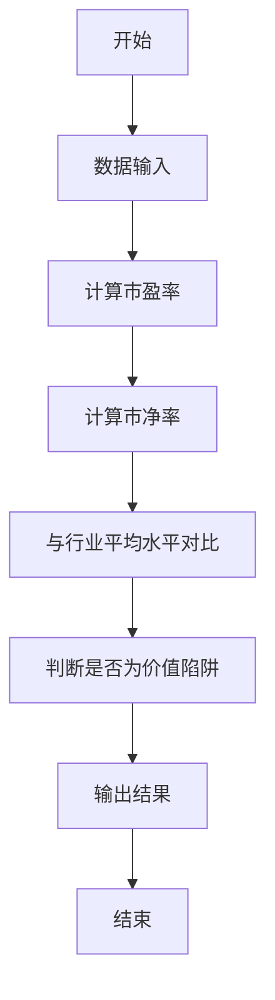

                 


# 目录大纲：《约翰·内夫的价值陷阱识别技巧》

## 关键词：价值陷阱、价值投资、约翰·内夫、投资分析、风险管理、股票评估、财务指标

## 摘要：本文详细介绍了约翰·内夫的价值陷阱识别技巧，从价值陷阱的定义、特征到识别方法，再到算法实现和系统架构设计，最后通过实际案例进行分析。文章内容丰富，逻辑清晰，适合投资者和研究人员参考。

---

## 目录

### 第一部分：价值陷阱识别的背景与基础

#### 第1章：价值投资与价值陷阱概述

##### 1.1 价值投资的起源与发展

- 1.1.1 价值投资的定义与核心理念
- 1.1.2 约翰·内夫的价值投资方法
- 1.1.3 价值陷阱的定义与特征

##### 1.2 价值陷阱的形成机制

- 1.2.1 企业基本面分析的重要性
- 1.2.2 市场情绪与价值陷阱的关系
- 1.2.3 价值陷阱的常见类型

##### 1.3 价值陷阱识别的必要性

- 1.3.1 投资者常见的误区
- 1.3.2 价值陷阱对投资决策的影响
- 1.3.3 识别价值陷阱的现实意义

##### 1.4 本章小结

---

#### 第2章：价值陷阱的核心概念与联系

##### 2.1 价值陷阱的核心要素

- 2.1.1 企业基本面分析的关键指标
- 2.1.2 市场估值与企业价值的关系
- 2.1.3 价值陷阱的识别维度

##### 2.2 价值陷阱的属性特征对比

- 2.2.1 表格对比：价值陷阱与优质企业的区别
- 2.2.2 图表分析：价值陷阱的特征分布
- 2.2.3 ER实体关系图：价值陷阱的核心要素

##### 2.3 价值陷阱的识别流程

- 2.3.1 识别步骤：从初步筛选到深度分析
- 2.3.2 关键指标：市盈率、市净率、ROE等的对比
- 2.3.3 数据可视化：价值陷阱的特征展示

##### 2.4 本章小结

---

#### 第3章：价值陷阱识别的算法原理

##### 3.1 算法原理概述

- 3.1.1 价值陷阱识别的数学模型
- 3.1.2 算法流程图：价值陷阱识别的逻辑框架
- 3.1.3 算法步骤的详细解释

##### 3.2 价值陷阱识别的数学模型

- 3.2.1 关键指标公式：
  - 市盈率（P/E）= 股价 / 每股收益
  - 市净率（P/B）= 股价 / 每股净资产
  - 净资产收益率（ROE）= 净利润 / 平均股东权益
- 3.2.2 模型构建：如何结合多个指标判断价值陷阱

##### 3.3 算法实现

- 3.3.1 Python代码实现：
  ```python
  import pandas as pd

  def calculate_pe_ticker(ticker_data):
      pe = ticker_data['股价'] / ticker_data['每股收益']
      return pe

  def calculate_pb_ticker(ticker_data):
      pb = ticker_data['股价'] / ticker_data['每股净资产']
      return pb

  def identify_value_trap(ticker_data):
      pe = calculate_pe_ticker(ticker_data)
      pb = calculate_pb_ticker(ticker_data)
      # 判断是否为价值陷阱的逻辑
      if pe > industry_pe_median and pb > industry_pb_median:
          return True
      else:
          return False
  ```

##### 3.4 算法流程图



##### 3.5 本章小结

---

### 第二部分：系统架构与项目实战

#### 第4章：系统架构设计

##### 4.1 问题场景介绍

- 4.1.1 价值陷阱识别系统的应用场景
- 4.1.2 系统的目标与功能需求

##### 4.2 系统功能设计

- 4.2.1 领域模型：
  ```mermaid
  classDiagram
      class 价值陷阱识别系统 {
          输入数据
          计算市盈率
          计算市净率
          判断是否为价值陷阱
          输出结果
      }
  ```

##### 4.3 系统架构设计

- 4.3.1 系统架构图：
  ```mermaid
  context diagram
      System: 价值陷阱识别系统
          Data Layer: 数据层
          Logic Layer: 逻辑层
          UI Layer: 用户界面层
  ```

##### 4.4 系统接口设计

- 4.4.1 API接口：
  - 输入接口：接收股票代码和数据
  - 输出接口：返回是否为价值陷阱的判断结果

##### 4.5 系统交互设计

- 4.5.1 序列图：
  ```mermaid
  sequenceDiagram
      用户 --> 系统: 输入股票代码
      系统 --> 数据层: 获取数据
      数据层 --> 逻辑层: 计算市盈率和市净率
      逻辑层 --> 用户: 返回判断结果
  ```

##### 4.6 本章小结

---

#### 第5章：项目实战

##### 5.1 环境安装

- 5.1.1 安装Python和必要的库：
  - Python 3.x
  - pandas、numpy、matplotlib

##### 5.2 系统核心实现

- 5.2.1 Python代码实现：
  ```python
  import pandas as pd
  import matplotlib.pyplot as plt

  # 示例数据
  data = {
      '股票代码': ['AAPL', 'GOOGL', 'MSFT'],
      '股价': [150, 250, 300],
      '每股收益': [10, 20, 15],
      '每股净资产': [50, 60, 40]
  }
  df = pd.DataFrame(data)

  # 计算市盈率和市净率
  df['市盈率'] = df['股价'] / df['每股收益']
  df['市净率'] = df['股价'] / df['每股净资产']

  # 可视化
  df.plot(kind='bar', y=['市盈率', '市净率'])
  plt.show()
  ```

##### 5.3 代码应用解读与分析

- 5.3.1 数据获取与处理
- 5.3.2 指标计算与可视化
- 5.3.3 结果分析

##### 5.4 实际案例分析

- 5.4.1 案例背景
- 5.4.2 数据分析与计算
- 5.4.3 判断结果与分析

##### 5.5 本章小结

---

### 第三部分：总结与最佳实践

#### 第6章：总结与最佳实践

##### 6.1 本章总结

- 6.1.1 价值陷阱识别的核心方法
- 6.1.2 算法与系统的综合应用

##### 6.2 最佳实践

- 6.2.1 投资中的注意事项
- 6.2.2 风险管理策略
- 6.2.3 持续学习与优化

##### 6.3 小结

---

## 参考文献

- 约翰·内夫的经典著作
- 相关学术论文
- 其他价值投资相关的书籍和资源

---

## 附录

- 附录A：常用财务指标解释
- 附录B：Python代码库的安装与使用
- 附录C：价值陷阱识别系统的扩展功能

