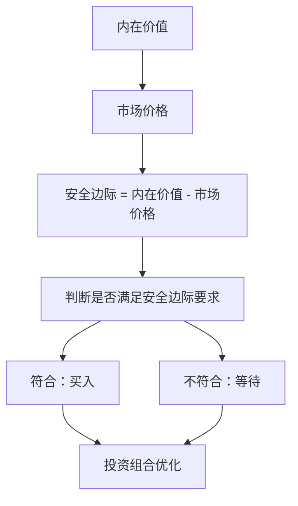
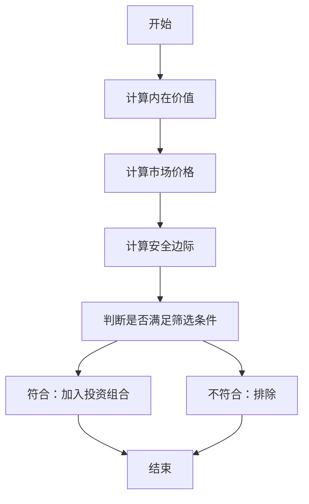
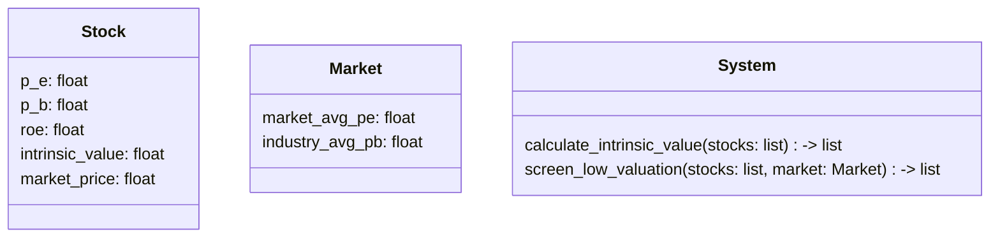
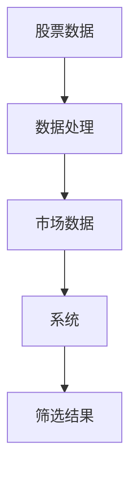
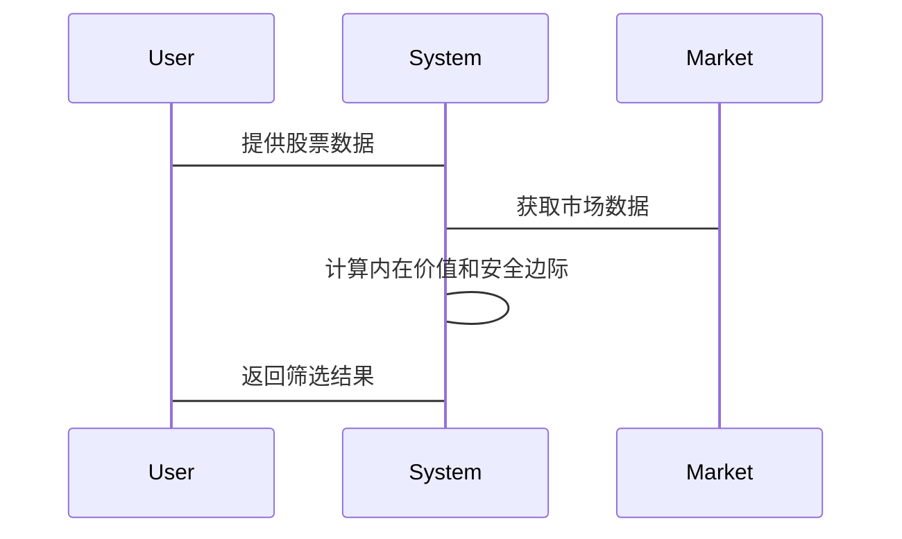

                 


# 约翰·内夫的低估值投资：简单而有效的价值策略

**关键词**：约翰·内夫，低估值投资，安全边际，逆向投资，价值投资，股票筛选，投资组合管理

**摘要**：约翰·内夫的低估值投资策略是一种简单而有效的价值投资方法，其核心在于通过安全边际和逆向投资来寻找被市场低估的优质股票。本文将从低估值投资的背景、核心概念、数学模型、算法实现、系统架构以及项目实战等多个方面，详细分析和探讨这一投资策略的原理、方法和实际应用。通过本文，读者将能够理解并掌握如何利用低估值投资策略来构建和优化自己的投资组合。

---

## 第1章 低估值投资的背景与核心概念

### 1.1 低估值投资的定义与背景

#### 1.1.1 低估值投资的定义
低估值投资是一种基于价值投资理念的投资策略，其核心在于寻找市场价格低于其内在价值的股票。这种策略强调安全边际，即在买入股票时，市场价格应显著低于其内在价值，从而降低投资风险并提高潜在回报。

#### 1.1.2 低估值投资的历史发展
低估值投资的理念可以追溯到本杰明·格雷厄姆的价值投资理论，而约翰·内夫则是这一理念的现代诠释者。他通过改进和优化低估值投资策略，使其更加适用于现代金融市场。

#### 1.1.3 约翰·内夫的投资理念
约翰·内夫的投资理念强调长期投资、逆向思维和安全边际。他认为，市场的短期波动为投资者提供了以低于内在价值的价格买入优质股票的机会。通过坚持这一策略，投资者可以在长期内获得超额回报。

### 1.2 低估值投资的核心要素

#### 1.2.1 安全边际的定义与计算
安全边际是低估值投资的核心要素之一，它是指股票的市场价格与内在价值之间的差距。计算安全边际的公式为：
$$ \text{安全边际} = \text{内在价值} - \text{市场价格} $$

安全边际越大，投资的风险越小，潜在回报越高。

#### 1.2.2 低估值股票的筛选标准
低估值股票的筛选标准通常包括以下几个方面：
1. 市盈率（P/E）低于市场平均值
2. 市净率（P/B）低于行业平均值
3. 净资产收益率（ROE）高于行业平均水平

#### 1.2.3 市场情绪与估值的关系
市场情绪对股票估值有重要影响。在市场恐慌时，股票价格可能大幅低于其内在价值，从而提供良好的投资机会。而在市场狂热时，股票价格可能被高估，此时应谨慎投资。

### 1.3 低估值投资与其他投资策略的对比

#### 1.3.1 价值投资与成长投资的区别
价值投资注重寻找市场价格低于内在价值的股票，而成长投资则注重寻找具有高增长潜力的股票。低估值投资更接近于价值投资，但更强调安全边际和逆向思维。

#### 1.3.2 投资组合的构建与优化
低估值投资策略通常采用分散投资的方法，将资金分配到多个具有不同行业和市场地位的股票中，以降低风险并提高稳定性。

#### 1.3.3 低估值策略的优缺点分析
低估值策略的优点包括风险低、回报潜力大和操作简单。缺点则包括可能需要较长时间才能看到回报，以及在市场高估时可能无法找到合适的标的。

### 1.4 约翰·内夫的投资哲学

#### 1.4.1 安全边际的重要性
安全边际是内夫投资哲学的核心，他强调在买入股票时必须留有充分的安全空间，以应对市场的不确定性和波动性。

#### 1.4.2 逆向投资的逻辑
逆向投资是指在市场恐慌时买入、在市场狂热时卖出的投资策略。内夫认为，市场的非理性波动为低估值投资提供了机会。

#### 1.4.3 长期投资与耐心的价值
内夫强调长期投资的重要性，认为短期波动不应影响长期投资决策。耐心是低估值投资成功的关键，投资者需要在市场低谷时坚持持有优质股票。

### 1.5 本章小结
本章介绍了低估值投资的背景、核心概念和内夫的投资哲学。通过理解安全边际、逆向投资和长期视角，投资者可以更好地把握低估值投资的精髓。

---

## 第2章 低估值投资的核心算法与数学模型

### 2.1 安全边际的计算方法

#### 2.1.1 安全边际的公式推导
$$ \text{安全边际} = \text{内在价值} - \text{市场价格} $$

#### 2.1.2 安全边际的计算步骤
1. 确定企业的内在价值，通常通过DCF模型或可比公司分析进行估算。
2. 计算股票的市场价格，即当前市价。
3. 计算安全边际，比较市场价格与内在价值的差距。

#### 2.1.3 安全边际的可视化


### 2.2 低估值股票的筛选算法

#### 2.2.1 筛选标准的数学表达
$$ \text{筛选条件} = \left\{ \begin{array}{ll} P/E < 市场平均值 \\ P/B < 行业平均值 \\ \text{ROE} > 10\% \end{array} \right. $$

#### 2.2.2 算法流程图


#### 2.2.3 算法实现
以下是一个简单的低估值股票筛选算法的伪代码：
```python
def screen_low_valuation(stocks):
    for stock in stocks:
        pe = stock.p_e
        pb = stock.p_b
        roe = stock.roe
        if pe < market_avg_pe and pb < industry_avg_pb and roe > 10%:
            return stock
    return None
```

### 2.3 数学模型与公式

#### 2.3.1 内在价值计算公式
$$ \text{内在价值} = \frac{\text{现金流}}{\text{贴现率}} $$

#### 2.3.2 市盈率计算公式
$$ \text{市盈率} = \frac{\text{股价}}{\text{每股收益}} $$

#### 2.3.3 市净率计算公式
$$ \text{市净率} = \frac{\text{股价}}{\text{每股净资产}} $$

---

## 第3章 系统分析与架构设计方案

### 3.1 项目介绍
本项目旨在设计一个基于低估值投资策略的股票筛选系统，帮助投资者自动识别具有安全边际的股票。

### 3.2 系统功能设计

#### 3.2.1 领域模型


#### 3.2.2 系统架构


### 3.3 系统接口设计

#### 3.3.1 输入接口
- 股票数据接口：接收股票的基本信息和财务数据。
- 市场数据接口：接收市场平均市盈率和行业平均市净率。

#### 3.3.2 输出接口
- 筛选结果接口：输出符合条件的低估值股票列表。

### 3.4 系统交互流程

#### 3.4.1 序列图


---

## 第4章 项目实战

### 4.1 环境安装
- Python 3.x
- pandas、numpy、scipy等库

### 4.2 核心实现

#### 4.2.1 计算内在价值
```python
import numpy as np

def calculate_intrinsic_value(cash_flow, discount_rate):
    return cash_flow / (1 + discount_rate)
```

#### 4.2.2 安全边际计算
```python
def calculate_margin_of_safety(intrinsic_value, market_price):
    return intrinsic_value - market_price
```

#### 4.2.3 低估值筛选
```python
def screen_low_valuation(stocks, market_avg_pe, industry_avg_pb):
    selected_stocks = []
    for stock in stocks:
        if stock.p_e < market_avg_pe and stock.p_b < industry_avg_pb:
            selected_stocks.append(stock)
    return selected_stocks
```

### 4.3 案例分析

#### 4.3.1 经典案例
假设市场平均市盈率为15，行业平均市净率为1.5，筛选出一只股票的市盈率为12，市净率为1.2，ROE为12%。这只股票满足低估值筛选条件，应加入投资组合。

#### 4.3.2 当前市场应用
根据当前市场数据，筛选出一批市盈率低于市场平均水平、市净率低于行业平均水平的股票，构建投资组合。

### 4.4 项目小结
通过本项目的实战，我们可以看到低估值投资策略的具体实现过程。投资者可以根据实际市场情况，调整筛选条件和参数，以优化投资组合的收益和风险。

---

## 第5章 最佳实践与注意事项

### 5.1 投资策略的调整
- 根据市场环境调整筛选条件。
- 定期评估投资组合的表现。

### 5.2 风险管理
- 设置止损点，避免重大损失。
- 分散投资，降低行业和个股风险。

### 5.3 持续学习与优化
- 关注市场动态和公司基本面变化。
- 定期复盘，优化投资策略。

### 5.4 小结
低估值投资策略是一种简单而有效的价值投资方法，但需要投资者具备耐心和纪律性。通过本文的分析和实战，读者可以更好地理解和应用这一策略，实现长期稳定的投资收益。

---

## 总结
本文全面介绍了约翰·内夫的低估值投资策略，从理论基础到实际应用，为投资者提供了详细的操作指南。通过理解安全边际、逆向投资和长期视角，投资者可以在复杂多变的市场中找到优质的投资机会。希望本文能为低估值投资的实践者提供有益的参考和启示。

