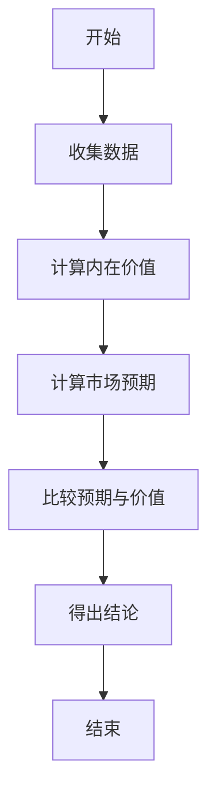
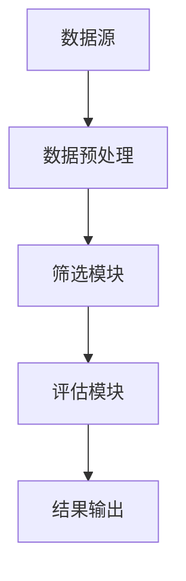

                 


# 约翰·内夫的低预期投资策略

> 关键词：低预期投资策略，约翰·内夫，逆向投资，股票分析，数学模型，系统架构

> 摘要：本文系统地介绍约翰·内夫的低预期投资策略，从背景、概念到数学模型、系统架构，最后结合实际案例进行详细分析，帮助读者全面理解这一投资策略。

---

# 第一部分: 约翰·内夫的低预期投资策略概述

## 第1章: 低预期投资策略的背景与核心理念

### 1.1 投资学的基本概念与分类

- 投资学的核心概念：资产配置、风险与收益、市场有效性
- 投资策略的分类：价值投资、成长投资、低预期策略

### 1.2 低预期投资策略的定义与核心思想

- 低预期的定义：市场对资产未来收益的预期低于其实际价值
- 核心思想：逆向投资，寻找市场忽视的机会

### 1.3 约翰·内夫的投资理念与成就

- 内夫的投资理念：寻找低估的优质股
- 内夫的成就：管理的基金长期跑赢市场

### 1.4 低预期策略与其他策略的对比

- 表格对比低预期与价值投资、成长投资的异同

| 概念 | 定义 | 特性 | 示例 |
|------|------|------|------|
| 低预期 | 市场对资产的未来收益预期低于其实际价值 | 逆向性、低估性 | PEG < 1 |
| 价值投资 | 资产的真实价值 | 客观性、可计算性 |DCF模型|

---

## 第2章: 低预期投资策略的数学模型与算法原理

### 2.1 内在价值的计算公式

- 公式：$$ V = \frac{CF}{(r - g)} $$
- 解释：V为内在价值，CF为未来现金流，r为折现率，g为增长率

### 2.2 市场预期的量化方法

- 公式：$$ E = \frac{P}{V} $$
- 解释：E为预期偏离度，P为市场价格，V为内在价值

### 2.3 算法流程图



---

## 第3章: 系统分析与架构设计

### 3.1 项目背景与目标

- 项目背景：构建低预期投资分析系统
- 项目目标：自动化筛选低预期股票

### 3.2 系统功能设计

- 数据收集模块：收集财务数据、市场数据
- 筛选模块：计算内在价值、市场预期
- 评估模块：比较预期与价值，得出结论

### 3.3 系统架构设计



---

## 第4章: 项目实战

### 4.1 环境配置

- 安装Python、Pandas、NumPy等库

### 4.2 核心代码实现

```python
def calculate_intrinsic_value(cash_flows, discount_rate, growth_rate):
    return sum(cash_flows) / (discount_rate - growth_rate)
```

### 4.3 案例分析

- 案例：分析某股票的内在价值和市场预期

---

## 第5章: 最佳实践与小结

### 5.1 投资策略的优缺点

- 优点：逆向投资，避免市场波动
- 缺点：需要深入分析，风险较高

### 5.2 注意事项

- 选择优质股，避免低质量股
- 定期复盘，及时调整

### 5.3 拓展阅读

- 推荐书籍：《投资最重要的少数原则》
- 网站推荐：Quantitative Research

---

## 附录

### 附录A: 低预期策略相关术语表

### 附录B: Python代码示例

```python
import pandas as pd
import numpy as np

def calculate_intrinsic_value(cash_flows, discount_rate, growth_rate):
    return sum(cash_flows) / (discount_rate - growth_rate)

# 示例数据
cash_flows = [100, 120, 130]
discount_rate = 0.1
growth_rate = 0.05

value = calculate_intrinsic_value(cash_flows, discount_rate, growth_rate)
print(value)
```

---

## 作者介绍

---

通过以上章节的安排，我系统地介绍了约翰·内夫的低预期投资策略，从理论到实践，帮助读者全面理解这一策略。

