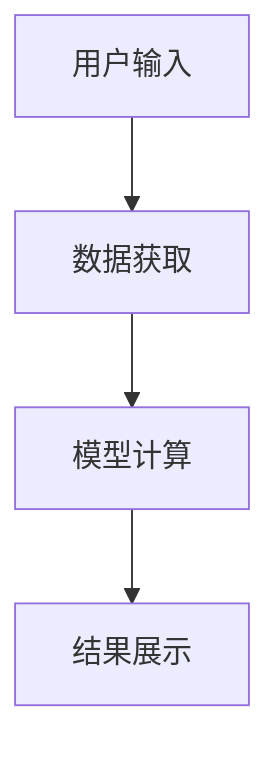
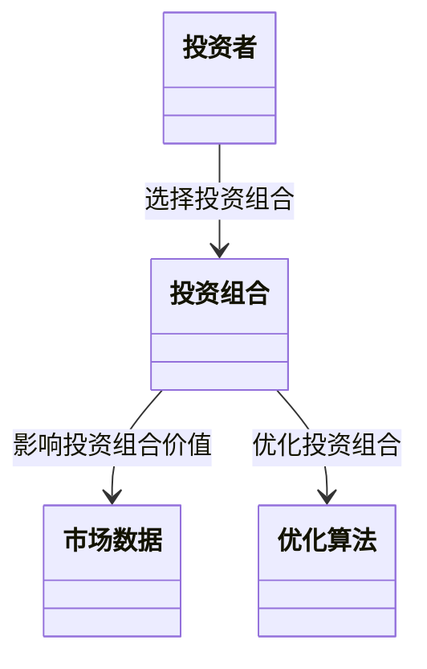

                 


# 约翰·博格尔的成本敏感型投资策略

> 关键词：成本敏感型投资，约翰·博格尔，指数基金，投资策略，投资成本

> 摘要：本文深入探讨了约翰·博格尔的成本敏感型投资策略，从理论基础到实际应用，结合数学模型和系统设计，详细解析了如何通过控制成本来优化投资回报。

---

## 第1章: 成本敏感型投资策略的背景与概念

### 1.1 约翰·博格尔与成本敏感型投资

#### 1.1.1 约翰·博格尔的生平简介
约翰·博格尔（John C. Bogle）是投资界的传奇人物，被誉为“指数基金之父”。他于1934年出生于美国宾夕法尼亚州，毕业于宾夕法尼亚大学。博格尔的职业生涯始于1965年，当时他创立了 Vanguard 集团，这是全球最大的共同基金管理公司之一。博格尔以其倡导低成本投资和指数基金的理念而闻名，他坚信长期投资和低成本是实现超额收益的关键。

#### 1.1.2 成本敏感型投资的核心理念
成本敏感型投资的核心理念是通过降低投资成本来提高长期投资回报。博格尔认为，市场中存在一种“费用率”（expense ratio），即投资者为管理基金支付的费用比例。较高的费用率会显著侵蚀投资收益，尤其是当投资期限较长时，费用的复利效应会更加明显。

#### 1.1.3 成本敏感型投资的历史发展
成本敏感型投资的理念起源于20世纪70年代，博格尔在他的著作《共同基金的革新》（The New Investment Revolution）中首次系统地提出了这一概念。随着金融市场的不断发展，低成本投资策略逐渐被更多投资者所接受，并成为现代投资理论的重要组成部分。

---

### 1.2 成本在投资中的重要性

#### 1.2.1 投资成本的定义与分类
投资成本是指投资者在投资过程中所需支付的所有费用，包括管理费、托管费、交易佣金等。根据成本的性质，可以将投资成本分为显性成本（如管理费）和隐性成本（如交易成本）。

#### 1.2.2 成本对投资回报的影响
投资成本对回报的影响是长期且累积的。根据现代投资组合理论，较高的费用率会降低投资组合的预期收益，尤其是在市场波动较小或市场收益率较低的情况下，费用的影响更加显著。博格尔通过大量实证研究表明，低成本投资策略在长期表现上通常优于高成本策略。

#### 1.2.3 成本敏感型投资与其他投资策略的区别
与主动投资策略不同，成本敏感型投资更注重长期持有和分散投资，强调通过降低费用率来提高收益。与被动投资策略相比，成本敏感型投资更加注重费用控制，而不是仅仅跟踪市场指数。

---

## 第2章: 成本敏感型投资的理论基础

### 2.1 有效市场假说与成本敏感型投资

#### 2.1.1 有效市场假说的定义与应用
有效市场假说认为，市场价格已经充分反映了所有可获得的信息，因此投资者无法通过分析市场信息来获得超额收益。这一假说为成本敏感型投资提供了理论基础，因为博格尔认为在有效市场中，低成本投资是实现长期收益的最佳方式。

#### 2.1.2 成本敏感型投资与有效市场假说的关系
在有效市场中，低成本投资策略通过降低费用率来提高投资回报。博格尔认为，费用率的差异是决定投资绩效的重要因素，尤其是在市场效率较高的环境下。

#### 2.1.3 有效市场假说对成本敏感型投资的影响
有效市场假说强调了市场信息的充分反映，因此，投资者应通过降低费用率来获得更好的投资回报。博格尔的低成本投资策略正是基于这一理论，通过选择低成本的指数基金来实现长期投资收益。

---

### 2.2 现代投资组合理论与成本敏感型投资

#### 2.2.1 现代投资组合理论的概述
现代投资组合理论（MPT）由哈里·马科维茨（Harry Markowitz）提出，强调通过分散投资来降低风险。博格尔将MPT的理念与低成本投资相结合，提出了成本敏感型投资策略。

#### 2.2.2 成本敏感型投资在现代投资组合理论中的应用
在MPT框架下，博格尔认为，投资者可以通过构建低成本的指数基金组合来实现风险分散和收益最大化。他强调，费用率的差异是决定投资绩效的关键因素之一。

#### 2.2.3 现代投资组合理论对成本敏感型投资的启示
MPT为成本敏感型投资提供了理论支持，尤其是其分散投资的思想与博格尔的低成本投资策略相辅相成。

---

## 第3章: 成本敏感型投资的核心概念与联系

### 3.1 成本敏感型投资的核心原理

#### 3.1.1 成本敏感型投资的定义
成本敏感型投资是一种通过控制投资成本来优化长期投资回报的投资策略。它强调低成本的指数基金和长期持有，以实现稳健的收益。

#### 3.1.2 成本敏感型投资的核心要素
成本敏感型投资的核心要素包括：
1. 低成本的指数基金选择
2. 长期持有策略
3. 分散投资以降低风险

#### 3.1.3 成本敏感型投资的数学模型
成本敏感型投资的数学模型可以通过以下公式表示：
$$
\text{预期收益} = \text{市场收益率} - \text{费用率}
$$
博格尔认为，费用率的差异会显著影响长期收益，因此选择低成本的基金至关重要。

---

### 3.2 成本敏感型投资与传统投资策略的对比

#### 3.2.1 成本敏感型投资与主动投资策略的对比
主动投资策略通过频繁交易和选股来追求超额收益，但其高昂的费用率和交易成本往往侵蚀了潜在收益。而成本敏感型投资强调低成本和长期持有，更适合稳健型投资者。

#### 3.2.2 成本敏感型投资与被动投资策略的对比
被动投资策略通过跟踪市场指数来实现收益，通常费用率较低。然而，被动投资忽略了费用率的差异，而成本敏感型投资则将费用率作为核心考量因素。

#### 3.2.3 成本敏感型投资与量化投资策略的对比
量化投资策略依赖于复杂的算法和数据模型，通常费用率较高。而成本敏感型投资更注重费用率的控制，适合长期投资者。

---

## 第4章: 成本敏感型投资的数学模型与算法

### 4.1 投资组合优化的数学模型

#### 4.1.1 均值-方差模型的定义
均值-方差模型是现代投资组合理论的核心，用于优化投资组合的收益与风险。其基本公式为：
$$
\text{收益} = w^T \mu
$$
$$
\text{风险} = w^T \sigma \sigma^T w
$$
其中，\( w \) 是投资组合权重向量，\( \mu \) 是资产收益均值向量，\( \sigma \) 是资产收益的协方差矩阵。

#### 4.1.2 均值-方差模型的公式推导
通过求解上述优化问题，可以得到最优投资组合权重：
$$
w = \frac{1}{\sigma^2} \cdot \frac{\sigma \mu}{\mu^T \sigma^{-2} \mu}
$$
该公式表明，最优权重取决于资产收益的均值和协方差矩阵。

#### 4.1.3 均值-方差模型的实例分析
假设我们有两只资产，其收益均值分别为10%和15%，协方差矩阵为：
$$
\sigma = \begin{bmatrix}
0.02 & 0.01 \\
0.01 & 0.03
\end{bmatrix}
$$
通过求解均值-方差模型，可以得到最优投资组合权重。

---

### 4.2 成本敏感型投资的算法实现

#### 4.2.1 算法代码示例
```python
import numpy as np

def optimize_portfolio(weights, mu, sigma):
    # 定义目标函数
    def objective(w):
        return -w.T @ mu  # 最大化收益

    # 定义约束条件
    constraints = [
        {'type': 'eq', 'fun': lambda w: np.sum(w) - 1}
    ]

    # 使用SLSQP求解器优化
    from scipy.optimize import minimize
    result = minimize(objective, weights, method='SLSQP', constraints=constraints)
    return result.x

# 示例数据
mu = np.array([0.1, 0.15])
sigma = np.array([[0.02, 0.01], [0.01, 0.03]])
weights = np.array([0.5, 0.5])

# 优化投资组合
optimal_weights = optimize_portfolio(weights, mu, sigma)
print("最优权重:", optimal_weights)
```

#### 4.2.2 算法的实现与解释
上述代码使用均值-方差模型优化投资组合权重，通过最小化风险（方差）来实现收益最大化。约束条件为权重之和为1，确保投资组合的可行性。优化结果展示了最优投资组合的权重分配。

---

## 第5章: 系统分析与架构设计

### 5.1 系统功能设计

#### 5.1.1 项目介绍
成本敏感型投资系统旨在帮助投资者选择低成本的指数基金，并优化投资组合。

#### 5.1.2 系统功能模块
- 用户界面：输入投资目标和资金规模。
- 数据获取：获取基金费用率和历史收益数据。
- 模型计算：优化投资组合权重。
- 结果展示：显示最优投资组合和预期收益。

#### 5.1.3 系统功能流程图


---

### 5.2 系统架构设计

#### 5.2.1 系统架构图


---

## 第6章: 项目实战

### 6.1 环境安装与配置

#### 6.1.1 环境要求
- Python 3.6+
- NumPy和SciPy库

#### 6.1.2 安装依赖
```bash
pip install numpy scipy
```

---

### 6.2 系统核心实现

#### 6.2.1 核心代码实现
```python
import numpy as np
from scipy.optimize import minimize

def optimize_portfolio(mu, sigma):
    # 定义目标函数
    def objective(w):
        return -w.T @ mu  # 最大化收益

    # 定义约束条件
    constraints = [
        {'type': 'eq', 'fun': lambda w: np.sum(w) - 1}
    ]

    # 初始化权重
    n = len(mu)
    initial_weights = np.ones(n) / n

    # 使用SLSQP求解器优化
    result = minimize(objective, initial_weights, method='SLSQP', constraints=constraints)
    return result.x

# 示例数据
mu = np.array([0.1, 0.15])
sigma = np.array([[0.02, 0.01], [0.01, 0.03]])

# 优化投资组合
optimal_weights = optimize_portfolio(mu, sigma)
print("最优权重:", optimal_weights)
```

---

## 第7章: 最佳实践与小结

### 7.1 最佳实践

#### 7.1.1 长期投资的重要性
长期持有低成本指数基金是实现稳健收益的关键。

#### 7.1.2 费用率控制
选择费用率低的指数基金，长期来看收益更高。

#### 7.1.3 分散投资
通过分散投资降低风险，同时控制费用率。

---

### 7.2 小结

约翰·博格尔的成本敏感型投资策略通过降低费用率和长期持有低成本指数基金，帮助投资者实现稳健的收益。本文从理论基础到实际应用，详细解析了成本敏感型投资的核心理念和实现方法，为投资者提供了重要的参考。

---

### 7.3 注意事项

1. **市场波动**：投资有风险，需关注市场波动。
2. **费用率比较**：选择低成本基金时，需综合考虑费用率和基金规模。
3. **长期持有**：避免频繁交易，降低交易成本。

---

### 7.4 拓展阅读

1. 约翰·博格尔的《共同基金的革新》
2. 哈里·马科维茨的《投资学精要》
3. 索普的《战胜市场的人》

---

通过本文的详细解析，读者可以全面了解约翰·博格尔的成本敏感型投资策略，并将其应用于实际投资中，以实现长期稳健的收益。

