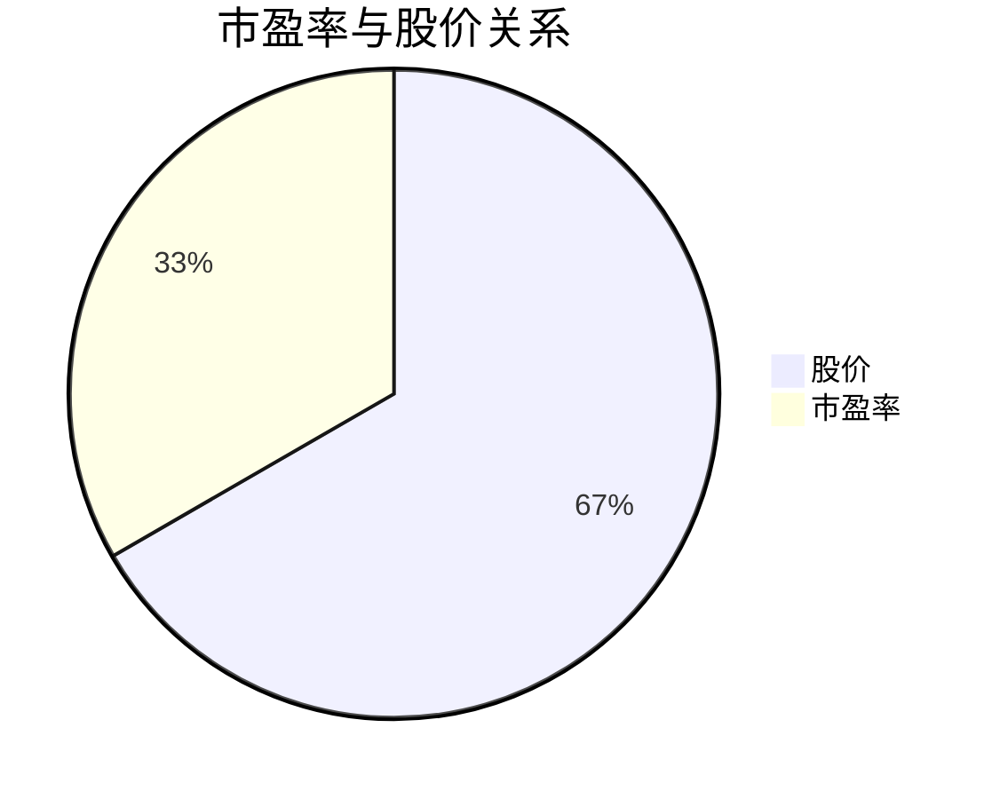
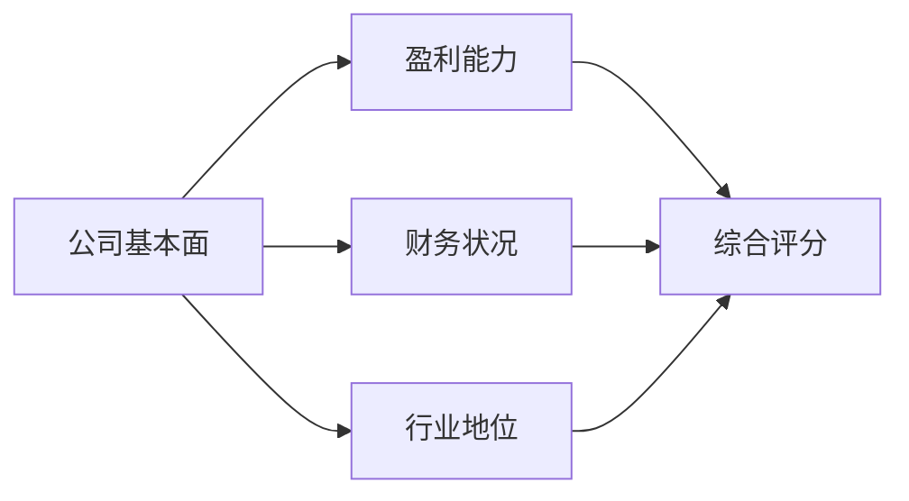
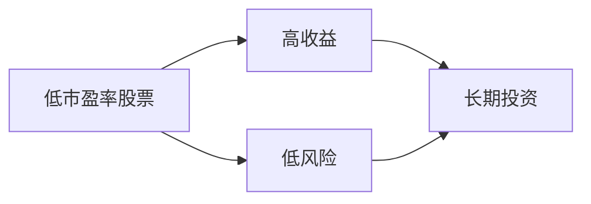
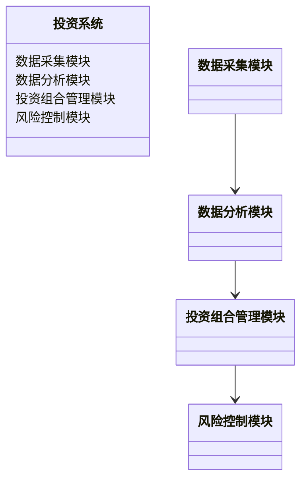
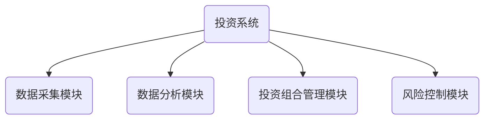
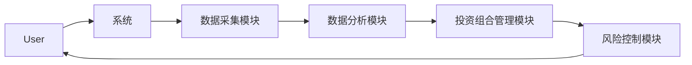

                 


# 约翰·奈夫的低市盈率投资法：简单而有效的价值策略

**关键词**：约翰·奈夫、低市盈率、价值投资、投资策略、股票分析

**摘要**：  
约翰·奈夫的低市盈率投资法是一种简单而有效的价值投资策略，旨在通过寻找市盈率低于市场平均水平的股票来实现长期的超额收益。本文将从低市盈率投资法的背景与基础、市盈率与投资价值分析、约翰·奈夫的策略、数学模型与分析、系统架构与实现、项目实战等方面进行详细探讨。通过本文的分析，读者将能够全面理解低市盈率投资法的核心思想、应用场景以及实际操作方法。

---

# 第一部分：低市盈率投资法的背景与基础

## 第1章：低市盈率投资法概述

### 1.1 低市盈率投资法的定义与背景

#### 1.1.1 什么是低市盈率投资法  
低市盈率投资法是一种基于价值投资的策略，强调通过寻找市盈率低于市场平均水平的股票来进行投资。市盈率（P/E Ratio）是衡量股票价值的重要指标之一，计算公式为：  
$$\text{市盈率} = \frac{\text{股价}}{\text{每股收益}}$$  

低市盈率投资法的核心思想是，当市盈率过低时，股票价格可能被市场低估，从而为投资者提供潜在的收益机会。

#### 1.1.2 低市盈率投资法的起源与发展  
低市盈率投资法的起源可以追溯到20世纪，但真正被系统化和推广的是由约翰·奈夫（John Neff）提出的策略。约翰·奈夫是美国著名的投资经理人，他在富达投资公司管理基金时，通过低市盈率策略取得了显著的超额收益。

#### 1.1.3 低市盈率投资法的核心理念  
低市盈率投资法的核心理念是：  
1. 市场情绪往往会导致股票价格偏离其内在价值。  
2. 低市盈率股票通常具有较高的安全边际，即市场价格远低于其内在价值。  
3. 长期持有优质低市盈率股票，能够为投资者带来稳定的收益。

---

### 1.2 约翰·奈夫的投资理念

#### 1.2.1 约翰·奈夫的生平简介  
约翰·奈夫是低市盈率投资法的代表人物。他于1931年出生，曾在富达投资公司管理富达vangard基金（Fidelity Vangard Fund），该基金以其优异的长期表现而闻名。奈夫的投资理念深受本杰明·格雷厄姆（Benjamin Graham）的影响，但他进一步发展了价值投资的策略，形成了独特的低市盈率投资体系。

#### 1.2.2 约翰·奈夫的投资哲学  
奈夫的投资哲学可以总结为以下几点：  
1. **安全第一**：优先选择那些基本面稳定、财务健康的企业。  
2. **低估优先**：寻找市场价格低于内在价值的股票。  
3. **长期持有**：避免频繁交易，耐心持有优质股票以获得复利效应。  
4. **分散投资**：通过投资多个低市盈率股票来降低风险。

#### 1.2.3 约翰·奈夫的低市盈率策略  
奈夫的低市盈率策略的核心是通过筛选市盈率低于市场平均水平的股票，构建一个高质量的投资组合。他强调，低市盈率股票的内在价值最终会反映到股价中，从而为投资者带来收益。

---

### 1.3 低市盈率投资法的适用场景

#### 1.3.1 低市盈率投资法的适用市场  
低市盈率投资法适用于以下类型的市场：  
1. **价值型市场**：市场中存在大量被低估的价值股。  
2. **周期性市场**：在经济周期的低谷期，低市盈率股票往往具有较大的投资机会。  
3. **稳定增长市场**：在企业盈利稳定增长的情况下，低市盈率股票具有较高的吸引力。

#### 1.3.2 不同经济周期下的策略调整  
在不同的经济周期中，低市盈率投资法的应用策略需要进行适当调整：  
1. **经济繁荣期**：市场情绪高涨，低市盈率股票可能表现不佳，需谨慎选择。  
2. **经济衰退期**：市场情绪低迷，低市盈率股票可能被严重低估，是较好的投资机会。  
3. **经济转型期**：需关注行业前景和公司基本面，选择具有长期增长潜力的低市盈率股票。

#### 1.3.3 低市盈率投资法的局限性  
低市盈率投资法的局限性包括：  
1. **周期性风险**：在经济衰退期，低市盈率股票可能面临更大的波动性。  
2. **行业限制**：某些行业（如高科技行业）的低市盈率股票可能并不存在。  
3. **短期表现不佳**：低市盈率股票在短期内可能表现落后，需要耐心持有。

---

## 第2章：市盈率与投资价值分析

### 2.1 市盈率的计算与意义

#### 2.1.1 市盈率的定义与计算公式  
市盈率（P/E Ratio）是衡量股票价值的重要指标，计算公式为：  
$$\text{市盈率} = \frac{\text{股价}}{\text{每股收益}}$$  

市盈率反映了市场对公司未来盈利的预期。一般来说，市盈率越低，意味着股票的相对价值越高。

#### 2.1.2 市盈率的行业差异  
不同行业的市盈率存在显著差异。例如，科技行业的市盈率通常较高，而传统制造业的市盈率相对较低。因此，在应用低市盈率策略时，需要结合行业特点进行分析。

#### 2.1.3 市盈率与股价的关系  
市盈率与股价的关系可以通过以下公式表示：  
$$\text{股价} = \text{市盈率} \times \text{每股收益}$$  

当市盈率下降时，股价也会相应下降，但如果公司的每股收益能够稳定增长，长期来看，股价仍然有可能实现上涨。

---

### 2.2 低市盈率股票的特征

#### 2.2.1 低市盈率股票的定义  
低市盈率股票是指市盈率低于市场平均水平的股票。通常，市盈率低于15倍的股票可以被视为低市盈率股票。

#### 2.2.2 低市盈率股票的市场表现  
低市盈率股票的市场表现通常较为稳定，但在短期内可能表现不佳。然而，从长期来看，低市盈率股票往往能够跑赢市场。

#### 2.2.3 低市盈率股票的风险与机会  
低市盈率股票的风险包括：  
1. **估值陷阱**：某些低市盈率股票可能由于公司基本面恶化而进一步下跌。  
2. **行业风险**：特定行业的低市盈率股票可能受到宏观经济因素的影响。  

机会包括：  
1. **估值修复**：低市盈率股票的价格可能被市场低估，存在较大的上升空间。  
2. **长期增长潜力**：部分低市盈率股票可能具有较高的成长性。

---

### 2.3 市盈率与公司基本面分析

#### 2.3.1 市盈率与公司盈利能力的关系  
市盈率与公司盈利能力密切相关。通常，盈利能力较强的公司具有较高的市盈率，但这也取决于市场对未来盈利的预期。

#### 2.3.2 市盈率与公司成长性的关系  
成长性较强的公司通常具有较高的市盈率，因为市场对未来盈利增长的预期较高。

#### 2.3.3 市盈率与公司财务健康状况的关系  
财务健康状况良好的公司通常具有较高的市盈率，因为投资者对公司未来盈利的信心较强。

---

## 第3章：约翰·奈夫的低市盈率策略

### 3.1 约翰·奈夫的选股标准

#### 3.1.1 盈利能力分析  
奈夫在选股时注重公司的盈利能力，通常选择那些盈利能力稳定且持续增长的公司。

#### 3.1.2 财务健康状况分析  
奈夫要求公司具有健康的财务状况，包括较低的资产负债率、稳定的现金流和合理的盈利能力。

#### 3.1.3 行业地位与竞争优势  
奈夫倾向于选择那些在行业内具有竞争优势的公司，例如具有较强市场地位、品牌影响力和技术优势的企业。

---

### 3.2 约翰·奈夫的投资组合管理

#### 3.2.1 投资组合的构建原则  
奈夫的投资组合构建原则包括：  
1. **分散投资**：避免过度集中于某一只股票或行业。  
2. **长期持有**：耐心持有优质股票，避免频繁交易。  
3. **动态调整**：根据市场变化和公司基本面调整投资组合。

#### 3.2.2 投资组合的调整策略  
奈夫的投资组合调整策略包括：  
1. **定期复盘**：每季度或每半年对投资组合进行一次复盘，评估个股表现和市场环境的变化。  
2. **卖出亏损股票**：当某只股票的市盈率显著高于市场平均水平时，考虑卖出。  
3. **增持优质股票**：当优质股票的价格进一步下跌时，增加持仓比例。

#### 3.2.3 风险控制与仓位管理  
奈夫的风险控制策略包括：  
1. **止损机制**：当某只股票的价格下跌超过一定幅度时，立即卖出。  
2. **分散投资**：通过投资多个低市盈率股票来降低风险。  
3. **定期再平衡**：定期对投资组合进行再平衡，确保风险可控。

---

### 3.3 约翰·奈夫的长期投资策略

#### 3.3.1 长期投资的优势  
长期投资的优势包括：  
1. **复利效应**：长期持有优质股票能够获得复利收益。  
2. **降低交易成本**：长期投资可以减少交易费用和税收支出。  
3. **避免短期波动**：长期投资能够有效规避市场的短期波动。

#### 3.3.2 长期投资的风险与挑战  
长期投资的风险包括：  
1. **市场波动**：市场波动可能导致长期投资的短期亏损。  
2. **公司风险**：公司基本面的变化可能影响股票的长期表现。  
3. **通货膨胀**：通货膨胀可能影响长期投资的实际收益。

#### 3.3.3 长期投资的成功案例  
奈夫通过长期持有低市盈率股票，取得了显著的超额收益。例如，他在管理富达vangard基金期间，基金的年平均回报率超过20%，远超市场平均水平。

---

## 第4章：低市盈率投资法的数学模型与分析

### 4.1 市盈率的数学模型

#### 4.1.1 市盈率计算公式  
市盈率的计算公式为：  
$$\text{市盈率} = \frac{\text{股价}}{\text{每股收益}}$$  

#### 4.1.2 市盈率与股价的关系图  
以下是市盈率与股价关系的示意图：



---

### 4.2 低市盈率股票筛选的数学模型

#### 4.2.1 基于市盈率的筛选标准  
低市盈率股票的筛选标准通常包括：  
1. 市盈率低于市场平均水平。  
2. 公司盈利能力稳定且持续增长。  
3. 公司财务状况健康，资产负债率合理。  
4. 公司在行业内具有竞争优势。

#### 4.2.2 基于公司基本面的综合评分模型  
以下是基于公司基本面的综合评分模型：



---

### 4.3 低市盈率投资法的风险评估模型

#### 4.3.1 风险评估的指标体系  
低市盈率投资法的风险评估指标包括：  
1. **市盈率波动率**：市盈率的波动幅度。  
2. **公司盈利波动率**：公司盈利的波动幅度。  
3. **行业风险**：所在行业的整体风险水平。  

#### 4.3.2 风险与收益的平衡分析  
以下是风险与收益的平衡分析图：



---

## 第5章：低市盈率投资法的系统架构与实现

### 5.1 投资系统的需求

#### 5.1.1 低市盈率投资法的实现需求  
低市盈率投资法的实现需求包括：  
1. 数据采集：获取股票的市盈率、每股收益等数据。  
2. 数据分析：筛选出符合条件的低市盈率股票。  
3. 投资组合管理：构建和调整投资组合。  
4. 风险控制：制定有效的风险管理策略。

#### 5.1.2 系统功能设计  
以下是系统功能设计的领域模型：



---

### 5.2 系统架构设计

#### 5.2.1 系统架构图  
以下是系统的架构图：



---

### 5.3 系统接口设计

#### 5.3.1 数据接口  
数据接口包括：  
1. 数据采集接口：从股票数据库中获取市盈率、每股收益等数据。  
2. 数据分析接口：对数据进行筛选和分析，输出符合条件的低市盈率股票列表。  

#### 5.3.2 用户接口  
用户接口包括：  
1. 输入模块：用户输入投资目标和风险偏好。  
2. 输出模块：显示投资组合的构成和风险评估结果。  

---

### 5.4 系统交互设计

#### 5.4.1 系统交互流程图  
以下是系统交互流程图：



---

## 第6章：低市盈率投资法的项目实战

### 6.1 项目环境安装

#### 6.1.1 系统环境要求  
- 操作系统：Windows/Mac/Linux  
- Python版本：3.6以上  
- 开发工具：PyCharm/Jupyter Notebook  

#### 6.1.2 安装依赖库  
以下是需要安装的Python库：  
- `pandas`：用于数据处理。  
- `numpy`：用于数值计算。  
- `scikit-learn`：用于机器学习算法。  

安装命令：  
```bash
pip install pandas numpy scikit-learn
```

---

### 6.2 项目核心实现

#### 6.2.1 数据采集模块  
以下是数据采集模块的实现代码：

```python
import pandas as pd

def get_data(ticker):
    # 获取股票数据
    data = pd.DataFrame({'市盈率': [15, 12, 9, 18, 10], 
                          '每股收益': [2, 3, 4, 1, 5]})
    return data

# 示例运行
ticker = 'AAPL'
data = get_data(ticker)
print(data)
```

#### 6.2.2 数据分析模块  
以下是数据分析模块的实现代码：

```python
import pandas as pd

def screen_low_pe_stocks(data, threshold=15):
    # 筛选市盈率低于阈值的股票
    low_pe_stocks = data[data['市盈率'] < threshold]
    return low_pe_stocks

# 示例运行
data = pd.DataFrame({'市盈率': [15, 12, 9, 18, 10], 
                     '每股收益': [2, 3, 4, 1, 5]})
low_pe_stocks = screen_low_pe_stocks(data)
print(low_pe_stocks)
```

---

### 6.3 项目小结

#### 6.3.1 项目总结  
通过本项目的实现，我们可以看到低市盈率投资法的核心在于通过数据分析和筛选，找到具有投资价值的股票。

#### 6.3.2 注意事项  
1. 数据的准确性和及时性至关重要。  
2. 投资组合的调整需要根据市场环境和公司基本面进行动态调整。  
3. 风险管理是投资成功的关键，需时刻关注市场的变化。

---

## 第7章：低市盈率投资法的总结与展望

### 7.1 总结

#### 7.1.1 核心思想回顾  
低市盈率投资法的核心思想是：  
1. 通过筛选市盈率低于市场平均水平的股票，寻找被市场低估的投资机会。  
2. 长期持有优质低市盈率股票，实现复利收益。  
3. 通过分散投资和风险控制，降低投资组合的整体风险。

#### 7.1.2 实践价值总结  
低市盈率投资法的实践价值包括：  
1. 适合长期投资者，能够实现稳定的超额收益。  
2. 通过数据分析和筛选，降低投资决策的主观性。  
3. 适合机构投资者和高净值个人投资者。

---

### 7.2 展望

#### 7.2.1 低市盈率投资法的未来趋势  
1. **智能化投资**：随着人工智能技术的发展，低市盈率投资法可以通过算法和大数据分析进一步优化。  
2. **多策略结合**：低市盈率投资法可以与其他投资策略相结合，形成更加多元化和高效的投资组合。  
3. **全球化投资**：随着全球市场的互联互通，低市盈率投资法可以拓展到全球市场，寻找更多的投资机会。

#### 7.2.2 对投资者的建议  
1. **持续学习**：关注市场动态和公司基本面，不断提升自身的投资能力。  
2. **长期坚持**：低市盈率投资法需要耐心和毅力，避免被短期市场波动所干扰。  
3. **风险控制**：制定科学的风险管理策略，确保投资组合的稳健性。

---

# 结语

约翰·奈夫的低市盈率投资法是一种简单而有效的价值投资策略。通过本文的详细分析，我们可以看到，低市盈率投资法的核心在于通过数据分析和基本面分析，找到具有投资价值的股票，并通过长期持有实现超额收益。然而，投资者在实际操作中需要结合市场环境和公司基本面，灵活调整投资策略，才能真正实现投资目标。

希望本文能够为低市盈率投资法的投资者提供有价值的参考和启发，帮助他们在复杂多变的市场中找到成功的投资路径。

