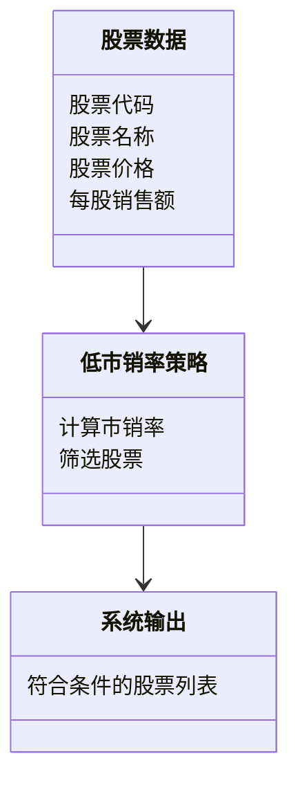

                 


```markdown
# 约翰·奈夫的低市销率价值投资：另一种选股视角

> 关键词：低市销率、价值投资、约翰·奈夫、股票筛选、投资策略、风险管理

> 摘要：本文深入探讨了约翰·奈夫提出的低市销率价值投资策略，从背景、原理、算法到系统架构、项目实战等多方面进行详细分析，揭示了低市销率策略在选股中的独特视角和实际应用。

---

# 第一部分: 低市销率价值投资的背景与基础

# 第1章: 低市销率价值投资的背景介绍

## 1.1 价值投资的起源与发展
### 1.1.1 价值投资的核心理念
- 价值投资是基于对企业内在价值的评估，寻找市场价格低于内在价值的股票。
- 约翰·奈夫的贡献：他提出了低市销率策略，作为价值投资的重要补充。

### 1.1.2 约翰·奈夫的贡献与投资风格
- 约翰·奈夫是低市销率策略的代表人物。
- 他的投资理念强调企业基本面分析和长期投资。

### 1.1.3 低市销率策略的定义和特点
- 低市销率策略是通过市销率（Price-to-Sales Ratio，PSR）来筛选被低估的股票。
- PSR = 股票价格 / 每股销售额。
- 低市销率策略的特点：简单易用、注重企业销售收入。

## 1.2 低市销率价值投资的适用场景
### 1.2.1 适用行业
- 低市销率策略适用于销售收入稳定、增长可预期的行业。
- 特别适合科技、消费品和制造行业。

### 1.2.2 不适用场景
- 对于亏损企业或销售不佳的企业，低市销率策略可能不适用。
- 市销率高的行业可能不适合此策略。

### 1.2.3 风险与边界
- 市场波动可能导致市销率失真。
- 需结合其他财务指标进行综合评估。

---

# 第2章: 低市销率价值投资的核心概念

## 2.1 市销率与市盈率的对比分析
### 2.1.1 市盈率的定义与计算
$$市盈率 = \frac{股票价格}{每股净利润}$$
- 市盈率关注的是利润，而市销率关注的是销售收入。

### 2.1.2 市销率的定义与计算
$$市销率 = \frac{股票价格}{每股销售额}$$
- 市销率适用于评估销售驱动型企业的内在价值。

### 2.1.3 两者对比表格
| 指标 | 定义 | 适用场景 |
|------|------|----------|
| 市盈率 | 利润驱动 | 适用于利润稳定的行业 |
| 市销率 | 销售驱动 | 适用于销售收入稳定的行业 |

## 2.2 低市销率策略的核心原理
### 2.2.1 理论基础
- 市销率反映了市场对公司每单位销售收入的定价。
- 低市销率意味着市场对公司销售能力的估值较低。

### 2.2.2 核心要素
- 公司销售收入：稳定的销售收入是低市销率策略的前提。
- 行业平均市销率：作为筛选标准的重要参考。

### 2.2.3 选股逻辑
1. 计算目标公司的市销率。
2. 比较市销率与行业平均水平。
3. 选择市销率低于行业平均的公司。

---

# 第3章: 低市销率价值投资的算法原理

## 3.1 市销率计算算法
### 3.1.1 计算公式
$$市销率 = \frac{股票价格}{每股销售额}$$

### 3.1.2 计算步骤
1. 获取目标公司的股价数据。
2. 获取目标公司的每股销售额数据。
3. 计算市销率。
4. 比较市销率与行业平均水平。

## 3.2 低市销率策略的筛选算法
### 3.2.1 筛选条件
1. 市销率 < 行业平均市销率。
2. 公司基本面良好。
3. 公司具有长期竞争优势。

### 3.2.2 算法流程图


---

# 第4章: 低市销率价值投资的系统架构

## 4.1 系统功能设计
### 4.1.1 功能模块
1. 数据获取模块：获取股票价格和销售收入数据。
2. 计算模块：计算市销率。
3. 筛选模块：根据筛选条件筛选股票。
4. 输出模块：展示结果。

### 4.1.2 领域模型


---

# 第5章: 项目实战

## 5.1 环境安装
- Python 3.8以上版本。
- 安装必要的库：pandas、numpy、requests。

## 5.2 核心实现代码
```python
import pandas as pd
import requests

# 获取股票数据
def get_stock_data(ticker):
    url = f"https://api.example.com/stock/{ticker}"
    response = requests.get(url)
    return pd.DataFrame(response.json())

# 计算市销率
def calculate_psr(stock_data):
    stock_data['PSR'] = stock_data['price'] / stock_data['sales_per_share']
    return stock_data

# 筛选低市销率股票
def screen_low_psr(stock_data, industry_psr):
    stock_data['is_low_psr'] = stock_data['PSR'] < industry_psr
    return stock_data

# 主函数
def main():
    tickers = ['AAPL', 'GOOGL', 'AMZN']
    stock_data = pd.DataFrame()
    for ticker in tickers:
        data = get_stock_data(ticker)
        stock_data = pd.concat([stock_data, data])
    stock_data = calculate_psr(stock_data)
    industry_psr = 1.5  # 假设行业平均市销率为1.5
    stock_data = screen_low_psr(stock_data, industry_psr)
    print(stock_data)

if __name__ == "__main__":
    main()
```

## 5.3 代码解读与分析
- `get_stock_data`：从API获取股票数据。
- `calculate_psr`：计算市销率。
- `screen_low_psr`：根据行业平均市销率筛选股票。

## 5.4 实际案例分析
- 以苹果、谷歌、亚马逊为例，分析它们的市销率。
- 判断这些公司是否符合低市销率策略。

---

# 第6章: 总结与展望

## 6.1 总结
- 低市销率策略是一种有效的选股方法。
- 通过市销率可以发现被低估的股票。
- 结合其他指标可以提高选股的准确性。

## 6.2 注意事项
- 市销率只是一个参考指标，需结合其他因素综合分析。
- 长期投资，避免短期波动干扰。

## 6.3 拓展阅读
- 《价值投资实战策略》
- 《投资学基础》

---

# 附录: 更多低市销率策略的思考

## 附录A: 风险管理
- 设定止损点。
- 分散投资，降低风险。

## 附录B: 常见问题解答
1. 低市销率策略适合所有行业吗？ 不是，适用于销售稳定的行业。
2. 如何获取准确的销售收入数据？ 可以通过财务报表获取。

---

通过本文的分析，读者可以深入了解低市销率价值投资的策略和方法，掌握如何通过市销率指标筛选出具有投资价值的股票。
```

