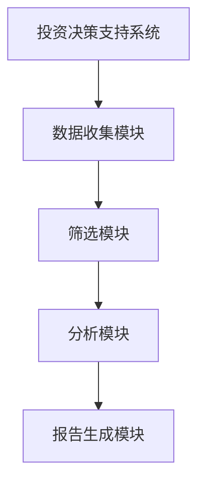

                 


# 约翰·奈夫的高股息价值投资：稳定收益的来源

## 关键词：约翰·奈夫、高股息价值投资、股息率、股息支付率、投资策略、风险管理

## 摘要：  
高股息价值投资是一种通过投资高股息率股票来实现稳定收益的投资策略，其核心在于筛选具备稳定股息支付能力的公司。本文从约翰·奈夫的高股息价值投资理念出发，详细分析了高股息价值投资的背景、核心原理、数学模型、系统架构、项目实战及风险管理等内容，为投资者提供了一套完整的高股息价值投资方法论。

---

# 第1章 高股息价值投资的背景与基础

## 1.1 高股息价值投资的背景

### 1.1.1 价值投资的起源与发展  
价值投资是一种以基本面分析为核心的长期投资策略，起源于20世纪初，由本杰明·格雷厄姆和戴维·多德提出。其核心思想是通过分析公司的财务状况、行业地位和竞争优势，寻找被市场低估的股票进行投资。约翰·奈夫继承并发展了这一理念，将高股息支付率作为筛选优质股票的重要标准之一。

### 1.1.2 高股息投资的必要性  
在经济波动和市场不确定性加剧的背景下，投资者越来越倾向于寻找能够提供稳定收益的投资标的。高股息股票因其稳定的现金流和较高的分红能力，成为投资者追求稳定收益的重要选择。此外，高股息股票通常具有较高的安全边际，能够在市场下跌时为投资者提供较好的抗跌性。

### 1.1.3 约翰·奈夫的贡献  
约翰·奈夫是高股息价值投资的倡导者，他提出了“奈夫公式”，即通过股息支付率（D/P）和股息增长率（Dividend Growth Rate）来筛选具有可持续增长潜力的股票。他的投资理念强调长期持有、价值投资和风险管理，为高股息价值投资理论的发展奠定了基础。

---

## 1.2 高股息价值投资的核心概念

### 1.2.1 高股息投资的定义  
高股息价值投资是指通过筛选股息率高、股息支付率稳定、股息增长能力强的股票，进行长期投资以获取稳定收益的投资策略。

### 1.2.2 高股息投资的特点  
- **高股息率**：股息率高，通常为3%~10%或更高。  
- **稳定股息支付**：公司具备持续支付股息的能力，股息支付率稳定。  
- **低市盈率和低市净率**：通常估值较低，具有较高的安全边际。  
- **防御性较强**：在市场低迷时，高股息股票通常表现相对稳定。  

### 1.2.3 高股息投资的适用场景  
- **追求稳定收益的投资者**：如保守型投资者、退休人士等。  
- **熊市或经济衰退期**：高股息股票通常表现较好，能够为投资者提供稳定的现金流。  
- **低利率环境**：在债券收益率较低的环境下，高股息股票的吸引力增强。  

---

# 第2章 高股息价值投资的核心原理

## 2.1 高股息价值投资的原理

### 2.1.1 股息率的计算与分析  
股息率是衡量股票股息收益的重要指标，计算公式为：  
$$股息率 = \frac{每股股息}{股价}$$  

股息率越高，说明股票的分红能力越强，但需要结合公司盈利能力进行分析。例如，如果某股票股息率为5%，而其净利润率为10%，说明公司的盈利状况较好，股息支付能力较强。

### 2.1.2 股息增长的预测与评估  
股息增长率是衡量公司股息支付能力的重要指标，通常可以通过历史股息增长率和行业平均股息增长率进行预测。例如，某公司过去5年的股息增长率分别为5%、6%、4%、7%和6%，其平均股息增长率为5.8%。

### 2.1.3 股息质量的判断与筛选  
股息质量是指公司股息支付的可持续性，通常通过以下指标进行评估：  
- **股息支付率**：$$股息支付率 = \frac{股息}{净利润}$$  
- **自由现金流**：公司是否有足够的现金流支持股息支付。  
- **债务水平**：公司是否存在过高的债务负担，影响股息支付能力。  

---

## 2.2 高股息价值投资的核心指标

### 2.2.1 股息率  
股息率是高股息价值投资的核心指标之一，通常选择股息率在3%以上的股票作为潜在投资标的。

### 2.2.2 股息支付率  
股息支付率是衡量公司股息支付能力的重要指标，通常选择股息支付率在25%~50%之间的股票，既能保证股息支付的可持续性，又不会过度侵蚀公司利润。

### 2.2.3 股息增长历史与预期  
股息增长率是高股息价值投资的重要参考指标，通常选择股息增长历史稳定且未来预期增长的股票。

---

## 2.3 高股息价值投资的筛选标准

### 2.3.1 股息率的筛选标准  
- 股息率 > 3%  
- 股息率 < 10%（避免过高股息率带来的高风险）  

### 2.3.2 股息增长的稳定性  
- 股息增长历史稳定，通常要求过去5年股息增长率波动较小。  
- 股息增长率在合理范围内，通常为3%~8%。  

### 2.3.3 公司财务健康状况  
- 净利润率 > 5%  
- 负债率 < 50%  
- 自由现金流 > 0  

---

# 第3章 高股息价值投资的数学模型与公式

## 3.1 股息率的计算公式  
$$股息率 = \frac{每股股息}{股价}$$  

例如，某股票的股息为1元，股价为20元，则股息率为5%。

## 3.2 股息支付率的计算公式  
$$股息支付率 = \frac{股息}{净利润}$$  

例如，某公司净利润为10亿元，股息支付为3亿元，则股息支付率为30%。

## 3.3 股票价值的评估公式  
$$股票价值 = \frac{股息}{股息增长率}$$  

例如，某股票股息为2元，股息增长率为5%，则股票价值为40元。

---

# 第4章 高股息价值投资的系统架构设计

## 4.1 投资决策支持系统功能设计  
- **数据收集模块**：获取股票的基本信息、财务数据和市场数据。  
- **筛选模块**：根据股息率、股息支付率等指标筛选高股息股票。  
- **分析模块**：对筛选出的股票进行深入分析，评估其投资价值。  
- **报告生成模块**：生成投资报告，提供投资建议。  

## 4.2 系统架构设计  


---

# 第5章 高股息价值投资的项目实战

## 5.1 环境安装与数据准备  
- 安装Python和相关库（如pandas、numpy、matplotlib）。  
- 收集目标股票的财务数据和市场数据。  

## 5.2 核心代码实现  
```python
import pandas as pd
import numpy as np

# 数据预处理
data = pd.read_csv('stock_data.csv')
data['股息率'] = data['股息'] / data['股价']
data['股息支付率'] = data['股息'] / data['净利润']

# 筛选高股息股票
筛选条件：股息率 > 3% 且股息支付率 < 50%
高股息股票 = data[data['股息率'] > 0.03 & data['股息支付率'] < 0.5]
```

## 5.3 实际案例分析  
以某行业为例，筛选出符合条件的高股息股票，并分析其投资价值。

---

# 第6章 风险管理与最佳实践

## 6.1 风险管理  
- **分散投资**：避免将所有资金投入到单一股票中。  
- **定期调整**：根据市场变化和公司基本面调整投资组合。  
- **风险管理指标**：如最大回撤、VaR等。  

## 6.2 最佳实践  
- **长期持有**：避免频繁交易，降低交易成本。  
- **持续学习**：关注市场动态和公司基本面变化。  
- **纪律性**：严格按照筛选标准进行投资决策。  

---

# 结论  

高股息价值投资是一种有效的投资策略，能够为投资者提供稳定收益。通过科学的筛选标准、系统的分析方法和严格的风险管理，投资者可以在高股息价值投资中实现长期稳健的收益。未来，随着市场环境的变化，高股息价值投资也将不断优化和创新，为投资者提供更多优质的投资机会。

--- 

**附录**：  
- 高股息价值投资的常见问题解答  
- 进一步阅读的推荐书籍和资源  

---

