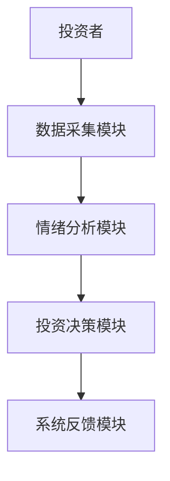
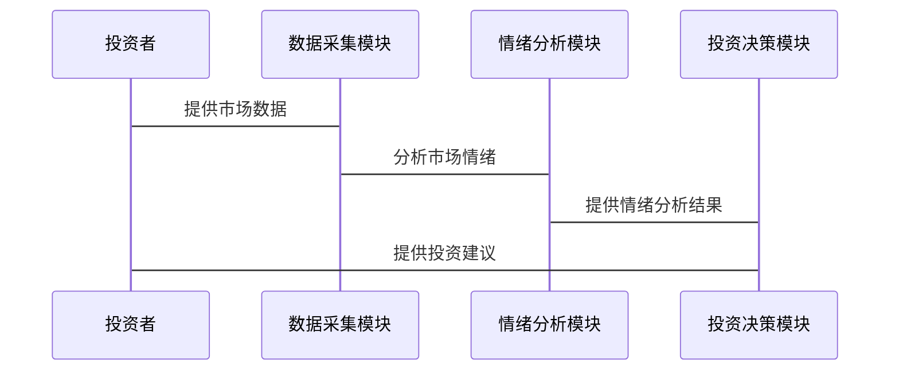

                 


# 约翰·聂夫的价值投资者情绪控制

> 关键词：价值投资，情绪控制，投资决策，约翰·聂夫，行为金融学

> 摘要：本文深入探讨了价值投资中情绪控制的重要性，并结合约翰·聂夫的投资理念，系统地分析了情绪控制的核心概念、算法原理、系统架构以及实战应用。通过数学模型、系统设计和项目案例的详细解读，本文为读者提供了一套有效控制情绪波动、提升投资决策能力的方法论。

---

# 第一部分: 价值投资与情绪控制的背景与基础

# 第1章: 价值投资与情绪控制概述

## 1.1 价值投资的核心理念

### 1.1.1 价值投资的定义与起源

价值投资是一种投资策略，其核心理念是通过分析企业的基本面，寻找市场价格低于其内在价值的投资标的。这种方法由本杰明·格雷厄姆和戴维·多德在20世纪初提出，后来被巴菲特、约翰·聂夫等投资者发扬光大。

价值投资的核心在于寻找市场中的“烟蒂”——那些被市场忽视或低估的企业。这种投资策略强调长期持有优质资产，而非短期市场波动。

### 1.1.2 价值投资的核心原则

价值投资的核心原则包括：
1. **安全边际**：买入价格低于内在价值，以降低风险。
2. **长期视角**：关注企业的长期盈利能力，而非短期价格波动。
3. **逆向思维**：在市场恐慌时寻找机会，避免随市场情绪盲目操作。

### 1.1.3 价值投资与情绪控制的关系

价值投资的成功很大程度上取决于投资者的情绪控制能力。市场波动往往引发投资者的贪婪和恐惧情绪，这些情绪可能导致非理性的决策，偏离价值投资的核心原则。

---

## 1.2 投资中的情绪问题

### 1.2.1 情绪在投资中的影响

情绪是人类决策的核心因素之一，但往往会导致错误的决策。在投资中，常见的负面情绪包括：
- **贪婪**：市场上涨时盲目追涨，忽视风险。
- **恐惧**：市场下跌时过度恐慌，盲目抛售。
- **过度自信**：忽视潜在风险，过于相信自己的判断。

### 1.2.2 常见的情绪偏差与错误

以下是几种常见的情绪偏差：
1. **确认偏差**：倾向于寻找支持自己观点的信息，忽视相反的证据。
2. **损失厌恶**：对损失的恐惧大于对收益的追求，导致决策过于保守。
3. **从众心理**：跟随市场潮流，缺乏独立判断。

### 1.2.3 情绪波动对投资决策的破坏性

情绪波动会导致以下后果：
- 错失长期投资机会。
- 过度交易，增加交易成本。
- 在市场底部卖出，在市场顶部买入。

---

## 1.3 约翰·聂夫的价值投资策略

### 1.3.1 约翰·聂夫的投资理念

约翰·聂夫是价值投资的代表人物之一，他强调：
1. **低市盈率投资**：寻找市场价格低于企业内在价值的股票。
2. **长期持有**：避免频繁交易，减少情绪干扰。
3. **逆向思考**：在市场恐慌时买入，在市场狂热时卖出。

### 1.3.2 约翰·聂夫的情绪控制方法

约翰·聂夫通过以下方法控制情绪：
1. **严格的投资纪律**：坚持基本面分析，避免被市场情绪左右。
2. **长期视角**：关注企业的长期价值，而非短期价格波动。
3. **分散投资**：通过分散投资降低风险，避免因单一投资标的波动而过度恐慌。

### 1.3.3 约翰·聂夫投资策略的案例分析

以约翰·聂夫投资中的经典案例为例，分析其如何通过情绪控制实现长期收益。

---

## 1.4 本章小结

本章介绍了价值投资的核心理念、情绪在投资中的影响，以及约翰·聂夫的情绪控制方法。情绪控制是价值投资成功的关键，投资者需要通过纪律和长期视角来克服情绪的干扰。

---

# 第二部分: 情绪控制的核心概念与原理

# 第2章: 情绪控制的原理与机制

## 2.1 情绪控制的定义与分类

### 2.1.1 情绪控制的定义

情绪控制是指通过自我调节和管理，减少情绪波动对决策的影响。在投资中，情绪控制的核心在于保持理性，避免贪婪和恐惧的干扰。

### 2.1.2 情绪控制的分类与特点

情绪控制可以分为两类：
1. **内在情绪控制**：通过自我反思和心理调节来控制情绪。
2. **外在情绪控制**：通过制定规则和纪律来约束情绪。

### 2.1.3 情绪控制的核心要素

情绪控制的核心要素包括：
1. **自我认知**：了解自己的情绪倾向。
2. **决策纪律**：制定明确的投资规则并严格执行。
3. **长期视角**：关注长期价值，忽略短期波动。

---

## 2.2 情绪与决策的关系

### 2.2.1 情绪对决策的影响

情绪通过影响认知和判断，进而影响决策。例如，贪婪会导致高估投资标的的价值，而恐惧则会导致低估其价值。

### 2.2.2 情绪与理性决策的冲突

情绪常常与理性决策冲突，导致投资者做出错误的决策。例如，在市场恐慌时卖出优质资产，或者在市场狂热时盲目追涨。

### 2.2.3 情绪在投资中的具体表现

情绪在投资中的具体表现包括：
- 在市场上涨时过于乐观，忽视潜在风险。
- 在市场下跌时过于悲观，过度减仓。

---

## 2.3 情绪控制的数学模型

### 2.3.1 情绪与决策的数学关系

情绪与决策的关系可以用以下数学模型表示：
$$
\text{决策} = f(\text{情绪}, \text{理性分析})
$$

其中，$f$ 表示情绪和理性分析的函数关系。

### 2.3.2 情绪控制的优化模型

为了优化情绪控制，可以建立以下优化模型：
$$
\min_{\text{情绪}} \text{情绪波动} \\
\text{subject to} \\
\text{理性分析} \geq \text{情绪影响}
$$

### 2.3.3 情绪控制的反馈机制

情绪控制的反馈机制包括：
1. **情绪监测**：实时监测情绪波动。
2. **决策调整**：根据情绪波动调整投资策略。
3. **结果分析**：分析情绪波动对投资结果的影响。

---

## 2.4 本章小结

本章从情绪控制的定义、分类和核心要素出发，分析了情绪与决策的关系，并提出了情绪控制的数学模型和反馈机制。

---

# 第三部分: 情绪控制的算法与实现

# 第3章: 情绪控制的算法原理

## 3.1 情绪分析的基本算法

### 3.1.1 基于文本的情绪分类

通过自然语言处理技术，对文本进行情绪分类。例如，使用情感词典和机器学习算法对新闻标题进行情绪分类。

### 3.1.2 基于情感词典的情绪分析

利用情感词典（如AFINN、VADER等）对文本进行情绪评分。例如：
- 正向情绪：$score > 0.5$
- 负向情绪：$score < -0.5$

### 3.1.3 基于机器学习的情绪预测

使用机器学习算法（如支持向量机、随机森林）对市场情绪进行预测。

---

## 3.2 情绪控制的优化算法

### 3.2.1 基于强化学习的情绪控制

通过强化学习算法，优化情绪控制策略。例如，使用Q-learning算法对情绪状态进行奖励建模。

### 3.2.2 基于遗传算法的情绪优化

使用遗传算法优化情绪控制参数。例如，通过遗传算法优化情绪阈值。

### 3.2.3 基于神经网络的情绪预测

使用深度学习算法（如LSTM）对市场情绪进行预测。

---

## 3.3 情绪控制的数学模型

### 3.3.1 情绪控制的线性回归模型

建立情绪控制的线性回归模型：
$$
y = \beta_0 + \beta_1 x_1 + \beta_2 x_2 + \ldots + \beta_n x_n + \epsilon
$$

其中，$y$ 表示情绪控制效果，$x_i$ 表示影响情绪的变量。

### 3.3.2 情绪控制的非线性回归模型

建立情绪控制的非线性回归模型：
$$
y = f(x_1, x_2, \ldots, x_n)
$$

其中，$f$ 表示非线性函数。

### 3.3.3 情绪控制的动态规划模型

建立情绪控制的动态规划模型，通过状态转移方程优化情绪控制策略。

---

## 3.4 本章小结

本章介绍了情绪控制的基本算法，包括文本情绪分类、机器学习算法和数学模型。通过这些算法，可以量化和优化情绪控制策略。

---

# 第四部分: 情绪控制的系统分析与架构设计

# 第4章: 情绪控制系统的分析与设计

## 4.1 系统功能需求分析

### 4.1.1 系统目标与功能

系统目标：
- 实时监测市场情绪。
- 提供情绪控制建议。
- 优化投资决策。

系统功能：
- 情绪监测模块。
- 情绪分析模块。
- 情绪控制模块。

### 4.1.2 问题场景介绍

以股票市场为例，分析情绪控制系统在股票投资中的应用场景。

### 4.1.3 系统功能设计

设计系统功能模块，包括：
1. 数据采集模块。
2. 情绪分析模块。
3. 投资决策模块。
4. 系统反馈模块。

---

## 4.2 系统架构设计

### 4.2.1 系统架构图

使用Mermaid绘制系统架构图：



### 4.2.2 系统功能模块设计

1. 数据采集模块：
   - 采集市场数据（如新闻、社交媒体情绪）。
2. 情绪分析模块：
   - 对市场数据进行情绪分类。
3. 投资决策模块：
   - 根据情绪分析结果优化投资策略。
4. 系统反馈模块：
   - 提供情绪控制建议。

---

## 4.3 系统接口设计

### 4.3.1 系统接口设计

设计系统接口，包括：
1. 数据输入接口。
2. 情绪分析接口。
3. 投资决策接口。

### 4.3.2 系统交互流程

使用Mermaid绘制系统交互流程图：



---

## 4.4 本章小结

本章从系统功能需求、架构设计和接口设计三个方面，详细分析了情绪控制系统的实现方案。

---

# 第五部分: 项目实战

# 第5章: 项目实战与经验分享

## 5.1 项目介绍

### 5.1.1 项目背景

以构建一个基于情绪分析的投资决策支持系统为例。

### 5.1.2 项目目标

实现一个能够实时监测市场情绪，并提供情绪控制建议的投资决策支持系统。

---

## 5.2 项目核心实现

### 5.2.1 环境安装

安装必要的开发环境，包括：
- Python编程语言。
- 机器学习库（如Scikit-learn、TensorFlow）。
- 数据可视化库（如Matplotlib、Seaborn）。

### 5.2.2 核心代码实现

以下是一个基于情绪分析的投资决策支持系统的代码示例：

```python
import numpy as np
import pandas as pd
from sklearn.linear_model import LinearRegression

# 数据加载
data = pd.read_csv('market_data.csv')

# 情绪分析
def emotion_analysis(text):
    # 假设text是市场新闻标题
    return 1 if 'positive' in text else -1

# 情绪控制模型
model = LinearRegression()
model.fit(data[['emotion_score']], data['return'])

# 投资决策
def investment_decision(emotion_score):
    return model.predict([[emotion_score]])[0]
```

### 5.2.3 代码应用解读与分析

通过上述代码，我们可以实现情绪分析和投资决策的自动化。例如，当市场情绪为正时，模型会预测较高的回报，投资者可以增加持股比例。

---

## 5.3 项目案例分析

### 5.3.1 案例背景

以某次市场波动为例，分析情绪控制系统在投资决策中的应用。

### 5.3.2 案例分析

分析情绪控制系统在案例中的表现，并总结经验教训。

---

## 5.4 项目小结

本章通过一个具体的项目案例，详细讲解了情绪控制系统的实现过程和应用效果。

---

# 第六部分: 最佳实践与总结

# 第6章: 最佳实践与总结

## 6.1 最佳实践

### 6.1.1 投资决策中的情绪控制技巧

1. 建立严格的纪律。
2. 保持长期视角。
3. 分散投资，降低风险。

### 6.1.2 情绪控制的数学优化方法

使用数学模型优化情绪控制策略，例如：
- 建立情绪控制的线性回归模型。
- 使用强化学习优化情绪控制策略。

### 6.1.3 系统设计中的注意事项

在系统设计中，需要注意以下几点：
1. 数据的实时性。
2. 算法的高效性。
3. 系统的可扩展性。

---

## 6.2 小结

通过本文的分析和实践，我们可以得出以下结论：
- 情绪控制是价值投资成功的关键。
- 通过数学模型和系统设计，可以有效量化和优化情绪控制策略。
- 在投资中，我们需要保持理性和纪律，避免情绪的干扰。

---

## 6.3 注意事项

1. 情绪控制需要长期练习和积累。
2. 投资者应根据自身情况调整情绪控制策略。
3. 系统设计需要结合实际市场情况。

---

## 6.4 拓展阅读

1. 《The Intelligent Investor》——本杰明·格雷厄姆
2. 《The Psychology of Money》——理查德·克雷默
3. 《算法交易：数学模型与实践》——朱俊

---

# 结语

通过本文的系统分析和实战案例，我们可以看到，情绪控制是价值投资成功的关键。投资者需要通过纪律、长期视角和理性分析，克服情绪的干扰，实现稳健的投资收益。

--- 

# 附录

## 附录A: 常用工具与资源

1. 数据分析工具：Python、R。
2. 机器学习库：Scikit-learn、TensorFlow。
3. 数据可视化工具：Matplotlib、Seaborn。

## 附录B: 参考文献

1. 格雷厄姆，本杰明. 《聪明的投资者》
2. 巴菲特，沃伦. 《巴菲特致股东的信》
3. 聂夫，约翰. 《约翰·聂夫投资精选集》

---

# END
</# 约翰·聂夫的价值投资者情绪控制>

