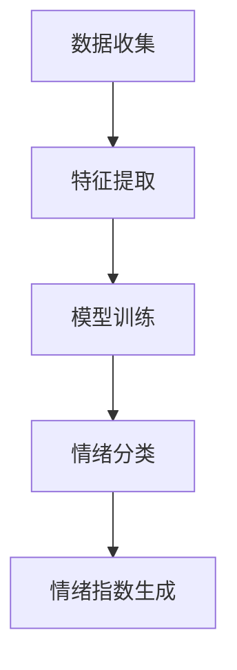
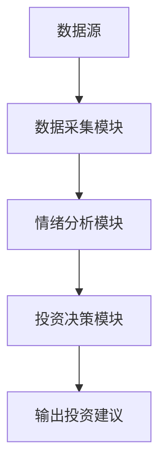

                 


# 约翰·聂夫的价值投资者情绪管理

> 关键词：约翰·聂夫，价值投资，情绪管理，投资决策，市场情绪，量化分析

> 摘要：本文深入探讨了约翰·聂夫的价值投资理念及其在情绪管理方面的应用。通过分析投资中的情绪问题、情绪量化的方法以及情绪管理的算法实现，本文为投资者提供了有效的策略和工具，帮助他们在复杂多变的市场中做出理性的决策。

---

## 第一部分: 价值投资与情绪管理的背景介绍

### 第1章: 价值投资的核心概念

#### 1.1 价值投资的定义与特点
价值投资是一种以基本面分析为基础的投资策略，强调以低于内在价值的价格买入优质资产。其核心特点包括：
- **长期导向**：关注企业的长期价值，而非短期价格波动。
- **安全边际**：买入价格低于内在价值，以降低风险。
- **逆向思维**：在市场恐慌时寻找机会，在市场狂热时保持冷静。

#### 1.2 约翰·聂夫的价值投资理念
约翰·聂夫是价值投资的代表人物之一，他的投资理念主要包括：
- **低市盈率策略**：偏好市盈率低于市场平均水平的股票。
- **企业质量**：关注企业盈利能力和财务健康状况。
- **长期持有**：通过长期持有优质资产获得 compound收益。

#### 1.3 情绪管理在投资中的重要性
情绪管理是价值投资成功的关键因素之一，主要体现在：
- **避免非理性决策**：情绪波动可能导致投资者做出错误决策，如盲目追涨杀跌。
- **维持纪律**：在市场波动中保持投资策略的纪律性，避免被短期情绪左右。
- **抓住机会**：情绪管理帮助投资者在市场恐慌时发现低估资产。

---

## 第二部分: 投资情绪的分类与分析

### 第2章: 投资情绪的类型与特征

#### 2.1 理性情绪与非理性情绪
| 情绪类型 | 特点 | 示例 |
|---------|------|------|
| 理性情绪 | 基于逻辑和事实，决策客观 | 分析市场数据，制定投资计划 |
| 非理性情绪 | 受情感和直觉影响，决策主观 | 股市上涨时贪婪，下跌时恐惧 |

#### 2.2 情绪波动的周期性分析
- **情绪周期**：市场情绪通常呈现周期性波动，包括乐观、狂热、恐慌和绝望四个阶段。
- **周期特征**：在周期顶部，投资者情绪过于乐观，容易忽视风险；在周期底部，投资者情绪低落，容易错失机会。

#### 2.3 情绪与市场行为的关系
- **情绪驱动市场**：投资者情绪影响市场行为，如交易量和价格波动。
- **市场反馈情绪**：市场走势反过来影响投资者情绪，形成情绪与市场的双向互动。

---

## 第三部分: 情绪管理的量化分析

### 第3章: 情绪量化的核心原理

#### 3.1 情绪量化的方法与工具
- **自然语言处理（NLP）**：通过分析新闻、社交媒体等文本数据，提取市场情绪。
- **数据可视化**：使用图表展示情绪指数的变化趋势。

#### 3.2 情绪指标的构建与分析
- **情绪指数**：通过加权平均等方法，将多源情绪数据整合为一个综合指数。
- **指标有效性**：通过回测和统计分析，验证情绪指标对投资决策的指导作用。

#### 3.3 情绪与市场数据的关联分析
- **相关性分析**：通过统计方法，分析情绪指数与市场收益、波动性之间的相关性。
- **因果关系**：探讨情绪变化是否导致市场波动。

---

## 第四部分: 情绪管理的算法实现

### 第4章: 情绪分析算法的实现

#### 4.1 情绪分析算法的原理
- **数据收集**：从社交媒体、新闻等来源获取文本数据。
- **特征提取**：提取文本中的情感关键词和语调特征。
- **模型训练**：使用机器学习算法（如SVM、LSTM）训练情绪分类模型。

#### 4.2 情绪分析的Mermaid流程图


#### 4.3 情绪分析的Python代码实现
```python
import numpy as np
from sklearn.svm import SVC
from sklearn.metrics import accuracy_score

# 示例数据
X_train = np.array([[0.5, 0.6], [0.7, 0.8], [0.3, 0.4]])
y_train = np.array([0, 1, 0])  # 0代表负面情绪，1代表正面情绪

# 训练模型
model = SVC()
model.fit(X_train, y_train)

# 测试数据
X_test = np.array([[0.6, 0.7], [0.4, 0.5]])
y_test = model.predict(X_test)

# 输出结果
print("预测情绪:", y_test)
```

---

## 第五部分: 项目实战

### 第5章: 系统架构与实现

#### 5.1 系统功能设计
- **数据采集模块**：从多种来源获取市场数据和情绪数据。
- **情绪分析模块**：对情绪数据进行处理和分析，生成情绪指数。
- **投资决策模块**：根据情绪指数和市场数据，制定投资策略。

#### 5.2 系统架构图


---

## 第六部分: 总结与展望

### 第6章: 最佳实践与小结

#### 6.1 小结
- 情绪管理是价值投资成功的关键。
- 通过量化分析和算法实现，投资者可以更好地控制情绪，制定科学的投资策略。

#### 6.2 注意事项
- 投资者应结合市场环境和个人情况，灵活调整情绪管理策略。
- 避免过度依赖算法，保持对市场的理性判断。

#### 6.3 未来展望
- 情绪管理的算法和工具将更加智能化，帮助投资者更好地应对复杂市场环境。

---

通过以上步骤，我们可以系统地理解并应用约翰·聂夫的价值投资理念，结合情绪管理的量化分析和算法实现，帮助投资者在复杂的市场中做出更理性的决策。

