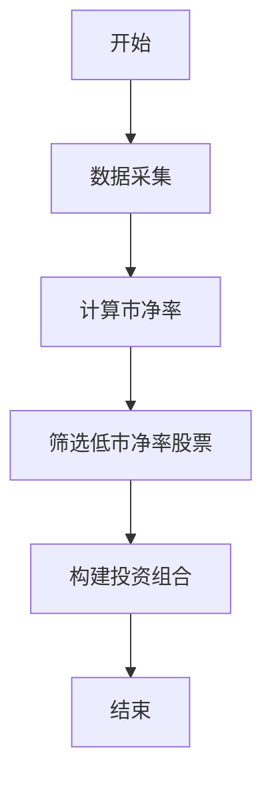
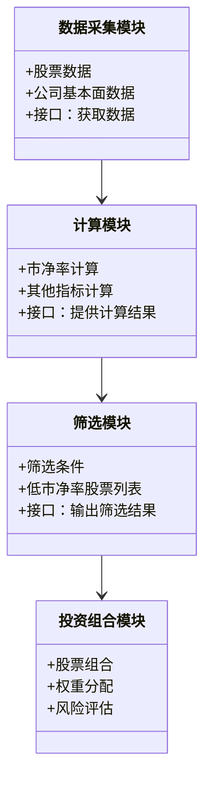
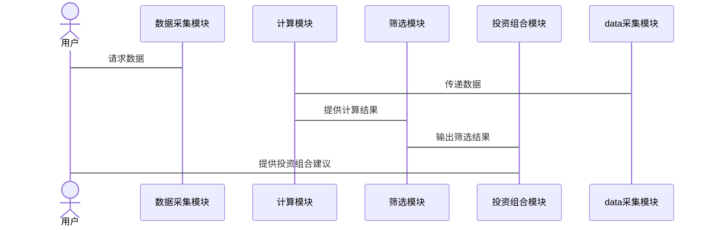

                 


# 《约翰·聂夫的低市净率投资：简单有效的价值筛选》

## 关键词：低市净率投资，约翰·聂夫，价值投资，股票筛选，投资策略

## 摘要：  
本文深入探讨了约翰·聂夫的低市净率投资策略，分析其核心概念、筛选方法及其在现代投资组合中的应用。通过数学模型、系统架构和实际案例，揭示了如何利用低市净率筛选股票，构建稳健的投资组合，帮助投资者在市场中挖掘低估价值股。

---

# 目录大纲：《约翰·聂夫的低市净率投资：简单有效的价值筛选》

## 第一部分：低市净率投资的背景与基础

### 第1章：低市净率投资的起源与发展

#### 1.1 低市净率投资的定义与核心理念
- 1.1.1 什么是低市净率投资
- 1.1.2 约翰·聂夫的投资理念与方法
- 1.1.3 低市净率投资与其他投资策略的对比

#### 1.2 低市净率投资的背景与现状
- 1.2.1 低市净率投资的起源与发展
- 1.2.2 约翰·聂夫的低市净率投资实践
- 1.2.3 当前低市净率投资的市场环境

## 第二部分：低市净率投资的核心概念与分析

### 第2章：低市净率投资的核心概念

#### 2.1 市净率的定义与计算
- 2.1.1 市净率的定义
- 2.1.2 市净率的计算公式：$$PB = \frac{P}{B}$$
- 2.1.3 市净率与企业价值的关系

#### 2.2 低市净率股票的筛选标准
- 2.2.1 低市净率的界定：$$PB < 1$$
- 2.2.2 其他筛选条件（如ROE、股息率等）
- 2.2.3 行业特性对筛选的影响

### 第3章：低市净率投资的数学模型与分析

#### 3.1 市净率的数学模型
- 3.1.1 市净率公式：$$PB = \frac{P}{B}$$
- 3.1.2 市净率与股价的关系分析：$$P = PB \times B$$

#### 3.2 低市净率投资的比较分析
- 3.2.1 市净率与市盈率的对比
- 3.2.2 不同行业间的市净率差异分析

## 第三部分：低市净率投资的筛选策略与流程

### 第4章：低市净率股票筛选的算法原理

#### 4.1 筛选流程概述
- 4.1.1 数据采集与处理
- 4.1.2 市净率计算与筛选
- 4.1.3 投资组合构建

#### 4.2 低市净率筛选流程的 mermaid 流程图


### 第5章：系统分析与架构设计方案

#### 5.1 低市净率股票筛选系统的功能模块
- 5.1.1 数据采集模块
- 5.1.2 计算模块
- 5.1.3 筛选模块
- 5.1.4 投资组合模块

#### 5.2 系统架构设计的 mermaid 类图


#### 5.3 系统交互设计的 mermaid 序列图


## 第四部分：项目实战与案例分析

### 第6章：低市净率投资的项目实战

#### 6.1 环境安装与工具准备
- 6.1.1 安装Python环境
- 6.1.2 安装数据分析库（如Pandas、NumPy）
- 6.1.3 数据源获取（如Yahoo Finance API）

#### 6.2 低市净率股票筛选的代码实现

##### 6.2.1 数据获取与预处理
```python
import pandas as pd
import numpy as np

# 示例数据：假设我们从Yahoo Finance获取数据
def get_data(ticker):
    # 这里需要实现实际的数据获取逻辑
    return pd.DataFrame({'price': [100], 'book_value': [50]}, index=[ticker])

# 获取股票数据
tickers = ['AAPL', 'MSFT', 'GOOGL']
df = pd.DataFrame()
for t in tickers:
    data = get_data(t)
    df = df.append(data)
```

##### 6.2.2 计算市净率并筛选
```python
# 计算市净率
df['PB'] = df['price'] / df['book_value']

# 筛选PB < 1的股票
low_pb_stocks = df[df['PB'] < 1]
print(low_pb_stocks)
```

#### 6.3 案例分析：2023年市场中的低市净率股票

##### 6.3.1 实际案例分析
- 选择特定行业的低市净率股票，例如金融行业。
- 计算这些股票的市净率，比较其与行业平均值的差异。

##### 6.3.2 投资组合构建
- 根据筛选结果，选择若干只低市净率股票，构建投资组合。
- 分析投资组合的风险与收益比。

## 第五部分：最佳实践与注意事项

### 第7章：低市净率投资的最佳实践

#### 7.1 投资策略的注意事项
- 7.1.1 行业选择的重要性
- 7.1.2 风险控制的必要性
- 7.1.3 定期复盘与调整

#### 7.2 低市净率投资的小结
- 7.2.1 低市净率投资的优势
- 7.2.2 该策略的局限性
- 7.2.3 结合其他指标的综合筛选

#### 7.3 拓展阅读与进一步学习
- 7.3.1 推荐书籍与文章
- 7.3.2 在线资源与工具
- 7.3.3 参与投资论坛与社区

---

## 结语  
通过本文的详细分析与实战案例，读者可以深入了解约翰·聂夫的低市净率投资策略，并能够在实际投资中应用这些方法，筛选出具有长期投资价值的低估股票，构建稳健的投资组合。

