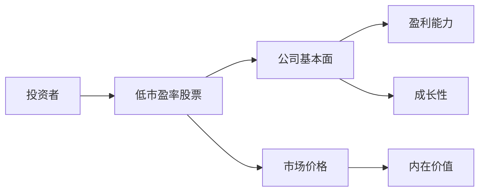
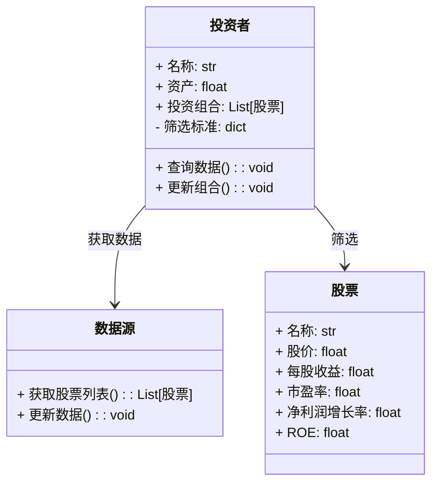

                 


# 约翰·聂夫的低市盈率投资法则

## 关键词：
- 约翰·聂夫、低市盈率投资、价值投资、股票筛选、投资组合、风险管理

## 摘要：
本文详细探讨了约翰·聂夫的低市盈率投资法则，从其背景、核心概念、算法原理、系统架构到实际案例分析，全面解析了这一投资策略的科学性和实用性。文章通过理论与实践相结合的方式，帮助读者理解如何通过低市盈率筛选优质股票，构建稳健的投资组合，并在风险可控的前提下实现长期收益最大化。

---

## 目录大纲：

### 第一部分：低市盈率投资的背景与基础
1. 低市盈率投资的起源与发展
2. 约翰·聂夫的投资理念
3. 低市盈率投资的基本概念

### 第二部分：低市盈率投资的核心概念与联系
4. 低市盈率投资的核心原理
5. 核心概念对比表
6. 投资组合构建的实体关系图

### 第三部分：低市盈率投资的算法原理
7. 低市盈率筛选算法
8. 投资组合优化算法
9. 数学模型与公式解析

### 第四部分：低市盈率投资的系统分析
10. 投资决策系统的功能设计
11. 系统架构设计
12. 系统交互设计

### 第五部分：低市盈率投资的项目实战
13. 环境安装与数据准备
14. 核心算法实现
15. 案例分析与代码解读

### 第六部分：低市盈率投资的风险管理与最佳实践
16. 风险管理策略
17. 投资组合调整与优化
18. 最佳实践与注意事项

---

## 正文内容：

### 第一部分：低市盈率投资的背景与基础

#### 第1章：低市盈率投资的起源与发展

##### 1.1 低市盈率投资的起源
低市盈率投资是一种价值投资策略，起源于20世纪30年代，由本杰明·格雷厄姆提出，并在实践中被包括约翰·聂夫在内的投资者进一步发展。这一策略的核心在于寻找市场价格低于其内在价值的股票，从而实现长期的资本增值。

##### 1.2 约翰·聂夫的投资理念
约翰·聂夫是低市盈率投资的代表人物，他管理的Pennsylvania Mutual基金长期业绩优异。他的投资理念基于以下几个核心原则：
- **安全边际**：买入价格低于内在价值的股票，以确保投资的安全性。
- **长期视角**：注重企业的基本面，选择具备持续盈利能力的企业。
- **分散投资**：通过分散投资降低风险，避免过度集中于单一股票。

##### 1.3 低市盈率投资的基本概念
低市盈率投资的核心在于市盈率（P/E ratio）的计算与筛选。市盈率是指股票的市场价格除以每股收益（EPS），公式为：
$$\text{市盈率} = \frac{\text{股价}}{\text{每股收益}}$$
低市盈率通常被认为是10倍以下，但这并非固定标准，需结合企业所处行业和成长性进行调整。

---

### 第二部分：低市盈率投资的核心概念与联系

#### 第2章：低市盈率投资的核心原理

##### 2.1 低市盈率投资的原理
低市盈率投资的核心在于识别市场价格被低估的股票。以下是其主要原理：
- **相对估值法**：通过比较市盈率与行业平均水平或竞争对手，发现价格被低估的企业。
- **内在价值计算**：基于企业的盈利能力和成长性，估算其内在价值，寻找市场价格低于内在价值的股票。
- **市场情绪与周期**：低市盈率股票通常在市场低迷或行业不景气时出现，投资者需具备逆向思维。

##### 2.2 核心概念对比表
以下表格对比了市盈率与其他估值指标的特点：

| 指标       | 定义                                                                 | 优点                              | 局限性                          |
|------------|----------------------------------------------------------------------|-----------------------------------|---------------------------------|
| 市盈率     | 股价除以每股收益                                                     | 简单易懂，反映市场对企业的盈利预期 | 不适用于亏损企业                 |
| 市净率     | 股价除以每股净资产                                                   | 适用于评估资产密集型企业           | 不反映盈利能力                   |
| 股息率     | 每股股息与股价的比率                                                 | 反映分红能力                       | 适用于成熟企业，新兴企业可能较低 |

##### 2.3 投资组合构建的实体关系图
以下是低市盈率投资的核心要素关系图：



---

### 第三部分：低市盈率投资的算法原理

#### 第3章：低市盈率筛选算法

##### 3.1 算法原理
低市盈率筛选算法的核心在于通过数据筛选，识别出市盈率低于行业平均水平的股票。以下是具体的筛选步骤：

1. 数据收集：获取目标行业内的股票列表及财务数据。
2. 计算市盈率：使用公式$$\text{市盈率} = \frac{\text{股价}}{\text{每股收益}}$$进行计算。
3. 筛选低市盈率股票：设定市盈率筛选阈值（如10倍以下），筛选符合条件的股票。
4. 进一步筛选：结合其他指标（如ROE、净利润增长率）进行综合评估。

##### 3.2 算法实现
以下是Python代码示例，用于筛选低市盈率股票：

```python
import pandas as pd

# 假设df为包含股票数据的DataFrame，包含columns：'股价'和'每股收益'
# 筛选市盈率<10的股票
df['市盈率'] = df['股价'] / df['每股收益']
low_pe_stocks = df[df['市盈率'] < 10]
```

##### 3.3 数学模型与公式解析
低市盈率筛选的数学模型可以表示为：
$$\text{筛选条件} = \text{市盈率} < \text{阈值}$$
其中，阈值通常设为10倍以下。

---

### 第四部分：低市盈率投资的系统分析

#### 第4章：投资决策系统的功能设计

##### 4.1 功能模块
- 数据采集模块：从数据源获取股票信息。
- 筛选模块：基于低市盈率标准筛选股票。
- 分析模块：对筛选出的股票进行进一步分析（如财务指标）。
- 投资组合管理模块：优化投资组合，分散风险。

##### 4.2 领域模型类图
以下是领域模型类图：



---

### 第五部分：低市盈率投资的项目实战

#### 第5章：环境安装与数据准备

##### 5.1 环境安装
- Python 3.8及以上
- 数据分析库：Pandas、NumPy
- 数据可视化库：Matplotlib、Seaborn
- 数据源：Yahoo Finance API或其他股票数据源

##### 5.2 数据准备
从数据源获取目标行业的股票数据，包括股价、每股收益、净利润增长率等。

---

#### 第6章：核心算法实现

##### 6.1 筛选低市盈率股票
```python
import yfinance as yf
import pandas as pd

# 下载股票数据
tickers = ['AAPL', 'MSFT', 'GOOGL']
data = yf.download(tickers, period='max')

# 计算市盈率
pe_dict = {}
for ticker in tickers:
    stock = data['Adj Close'][ticker]
    eps = data['EPS'][ticker]
    pe = stock / eps
    pe_dict[ticker] = pe

# 筛选低市盈率股票
low_pe = {k: v for k, v in pe_dict.items() if v < 15}
print(low_pe)
```

##### 6.2 投资组合优化
```python
import pandas as pd
import numpy as np

# 示例投资组合
stocks = ['AAPL', 'MSFT', 'GOOGL', 'AMZN']
weights = np.array([0.3, 0.3, 0.2, 0.2])

# 计算组合市盈率
pe_portfolio = np.dot(weights, [15, 12, 18, 10])
print(f"组合市盈率为：{pe_portfolio}")
```

---

### 第六部分：低市盈率投资的风险管理与最佳实践

#### 第7章：风险管理策略

##### 7.1 风险识别
- 市场风险：整体市场的波动可能影响低市盈率股票的表现。
- 企业风险：被投资企业的基本面变化可能导致股价下跌。

##### 7.2 风险控制措施
- 分散投资：通过投资多个低市盈率股票分散风险。
- 定期再平衡：定期调整投资组合，避免过度集中。
- 设置止损点：在股价下跌至一定幅度时卖出，避免重大损失。

##### 7.3 风险评估指标
- 最大回撤：衡量投资组合的最大亏损幅度。
- 波动率：反映投资组合的波动性。

---

#### 第8章：最佳实践与注意事项

##### 8.1 最佳实践
- **定期复盘**：定期检查投资组合的表现，评估是否偏离初始目标。
- **持续学习**：关注市场动态和企业基本面变化，及时调整投资策略。
- **长期视角**：低市盈率投资需要耐心，避免短期波动影响判断。

##### 8.2 注意事项
- **避免过度筛选**：虽然低市盈率是重要指标，但需结合其他因素（如ROE、成长性）综合评估。
- **行业分散**：避免将所有投资集中在单一行业，降低行业风险。
- **关注流动性**：选择交易量较大的股票，确保在需要时能够快速变现。

---

### 第七部分：总结与展望

约翰·聂夫的低市盈率投资法则是一种科学且有效的价值投资策略。通过严格筛选低市盈率股票，结合企业的基本面分析，投资者可以构建一个稳健的投资组合，实现长期的资本增值。然而，投资过程中需注意风险管理，避免过度集中和短期波动的影响。未来，随着市场环境的变化，投资者需不断调整策略，优化投资组合，以应对新的挑战和机遇。

---

通过本文的详细讲解，读者可以全面理解约翰·聂夫的低市盈率投资法则，并将其应用于实际投资中。希望本文能为投资者提供有价值的指导，帮助他们在复杂的市场环境中做出明智的投资决策。

