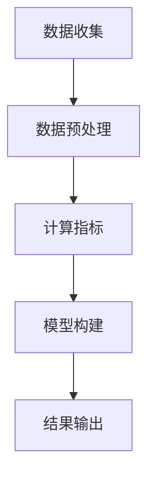

                 


# 约翰·聂夫的小盘价值股筛选标准

## 关键词：小盘价值股，约翰·聂夫，投资筛选标准，基本面分析，估值指标，竞争优势，财务健康

## 摘要：  
约翰·聂夫是美国著名投资经理，以小盘价值股投资闻名。本文将深入解析约翰·聂夫的小盘价值股筛选标准，从投资理念、筛选模型到实际应用，结合技术分析与案例研究，帮助投资者理解和应用这一经典投资策略。

---

# 第1章: 约翰·聂夫投资理念与小盘价值股背景

## 1.1 约翰·聂夫的投资哲学  
### 1.1.1 投资者的心理与行为分析  
约翰·聂夫认为，成功的投资需要在理性与感性之间找到平衡。他强调长期投资、分散风险和对市场情绪的深刻理解。  

### 1.1.2 小盘价值股的定义与特点  
小盘价值股是指市值较小、估值低于市场平均水平的股票。其特点包括：低市盈率（P/E）、低市净率（P/B）、高股息率和较高的安全边际。  

### 1.1.3 小盘价值股投资的历史与现状  
小盘价值股投资在历史上经历过多次周期性波动，但在长期来看，其回报率显著优于大盘股。  

## 1.2 小盘价值股的投资价值  
### 1.2.1 小盘股的市场定位与机会  
小盘股通常具有较高的增长潜力，因其市值较小，更容易通过内生增长实现价值提升。  

### 1.2.2 价值股的特征与优势  
价值股的核心特征包括低估值、高分红和较高的内在价值。其优势在于市场波动时的防御性较强。  

### 1.2.3 小盘价值股的长期回报分析  
研究表明，小盘价值股在长期表现上优于大盘成长股，尤其是在市场低迷时期，其防御性更加显著。  

## 1.3 本章小结  
约翰·聂夫的投资理念以基本面分析为核心，结合小盘价值股的低估值和高增长潜力，形成了独特的筛选标准。  

---

# 第2章: 小盘价值股筛选标准的核心概念

## 2.1 筛选标准的背景与目标  
### 2.1.1 筛选标准的必要性  
为了避免盲目投资，筛选标准能够帮助投资者快速定位具备潜力的小盘价值股。  

### 2.1.2 筛选标准的目标与原则  
目标是筛选出具有低估值、高成长性和强竞争优势的股票。原则包括：低市盈率、低市净率、高股息率和财务健康。  

## 2.2 核心概念与联系  
### 2.2.1 筛选标准的核心要素  
1. 市盈率（P/E）：低于行业平均水平。  
2. 市净率（P/B）：低于行业平均水平。  
3. 股息率：高于行业平均水平。  
4. 净利润增长率：过去三年年均增长率不低于5%。  

### 2.2.2 核心要素之间的关系  
通过公式：  
$$ \text{筛选标准} = f(\text{P/E}, \text{P/B}, \text{股息率}, \text{净利润增长率}) $$  
可以看出，各指标相互补充，共同构成筛选模型。  

### 2.2.3 筛选标准的数学模型与公式  
以约翰·聂夫的筛选模型为例：  
$$ \text{筛选得分} = 0.4 \times (\text{P/E}) + 0.3 \times (\text{P/B}) + 0.2 \times (\text{股息率}) + 0.1 \times (\text{净利润增长率}) $$  

## 2.3 筛选标准的属性特征对比  
### 2.3.1 估值指标对比  
| 指标 | 标准值 |  
|------|--------|  
| P/E  | < 15   |  
| P/B  | < 2    |  

### 2.3.2 财务指标对比  
| 指标         | 标准值 |  
|--------------|--------|  
| 净利润增长率 | ≥5%    |  
| 股息率       | ≥3%    |  

### 2.3.3 市场指标对比  
| 指标     | 标准值 |  
|----------|--------|  
| 市场地位 | 中小盘 |  

## 2.4 筛选标准的ER实体关系图  
```mermaid
er
actor 投资者
actor 筛选标准
actor 小盘价值股
```

---

# 第3章: 小盘价值股筛选标准的算法原理

## 3.1 筛选标准的算法概述  
### 3.1.1 算法的基本原理  
通过多因子模型，结合估值、成长性和财务健康指标，对股票进行评分和排序。  

### 3.1.2 算法的核心步骤  
1. 数据收集：获取目标股票的财务数据。  
2. 数据预处理：计算各项指标。  
3. 模型构建：根据筛选标准进行评分。  
4. 结果输出：筛选出符合条件的股票。  

## 3.2 筛选标准的数学模型与公式  
以约翰·聂夫的多因子模型为例：  
$$ \text{总得分} = 0.4 \times (\text{P/E}) + 0.3 \times (\text{P/B}) + 0.2 \times (\text{股息率}) + 0.1 \times (\text{净利润增长率}) $$  

## 3.3 算法的流程图  


---

# 第4章: 小盘价值股筛选标准的系统分析与架构设计

## 4.1 系统分析  
### 4.1.1 系统目标与范围  
目标是构建一个基于约翰·聂夫筛选标准的股票筛选系统。  

### 4.1.2 系统功能需求  
- 数据采集：获取股票数据。  
- 数据处理：计算各项指标。  
- 模型构建：根据筛选标准筛选股票。  
- 结果展示：输出筛选结果。  

### 4.1.3 系统性能需求  
- 响应时间：快速处理数据。  
- 可扩展性：支持大规模数据处理。  

## 4.2 系统架构设计  
### 4.2.1 系统架构图的绘制  


### 4.2.2 系统架构图的解释  
系统分为数据采集、数据处理、模型构建和结果展示四个模块，各模块之间相互独立，协同工作。  

### 4.2.3 系统架构图的应用  
通过模块化设计，系统能够高效处理数据并输出结果。  

## 4.3 系统接口设计  
### 4.3.1 系统接口的定义  
- 输入接口：股票数据。  
- 输出接口：筛选结果。  

### 4.3.2 系统接口的实现  
通过API接口实现数据输入和输出。  

### 4.3.3 系统接口的交互流程  
```mermaid
sequence
投资者 -> 数据采集模块: 提供股票列表
数据采集模块 -> 数据处理模块: 提供数据
数据处理模块 -> 模型构建模块: 提供计算结果
模型构建模块 -> 结果展示模块: 提供筛选结果
结果展示模块 -> 投资者: 显示筛选结果
```

---

# 第5章: 小盘价值股筛选标准的项目实战

## 5.1 环境安装  
- 安装Python和相关库（Pandas、NumPy、Matplotlib）。  

## 5.2 系统核心实现源代码  
```python
import pandas as pd
import numpy as np

# 数据加载
df = pd.read_csv('stock_data.csv')

# 数据预处理
def calculate_score(row):
    pe = row['PE']
    pb = row['PB']
    dividend_yield = row['Dividend Yield']
    net_profit_growth = row['Net Profit Growth']
    return 0.4 * pe + 0.3 * pb + 0.2 * dividend_yield + 0.1 * net_profit_growth

# 计算得分
df['Score'] = df.apply(calculate_score, axis=1)

# 筛选结果
selected_stocks = df[df['Score'] > 70]
```

## 5.3 代码应用解读与分析  
- 数据加载：读取股票数据。  
- 数据预处理：计算各项指标。  
- 筛选结果：根据得分筛选出符合条件的股票。  

## 5.4 实际案例分析  
以某小盘股为例，计算其得分并判断是否符合筛选标准。  

## 5.5 项目小结  
通过代码实现，可以快速筛选出符合约翰·聂夫标准的小盘价值股。  

---

# 第6章: 小盘价值股筛选标准的最佳实践

## 6.1 投资策略与风险管理  
- 分散投资：避免过度集中。  
- 定期复评：动态调整投资组合。  

## 6.2 筛选标准的优化与调整  
- 根据市场变化调整权重。  
- 引入更多指标（如ROE、ROA）。  

## 6.3 筛选标准的注意事项  
- 数据来源的可靠性。  
- 模型的适用性。  

## 6.4 拓展阅读  
推荐阅读约翰·聂夫的《小盘股投资》等书籍。  

---

# 附录

## 附录A: 数据来源与工具推荐  
- 数据来源：Yahoo Finance、Google Finance。  
- 工具推荐：Python、Pandas、NumPy。  

## 附录B: 约翰·聂夫的经典语录  
- "投资的秘诀在于找到那些被市场忽视的好公司。"  

## 附录C: 筛选标准的详细公式  
$$ \text{Score} = 0.4 \times \text{P/E} + 0.3 \times \text{P/B} + 0.2 \times \text{Dividend Yield} + 0.1 \times \text{Net Profit Growth} $$  

---

# 本文小结  
通过本文的分析，读者可以全面了解约翰·聂夫的小盘价值股筛选标准，并将其应用于实际投资中。

