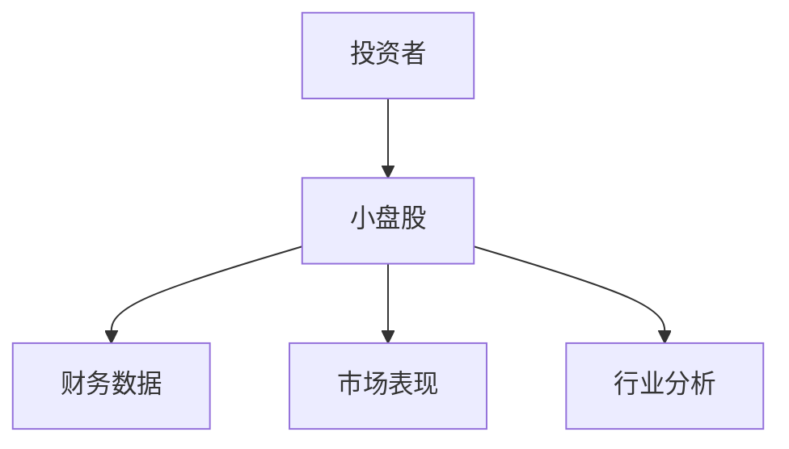
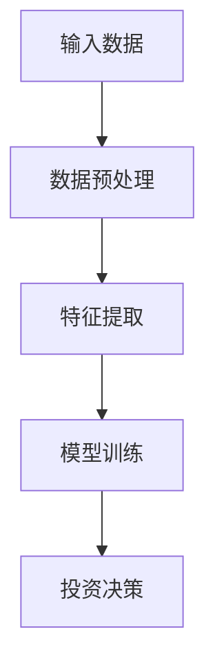
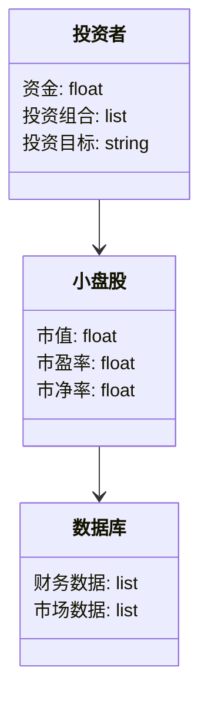
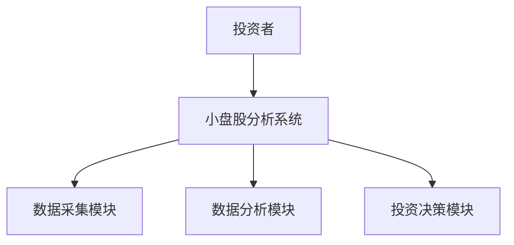
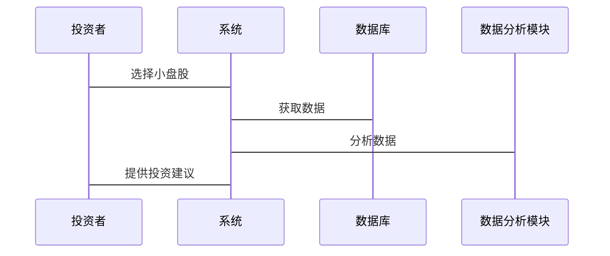

                 


# 约翰·聂夫的小盘股研究方法论

## 关键词
小盘股投资、约翰·聂夫、投资方法论、算法原理、系统架构、项目实战

## 摘要
本文深入探讨了约翰·聂夫的小盘股研究方法论，从背景介绍、核心概念到算法原理、系统架构，再到项目实战和最佳实践，全面解析其投资策略。通过详细讲解每一步骤，帮助读者理解并应用小盘股研究的系统性方法，提升投资决策能力。

---

# 第一部分: 小盘股投资的背景与概述

## 第1章: 小盘股投资的定义与特点

### 1.1 小盘股的定义与分类
#### 1.1.1 小盘股的定义
- 小盘股指的是市值较小的公司股票，通常在30亿到20亿美元之间。
- 小盘股市场具有较高的波动性和潜在的高增长机会。

#### 1.1.2 小盘股的分类与特点
- 按市值划分：微小盘、小盘、中盘和大盘。
- 小盘股特点：流动性较低、波动性较高、成长性强。

#### 1.1.3 小盘股与大盘股的对比
- 小盘股：高增长潜力，但风险较高。
- 大盘股：稳定性高，风险较低，但增长潜力有限。

### 1.2 小盘股投资的背景与现状
#### 1.2.1 小盘股市场的特点
- 市场参与者较少，竞争相对较低。
- 市场信息不充分，存在较多的未发现价值。

#### 1.2.2 小盘股投资的现状与趋势
- 近年来，小盘股投资逐渐受到更多关注。
- 数字化工具的应用使得小盘股研究更加高效。

#### 1.2.3 小盘股投资的风险与机遇
- 风险：流动性风险、信息不对称、波动性大。
- 机遇：潜在的高回报、市场低估的机会。

## 第2章: 约翰·聂夫的投资理念与方法论

### 2.1 约翰·聂夫的个人背景与投资风格
#### 2.1.1 约翰·聂夫的个人简介
- 约翰·聂夫是美国著名的投资专家，专注于小盘股投资。
- 他的投资理念强调长期价值和基本面分析。

#### 2.1.2 小盘股投资的核心理念
- 专注于具有强大基本面和成长潜力的小盘股。
- 长期持有，注重公司的内在价值。

#### 2.1.3 约翰·聂夫的投资风格与特点
- 逆向投资：在市场低估时买入，高估时卖出。
- 低市盈率策略：选择市盈率低于行业平均水平的公司。

### 2.2 小盘股研究的核心要素
#### 2.2.1 财务指标分析
- 利润能力：净利润率、ROE。
- 营运能力：存货周转率、应收账款周转率。
- 偿债能力：资产负债率、流动比率。

#### 2.2.2 市盈率与市净率分析
- 市盈率（P/E）：股价与每股收益的比率。
- 市净率（P/B）：股价与每股净资产的比率。
- 低市盈率和低市净率的公司具有较高的投资价值。

#### 2.2.3 公司基本面与成长潜力
- 公司所处行业的发展前景。
- 管理团队的能力和稳定性。
- 公司的竞争优势和市场地位。

---

# 第二部分: 小盘股研究的核心概念与联系

## 第3章: 核心概念原理

### 3.1 核心概念原理
#### 3.1.1 小盘股研究的核心要素
- 财务指标：盈利能力、营运能力、偿债能力。
- 市场指标：市盈率、市净率。
- 基本面因素：行业前景、管理团队、竞争优势。

#### 3.1.2 投资决策的关键因素
- 公司的成长性：未来收入和利润的增长潜力。
- 公司的财务健康：是否有稳定的盈利能力和良好的财务状况。
- 市场环境：宏观经济环境和行业趋势。

#### 3.1.3 小盘股研究的系统性框架
- 数据收集：收集公司的财务数据、行业数据。
- 数据分析：运用财务指标和市场指标进行分析。
- 投资决策：根据分析结果做出投资决策。

### 3.2 核心概念属性特征对比

#### 3.2.1 小盘股与大盘股的对比分析
| 特性       | 小盘股                     | 大盘股                     |
|------------|---------------------------|---------------------------|
| 市值范围     | 30亿到20亿美元             | 200亿美元以上             |
| 波动性       | 高                        | 低                        |
| 成长潜力     | 高                        | 中等                      |
| 风险         | 高                        | 低                        |

#### 3.2.2 小盘股研究的核心指标对比
| 指标         | 小盘股研究                | 大盘股研究                |
|--------------|--------------------------|--------------------------|
| 关注重点     | 市盈率、市净率、成长性    | 市盈率、市净率、稳定性    |
| 数据来源     | 公司财报、行业报告        | 公司财报、行业报告        |
| 分析方法     | 财务指标分析、市场分析    | 财务指标分析、市场分析    |

#### 3.2.3 小盘股研究方法的优缺点
- 优点：潜在的高回报、市场低估的机会。
- 缺点：流动性风险、信息不对称、波动性大。

### 3.3 ER实体关系图架构


---

# 第三部分: 小盘股研究的算法原理与数学模型

## 第4章: 算法原理

### 4.1 算法原理
#### 4.1.1 投资决策的数学模型
- 使用CAPM模型计算股票的预期回报率。
- 通过市盈率和市净率分析公司估值。

#### 4.1.2 算法流程图


#### 4.1.3 Python代码示例
```python
import pandas as pd
import numpy as np

# 示例数据
data = {
    '公司名称': ['公司A', '公司B', '公司C'],
    '市盈率': [15, 20, 25],
    '市净率': [2, 3, 4],
    '净利润率': [10, 15, 20]
}

df = pd.DataFrame(data)

# 计算预期回报率
def calculate_return(row):
    pe = row['市盈率']
    pb = row['市净率']
    roe = row['净利润率']
    return (pe + pb + roe) / 3

df['预期回报率'] = df.apply(calculate_return, axis=1)
print(df)
```

#### 4.1.4 数学公式
- 预期回报率公式：
  $$
  \text{预期回报率} = \frac{\text{市盈率} + \text{市净率} + \text{净利润率}}{3}
  $$

---

# 第四部分: 系统分析与架构设计

## 第5章: 系统架构设计

### 5.1 系统功能设计
#### 5.1.1 领域模型


#### 5.1.2 系统架构


### 5.2 系统接口设计
#### 5.2.1 数据接口
- 数据输入接口：接收公司财务数据和市场数据。
- 数据输出接口：输出分析结果和投资建议。

#### 5.2.2 交互设计
- 用户输入：选择关注的小盘股。
- 系统输出：分析报告和投资建议。

### 5.3 系统交互设计


---

# 第五部分: 项目实战

## 第6章: 项目实战

### 6.1 环境安装
- 安装Python和相关库（pandas、numpy、matplotlib）。
- 安装Jupyter Notebook用于数据分析和可视化。

### 6.2 系统核心实现
#### 6.2.1 数据采集模块
- 使用API获取小盘股的财务数据和市场数据。
- 数据清洗和预处理。

#### 6.2.2 数据分析模块
- 计算财务指标（市盈率、市净率、净利润率）。
- 可视化分析结果（柱状图、折线图）。

#### 6.2.3 投资决策模块
- 基于分析结果生成投资建议。
- 输出投资组合和风险评估。

### 6.3 代码实现
#### 6.3.1 数据采集
```python
import requests
import json

url = "https://api.example.com/stocks"
params = {
    'market_cap': 'small'
}

response = requests.get(url, params=params)
data = json.loads(response.text)
```

#### 6.3.2 数据分析
```python
import pandas as pd
import matplotlib.pyplot as plt

df = pd.DataFrame(data)
df['市盈率'].plot(kind='bar')
plt.show()
```

### 6.4 案例分析
#### 6.4.1 案例背景
- 选择一家小盘股公司，分析其财务数据和市场表现。

#### 6.4.2 数据分析
- 计算市盈率、市净率和净利润率。
- 对比行业平均水平，评估公司的估值。

#### 6.4.3 投资决策
- 根据分析结果，决定是否投资该公司。

### 6.5 项目小结
- 通过实际案例，验证小盘股研究方法的有效性。
- 总结项目经验，优化研究流程。

---

# 第六部分: 最佳实践与总结

## 第7章: 最佳实践

### 7.1 小结
- 约翰·聂夫的小盘股研究方法论具有较高的实用价值。
- 通过系统性分析，可以有效识别具有投资价值的小盘股。

### 7.2 注意事项
- 风险提示：小盘股投资风险较高，需谨慎操作。
- 数据质量：确保数据来源可靠，避免信息偏差。
- 持续学习：关注市场变化，及时调整投资策略。

### 7.3 拓展阅读
- 推荐书籍：《彼得·林奇的成功投资》、《价值投资实战》。
- 推荐网站：晨星、FactSet、S&P Capital IQ。

---

# 结语

通过本文的详细讲解，读者可以全面了解约翰·聂夫的小盘股研究方法论，并掌握其在实际投资中的应用。希望本文能为投资者提供有价值的参考，帮助他们在小盘股投资领域取得成功。

