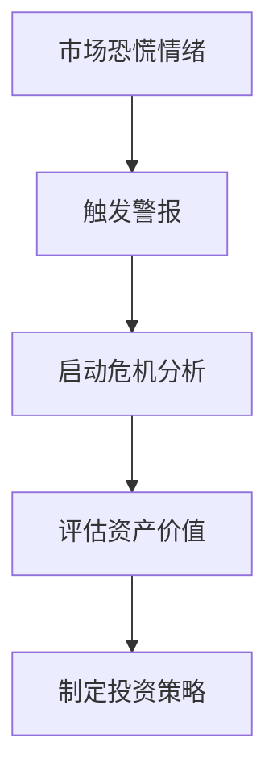
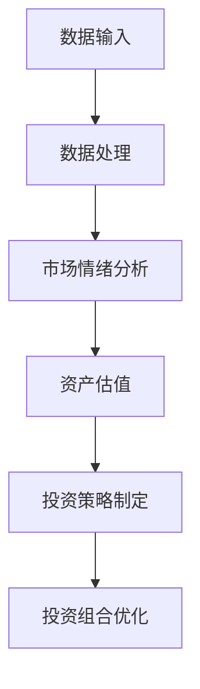

                 


# 约翰·邓普顿的危机投资策略：在恐慌中寻找机会

## 关键词：
- 约翰·邓普顿
- 危机投资
- 恐慌市场
- 投资策略
- 价值投资
- 风险管理

## 摘要：
本文深入探讨了约翰·邓普顿的危机投资策略，分析了他在恐慌市场中的投资哲学、核心概念、算法原理和系统架构。通过结合数学模型和实际案例，详细讲解了如何在市场危机中识别机会，制定投资策略，并进行风险管理。文章还提供了项目实战和最佳实践，帮助读者在恐慌市场中找到投资机会。

---

# 第一部分：背景介绍

## 第1章：约翰·邓普顿的投资哲学

### 1.1 约翰·邓普顿的生平简介
约翰·邓普顿（John Templeton）是20世纪著名的投资家，以在市场恐慌中寻找投资机会而闻名。他创立了邓普顿基金，被誉为“牛市中的乌龟”。邓普顿的投资哲学强调在市场恐慌时买入低估资产，在市场疯狂时卖出资产。

### 1.2 投资哲学的核心理念
- **价值投资**：寻找市场价格低于内在价值的资产。
- **逆向投资**：在市场恐慌时买入，市场疯狂时卖出。
- **分散投资**：通过分散投资降低风险。
- **长期视角**：关注长期价值，而非短期波动。

### 1.3 邓普顿投资哲学的现代意义
尽管邓普顿的投资哲学源于传统价值投资，但在现代市场中仍具有重要意义。恐慌市场中的投资机会仍然存在，投资者需要具备逆向思维和风险管理能力。

---

## 第2章：危机投资策略的核心概念

### 2.1 危机投资的定义与特征
- **定义**：在市场恐慌或危机期间，通过分析市场情绪和资产价格，寻找被低估的投资机会。
- **特征**：
  - 市场恐慌情绪高
  - 资产价格被低估
  - 投资者情绪极端

### 2.2 危机投资的核心概念
- **市场情绪分析**：通过情绪指标（如恐慌指数、VIX指数）评估市场恐慌程度。
- **资产估值**：使用DCF模型、市盈率等方法评估资产是否被低估。
- **安全边际**：在买入资产时，确保价格远低于内在价值。

### 2.3 危机投资的ER实体关系图
```mermaid
entity Market_Panic {
  id: 市场恐慌
  attributes: 惶恐慌指标、市场情绪、资产价格
}

entity Investment_Opportunity {
  id: 投资机会
  attributes: 资产价格、内在价值、安全边际
}

Market_Panic --> Investment_Opportunity
```

---

# 第二部分：危机投资策略的系统分析与架构设计

## 第3章：算法原理

### 3.1 危机识别算法流程图


### 3.2 危机投资的数学模型

#### 3.2.1 投资回报的数学公式
$$ R = \frac{P_{final} - P_{initial}}{P_{initial}} \times 100\% $$

#### 3.2.2 风险调整后的回报模型
$$ R_{adj} = R - \alpha \times Risk $$

#### 3.2.3 投资组合优化模型
$$ Maximize \quad R \quad subject \quad to \quad Risk \leq R_{max} $$

---

## 第4章：系统架构与工具

### 4.1 系统架构设计


### 4.2 工具与技术
- 数据分析工具：Python、R、Excel
- 估值模型：DCF模型、市盈率模型
- 风险管理工具：VIX指数、波动率分析

---

# 第三部分：项目实战

## 第5章：项目环境配置

### 5.1 环境需求
- Python 3.8+
- Jupyter Notebook
- Pandas、NumPy、Matplotlib

### 5.2 代码实现

#### 5.2.1 数据获取与处理
```python
import pandas as pd
import numpy as np

# 获取市场数据
data = pd.read_csv('market_data.csv')

# 计算市场情绪指标
data['Market_Panic_Index'] = np.where(data['price'].diff().fillna(0) < 0, 1, 0)
```

#### 5.2.2 投资策略实现
```python
def calculate_margin_of_safety(price, intrinsic_value):
    return intrinsic_value - price

# 示例：计算安全边际
price = 50
intrinsic_value = 100
margin = calculate_margin_of_safety(price, intrinsic_value)
print(f"安全边际为：{margin}")
```

## 第6章：案例分析与总结

### 6.1 案例分析
- **案例背景**：2008年金融危机期间，邓普顿基金通过购买被低估的资产获得了丰厚回报。
- **策略分析**：在市场恐慌时，邓普顿通过价值投资和分散投资策略，成功捕捉到了市场底部的投资机会。

### 6.2 总结
- 危机投资需要逆向思维和长期视角。
- 投资者应具备市场情绪分析和资产估值的能力。
- 风险管理是危机投资的核心，确保投资组合的安全性。

---

## 第7章：最佳实践与注意事项

### 7.1 最佳实践
- **持续学习**：关注市场动态，学习投资知识。
- **分散投资**：避免过度集中，降低风险。
- **长期持有**：耐心等待市场反转。

### 7.2 注意事项
- 避免情绪化决策。
- 严格控制仓位，防止过度杠杆。
- 定期评估投资组合，及时调整策略。

---

## 第8章：小结与展望

### 8.1 小结
本文系统地介绍了约翰·邓普顿的危机投资策略，从投资哲学到算法实现，再到项目实战，全面解析了如何在恐慌市场中寻找投资机会。

### 8.2 展望
未来，危机投资策略将更加依赖于数据科学和人工智能技术。投资者需要结合技术进步，不断提升自身的分析能力和风险管理能力。

---

# 结语
约翰·邓普顿的危机投资策略为投资者提供了在恐慌市场中寻找机会的思路。通过逆向思维和长期视角，投资者可以在市场底部布局，捕捉潜在的投资机会。希望本文能为投资者提供有价值的参考和启发。

---

