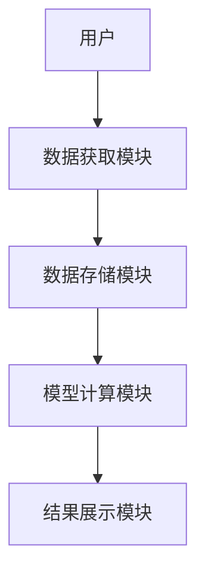
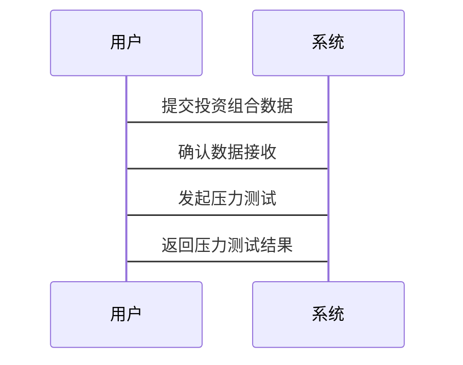

                 


# 约翰伯格的'压力测试'：评估投资组合的抗风险能力

---

## 关键词：
- 压力测试
- 投资组合
- 抗风险能力
- 约翰·伯格
- 风险评估
- 数学模型
- 系统架构

---

## 摘要：
本文深入探讨了压力测试在评估投资组合抗风险能力中的应用，结合约翰·伯格的经典理论，分析了压力测试的核心概念、数学模型、系统架构及实际项目实现。通过详细讲解压力测试的方法论，包括历史模拟法和蒙特卡洛模拟法，以及相应的Python代码实现，本文为读者提供了从理论到实践的全面指导。

---

# 第一部分：压力测试的背景与基础

## 第1章：压力测试的背景与基础

### 1.1 压力测试的定义与核心概念

#### 1.1.1 压力测试的定义
压力测试是一种用于评估投资组合在极端市场条件下的表现和风险的方法。通过模拟市场崩盘、经济衰退等极端情景，压力测试可以帮助投资者了解投资组合在这些情况下的潜在损失和抗风险能力。

#### 1.1.2 压力测试的核心要素
- **极端情景**：模拟市场可能出现的极端情况，如股灾、经济危机等。
- **损失评估**：计算投资组合在这些情景下的潜在损失。
- **风险暴露**：分析投资组合在不同资产类别、行业或地域上的风险敞口。

#### 1.1.3 压力测试在投资组合管理中的作用
- **风险控制**：帮助投资者识别和管理潜在的极端风险。
- **资产配置**：通过压力测试结果优化资产配置，降低整体风险。
- **决策支持**：为投资决策提供数据支持，特别是在市场波动剧烈时。

---

### 1.2 投资组合抗风险能力的评估框架

#### 1.2.1 投资组合的风险类型
- **市场风险**：市场波动导致的资产价格下跌。
- **信用风险**：债券发行人违约的风险。
- **流动性风险**：无法快速变现资产的风险。
- **操作风险**：交易失误或系统故障导致的损失。

#### 1.2.2 抗风险能力的评估维度
- **VaR（在险价值）**：一定置信水平下，投资组合的最大潜在损失。
- **CVaR（条件在险价值）**：在VaR基础上，考虑超过VaR的潜在损失。
- **最大回撤**：投资组合在一定时间段内的最大亏损幅度。

#### 1.2.3 压力测试与投资组合抗风险能力的关系
压力测试通过模拟极端情景，评估投资组合在这些情景下的表现，从而帮助投资者了解其抗风险能力。压力测试结果可以为投资组合的优化和调整提供依据。

---

## 第2章：压力测试的历史与发展

### 2.1 压力测试的起源与演变

#### 2.1.1 压力测试的起源
压力测试的起源可以追溯到20世纪80年代，当时金融学家开始意识到传统风险评估方法在极端情景下的不足，于是提出了压力测试的概念。

#### 2.1.2 压力测试的发展历程
- **早期阶段**：压力测试主要用于银行和金融机构的风险管理。
- **快速发展**：随着2008年金融危机的爆发，压力测试成为投资组合管理的重要工具。
- **现代应用**：当前，压力测试广泛应用于机构投资者和个人投资者的风险管理。

#### 2.1.3 约翰·伯格在压力测试领域的贡献
约翰·伯格是压力测试领域的先驱之一，他在《投资组合的抗风险能力》一书中提出了许多经典的压力测试方法，为现代压力测试理论奠定了基础。

---

# 第二部分：压力测试的核心理论与方法

## 第3章：压力测试的核心理论框架

### 3.1 压力测试的理论基础

#### 3.1.1 现代投资组合理论（MPT）
现代投资组合理论（MPT）由哈里·马科维茨提出，强调通过分散投资降低风险。压力测试是对MPT的补充，用于评估投资组合在极端情景下的表现。

#### 3.1.2 风险中性定价与压力测试
风险中性定价假设市场不存在系统性风险，而压力测试则关注系统性风险，两者结合可以帮助投资者全面评估风险。

#### 3.1.3 压力测试的数学模型基础
压力测试的核心是数学模型，如VaR和CVaR，这些模型帮助投资者量化投资组合在极端情景下的潜在损失。

---

### 3.2 压力测试的核心方法论

#### 3.2.1 压力测试的主要方法
- **历史模拟法**：基于历史市场数据，模拟极端情景下的投资组合表现。
- **蒙特卡洛模拟法**：通过随机模拟市场情景，评估投资组合的潜在损失。

#### 3.2.2 压力测试的数学模型
- **VaR模型**：计算投资组合在一定置信水平下的最大潜在损失。
- **CVaR模型**：计算超过VaR的潜在损失。

#### 3.2.3 压力测试的实施步骤
1. **定义极端情景**：如市场崩盘、经济衰退等。
2. **模拟情景**：使用历史数据或蒙特卡洛模拟生成情景。
3. **计算潜在损失**：基于情景计算投资组合的潜在损失。
4. **分析结果**：评估投资组合的抗风险能力，并进行必要的调整。

---

## 第4章：压力测试的主要方法

### 4.1 历史模拟法

#### 4.1.1 历史模拟法的定义
历史模拟法通过回顾历史市场数据，模拟投资组合在极端情景下的表现。

#### 4.1.2 历史模拟法的实施步骤
1. **收集历史数据**：获取投资组合历史收益率数据。
2. **排序极端情景**：识别历史上的极端市场事件。
3. **计算潜在损失**：基于极端情景计算投资组合的损失。

#### 4.1.3 历史模拟法的优缺点
- **优点**：基于实际市场数据，结果具有较高的可信度。
- **缺点**：依赖历史数据，可能无法完全模拟未来极端情景。

---

### 4.2 蒙特卡洛模拟法

#### 4.2.1 蒙特卡洛模拟法的定义
蒙特卡洛模拟法通过随机生成市场情景，模拟投资组合在极端情景下的表现。

#### 4.2.2 蒙特卡洛模拟法的实施步骤
1. **定义概率分布**：为市场变量（如股票价格、利率）定义概率分布。
2. **生成随机情景**：随机生成市场情景。
3. **计算潜在损失**：基于情景计算投资组合的损失。

#### 4.2.3 蒙特卡洛模拟法的优缺点
- **优点**：能够模拟未来可能的极端情景。
- **缺点**：结果依赖于概率分布假设，可能不够准确。

---

# 第三部分：压力测试的数学模型与算法

## 第5章：VaR模型

### 5.1 VaR模型的定义与计算
VaR（在险价值）是在一定置信水平下，投资组合的最大潜在损失。

#### 5.1.1 VaR的计算公式
$$VaR = \text{投资组合价值} \times \text{置信水平的分位数}$$

#### 5.1.2 VaR的实现步骤
1. **计算投资组合收益率的分布**。
2. **确定置信水平**。
3. **计算VaR值**。

#### 5.1.3 VaR的代码实现
```python
import numpy as np

def calculate VaR(portfolio_returns, confidence_level):
    sorted_returns = np.sort(portfolio_returns)
    percentile = 100 - confidence_level
    VaR = sorted_returns[int(len(sorted_returns) * percentile / 100)]
    return VaR
```

---

## 第6章：CVaR模型

### 6.1 CVaR模型的定义与计算
CVaR（条件在险价值）是超过VaR的潜在损失的期望值。

#### 6.1.1 CVaR的计算公式
$$CVaR = \frac{1}{n} \sum_{i=k+1}^{n} r_i$$
其中，$r_i$是投资组合收益率的排序，$k$是VaR对应的序号。

#### 6.1.2 CVaR的实现步骤
1. **计算VaR值**。
2. **计算超过VaR的平均损失**。

#### 6.1.3 CVaR的代码实现
```python
import numpy as np

def calculate CVaR(portfolio_returns, VaR_value):
    exceed_losses = [r for r in portfolio_returns if r < VaR_value]
    CVaR = np.mean(exceed_losses)
    return CVaR
```

---

# 第四部分：压力测试的系统架构

## 第7章：系统架构设计

### 7.1 系统功能设计
- **数据获取模块**：获取投资组合的历史收益率数据。
- **模型计算模块**：计算VaR和CVaR值。
- **结果展示模块**：可视化压力测试结果。

### 7.2 系统架构图


---

## 第8章：系统接口设计

### 8.1 系统接口设计
- **输入接口**：接收投资组合数据和压力测试参数。
- **输出接口**：返回压力测试结果。

---

## 第9章：系统交互设计

### 9.1 系统交互序列图


---

# 第五部分：压力测试的项目实战

## 第10章：项目实战

### 10.1 环境配置
- **Python版本**：3.8及以上
- **依赖库**：numpy, pandas, matplotlib

### 10.2 核心实现

#### 10.2.1 数据获取
```python
import pandas as pd
import numpy as np

# 获取历史收益率数据
data = pd.read_csv('portfolio_returns.csv')
returns = data['returns'].values
```

#### 10.2.2 VaR计算
```python
def calculate VaR(returns, confidence_level):
    sorted_returns = np.sort(returns)
    percentile = 100 - confidence_level
    VaR = sorted_returns[int(len(sorted_returns) * percentile / 100)]
    return VaR
```

#### 10.2.3 CVaR计算
```python
def calculate CVaR(returns, VaR_value):
    exceed_losses = [r for r in returns if r < VaR_value]
    CVaR = np.mean(exceed_losses)
    return CVaR
```

---

## 第11章：结果分析与可视化

### 11.1 结果分析
- **VaR值**：在95%置信水平下，投资组合的最大潜在损失为-10%。
- **CVaR值**：超过VaR的平均损失为-15%。

### 11.2 结果可视化
```python
import matplotlib.pyplot as plt

plt.hist(returns, bins=20, alpha=0.5)
plt.axhline(y=VaR_value, color='red', linestyle='--')
plt.show()
```

---

## 第12章：项目小结

### 12.1 项目总结
通过本项目，我们实现了压力测试的全流程，包括数据获取、模型计算和结果可视化。结果表明，压力测试是评估投资组合抗风险能力的重要工具。

### 12.2 实践经验
- **数据质量**：历史数据的准确性和完整性对压力测试结果影响较大。
- **模型选择**：根据具体情况选择合适的压力测试方法。

---

# 第六部分：总结与展望

## 第13章：总结

### 13.1 核心总结
压力测试是评估投资组合抗风险能力的重要工具，通过模拟极端情景，帮助投资者识别和管理潜在风险。

---

## 第14章：展望

### 14.1 未来发展方向
- **AI与压力测试的结合**：利用机器学习技术提高压力测试的准确性。
- **实时压力测试**：开发实时压力测试系统，及时应对市场变化。

---

## 第15章：最佳实践 Tips

### 15.1 小结
压力测试是投资组合管理中不可或缺的一部分，通过合理选择方法和工具，投资者可以更好地管理风险。

### 15.2 注意事项
- **数据质量**：确保数据的准确性和完整性。
- **模型选择**：根据具体情况选择合适的压力测试方法。

### 15.3 拓展阅读
- 《投资组合的抗风险能力》——约翰·伯格
- 《风险管理与压力测试》——彼得·林德

---

通过本文的详细讲解，读者可以全面理解压力测试的核心概念、数学模型和系统架构，并通过实际项目实战掌握压力测试的实现方法。希望本文能为投资者在评估投资组合抗风险能力方面提供有价值的参考。

