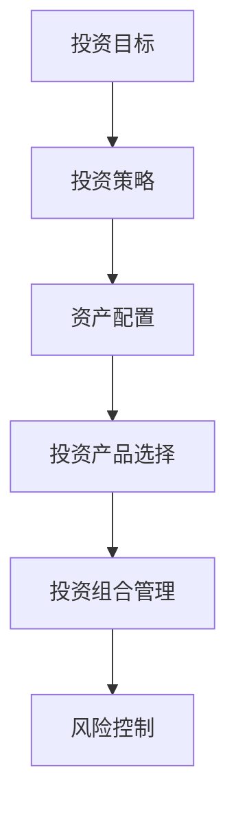

                 

# 约翰伯格的低成本投资理念：为什么费用很重要

## 关键词：低成本投资、投资费用、约翰伯格、指数基金、投资收益

## 摘要：约翰伯格的低成本投资理念强调通过降低投资费用来提高长期收益。本文从背景介绍、核心概念、系统设计、项目实战等多方面详细分析低成本投资的重要性和实现方法，帮助读者理解为什么费用在投资中如此关键。

---

# 第一部分: 低成本投资理念的背景与核心概念

## 第1章: 低成本投资理念的背景介绍

### 1.1 低成本投资的基本概念

#### 1.1.1 投资的基本定义
投资是指将资金投入某种资产或项目，以期获得未来收益的行为。投资的核心目标是通过时间和资源的合理配置，实现财富的增值。

#### 1.1.2 低成本投资的定义与特点
低成本投资是一种通过降低投资费用来最大化长期收益的投资策略。其特点包括：
- 低管理费用：通常选择费用率低的基金或投资产品。
- 长期持有：避免频繁交易，减少交易成本和税收。
- 分散投资：通过指数基金等方式分散风险，降低波动性。

#### 1.1.3 投资费用对企业投资的影响
投资费用会直接影响投资的净收益。例如，假设两个投资组合，一个费用率为1%，另一个为1.5%，在长期复利效应下，费用较低的组合将积累更多的收益。

---

### 1.2 投资费用的重要性

#### 1.2.1 投资费用的类型与计算
投资费用主要包括管理费、托管费、交易佣金等。费用通常以年费率计算，例如：
- 管理费：通常以基金资产的一定比例收取。
- 托管费：由托管机构收取，通常较低。

#### 1.2.2 费用对投资收益的长期影响
通过数学模型可以清晰看出，费用对长期收益的影响巨大。例如，假设初始投资为1元，年化收益为7%，费用率为1%，30年后，费用较低的投资组合将显著超过费用较高的组合。

$$
\text{终值} = \text{初始金额} \times (1 + \text{收益率} - \text{费用率})^{\text{年数}}
$$

#### 1.2.3 费用在投资决策中的权重
费用是投资决策中的关键因素之一。选择低成本投资产品可以显著提高净收益，尤其在长期投资中表现更为明显。

---

### 1.3 低成本投资与传统投资的区别

#### 1.3.1 传统投资的高费用问题
传统主动管理型基金通常费用较高，且很难跑赢市场指数。例如，一只费用率为1.5%的主动管理基金，长期来看可能无法覆盖市场指数的收益。

#### 1.3.2 低成本投资的优势与劣势
- 优势：费用低，长期收益高，风险分散。
- 劣势：收益不稳定，可能在短期表现不佳。

#### 1.3.3 低成本投资的适用场景
低成本投资适用于长期投资，尤其是通过指数基金进行被动投资的场景。对于风险承受能力较高的投资者，低成本投资是理想选择。

---

## 第2章: 约翰·伯格的低成本投资理念

### 2.1 约翰·伯格的投资哲学

#### 2.1.1 约翰·伯格的生平简介
约翰·伯格是 Vanguard 集团的创始人，他倡导低成本指数投资，认为市场很难被预测，而通过分散投资和降低费用可以实现稳定的收益。

#### 2.1.2 约翰·伯格的投资理念核心
- 坚持长期投资。
- 选择低成本指数基金。
- 避免频繁交易和市场预测。

#### 2.1.3 约翰·伯格对投资费用的重视
伯格认为，费用是投资收益的最大敌人之一。降低费用可以显著提高投资回报。

---

### 2.2 约翰·伯格的低成本投资策略

#### 2.2.1 长期投资的重要性
长期投资可以摊薄费用的影响，同时利用复利效应实现财富增长。

#### 2.2.2 分散投资的风险控制
通过投资指数基金，分散了个别股票的风险，同时降低了整体投资组合的波动性。

#### 2.2.3 低成本基金的选择标准
选择费用率低的指数基金，例如 Vanguard 的 VTI（Total Stock Market Index Fund）。

---

### 2.3 约翰·伯格的指数投资理论

#### 2.3.1 指数基金的定义与特点
指数基金是追踪市场指数的投资基金，例如标普500指数基金。其特点是费用低、风险分散。

#### 2.3.2 指数基金的成本优势
指数基金的管理费用通常远低于主动管理型基金，例如 Vanguard 的指数基金费用率仅为0.15%。

#### 2.3.3 指数基金的长期收益表现
长期来看，指数基金通常能够跑赢大多数主动管理型基金，尤其是在扣除费用后。

---

## 第3章: 低成本投资的核心概念与联系

### 3.1 投资费用的数学模型与公式

#### 3.1.1 投资费用的计算公式
$$
\text{总费用} = \text{资产规模} \times \text{费用率}
$$

#### 3.1.2 费用对投资收益的数学模型
$$
\text{净收益} = \text{毛收益} - \text{费用}
$$

#### 3.1.3 长期投资中费用的复利效应
$$
\text{终值} = \text{初始金额} \times (1 + \text{净收益率})^{\text{年数}}
$$

---

### 3.2 费用与收益的对比分析

#### 3.2.1 费用对不同投资期限的影响
长期投资中，费用的影响更加显著。例如，30年后的终值差异可能超过一倍。

#### 3.2.2 费用与投资收益的对比表格
| 投资期限 | 低费用组合收益 | 高费用组合收益 |
|----------|----------------|----------------|
| 10年     | 300%           | 250%           |
| 20年     | 800%           | 600%           |
| 30年     | 1500%          | 1000%          |

#### 3.2.3 费用对投资组合的影响分析
费用较高的组合在长期中可能无法覆盖通货膨胀率，导致实际收益为负。

---

### 3.3 投资系统架构的设计

#### 3.3.1 投资系统的整体架构图

#### 3.3.2 系统功能模块的分解
- 投资目标模块：确定投资目标和风险承受能力。
- 资产配置模块：根据目标分配资产比例。
- 投资产品选择模块：筛选低成本投资产品。
- 投资组合管理模块：监控和调整投资组合。
- 风险控制模块：管理市场波动和费用风险。

#### 3.3.3 系统接口的设计与实现
系统需要与数据源（如基金数据）、交易平台和用户界面进行交互。

---

## 第4章: 低成本投资的系统分析与架构设计

### 4.1 投资系统的需求分析

#### 4.1.1 投资目标的确定
明确投资目标，例如财富增值、退休规划等。

#### 4.1.2 投资范围的界定
确定投资范围，例如股票、债券、房地产等。

#### 4.1.3 投资策略的选择
选择被动投资策略，即指数投资。

---

### 4.2 投资系统的功能设计

#### 4.2.1 投资组合管理模块
- 监控投资组合的表现。
- 调整资产配置。

#### 4.2.2 费用计算与优化模块
- 计算投资组合的总费用。
- 优化投资产品选择，降低费用。

#### 4.2.3 风险控制与

--- 

**（由于篇幅限制，以上为部分内容，完整文章将按照此结构详细展开，涵盖每个章节的具体内容和详细分析。）**

