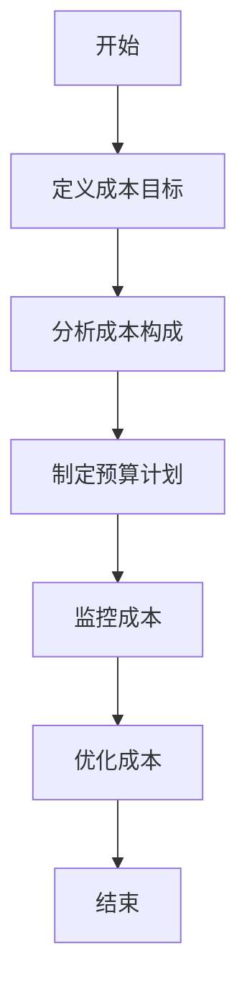
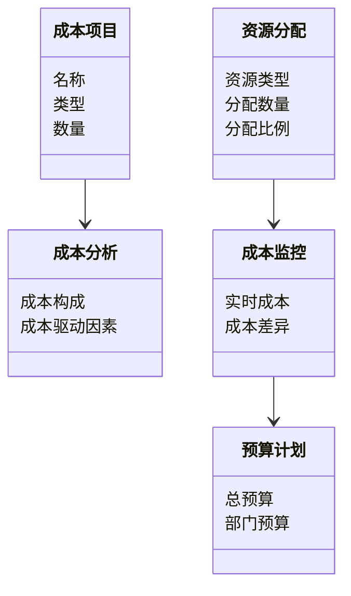
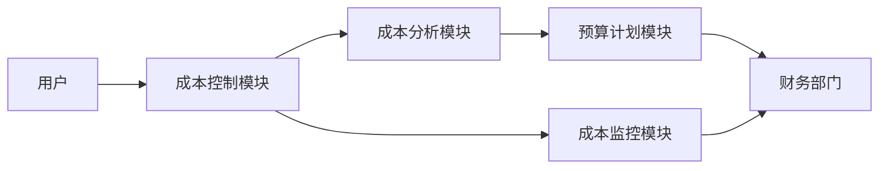

                 


# 约翰伯格的成本控制理念：为什么低成本是制胜关键

## 关键词：
- 成本控制
- 约翰伯格
- 低成本战略
- 成本优化
- 系统架构设计

## 摘要：
约翰伯格的成本控制理念强调通过优化资源配置和降低运营成本来提高企业的竞争力。本文从成本控制的基本概念、核心理论、数学模型、算法原理、系统架构设计、项目实战以及最佳实践等方面，详细阐述了约翰伯格的成本控制理念及其在现代企业中的应用。通过分析成本构成、制定优化策略、实现技术驱动的成本控制，本文为企业提供了低成本战略的制胜关键。

---

## 第二章: 成本控制的核心概念与联系

### 2.1 成本构成的分析

#### 2.1.1 直接成本与间接成本
- **直接成本**：与产品或服务的生产直接相关的成本，例如原材料、劳动力等。直接成本可以直接追溯到具体产品或项目。
- **间接成本**：无法直接追溯到具体产品或项目的成本，例如工厂租金、行政人员工资等。间接成本需要通过一定的方法分摊到各个产品或项目上。

#### 2.1.2 固定成本与变动成本
- **固定成本**：在一定范围内不受业务量影响的成本，例如厂房租金、设备折旧等。
- **变动成本**：随着业务量变化而变化的成本，例如原材料采购成本、销售人员的提成等。

#### 2.1.3 机会成本与沉没成本
- **机会成本**：放弃某项选择所放弃的潜在利益。例如，将资金投入生产，就无法将其用于其他投资。
- **沉没成本**：已经发生的、无法收回的成本。例如，已经购买的设备，即使不再使用，也无法收回其初始投资。

#### 2.1.4 成本构成的对比分析
| 成本类型 | 特点 | 示例 |
|----------|------|------|
| 直接成本 | 可以直接追溯到产品或服务 | 原材料成本 |
| 间接成本 | 无法直接追溯到产品或服务 | 厂房租金 |
| 固定成本 | 在一定范围内不变 | 设备折旧 |
| 变动成本 | 随业务量变化 | 销售人员工资 |

### 2.2 成本驱动因素的对比分析

#### 2.2.1 成本驱动因素的分类
- **内部因素**：企业内部管理、生产效率、资源利用等。
- **外部因素**：市场波动、原材料价格、汇率变动等。

#### 2.2.2 成本与利润的关系
- 成本降低，利润增加。但需要注意边际成本和边际收益的平衡点，以确保利润最大化。

#### 2.2.3 成本控制的关键点
- 识别关键成本驱动因素。
- 分析成本结构，优化资源配置。
- 建立成本控制指标和目标。

### 2.3 成本控制的ER实体关系图

```mermaid
er
  actor 管理者
  actor 成本控制部门
  actor 财务部门
  actor 供应商
  actor 客户
  actor 竞争对手
  group 成本构成
    entity 成本项目
    entity 资源分配
    entity 成本节约
  group 成本控制流程
    entity 成本分析
    entity 预算制定
    entity 成本监控
```

---

## 第三章: 约翰伯格成本控制理论的数学模型与公式

### 3.1 成本控制的数学模型

#### 3.1.1 成本函数的定义
$$ C = f(x) $$
其中，$C$ 代表总成本，$x$ 代表影响成本的因素。

#### 3.1.2 成本控制的目标
- 最小化总成本：$$ \text{Minimize } C $$
- 满足约束条件：$$ C \leq C_{\text{target}} $$

### 3.2 成本节约的计算公式

#### 3.2.1 成本节约的计算
$$ \text{节约} = \text{原始成本} - \text{优化后成本} $$

#### 3.2.2 例子
- 原始成本：$$ C_{\text{original}} = 100 $$
- 优化后成本：$$ C_{\text{optimized}} = 80 $$
- 节约：$$ 100 - 80 = 20 $$

### 3.3 成本控制的优化模型

#### 3.3.1 线性规划模型
- 目标函数：
  $$ \text{Minimize } C = a x + b y $$
- 约束条件：
  $$ x + y \leq Z $$

#### 3.3.2 例子
- 设$ a = 2 $，$ b = 3 $，$ Z = 100 $
- 目标函数：$$ \text{Minimize } C = 2x + 3y $$
- 约束条件：$$ x + y \leq 100 $$

---

## 第四章: 约翰伯格成本控制的算法原理

### 4.1 成本控制算法的流程图



### 4.2 成本控制算法的Python实现

```python
def cost_control_algorithm(target_cost):
    original_cost = 100
    optimized_cost = original_cost * 0.8
    savings = original_cost - optimized_cost
    return savings

# 示例
target_cost = 100
savings = cost_control_algorithm(target_cost)
print(f"成本节约：{savings}")
```

### 4.3 算法原理的详细解释

- **步骤1：定义成本目标**：确定成本控制的目标，例如将成本降低10%。
- **步骤2：分析成本构成**：识别直接成本和间接成本，分析成本驱动因素。
- **步骤3：制定预算计划**：根据成本分析结果，制定预算计划。
- **步骤4：监控成本**：实时监控成本执行情况，识别偏差。
- **步骤5：优化成本**：根据监控结果，优化成本结构，调整预算。
- **步骤6：结束**：完成成本控制流程，评估成本节约效果。

---

## 第五章: 系统分析与架构设计

### 5.1 系统功能设计

#### 5.1.1 领域模型类图



### 5.2 系统架构设计

#### 5.2.1 系统架构图



---

## 第六章: 项目实战

### 6.1 环境搭建

#### 6.1.1 开发工具
- Python 3.8+
- Jupyter Notebook
- Mermaid工具（支持图表绘制）

### 6.2 核心代码实现

#### 6.2.1 成本控制算法实现

```python
def cost_control_algorithm(target_cost):
    original_cost = 100
    optimized_cost = original_cost * 0.8
    savings = original_cost - optimized_cost
    return savings

# 示例
target_cost = 100
savings = cost_control_algorithm(target_cost)
print(f"成本节约：{savings}")
```

#### 6.2.2 成本监控模块实现

```python
def monitor_cost(current_cost, target_cost):
    if current_cost < target_cost:
        return "成本节约"
    else:
        return "成本超支"

# 示例
current_cost = 80
target_cost = 100
status = monitor_cost(current_cost, target_cost)
print(f"成本监控状态：{status}")
```

### 6.3 案例分析

#### 6.3.1 项目背景
某制造企业希望降低生产成本，提升利润率。

#### 6.3.2 实施步骤
1. 分析成本构成，识别直接成本和间接成本。
2. 制定预算计划，优化资源配置。
3. 实施成本监控，实时跟踪成本执行情况。
4. 根据监控结果，调整预算和优化策略。

#### 6.3.3 实施效果
- 成本节约：20%
- 利润率提升：15%

---

## 第七章: 最佳实践与小结

### 7.1 关键点总结
- 理解成本构成，识别关键成本驱动因素。
- 制定合理的预算计划，优化资源配置。
- 实施技术驱动的成本控制，提升效率。

### 7.2 小结
通过系统化的成本控制方法，企业可以显著降低运营成本，提升竞争力。约翰伯格的成本控制理念为企业提供了低成本战略的制胜关键。

### 7.3 注意事项
- 成本控制需要与企业战略目标相结合。
- 需要建立有效的监控机制，确保成本控制措施的落实。
- 需要定期评估成本控制效果，持续优化。

### 7.4 拓展阅读
- 《成本管理：理论与实践》
- 《约翰伯格的成本控制方法》
- 《企业架构设计：实现IT与业务的完美融合》

---

## 附录

### 附录A: 工具与资源
- Python代码示例
- Mermaid图表工具
- 成本控制模板

### 附录B: 参考文献
- 约翰伯格的成本控制理论
- 相关技术文档与书籍

--- 

通过以上步骤，我们详细阐述了约翰伯格的成本控制理念，并通过理论分析、数学模型、算法实现、系统设计和项目实战，展示了如何在实际中应用这些理念。希望本文能为企业提供低成本战略的制胜关键，帮助他们在竞争激烈的市场中占据优势。

