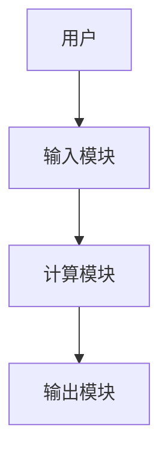

                 


# {{此处是文章标题}}

## 关键词：{{此处列出文章的5-7个核心关键词}}

## 摘要：{{此处给出文章的核心内容和主题思想}}

---

# {{此处是文章标题}}

## 关键词：投资成本计算、约翰·伯格、投资组合、金融分析、风险管理

## 摘要：本文详细探讨了约翰·伯格的投资成本计算方法，从基本概念、成本构成、计算模型到系统设计和实际应用，全面解析投资成本计算的核心原理和实际操作。通过分析约翰·伯格的投资理念，结合数学模型和系统架构设计，帮助读者理解和掌握投资成本计算的关键步骤和方法。

---

# 第一部分: 投资成本计算基础

## 第1章: 投资成本的基本概念

### 1.1 投资成本的定义与分类

#### 1.1.1 投资成本的定义
投资成本是指投资者在投资过程中所发生的各项费用和支出，包括购买资产的初始成本、持有资产期间的费用以及交易过程中的各项费用。投资成本是衡量投资收益的重要指标之一，直接影响投资回报率和投资决策。

#### 1.1.2 投资成本的分类
投资成本可以分为以下几类：
- **直接成本**：与投资直接相关的费用，如购买资产的本金、佣金费用等。
- **间接成本**：与投资间接相关的费用，如管理费用、托管费用等。
- **隐性成本**：一些隐性费用，如机会成本、税收成本等。

#### 1.1.3 投资成本与投资收益的关系
投资成本与投资收益密切相关。较高的投资成本会降低净收益，而较低的投资成本则有助于提高净收益。因此，在投资决策中，投资者需要综合考虑成本与收益的关系，以实现最优的投资组合。

---

### 1.2 投资成本计算的重要性

#### 1.2.1 投资成本对投资决策的影响
投资成本是投资者在选择投资标的时需要考虑的重要因素。较高的交易成本和持有成本会增加投资的负担，影响投资的可行性和收益性。

#### 1.2.2 投资成本在投资组合中的作用
在构建投资组合时，投资成本是优化组合的重要考量因素。通过合理控制投资成本，可以降低整体投资成本，提高组合的收益。

#### 1.2.3 投资成本对风险控制的意义
投资成本与风险控制密切相关。较高的成本会增加投资的风险，而合理的成本控制有助于降低整体风险。

---

### 1.3 约翰·伯格的投资理念

#### 1.3.1 约翰·伯格的生平简介
约翰·伯格（John Bogle）是美国著名投资者，曾创立 Vanguard 集团，是指数基金的 pioneer。他的投资理念以低费用、长期持有和价值投资为核心。

#### 1.3.2 约翰·伯格的投资哲学
约翰·伯格主张长期投资和价值投资，强调降低投资成本和避免过度交易。他认为，长期来看，市场波动和交易成本是投资收益的主要敌人。

#### 1.3.3 约翰·伯格的成本控制方法
约翰·伯格通过降低基金费用率和减少交易频率来控制成本。他提倡指数基金投资，认为这种投资方式能够有效降低投资成本。

---

### 1.4 本章小结
本章从投资成本的基本概念入手，详细介绍了投资成本的分类、重要性以及约翰·伯格的投资理念。通过理解这些内容，读者可以初步掌握投资成本计算的基本框架。

---

## 第2章: 投资成本的构成与计算方法

### 2.1 投资成本的构成要素

#### 2.1.1 资产的购买成本
资产的购买成本包括购买价格、佣金费用等。购买成本是投资者初始投资的主要支出。

#### 2.1.2 资产的持有成本
持有成本包括托管费用、管理费用、利息费用等。这些费用通常按年收取，与资产的规模和类型有关。

#### 2.1.3 资产的交易成本
交易成本包括买卖价差、佣金费用等。频繁的交易会增加交易成本，影响投资收益。

---

### 2.2 投资成本的计算方法

#### 2.2.1 单笔投资成本计算
单笔投资成本计算公式为：
$$
\text{单笔投资成本} = \text{购买价格} + \text{佣金费用}
$$

#### 2.2.2 投资组合成本计算
投资组合成本计算公式为：
$$
\text{组合总成本} = \sum_{i=1}^{n} (\text{购买成本}_i + \text{持有成本}_i + \text{交易成本}_i)
$$

#### 2.2.3 成本分摊与分配
在投资组合中，成本分摊通常按照资产的比例进行分配。例如，如果某资产占投资组合的 10%，则其成本也按 10% 分摊到整体成本中。

---

### 2.3 约翰·伯格的成本计算模型

#### 2.3.1 模型的构成与特点
约翰·伯格的成本计算模型以低费用率和长期持有为核心，通过减少交易频率和降低管理费用来控制成本。

#### 2.3.2 模型的适用场景
该模型适用于长期投资和被动投资策略，特别适合指数基金和定投策略。

#### 2.3.3 模型的优缺点分析
- **优点**：费用低、风险小、收益稳定。
- **缺点**：不适合短期交易和高风险投资。

---

### 2.4 本章小结
本章详细讲解了投资成本的构成要素和计算方法，并结合约翰·伯格的成本计算模型，分析了其在投资中的应用。通过这些内容，读者可以掌握投资成本计算的基本方法和实际应用。

---

## 第3章: 投资成本计算的数学模型与公式

### 3.1 投资成本计算的基本公式

#### 3.1.1 投资成本的总公式
投资成本的总公式为：
$$
\text{总成本} = \text{购买成本} + \text{持有成本} + \text{交易成本}
$$

#### 3.1.2 投资成本的分项公式
- 购买成本公式：
$$
\text{购买成本} = \text{资产价格} \times \text{数量}
$$
- 持有成本公式：
$$
\text{持有成本} = \text{资产价格} \times \text{数量} \times \text{持有时间} \times \text{利率}
$$
- 交易成本公式：
$$
\text{交易成本} = \text{交易次数} \times \text{每次交易费用}
$$

---

### 3.2 投资组合成本计算的数学模型
投资组合成本计算的数学模型为：
$$
\text{组合总成本} = \sum_{i=1}^{n} (\text{购买成本}_i + \text{持有成本}_i + \text{交易成本}_i)
$$

---

### 3.3 约翰·伯格模型的数学表达
约翰·伯格模型的数学表达式为：
$$
C = \sum_{i=1}^{m} (c_i \times a_i)
$$
其中，$C$ 表示总成本，$c_i$ 表示第 $i$ 项资产的成本，$a_i$ 表示第 $i$ 项资产的数量。

---

### 3.4 本章小结
本章通过数学公式详细阐述了投资成本计算的核心原理，并结合约翰·伯格的成本计算模型，分析了其数学表达式和应用场景。

---

## 第4章: 投资成本计算的系统分析与架构设计

### 4.1 系统功能设计

#### 4.1.1 系统功能模块划分
投资成本计算系统主要包括以下功能模块：
- 数据输入模块
- 成本计算模块
- 结果输出模块

#### 4.1.2 功能模块的交互流程
1. 用户输入投资数据，包括资产价格、数量、持有时间等。
2. 系统根据输入数据进行成本计算，包括购买成本、持有成本和交易成本。
3. 系统输出计算结果，包括总成本和各项成本的具体数值。

#### 4.1.3 功能模块的实现方式
通过编程实现各功能模块，使用 Python 编写计算程序，结合数据可视化工具展示计算结果。

---

### 4.2 系统架构设计

#### 4.2.1 系统架构图


#### 4.2.2 系统实体关系图
```mermaid
entity User
entity 投资数据
entity 计算模块
entity 计算结果

User --> 投资数据: 提交
投资数据 --> 计算模块: 处理
计算模块 --> 计算结果: 输出
```

---

### 4.3 系统接口设计

#### 4.3.1 输入接口设计
用户通过输入界面提交投资数据，包括资产价格、数量、持有时间等。

#### 4.3.2 输出接口设计
系统输出计算结果，包括各项成本的具体数值和总成本。

#### 4.3.3 数据接口设计
系统通过数据库接口存储和检索投资数据，支持多种数据格式的导入和导出。

---

### 4.4 系统交互设计

#### 4.4.1 交互流程图
```mermaid
sequence
    用户->输入模块: 提交投资数据
    输入模块->计算模块: 请求计算
    计算模块->输出模块: 返回计算结果
    输出模块->用户: 显示计算结果
```

---

### 4.5 本章小结
本章从系统设计的角度，详细讲解了投资成本计算系统的功能模块、架构设计和交互流程。通过系统设计，读者可以更好地理解投资成本计算的实际应用。

---

## 第5章: 项目实战与案例分析

### 5.1 项目环境安装

#### 5.1.1 系统需求
- 操作系统：Windows/Mac/Linux
- Python 版本：3.6+
- 开发工具：IDE（如 PyCharm）
- 第三方库：Matplotlib、Pandas

#### 5.1.2 环境配置
安装必要的 Python 库：
```bash
pip install numpy pandas matplotlib
```

---

### 5.2 核心实现源代码

#### 5.2.1 投资成本计算代码
```python
import numpy as np
import pandas as pd

# 输入数据
prices = [100, 200, 300]  # 资产价格
quantities = [1, 2, 3]     # 资产数量
holding_periods = [1, 2, 3] # 持有时间
interest_rates = [0.01, 0.02, 0.03] # 利率
transaction_costs = [10, 20, 30]   # 交易成本

# 计算成本
purchase_costs = np.array(prices) * np.array(quantities)
holding_costs = np.array(prices) * np.array(quantities) * np.array(holding_periods) * np.array(interest_rates)
transaction_costs_total = np.array(transaction_costs).sum()

total_cost = purchase_costs.sum() + holding_costs.sum() + transaction_costs_total

print("购买成本：", purchase_costs.sum())
print("持有成本：", holding_costs.sum())
print("交易成本：", transaction_costs_total)
print("总成本：", total_cost)
```

#### 5.2.2 代码实现解读
- **输入数据**：包括资产价格、数量、持有时间、利率和交易成本。
- **计算过程**：分别计算购买成本、持有成本和交易成本，最后求和得到总成本。
- **输出结果**：显示各项成本的具体数值和总成本。

---

### 5.3 案例分析与解读

#### 5.3.1 案例背景
假设投资者投资了三只资产，具体数据如下：
- 资产1：价格 100，数量 1，持有时间 1 年，利率 1%
- 资产2：价格 200，数量 2，持有时间 2 年，利率 2%
- 资产3：价格 300，数量 3，持有时间 3 年，利率 3%
- 交易成本分别为 10、20、30

#### 5.3.2 计算过程
根据代码计算，各项成本分别为：
- 购买成本：100 + 400 + 900 = 1400
- 持有成本：100*1*1*0.01 + 200*2*2*0.02 + 300*3*3*0.03 = 1 + 8 + 27 = 36
- 交易成本：10 + 20 + 30 = 60
- 总成本：1400 + 36 + 60 = 1500

#### 5.3.3 结果分析
通过计算，投资者的总成本为 1500。可以看出，购买成本是最大的成本构成部分，而持有成本和交易成本也对总成本有一定影响。

---

### 5.4 本章小结
本章通过实际案例分析，详细讲解了投资成本计算的具体过程和方法。通过代码实现和案例分析，读者可以更好地理解和掌握投资成本计算的实际应用。

---

## 第六章: 总结与最佳实践

### 6.1 本章小结
通过本文的详细讲解，读者可以全面了解投资成本计算的核心原理和实际操作方法。从基本概念到数学模型，再到系统设计和项目实战，本文为读者提供了一个完整的知识体系。

---

### 6.2 最佳实践 tips

#### 6.2.1 成本控制建议
- 选择低费用率的投资产品，如指数基金。
- 减少交易频率，降低交易成本。
- 长期持有资产，降低持有成本。

#### 6.2.2 风险管理建议
- 合理分散投资，降低投资风险。
- 定期评估投资组合，优化成本结构。

#### 6.2.3 持续学习建议
- 关注市场动态，及时调整投资策略。
- 学习新的投资知识和技能，提升投资能力。

---

### 6.3 本章总结
投资成本计算是投资决策中的重要环节。通过合理控制投资成本，投资者可以提高投资收益，实现长期稳健的投资回报。

---

## 附录: 扩展阅读

### 附录 A: 相关书籍推荐
1. 《约翰·伯格的投资哲学》
2. 《投资学基础》
3. 《金融风险管理》

### 附录 B: 开源工具推荐
1. Python 的 Pandas 库
2. Matplotlib 可视化工具
3. NumPy 数值计算库

---

通过本文的学习，读者可以全面掌握投资成本计算的核心原理和实际应用方法。无论是理论知识还是实际操作，都能为读者提供有价值的参考和指导。

