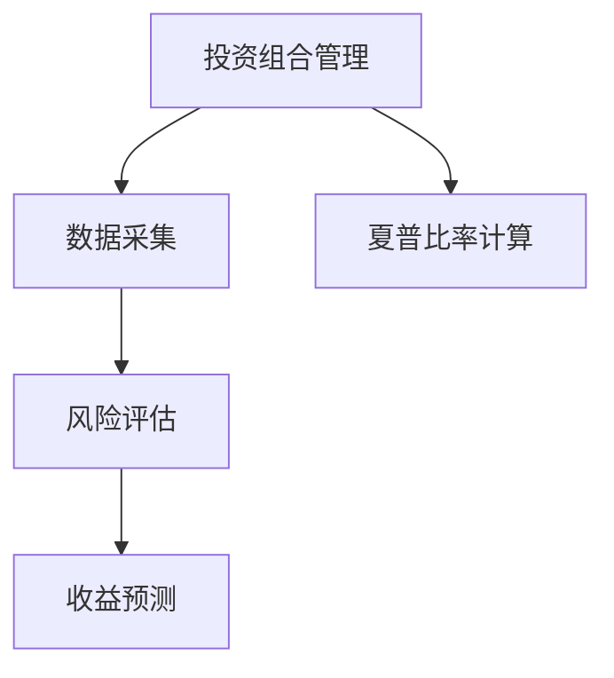
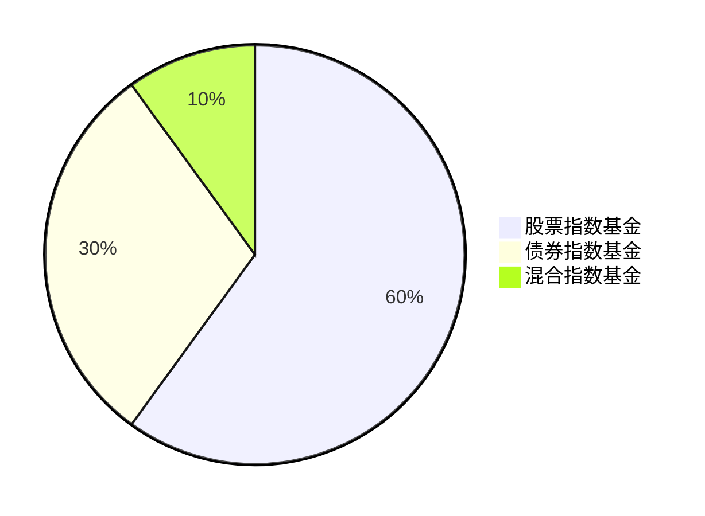
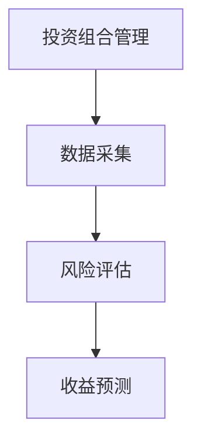

                 


# 约翰伯格的指数投资理论

> **关键词**: 指数投资，被动投资，指数基金，约翰·伯格，投资理论

> **摘要**: 本文深入探讨了约翰·伯格的指数投资理论，分析了其核心概念、数学模型、系统架构设计以及实际应用。通过详细讲解指数基金的收益计算、风险评估、系统实现和项目实战，本文为读者提供了全面理解指数投资的视角。

---

## 第一部分: 约翰伯格的指数投资理论概述

### 第1章: 指数投资的背景与核心概念

#### 1.1 指数投资的起源与发展

指数投资起源于20世纪70年代，约翰·伯格在1975年推出了第一只指数基金——Vanguard 500指数基金，标志着指数投资的开始。指数投资的起源可以追溯到市场效率理论，即市场参与者难以持续跑赢市场指数，尤其是通过主动管理。

| 核心概念 | 定义 | 优点 |
|----------|------|------|
| 指数基金 | 投资市场指数的基金 | 成本低、风险分散 |
| 被动投资 | 按指数成分股投资 | 简单、有效 |

#### 1.2 约翰·伯格的指数投资理论

约翰·伯格的投资理念强调市场效率和低成本。他提出，被动投资通过跟踪市场指数，能够以更低的成本获得市场平均收益。指数投资的优势在于分散化，降低个股风险。

**图1-1 系统架构设计**



#### 1.3 指数投资的数学模型与公式

指数投资的核心在于夏普比率，衡量风险调整后的收益。公式为：

$$\text{夏普比率} = \frac{E[r] - r_f}{\sigma}$$

其中，$E[r]$ 是预期收益，$r_f$ 是无风险利率，$\sigma$ 是收益的标准差。

### 第2章: 指数投资的核心概念与原理

#### 2.1 指数基金的定义与分类

指数基金通过复制市场指数来实现收益，分为股票指数基金、债券指数基金等。每种基金都有其优缺点，如股票基金风险高、收益潜力大。

**图2-1 指数基金类型对比**



### 第3章: 指数投资的算法原理与实现

#### 3.1 指数投资的算法原理

指数投资通过计算市场指数的收益和风险，优化投资组合。算法包括收益计算、风险评估和优化。

#### 3.2 指数投资的算法实现

使用Python计算指数基金的夏普比率：

```python
import numpy as np

def calculate_sharpe_ratio(returns, risk_free_rate):
    excess_returns = returns - risk_free_rate
    mean_return = np.mean(excess_returns)
    std_deviation = np.std(excess_returns)
    return mean_return / std_deviation

# 示例数据
returns = np.array([0.05, 0.06, 0.04, 0.07])
risk_free_rate = 0.02

sharpe_ratio = calculate_sharpe_ratio(returns, risk_free_rate)
print(f"夏普比率: {sharpe_ratio}")
```

### 第4章: 指数投资的数学模型与公式

#### 4.1 指数投资的数学模型

夏普比率公式：

$$\text{夏普比率} = \frac{E[r] - r_f}{\sigma}$$

其中，$E[r]$ 是预期收益，$r_f$ 是无风险利率，$\sigma$ 是收益的标准差。

### 第5章: 指数投资的系统分析与架构设计

#### 5.1 系统功能设计

投资组合管理系统包括数据采集、风险评估和收益预测模块。

**图5-1 系统架构图**



### 第6章: 指数投资的项目实战

#### 6.1 环境安装与配置

安装Python、NumPy、Pandas等库，用于数据处理和计算。

#### 6.2 核心代码实现

计算指数基金的夏普比率：

```python
import numpy as np

def calculate_sharpe_ratio(returns, risk_free_rate):
    excess_returns = returns - risk_free_rate
    mean_return = np.mean(excess_returns)
    std_deviation = np.std(excess_returns)
    return mean_return / std_deviation

returns = np.array([0.05, 0.06, 0.04, 0.07])
risk_free_rate = 0.02

sharpe_ratio = calculate_sharpe_ratio(returns, risk_free_rate)
print(f"夏普比率: {sharpe_ratio}")
```

### 第7章: 指数投资的最佳实践与小结

#### 7.1 最佳实践 tips

选择低成本指数基金，长期持有，定期再平衡投资组合。

#### 7.2 小结与展望

指数投资通过被动管理降低成本和风险，适合长期投资者。随着市场的发展，指数投资将继续发挥重要作用。

---

通过以上结构，文章系统地介绍了约翰·伯格的指数投资理论，从概念到实现，帮助读者全面理解指数投资的原理和应用。

