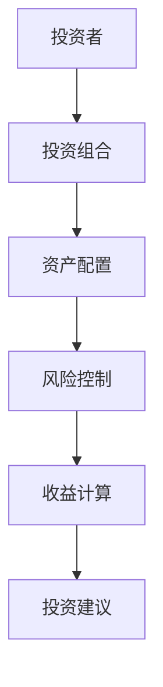

                 


# 约翰伯格的简单投资法则

> 关键词：投资法则，约翰·伯格，资产配置，分散投资，成本控制，长期复利

> 摘要：本文详细解析了约翰·伯格的简单投资法则，涵盖其投资理念、数学模型、系统架构及实际应用，通过技术化的分析方法，揭示投资的本质与实现路径。

---

## 第一部分: 约翰伯格的简单投资法则概述

### 第1章: 投资的基本概念与背景介绍

#### 1.1 投资的基本概念

投资是通过配置资源（如资金）于不同资产或项目，以期望在未来获得收益的行为。其核心在于通过时间和资源的再分配，实现财富的增值。

- **投资的定义**：投资是指将资金或其他资源投入到特定资产或项目中，以期望在未来获得超过初始投入的价值。

- **投资的目的与意义**：
  - **目的**：实现财富增值、保值，对冲通货膨胀风险。
  - **意义**：通过科学的投资策略，投资者可以在不确定的市场中获取稳定收益。

- **投资的基本原理**：
  - 资本的时间价值：资金的未来价值高于现值。
  - 风险与收益的平衡：高风险通常意味着高收益，但并非绝对。

#### 1.2 约翰·伯格的生平简介

约翰·伯格（John Bogle）是投资界的传奇人物，被誉为“指数基金之父”。他于1934年出生在美国宾夕法尼亚州，1958年加入 Vanguard 公司（当时为 Wellington 基金管理公司）。1975年，他创立了 Vanguard 集团，并推出第一只指数基金——Vanguard S&P 500指数基金（Vanguard 500 Index Fund），彻底改变了投资行业。

- **伯格的投资理念**：
  - 强调长期投资，避免频繁交易。
  - 倡导分散投资，降低市场波动带来的风险。
  - 注重成本控制，认为低费用是长期收益的关键。

#### 1.3 约翰·伯格的投资理念

伯格的核心理念可以概括为“简单、分散、长期”。他主张通过分散投资降低风险，通过长期持有降低交易成本，从而实现稳定的收益。

- **长期投资的重要性**：
  - 长期投资能够摊薄成本，平滑市场波动。
  - 时间是投资最好的朋友，复利效应会放大收益。

- **分散投资的风险管理**：
  - 通过投资不同资产类别或行业，降低单一资产带来的风险。
  - 分散投资能够有效降低非系统性风险。

- **成本控制在投资中的作用**：
  - 高昂的管理费用会侵蚀长期收益。
  - 低成本投资策略能够提升整体回报率。

### 1.4 简单投资法则的背景

简单投资法则是指通过长期持有低成本指数基金，实现财富增值的投资策略。该策略的核心在于其简单性、低成本和分散性，适合绝大多数投资者。

- **简单投资法则的背景**：
  - 投资市场复杂多变，普通投资者难以通过频繁交易获利。
  - 专业投资者的高 fees 侵蚀了长期收益。
  - 分散投资能够降低风险，长期持有能够享受复利收益。

---

## 第二部分: 简单投资法则的核心概念

### 第2章: 资产配置的基本原理

#### 2.1 资产配置的定义

资产配置是指将资金分配到不同资产类别（如股票、债券、现金等）中，以实现风险与收益的平衡。

- **资产配置的定义**：
  - 资产配置是通过将资金分配到不同资产类别，以实现风险分散和收益最大化。

- **不同资产类别及其特点**：

| 资产类别 | 特点 | 风险 | 收益 |
|----------|------|------|------|
| 股票     | 潜在收益高，波动性大 | 高 | 高 |
| 债券     | 收益相对稳定，波动性小 | 中 | 中 |
| 现金     | 流动性高，风险最低 | 低 | 低 |

- **资产配置的优缺点对比**：

| 优点                          | 缺点                          |
|-------------------------------|-------------------------------|
| 分散风险，降低波动性          | 需要定期调整，可能产生交易成本 |
| 长期收益稳定，适合普通投资者  | 需要专业知识，配置不当可能降低收益 |

### 2.2 分散投资的风险管理

分散投资是通过投资多种资产或资产类别，降低特定资产或市场波动带来的风险。

- **分散投资的定义**：
  - 分散投资是通过持有多种资产或资产类别，降低特定资产或市场波动带来的风险。

- **分散投资与集中投资的对比**：

| 分散投资                     | 集中投资                     |
|----------------------------|----------------------------|
| 风险低，收益稳定           | 风险高，收益波动大         |
| 适合长期投资               | 适合短期投机               |

- **分散投资的实际应用**：
  - 按照风险承受能力分配资产比例。
  - 定期调整资产配置，以适应市场变化。

### 2.3 成本控制在投资中的重要性

成本控制是简单投资法则的核心要素之一，低成本策略能够提升长期收益。

- **成本控制的定义**：
  - 成本控制是指通过降低管理费用、交易费用等，提升投资收益。

- **成本对投资收益的影响**：
  - 高费用会侵蚀长期收益，低成本策略能够放大复利效应。

- **如何降低投资成本**：
  - 选择低成本指数基金。
  - 避免频繁交易，降低交易费用。

---

## 第三部分: 简单投资法则的数学模型与算法原理

### 第3章: 投资回报率的计算公式

#### 3.1 简单回报率的计算

简单回报率是指某段时间内资产价格的变动幅度。

- **简单回报率的计算公式**：
  $$ 简单回报率 = \frac{期末价格 - 初始价格}{初始价格} \times 100\% $$

  例如，某股票初始价格为10元，期末价格为12元，简单回报率为：
  $$ \frac{12 - 10}{10} \times 100\% = 20\% $$

#### 3.2 复杂回报率的计算

复杂回报率考虑了时间因素，适用于长期投资。

- **复杂回报率的计算公式**：
  $$ 复杂回报率 = \left( \frac{期末价格}{初始价格} \right)^{\frac{1}{n}} - 1 $$

  其中，n为投资期限。

  例如，某股票初始价格为10元，期末价格为12元，投资期限为2年，复杂回报率为：
  $$ \left( \frac{12}{10} \right)^{\frac{1}{2}} - 1 \approx 0.0949 \approx 9.49\% $$

### 第3.2章: 投资组合优化的数学模型

#### 3.2.1 投资组合优化的定义

投资组合优化是指在给定风险水平下，寻找能够最大化收益的资产配置。

- **投资组合优化的数学公式**：
  $$ \text{最大化} \quad R_p = \sum_{i=1}^{n} w_i R_i $$
  $$ \text{约束} \quad \sum_{i=1}^{n} w_i = 1 $$
  $$ \text{其中} \quad w_i \text{为资产 } i \text{ 的权重，} R_i \text{为资产 } i \text{ 的预期收益} $$

#### 3.2.2 风险调整后的收益计算

风险调整后的收益是指在考虑风险因素后，资产的实际收益。

- **风险调整后的收益计算公式**：
  $$ R_{\text{调整后}} = R_{\text{名义}} - R_f $$
  $$ \text{其中} \quad R_f \text{为无风险利率} $$

  例如，某资产名义收益为10%，无风险利率为2%，则风险调整后的收益为：
  $$ 10\% - 2\% = 8\% $$

---

## 第四部分: 简单投资法则的系统分析与架构设计

### 第4章: 投资管理系统的功能设计

#### 4.1 投资管理系统的领域模型

- **领域模型类图**：


#### 4.2 投资管理系统的架构设计

- **系统架构图**：



---

## 第五部分: 简单投资法则的项目实战

### 第5章: 环境安装与核心实现

#### 5.1 环境安装

- **Python 环境**：
  - 安装 Python 3.8+
  - 安装必要的库：
    ```bash
    pip install pandas numpy matplotlib
    ```

#### 5.2 核心实现

- **投资组合优化代码示例**：

```python
import numpy as np
import pandas as pd

# 假设我们有三种资产，预期收益分别为10%, 15%, 20%
# 风险分别为15%, 20%, 25%

returns = [0.10, 0.15, 0.20]
variances = [0.15, 0.20, 0.25]

n = len(returns)
weights = np.zeros(n)

# 简单投资组合优化（假设等权重配置）
weights[0] = 1.0

# 计算预期收益和风险
expected_return = sum(weights * returns)
risk = sum(weights * variances)

print(f"预期收益: {expected_return:.2%}")
print(f"风险: {risk:.2%}")
```

---

## 第六部分: 简单投资法则的最佳实践

### 第6章: 小结与注意事项

- **小结**：
  - 简单投资法则的核心在于长期、分散、低成本。
  - 通过科学的资产配置和成本控制，普通投资者也能够实现稳定的收益。

- **注意事项**：
  - 避免频繁交易，降低交易成本。
  - 定期调整资产配置，适应市场变化。
  - 选择低成本的指数基金，避免高费用侵蚀收益。

### 6.2 拓展阅读

- **推荐书籍**：
  - 《投资最重要的事》——彼得·林奇
  - 《指数基金投资指南》——罗伯特·希勒

---

通过以上内容，我们可以清晰地看到，约翰·伯格的简单投资法则不仅是一种投资策略，更是一种长期、分散、低成本的投资理念。通过科学的系统设计和数学模型，投资者可以更好地理解和实现这一法则，从而在复杂多变的市场中获得稳定的收益。

